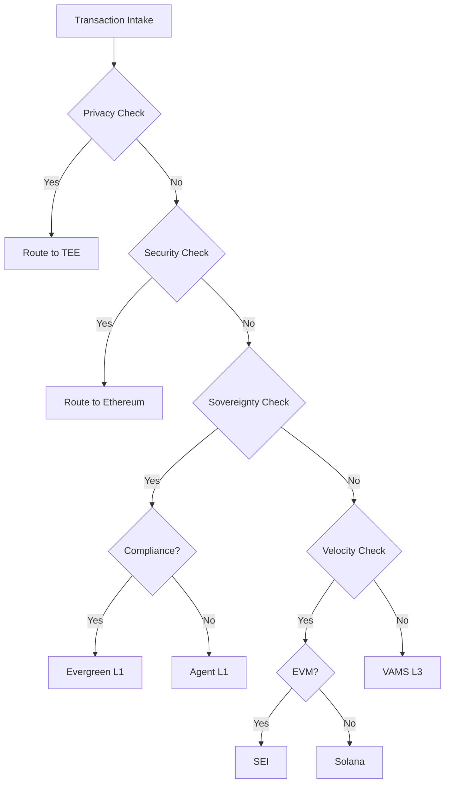

# VAMS Architecture Reference v3.1
## The AWS of Web3 & Sovereign Brain of the Agentic Web

**Version:** 3.1 (CTO Technical Expansion)  
**Date:** January 2026  
**Status:** Mainnet Specification  

---

## Table of Contents

1. [Executive Summary](#1-executive-summary)
2. [Design Philosophy](#2-design-philosophy)
3. [Part I: The AWS of Web3](#part-i-the-aws-of-web3)
   - [Compute Layer](#3-compute-layer)
   - [Storage Layer](#4-storage-layer)
   - [Networking Layer](#5-networking-layer)
4. [Part II: The Sovereign Brain](#part-ii-the-sovereign-brain)
   - [AI Inference Architecture](#6-ai-inference-architecture)
   - [Data Sovereignty Framework](#7-data-sovereignty-framework)
   - [Model Privacy & ZKML](#8-model-privacy--zkml)
5. [Part III: The Agentic Web](#part-iii-the-agentic-web)
   - [Agent Communication Protocols](#9-agent-communication-protocols)
   - [Agent Execution Runtime](#10-agent-execution-runtime)
   - [Agent Economy (x402)](#11-agent-economy-x402)
6. [Core Infrastructure](#core-infrastructure)
   - [Conditional L1 Router (CLR)](#12-conditional-l1-router-clr)
   - [VAMS Gateway](#13-vams-gateway)
   - [Cross-Chain Infrastructure](#14-cross-chain-infrastructure)
7. [Security & Compliance](#security--compliance)
   - [Security Architecture](#15-security-architecture)
   - [Compliance Framework](#16-compliance-framework)
8. [Deployment & Operations](#17-deployment--operations)

---

## 1. Executive Summary

VAMS (Verifiable and Agentic Modular Stack) is a Layer 3 meta-layer that synthesizes three paradigm shifts:

| Paradigm | VAMS Implementation | Value Proposition |
|----------|---------------------|-------------------|
| **AWS of Web3** | Decentralized Compute, Storage, Networking | Programmatic access to global DePIN infrastructure |
| **Sovereign Brain** | Privacy-preserving AI inference | Data sovereignty + model privacy + censorship resistance |
| **Agentic Web** | Standardized agent protocols | Autonomous agents as first-class network citizens |

VAMS enables AI agents to **consume infrastructure, process intelligence, and execute transactions** across a unified, verifiable stack.

---

## 2. Design Philosophy

### 2.1 Core Principles

```
┌─────────────────────────────────────────────────────────────────────────┐
│                         VAMS DESIGN PRINCIPLES                           │
├─────────────────────────────────────────────────────────────────────────┤
│                                                                          │
│  1. MODULAR SOVEREIGNTY                                                  │
│     Every component is replaceable; agents own their execution stack     │
│                                                                          │
│  2. VERIFIABLE EXECUTION                                                 │
│     ZK-proofs, TEE attestations, or optimistic fraud proofs for all     │
│                                                                          │
│  3. ECONOMIC ABSTRACTION                                                 │
│     Agents pay in $VAMS; protocol handles multi-chain gas conversion    │
│                                                                          │
│  4. COMPLIANCE BY DESIGN                                                 │
│     GDPR, MiCA, OFAC compliance embedded at protocol layer              │
│                                                                          │
│  5. CENSORSHIP RESISTANCE                                                │
│     No single point of control; decentralized at every layer            │
│                                                                          │
└─────────────────────────────────────────────────────────────────────────┘
```

---

# Part I: The AWS of Web3

## 3. Compute Layer

### 3.1 Overview

The Compute Layer provides decentralized access to GPU, CPU, and specialized hardware for AI inference, training, and general-purpose computation.

```
┌─────────────────────────────────────────────────────────────────────────┐
│                        COMPUTE LAYER ARCHITECTURE                        │
├─────────────────────────────────────────────────────────────────────────┤
│                                                                          │
│  ┌─────────────────┐  ┌─────────────────┐  ┌─────────────────┐         │
│  │     io.net      │  │     Akash       │  │   Render        │         │
│  │  GPU Clusters   │  │   Supercloud    │  │   Network       │         │
│  │                 │  │                 │  │                 │         │
│  │  • Ray clusters │  │  • K8s pods     │  │  • GPU render   │         │
│  │  • NVIDIA H100  │  │  • Docker       │  │  • 3D/Video     │         │
│  │  • A100/A10G    │  │  • Any CPU      │  │  • Streaming    │         │
│  └────────┬────────┘  └────────┬────────┘  └────────┬────────┘         │
│           │                    │                    │                   │
│           └────────────────────┼────────────────────┘                   │
│                                │                                        │
│                    ┌───────────▼───────────┐                            │
│                    │   VAMS COMPUTE        │                            │
│                    │   ORCHESTRATOR        │                            │
│                    │                       │                            │
│                    │   • Resource matching │                            │
│                    │   • Load balancing    │                            │
│                    │   • Proof aggregation │                            │
│                    │   • x402 settlement   │                            │
│                    └───────────────────────┘                            │
│                                                                          │
└─────────────────────────────────────────────────────────────────────────┘
```

### 3.2 GPU Compute (io.net Integration)

**Purpose:** High-performance GPU clusters for AI inference

**Architecture:**

| Component | Technology | Specification |
|-----------|------------|---------------|
| **Cluster Orchestration** | Ray | Distributed execution framework |
| **Hardware** | NVIDIA H100, A100, A10G | Enterprise-grade GPUs |
| **Network** | RDMA/InfiniBand | <1ms inter-node latency |
| **Payment** | $IO → x402 bridge | Pay-per-inference |

**Request Flow:**

```
Agent ─── InferenceRequest ───► VAMS Orchestrator
                                      │
                    ┌─────────────────┼─────────────────┐
                    ▼                 ▼                 ▼
              io.net Pool A     io.net Pool B     io.net Pool C
              (H100 x 8)        (A100 x 16)       (A10G x 32)
                    │                 │                 │
                    └─────────────────┼─────────────────┘
                                      │
                              InferenceResult
                              + Proof of Compute
```

**Proof of Compute:**

```rust
struct ProofOfCompute {
    /// Hash of input tensor
    input_hash: [u8; 32],
    /// Hash of output tensor
    output_hash: [u8; 32],
    /// TEE attestation (if SGX/SEV enabled)
    tee_attestation: Option<Attestation>,
    /// Optimistic fraud proof window (7 days)
    challenge_period_end: u64,
    /// Provider signature
    provider_signature: Signature,
}
```

### 3.3 CPU Compute (Akash Integration)

**Purpose:** General-purpose containerized workloads

**Architecture:**

```yaml
# Akash SDL Example for VAMS Agent Runtime
services:
  vams-agent:
    image: ghcr.io/vams-protocol/agent-runtime:latest
    expose:
      - port: 8080
        as: 80
        to:
          - global: true
    resources:
      cpu:
        units: 4
      memory:
        size: 8Gi
      storage:
        size: 20Gi

profiles:
  compute:
    vams-agent:
      resources:
        cpu:
          units: 4
        memory:
          size: 8Gi
        storage:
          size: 20Gi
```

### 3.4 Specialized Compute (Bittensor Subnets)

**Purpose:** Access specialized AI models and intelligence

**Integration:**

| Subnet | Intelligence Type | VAMS Use Case |
|--------|-------------------|---------------|
| SN1 | Text Generation | Agent reasoning |
| SN3 | Data Scraping | Market intelligence |
| SN8 | Time Series | Price prediction |
| SN9 | Pre-training | Model fine-tuning |
| SN18 | Vision | Image analysis |

**TAO → $VAMS Bridge:**

```
Agent Request ─► VAMS Orchestrator ─► Bittensor Subnet
                       │
                 $VAMS payment
                       │
                       ▼
              TAO Staking (Validator)
                       │
                       ▼
              Subnet Inference
                       │
                       ▼
              Response + Proof
```

---

## 4. Storage Layer

### 4.1 Overview

The Storage Layer provides decentralized, verifiable storage with multiple tiers for different latency and persistence requirements.

```
┌─────────────────────────────────────────────────────────────────────────┐
│                        STORAGE LAYER ARCHITECTURE                        │
├─────────────────────────────────────────────────────────────────────────┤
│                                                                          │
│  ┌───────────────────────────────────────────────────────────────────┐  │
│  │                        HOT STORAGE                                 │  │
│  │  ┌─────────────┐  ┌─────────────┐  ┌─────────────┐               │  │
│  │  │   Redis     │  │   Arweave   │  │   Ceramic   │               │  │
│  │  │   Cluster   │  │   (Bundlr)  │  │   Network   │               │  │
│  │  │             │  │             │  │             │               │  │
│  │  │  • Cache    │  │  • Perma    │  │  • Mutable  │               │  │
│  │  │  • <10ms    │  │  • Immutable│  │  • Streams  │               │  │
│  │  └─────────────┘  └─────────────┘  └─────────────┘               │  │
│  └───────────────────────────────────────────────────────────────────┘  │
│                                                                          │
│  ┌───────────────────────────────────────────────────────────────────┐  │
│  │                        WARM STORAGE                                │  │
│  │  ┌─────────────┐  ┌─────────────┐  ┌─────────────┐               │  │
│  │  │    IPFS     │  │  Lighthouse │  │   Storj     │               │  │
│  │  │   (Pinata)  │  │             │  │             │               │  │
│  │  │             │  │             │  │             │               │  │
│  │  │  • CID addr │  │  • FVM deal │  │  • Encrypted│               │  │
│  │  │  • <1s      │  │  • Verifi   │  │  • Erasure  │               │  │
│  │  └─────────────┘  └─────────────┘  └─────────────┘               │  │
│  └───────────────────────────────────────────────────────────────────┘  │
│                                                                          │
│  ┌───────────────────────────────────────────────────────────────────┐  │
│  │                        COLD STORAGE                                │  │
│  │  ┌─────────────────────────────────────────────────────────────┐  │  │
│  │  │                      Filecoin                                │  │  │
│  │  │                                                              │  │  │
│  │  │  • Storage deals • Proof of Replication • 10+ year persist  │  │  │
│  │  └─────────────────────────────────────────────────────────────┘  │  │
│  └───────────────────────────────────────────────────────────────────┘  │
│                                                                          │
└─────────────────────────────────────────────────────────────────────────┘
```

### 4.2 Storage Tier Specifications

| Tier | Provider | Latency | Persistence | Cost | Use Case |
|------|----------|---------|-------------|------|----------|
| **L0 (Cache)** | Redis | <10ms | Ephemeral | $0.001/GB/hr | Session state |
| **L1 (Hot)** | Arweave | <500ms | Permanent | $5/GB (one-time) | Proofs, receipts |
| **L2 (Warm)** | IPFS/Lighthouse | <2s | Pinned | $0.01/GB/month | Agent memory |
| **L3 (Cold)** | Filecoin | <1min | 10+ years | $0.0001/GB/month | Archives |

### 4.3 Verifiable Storage (Proof of Storage)

**Filecoin Integration:**

```solidity
interface IStorageVerifier {
    /// @notice Verify Filecoin storage deal
    function verifyStorageDeal(
        bytes32 dataCID,
        uint64 dealId,
        bytes calldata proof
    ) external view returns (bool valid);
    
    /// @notice Get storage deal status
    function getDealStatus(uint64 dealId) external view returns (DealStatus);
}

struct DealStatus {
    bool active;
    uint64 startEpoch;
    uint64 endEpoch;
    address provider;
    uint256 pricePerEpoch;
}
```

### 4.4 Encrypted Storage

For sensitive agent data, VAMS implements client-side encryption with decentralized key management:

```
┌─────────────┐     ┌─────────────┐     ┌─────────────┐
│   Agent     │     │  Lit Proto  │     │   Storage   │
│             │────►│  (Key Mgmt) │────►│   (IPFS)    │
└─────────────┘     └─────────────┘     └─────────────┘
      │                    │
      │ 1. Encrypt with    │ 2. Store encrypted
      │    symmetric key   │    key shares
      │                    │
      │ 3. Store encrypted data with CID
```

---

## 5. Networking Layer

### 5.1 Overview

The Networking Layer provides decentralized, censorship-resistant connectivity between agents, infrastructure, and blockchains.

```
┌─────────────────────────────────────────────────────────────────────────┐
│                       NETWORKING LAYER ARCHITECTURE                      │
├─────────────────────────────────────────────────────────────────────────┤
│                                                                          │
│  ┌─────────────────────────────────────────────────────────────────────┐│
│  │                       TRANSPORT LAYER                                ││
│  │  ┌─────────────┐  ┌─────────────┐  ┌─────────────┐                 ││
│  │  │  libp2p     │  │   NATS      │  │  WebRTC     │                 ││
│  │  │             │  │             │  │             │                 ││
│  │  │  • P2P mesh │  │  • Pub/Sub  │  │  • Browser  │                 ││
│  │  │  • DHT      │  │  • Request  │  │  • Real-time│                 ││
│  │  └─────────────┘  └─────────────┘  └─────────────┘                 ││
│  └─────────────────────────────────────────────────────────────────────┘│
│                                                                          │
│  ┌─────────────────────────────────────────────────────────────────────┐│
│  │                       RELAY LAYER                                    ││
│  │  ┌─────────────────────────────────────────────────────────────┐   ││
│  │  │                   Livepeer Network                           │   ││
│  │  │                                                              │   ││
│  │  │   • Video transcoding    • Low-latency streaming            │   ││
│  │  │   • Audio processing     • Geo-distributed nodes            │   ││
│  │  └─────────────────────────────────────────────────────────────┘   ││
│  └─────────────────────────────────────────────────────────────────────┘│
│                                                                          │
│  ┌─────────────────────────────────────────────────────────────────────┐│
│  │                       RPC LAYER                                      ││
│  │  ┌─────────────┐  ┌─────────────┐  ┌─────────────┐                 ││
│  │  │  Lava       │  │  Pocket     │  │   DRPC      │                 ││
│  │  │  Network    │  │  Network    │  │             │                 ││
│  │  │             │  │             │  │             │                 ││
│  │  │  • Decen RPC│  │  • 50+ chains│ │  • Failover │                 ││
│  │  └─────────────┘  └─────────────┘  └─────────────┘                 ││
│  └─────────────────────────────────────────────────────────────────────┘│
│                                                                          │
└─────────────────────────────────────────────────────────────────────────┘
```

### 5.2 Agent Discovery (DHT)

Agents discover each other via a Distributed Hash Table (DHT) built on libp2p:

```rust
struct AgentRecord {
    /// Agent's unique identifier
    agent_id: AgentId,
    /// Agent's capabilities
    capabilities: Vec<Capability>,
    /// Agent's public endpoints
    endpoints: Vec<Multiaddr>,
    /// Agent's reputation score
    reputation: u32,
    /// Signature proving ownership
    signature: Signature,
}

enum Capability {
    InferenceProvider { models: Vec<ModelId> },
    StorageProvider { capacity_gb: u64 },
    ComputeProvider { gpu_type: GpuType },
    OracleProvider { data_sources: Vec<String> },
}
```

### 5.3 Decentralized RPC

VAMS abstracts RPC access via Lava Network:

| Chain | Lava Provider | Latency | Reliability |
|-------|---------------|---------|-------------|
| Ethereum | lava-eth-1 | ~100ms | 99.9% |
| Solana | lava-sol-1 | ~50ms | 99.9% |
| Avalanche | lava-avax-1 | ~80ms | 99.9% |
| Polygon | lava-matic-1 | ~60ms | 99.9% |

---

# Part II: The Sovereign Brain

## 6. AI Inference Architecture

### 6.1 Overview

The Sovereign Brain enables privacy-preserving AI inference where:
- **Data never leaves the owner's control** (data sovereignty)
- **Models can be kept private** (model privacy)
- **Inference is verifiable** (proof of inference)
- **No single entity can censor requests** (censorship resistance)

```
┌─────────────────────────────────────────────────────────────────────────┐
│                    SOVEREIGN BRAIN ARCHITECTURE                          │
├─────────────────────────────────────────────────────────────────────────┤
│                                                                          │
│                          ┌─────────────────┐                             │
│                          │   AGENT         │                             │
│                          │   (Requestor)   │                             │
│                          └────────┬────────┘                             │
│                                   │                                      │
│                    ┌──────────────┼──────────────┐                       │
│                    ▼              ▼              ▼                       │
│            ┌─────────────┐ ┌─────────────┐ ┌─────────────┐              │
│            │  PLAINTEXT  │ │    TEE      │ │    ZKML     │              │
│            │  INFERENCE  │ │  INFERENCE  │ │  INFERENCE  │              │
│            │             │ │             │ │             │              │
│            │ • Fast      │ │ • Private   │ │ • Verifiable│              │
│            │ • Public    │ │ • Attested  │ │ • Trustless │              │
│            │ • Cheap     │ │ • Moderate  │ │ • Expensive │              │
│            └─────────────┘ └─────────────┘ └─────────────┘              │
│                    │              │              │                       │
│                    └──────────────┼──────────────┘                       │
│                                   │                                      │
│                          ┌────────▼────────┐                             │
│                          │  INFERENCE      │                             │
│                          │  ROUTER         │                             │
│                          │                 │                             │
│                          │  Routes based   │                             │
│                          │  on privacy     │                             │
│                          │  requirements   │                             │
│                          └─────────────────┘                             │
│                                                                          │
└─────────────────────────────────────────────────────────────────────────┘
```

### 6.2 Inference Modes

| Mode | Privacy | Verifiability | Latency | Cost | Use Case |
|------|---------|---------------|---------|------|----------|
| **Plaintext** | None | Optimistic | ~100ms | $ | Public data, non-sensitive |
| **TEE** | High | Attestation | ~200ms | $$ | Private data, trusted hardware |
| **ZKML** | Maximum | ZK-proof | ~10s | $$$ | Regulatory, high-stakes |
| **MPC** | Maximum | Collaborative | ~5s | $$$$ | Multi-party secrets |

### 6.3 TEE Inference (Phala Integration)

**Architecture:**

```
┌─────────────────────────────────────────────────────────────────────────┐
│                      TEE INFERENCE PIPELINE                              │
├─────────────────────────────────────────────────────────────────────────┤
│                                                                          │
│  1. REQUEST                                                              │
│     Agent encrypts input with TEE's public key                          │
│     ┌──────────────────────────────────────────────────────────────┐   │
│     │  encrypted_input = E(agent_data, tee_pubkey)                 │   │
│     └──────────────────────────────────────────────────────────────┘   │
│                                                                          │
│  2. ATTESTATION                                                          │
│     TEE proves code integrity via Intel SGX/AMD SEV attestation         │
│     ┌──────────────────────────────────────────────────────────────┐   │
│     │  attestation = sign(code_hash || mrenclave, intel_key)       │   │
│     └──────────────────────────────────────────────────────────────┘   │
│                                                                          │
│  3. EXECUTION                                                            │
│     Model runs inside enclave; data never exposed in plaintext          │
│     ┌──────────────────────────────────────────────────────────────┐   │
│     │  result = model.infer(D(encrypted_input, tee_privkey))       │   │
│     └──────────────────────────────────────────────────────────────┘   │
│                                                                          │
│  4. RESPONSE                                                             │
│     Result encrypted for agent; attestation proves correct execution    │
│     ┌──────────────────────────────────────────────────────────────┐   │
│     │  return (E(result, agent_pubkey), attestation)               │   │
│     └──────────────────────────────────────────────────────────────┘   │
│                                                                          │
└─────────────────────────────────────────────────────────────────────────┘
```

**Phat Contract Example (Rust):**

```rust
#[phala::contract]
impl PrivateInference {
    /// Run inference on private data
    #[ink(message)]
    pub fn infer(&self, encrypted_input: Vec<u8>) -> Result<InferenceResult, Error> {
        // Decrypt input inside TEE
        let input = self.decrypt(encrypted_input)?;
        
        // Load model (stored in TEE)
        let model = self.load_model()?;
        
        // Run inference
        let output = model.forward(&input)?;
        
        // Generate attestation
        let attestation = self.generate_attestation(&input, &output)?;
        
        // Encrypt result for caller
        let encrypted_output = self.encrypt_for_caller(output)?;
        
        Ok(InferenceResult {
            encrypted_output,
            attestation,
        })
    }
}
```

---

## 7. Data Sovereignty Framework

### 7.1 Principles

VAMS ensures data sovereignty through:

1. **Data Localization:** Data stays in user-controlled storage
2. **Computation to Data:** Models move to data, not vice versa
3. **Zero-Knowledge Proofs:** Prove properties without revealing data
4. **Revocable Access:** Owners can revoke access at any time

### 7.2 Data Flow Architecture

```
┌─────────────────────────────────────────────────────────────────────────┐
│                    DATA SOVEREIGNTY FLOW                                 │
├─────────────────────────────────────────────────────────────────────────┤
│                                                                          │
│  ┌──────────────────┐                                                   │
│  │   DATA OWNER     │                                                   │
│  │   (Agent)        │                                                   │
│  └────────┬─────────┘                                                   │
│           │                                                              │
│           │ 1. Data stored in owner-controlled TEE                      │
│           ▼                                                              │
│  ┌──────────────────┐                                                   │
│  │  OWNER'S TEE     │◄─────── Data never leaves enclave                │
│  │  (Phala Worker)  │                                                   │
│  └────────┬─────────┘                                                   │
│           │                                                              │
│           │ 2. Model sent to TEE (not data to model)                    │
│           ▼                                                              │
│  ┌──────────────────┐                                                   │
│  │  MODEL PROVIDER  │                                                   │
│  │  sends model weights                                                 │
│  │  to owner's TEE  │                                                   │
│  └────────┬─────────┘                                                   │
│           │                                                              │
│           │ 3. Inference runs in owner's TEE                            │
│           ▼                                                              │
│  ┌──────────────────┐                                                   │
│  │  RESULT          │                                                   │
│  │  Only owner can  │                                                   │
│  │  decrypt result  │                                                   │
│  └──────────────────┘                                                   │
│                                                                          │
└─────────────────────────────────────────────────────────────────────────┘
```

### 7.3 Access Control (Lit Protocol)

```typescript
// Define access conditions
const accessConditions = [
  {
    contractAddress: VAMS_AGENT_REGISTRY,
    standardContractType: "custom",
    chain: "avalanche",
    method: "isAuthorizedAgent",
    parameters: [":userAddress"],
    returnValueTest: {
      comparator: "=",
      value: "true",
    },
  },
];

// Encrypt data with conditions
const encryptedData = await litClient.encrypt({
  data: sensitiveAgentData,
  accessControlConditions: accessConditions,
});

// Only authorized agents can decrypt
const decryptedData = await litClient.decrypt({
  encryptedData,
  authSig: agentSignature,
});
```

---

## 8. Model Privacy & ZKML

### 8.1 Zero-Knowledge Machine Learning

ZKML enables verifiable inference without revealing:
- Model weights (proprietary models)
- Input data (private user data)
- Intermediate computations

**Providers:**

| Provider | Approach | Supported Models | Proof Time |
|----------|----------|------------------|------------|
| **EZKL** | Halo2 | CNN, MLP, Transformers | 10-60s |
| **Giza** | Cairo/STARK | ONNX models | 30-120s |
| **Modulus** | Custom ZK | Large models | 60-300s |

### 8.2 ZKML Architecture

```
┌─────────────────────────────────────────────────────────────────────────┐
│                        ZKML INFERENCE PIPELINE                           │
├─────────────────────────────────────────────────────────────────────────┤
│                                                                          │
│  ┌─────────────────┐                                                    │
│  │ 1. MODEL SETUP  │                                                    │
│  │                 │                                                    │
│  │ model.onnx ──► compile ──► circuit.zkey                             │
│  └─────────────────┘                                                    │
│                                                                          │
│  ┌─────────────────┐                                                    │
│  │ 2. PROVE        │                                                    │
│  │                 │                                                    │
│  │ (input, circuit) ──► EZKL prover ──► (output, proof)                │
│  └─────────────────┘                                                    │
│                                                                          │
│  ┌─────────────────┐                                                    │
│  │ 3. VERIFY       │                                                    │
│  │                 │                                                    │
│  │ (output, proof) ──► on-chain verifier ──► true/false                │
│  └─────────────────┘                                                    │
│                                                                          │
└─────────────────────────────────────────────────────────────────────────┘
```

### 8.3 On-Chain Verification

```solidity
interface IZKMLVerifier {
    /// @notice Verify ZKML inference proof
    /// @param proof The ZK proof
    /// @param publicInputs Public inputs (e.g., input hash, output hash)
    /// @return valid True if proof is valid
    function verifyInference(
        bytes calldata proof,
        uint256[] calldata publicInputs
    ) external view returns (bool valid);
}
```

---

# Part III: The Agentic Web

## 9. Agent Communication Protocols

### 9.1 Overview

The Agentic Web defines standardized protocols for autonomous agents to discover, communicate, negotiate, and transact with each other.

```
┌─────────────────────────────────────────────────────────────────────────┐
│                    AGENT COMMUNICATION STACK                             │
├─────────────────────────────────────────────────────────────────────────┤
│                                                                          │
│  ┌─────────────────────────────────────────────────────────────────────┐│
│  │  LAYER 4: SEMANTIC (MCP - Model Context Protocol)                   ││
│  │  • Tool calling  • Context sharing  • Capability negotiation        ││
│  └─────────────────────────────────────────────────────────────────────┘│
│                                                                          │
│  ┌─────────────────────────────────────────────────────────────────────┐│
│  │  LAYER 3: ECONOMIC (x402 Protocol)                                  ││
│  │  • Payment negotiation  • Credit settlement  • Micropayments        ││
│  └─────────────────────────────────────────────────────────────────────┘│
│                                                                          │
│  ┌─────────────────────────────────────────────────────────────────────┐│
│  │  LAYER 2: IDENTITY (DID/Verifiable Credentials)                     ││
│  │  • Agent identity  • Reputation  • Authorization                    ││
│  └─────────────────────────────────────────────────────────────────────┘│
│                                                                          │
│  ┌─────────────────────────────────────────────────────────────────────┐│
│  │  LAYER 1: TRANSPORT (libp2p / NATS)                                 ││
│  │  • P2P messaging  • Pub/Sub  • Request/Response                     ││
│  └─────────────────────────────────────────────────────────────────────┘│
│                                                                          │
└─────────────────────────────────────────────────────────────────────────┘
```

### 9.2 Agent Identity (DID)

Every VAMS agent has a Decentralized Identifier (DID):

```json
{
  "@context": "https://www.w3.org/ns/did/v1",
  "id": "did:vams:agent:abc123",
  "verificationMethod": [
    {
      "id": "did:vams:agent:abc123#keys-1",
      "type": "EcdsaSecp256k1VerificationKey2019",
      "controller": "did:vams:agent:abc123",
      "publicKeyHex": "04d2e..."
    }
  ],
  "service": [
    {
      "id": "did:vams:agent:abc123#inference",
      "type": "InferenceProvider",
      "serviceEndpoint": "https://agent.vams.network/abc123"
    }
  ]
}
```

### 9.3 Agent Discovery Protocol

```rust
/// Agent discovery via DHT
pub async fn discover_agents(
    capability: Capability,
    min_reputation: u32,
) -> Vec<AgentInfo> {
    // Query DHT for agents with capability
    let candidates = dht.find_providers(capability.to_key()).await?;
    
    // Filter by reputation
    let qualified = candidates
        .into_iter()
        .filter(|a| a.reputation >= min_reputation)
        .collect();
    
    // Verify DID documents
    let verified = verify_dids(qualified).await?;
    
    verified
}
```

### 9.4 Model Context Protocol (MCP)

VAMS implements MCP for standardized agent-to-agent communication:

```typescript
// MCP Tool Definition
interface MCPTool {
  name: string;
  description: string;
  inputSchema: JSONSchema;
  outputSchema: JSONSchema;
}

// Example: Inference Tool
const inferenceTools: MCPTool = {
  name: "run_inference",
  description: "Execute AI inference on provided input",
  inputSchema: {
    type: "object",
    properties: {
      model_id: { type: "string" },
      input: { type: "object" },
      privacy_level: { enum: ["plaintext", "tee", "zkml"] }
    },
    required: ["model_id", "input"]
  },
  outputSchema: {
    type: "object",
    properties: {
      result: { type: "object" },
      proof: { type: "string" },
      cost: { type: "number" }
    }
  }
};
```

---

## 10. Agent Execution Runtime

### 10.1 DBOS Integration

VAMS uses DBOS (Database Operating System) for **durable execution**:

```
┌─────────────────────────────────────────────────────────────────────────┐
│                    DURABLE EXECUTION FLOW                                │
├─────────────────────────────────────────────────────────────────────────┤
│                                                                          │
│  ┌──────────────────────────────────────────────────────────────────┐   │
│  │  WORKFLOW: MultiStepAgentTask                                     │   │
│  │                                                                    │   │
│  │  Step 1: Gather Data ─────────────► [CHECKPOINT]                  │   │
│  │            │                              │                        │   │
│  │            │ ◄──── Crash! ────────────────┘                        │   │
│  │            │                                                       │   │
│  │            │ ◄──── Recover from checkpoint ────┐                   │   │
│  │            │                                   │                   │   │
│  │  Step 2: Run Inference ───────────► [CHECKPOINT]                  │   │
│  │            │                                                       │   │
│  │  Step 3: Execute Transaction ─────► [CHECKPOINT]                  │   │
│  │            │                                                       │   │
│  │  Step 4: Report Result ───────────► [COMPLETE]                    │   │
│  └──────────────────────────────────────────────────────────────────┘   │
│                                                                          │
│  GUARANTEE: Exactly-once execution semantics                             │
│                                                                          │
└─────────────────────────────────────────────────────────────────────────┘
```

**DBOS Workflow Example:**

```python
from dbos import DBOS, workflow, step

@workflow
def agent_workflow(task_id: str, input_data: dict):
    # Step 1: Gather data (checkpointed)
    market_data = gather_market_data(task_id)
    
    # Step 2: Run inference (checkpointed)
    prediction = run_inference(market_data)
    
    # Step 3: Execute trade (checkpointed)
    tx_hash = execute_trade(prediction)
    
    # Step 4: Report result
    report_result(task_id, tx_hash)
    
    return tx_hash

@step
def run_inference(data: dict) -> dict:
    # If crashed mid-inference, this step is retried
    # with the same input (idempotent)
    result = model.predict(data)
    return result
```

### 10.2 Agent Lifecycle

```
┌───────────────────────────────────────────────────────────────────────┐
│                       AGENT LIFECYCLE                                  │
├───────────────────────────────────────────────────────────────────────┤
│                                                                        │
│  ┌─────────┐   ┌─────────┐   ┌─────────┐   ┌─────────┐   ┌─────────┐ │
│  │ CREATED │──►│ ACTIVE  │──►│ PAUSED  │──►│ RESUMED │──►│TERMINATE│ │
│  └─────────┘   └─────────┘   └─────────┘   └─────────┘   └─────────┘ │
│       │             │                                          │      │
│       │             │                                          │      │
│       │             ▼                                          ▼      │
│       │        ┌─────────┐                               ┌─────────┐ │
│       │        │EXECUTING│                               │ ARCHIVED│ │
│       │        └─────────┘                               └─────────┘ │
│       │             │                                                 │
│       │             ▼                                                 │
│       │        ┌─────────┐                                           │
│       └───────►│ FAILED  │ (with retry policy)                       │
│                └─────────┘                                           │
│                                                                        │
└───────────────────────────────────────────────────────────────────────┘
```

---

## 11. Agent Economy (x402)

### 11.1 x402 Protocol Specification

x402 is an HTTP-native payment protocol for agent-to-agent commerce:

```
┌─────────────────────────────────────────────────────────────────────────┐
│                        x402 PROTOCOL FLOW                                │
├─────────────────────────────────────────────────────────────────────────┤
│                                                                          │
│  Agent A                          Provider B                             │
│     │                                  │                                 │
│     │ ─── 1. POST /inference ─────────►│                                 │
│     │                                  │                                 │
│     │ ◄── 2. HTTP 402 Payment Required │                                 │
│     │     {                            │                                 │
│     │       "price": "0.001 VAMS",     │                                 │
│     │       "payment_address": "0x...",│                                 │
│     │       "nonce": 12345,            │                                 │
│     │       "expires": 1704360000      │                                 │
│     │     }                            │                                 │
│     │                                  │                                 │
│     │ ─── 3. Signed Payment Receipt ──►│                                 │
│     │     {                            │                                 │
│     │       "amount": "0.001 VAMS",    │                                 │
│     │       "nonce": 12345,            │                                 │
│     │       "signature": "0x..."       │                                 │
│     │     }                            │                                 │
│     │                                  │                                 │
│     │ ◄── 4. HTTP 200 + Result ────────│                                 │
│     │                                  │                                 │
│     │      [Background: Batch Settlement to Gateway L1]                  │
│     │                                  │                                 │
└─────────────────────────────────────────────────────────────────────────┘
```

### 11.2 Payment Channels (Instant Settlement)

For high-frequency interactions, agents use payment channels:

```solidity
interface IPaymentChannel {
    /// @notice Open a channel with a provider
    function openChannel(
        address provider,
        uint256 deposit
    ) external returns (bytes32 channelId);
    
    /// @notice Update channel state (off-chain negotiation)
    function updateState(
        bytes32 channelId,
        uint256 agentBalance,
        uint256 providerBalance,
        bytes calldata agentSig,
        bytes calldata providerSig
    ) external;
    
    /// @notice Close channel and settle
    function closeChannel(bytes32 channelId) external;
}
```

---

# Core Infrastructure

## 12. Conditional L1 Router (CLR)

### 12.1 Decision Tree v2.1



### 12.2 Routing Implementation

```python
class CLRouter:
    SECURITY_THRESHOLD = 10_000  # USD
    VELOCITY_THRESHOLD = 1_000   # ms
    
    async def route(self, tx: VAMSTransaction) -> RoutingDecision:
        # Priority 1: Privacy
        if tx.metadata.requires_privacy:
            return await self._route_to_tee(tx)
        
        # Priority 2: Security
        if tx.metadata.value_usd > self.SECURITY_THRESHOLD:
            return await self._route_to_ethereum(tx)
        
        # Priority 3: Sovereignty
        if tx.metadata.requires_custom_gas or tx.metadata.requires_isolation:
            if tx.metadata.requires_compliance:
                return await self._route_to_evergreen(tx)
            return await self._route_to_agent_l1(tx)
        
        # Priority 4: Velocity
        if tx.metadata.max_latency_ms < self.VELOCITY_THRESHOLD:
            if self._is_evm_payload(tx.payload):
                return await self._route_to_sei(tx)
            return await self._route_to_solana(tx)
        
        # Default: VAMS L3
        return await self._route_to_vams_l3(tx)
```

---

## 13. VAMS Gateway

See [Architecture v3.0 Section 11](./ARCHITECTURE.md#11-vams-gateway-architecture) for detailed Gateway specifications.

---

## 14. Cross-Chain Infrastructure

### Transport Matrix

| Source | Destination | Transport | Latency | Security |
|--------|-------------|-----------|---------|----------|
| VAMS L3 | Ethereum | AggLayer | ~12min | Pessimistic Proofs |
| VAMS L3 | Solana | Hyperlane | ~400ms | ISM verification |
| VAMS L3 | SEI | LayerZero v2 | ~380ms | DVN consensus |
| VAMS L3 | Avalanche C-Chain | Teleporter | ~1s | BLS multi-sig |
| VAMS L3 | Agent L1 | AWM | ~250ms | P-Chain validation |

---

# Security & Compliance

## 15. Security Architecture

### 15.1 Threat Model

| Threat | Severity | Mitigation |
|--------|----------|------------|
| Gateway Compromise | Critical | Multi-sig + timelock |
| Bridge Exploit | Critical | Pessimistic proofs |
| TEE Side-Channel | High | Multi-vendor redundancy |
| x402 MEV | High | Threshold encryption |
| Model Theft | Medium | ZKML + TEE |

### 15.2 Defense in Depth

```
┌────────────────────────────────────────────────────────────────────────┐
│                       DEFENSE IN DEPTH                                  │
├────────────────────────────────────────────────────────────────────────┤
│                                                                         │
│  Layer 1: PERIMETER                                                     │
│  └── DDoS protection (Cloudflare) + Rate limiting                      │
│                                                                         │
│  Layer 2: AUTHENTICATION                                                │
│  └── Wallet signatures (EIP-4361 SIWE) + Agent DID verification        │
│                                                                         │
│  Layer 3: AUTHORIZATION                                                 │
│  └── RBAC + Capability-based access + Polygon ID credentials           │
│                                                                         │
│  Layer 4: TRANSPORT                                                     │
│  └── TLS 1.3 + Message signing + Replay protection                     │
│                                                                         │
│  Layer 5: EXECUTION                                                     │
│  └── TEE isolation + WASM sandboxing + Formal verification             │
│                                                                         │
│  Layer 6: ECONOMIC                                                      │
│  └── Staking + Slashing + Insurance fund                               │
│                                                                         │
└────────────────────────────────────────────────────────────────────────┘
```

---

## 16. Compliance Framework

### 16.1 Regulatory Mapping

| Regulation | Requirement | VAMS Implementation |
|------------|-------------|---------------------|
| **GDPR Art. 17** | Right to Erasure | TEE-only PII + forgetMe() |
| **GDPR Art. 25** | Privacy by Design | ZK default, TEE encryption |
| **MiCA Art. 3** | Token Classification | $VAMS as utility, not e-money |
| **OFAC** | Sanctions Screening | Gateway OFAC oracle |
| **SOC 2** | Security Controls | Audit trail, access logs |

### 16.2 Audit Trail

```sql
CREATE TABLE compliance_audit_log (
    id UUID PRIMARY KEY,
    timestamp TIMESTAMPTZ NOT NULL,
    agent_id UUID NOT NULL,
    action VARCHAR(50) NOT NULL,
    resource VARCHAR(100) NOT NULL,
    ip_address INET,
    geo_location VARCHAR(10),
    ofac_check_result BOOLEAN,
    polygon_id_verified BOOLEAN,
    metadata JSONB
);
```

---

## 17. Deployment & Operations

### 17.1 Rollout Phases

| Phase | Timeline | Milestone |
|-------|----------|-----------|
| 0 | Q1 2026 | Security audits |
| 1 | Q1 2026 | Testnet deployment |
| 2 | Q2 2026 | Compliance integration |
| 3 | Q3 2026 | Guarded mainnet |
| 4 | Q4 2026 | Open mainnet |

---

## Appendix A: Glossary

| Term | Definition |
|------|------------|
| **ACP-77** | Avalanche pay-as-you-go L1 validation |
| **AWM** | Avalanche Warp Messaging |
| **CLR** | Conditional L1 Router |
| **DBOS** | Database Operating System |
| **DID** | Decentralized Identifier |
| **MCP** | Model Context Protocol |
| **TEE** | Trusted Execution Environment |
| **x402** | HTTP 402-based payment protocol |
| **ZKML** | Zero-Knowledge Machine Learning |

---

## Appendix B: References

1. [WHITEPAPER.md](./WHITEPAPER.md)
2. [PRD.md](./PRD.md)
3. [Polygon AggLayer](https://docs.polygon.technology/agg-layer/)
4. [Avalanche ACP-77](https://github.com/avalanche-foundation/ACPs)
5. [DBOS Documentation](https://docs.dbos.dev/)
6. [Phala Network](https://docs.phala.network/)
7. [EZKL](https://docs.ezkl.xyz/)
8. [Model Context Protocol](https://modelcontextprotocol.io/)

---

**Document Version:** 3.1  
**Last Updated:** January 2026  
**Maintainer:** Aseem Chishti  
**Contact:** aseeminksa@gmail.com
