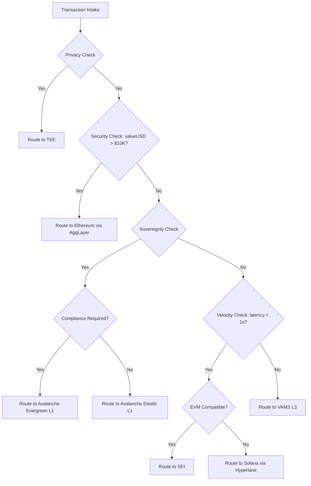

<!--
╔══════════════════════════════════════════════════════════════════════════════╗
║                         INTELLECTUAL PROPERTY NOTICE                          ║
╠══════════════════════════════════════════════════════════════════════════════╣
║  Document: VAMS Architecture Reference v0.3.0                                 ║
║  Author: Aseem Chishti                                                        ║
║  Email: aseeminksa@gmail.com                                                  ║
║  LinkedIn: https://www.linkedin.com/in/aseemchishti                           ║
║                                                                               ║
║  SHA-256 Fingerprint: 1FC554F7082EE8ADDDC3EF7250BCDA0CB004A04810BF73524ADCD62564F24A88
║  Timestamp: 2026-01-13T00:30:13+05:30 (ISO 8601)                              ║
║                                                                               ║
║  Copyright (c) 2026 Aseem Chishti. All Rights Reserved.                       ║
║  Licensed under the MIT License - see LICENSE file for details.               ║
║                                                                               ║
║  This cryptographic fingerprint establishes proof of authorship and content   ║
║  integrity at the specified timestamp. Any unauthorized reproduction          ║
║  claiming original authorship can be verified against this hash.              ║
╚══════════════════════════════════════════════════════════════════════════════╝
-->

# VAMS Architecture Reference v0.3.0
## The Sovereign Brain: Unified Technical Specification
### Realizing the "AWS of Web3" through the Verifiable and Agentic Modular Stack (L3)

**Version:** 0.3.0   
**Date:** January 2026  
**Status:** Mainnet Specification  

---

## Table of Contents

1. [Executive Summary](#1-executive-summary)
2. [Design Philosophy](#2-design-philosophy)
3. [The 5-Layer VAMS Stack](#3-the-5-layer-vams-stack)
   - [Layer 1: Foundational (Scalability & Data Availability)](#31-layer-1-foundational-layer)
   - [Layer 2: Compute (Performance & Inference)](#32-layer-2-compute-layer)
   - [Layer 3: Logic (Durability & State Management)](#33-layer-3-logic-layer)
   - [Layer 4: Trust (Compliance & Privacy)](#34-layer-4-trust-layer)
   - [Layer 5: Economic (Incentives, Tokenomics & Agent Economies)](#35-layer-5-economic-layer)
4. [Part I: The AWS of Web3](#part-i-the-aws-of-web3)
   - [DePIN Primitives Mapping](#4-depin-primitives-mapping)
   - [Compute Architecture](#5-compute-architecture)
   - [Storage Architecture](#6-storage-architecture)
   - [Networking Architecture](#7-networking-architecture)
5. [Part II: The Sovereign Brain](#part-ii-the-sovereign-brain)
   - [AI Inference Architecture](#8-ai-inference-architecture)
   - [Data Sovereignty Framework](#9-data-sovereignty-framework)
   - [Model Privacy & ZKML](#10-model-privacy--zkml)
6. [Part III: The Agentic Web](#part-iii-the-agentic-web)
   - [Agent Communication Protocols](#11-agent-communication-protocols)
   - [Agent Execution Runtime (DBOS)](#12-agent-execution-runtime)
   - [Agent Economy (x402 & AP2)](#13-agent-economy)
7. [Core Infrastructure](#core-infrastructure)
   - [Conditional L1 Router (CLR)](#14-conditional-l1-router-clr)
   - [Avalanche Network (Sovereign Execution Domain)](#15-avalanche-network)
   - [Cross-Chain Infrastructure](#16-cross-chain-infrastructure)
   - [VAMS Gateway](#17-vams-gateway)
8. [Decentralization & Mitigation Strategies](#18-decentralization--mitigation-strategies)
   - [CLR Decentralization & Routing Proofs](#181-clr-decentralization-c1-remediation)
   - [Governance & Admin Key Specification](#186-governance--admin-key-specification)
9. [Real-World Use Cases](#19-real-world-use-cases)
10. [Security & Compliance](#20-security--compliance)
    - [Multi-TEE Active Verification](#203-multi-tee-active-verification-c3-remediation)
    - [VAMS L3 Consensus Mechanism](#204-vams-l3-consensus-mechanism-c5-remediation)
    - [Bridge Security (Multi-ISM)](#205-bridge-security-enhancement-m1-remediation)
    - [x402 Payment Security](#206-x402-payment-security-m2-remediation)
    - [Agent Oracle Security](#207-agent-oracle-security-m3-remediation)
    - [DBOS State Anchoring](#208-dbos-state-anchoring-m4-remediation)
11. [Black Swan Event Handling](#21-black-swan-event-handling-c4-remediation)
    - [L1 Halt Fallback Matrix](#211-l1-halt-fallback-matrix)
    - [Economic Circuit Breakers](#213-economic-circuit-breakers)
    - [Insurance Fund Specification](#214-insurance-fund-specification)
12. [Deployment & Operations](#22-deployment--operations)
13. [Appendices](#appendices)

---

## 1. Executive Summary

The digital asset ecosystem stands at a definitive structural inflection point, characterized by the simultaneous maturation of Decentralized Physical Infrastructure Networks (DePIN) and the emergent dominance of autonomous agentic software. VAMS (Verifiable and Agentic Modular Stack) is a Layer 3 meta-layer designed to serve as the **"Sovereign Brain"** for the agentic web.

| Paradigm | VAMS Implementation | Value Proposition |
|----------|---------------------|-------------------|
| **AWS of Web3** | Decentralized Compute, Storage, Networking | Programmatic access to global DePIN infrastructure |
| **Sovereign Brain** | Privacy-preserving AI inference | Data sovereignty + model privacy + censorship resistance |
| **Agentic Web** | Standardized agent protocols | Autonomous agents as first-class network citizens |

VAMS enables AI agents to **consume infrastructure, process intelligence, and execute transactions** across a unified, verifiable stack—solving the "Usability Crisis" that currently stifles decentralized AI adoption.

---

## 2. Design Philosophy

### 2.1 Core Principles

```
┌─────────────────────────────────────────────────────────────────────────┐
│                         VAMS DESIGN PRINCIPLES                           │
├─────────────────────────────────────────────────────────────────────────┤
│                                                                          │
│  1. MODULAR SOVEREIGNTY                                                  │
│     Every component is replaceable; agents own their execution stack     │
│                                                                          │
│  2. VERIFIABLE EXECUTION                                                 │
│     ZK-proofs, TEE attestations, or optimistic fraud proofs for all     │
│                                                                          │
│  3. ECONOMIC ABSTRACTION                                                 │
│     Agents pay in $VAMS; protocol handles multi-chain gas conversion    │
│                                                                          │
│  4. COMPLIANCE BY DESIGN                                                 │
│     GDPR, MiCA, OFAC compliance embedded at protocol layer              │
│                                                                          │
│  5. CENSORSHIP RESISTANCE                                                │
│     No single point of control; decentralized at every layer            │
│                                                                          │
└─────────────────────────────────────────────────────────────────────────┘
```

### 2.2 The Agentic Imperative

Traditional blockchain architecture creates insurmountable bottlenecks for autonomous AI agents:
- **Block times exceeding 12 seconds** vs. agent requirements for sub-second feedback
- **Volatile gas costs** making economic planning impossible
- **Deterministic contracts** causing catastrophic failures in probabilistic workflows
- **Stateless transactions** vs. agents requiring rich, persistent state

VAMS addresses these through a modular stack that outsources functions to specialized DePIN providers.

---

## 3. The 5-Layer VAMS Stack

```
┌─────────────────────────────────────────────────────────────────────────┐
│                        VAMS 5-LAYER ARCHITECTURE                         │
├─────────────────────────────────────────────────────────────────────────┤
│                                                                          │
│  ┌─────────────────────────────────────────────────────────────────────┐│
│  │  LAYER 5: ECONOMIC                                                   ││
│  │  $VAMS Token • Dynamic TAO • x402/AP2 Payments • Staking            ││
│  └─────────────────────────────────────────────────────────────────────┘│
│                                                                          │
│  ┌─────────────────────────────────────────────────────────────────────┐│
│  │  LAYER 4: TRUST                                                      ││
│  │  Phala TEE • Marlin Oyster • Automata Attestation • ZKML            ││
│  └─────────────────────────────────────────────────────────────────────┘│
│                                                                          │
│  ┌─────────────────────────────────────────────────────────────────────┐│
│  │  LAYER 3: LOGIC                                                      ││
│  │  DBOS Durable Execution • Kwil • WeaveDB • Glacier Vector DB        ││
│  └─────────────────────────────────────────────────────────────────────┘│
│                                                                          │
│  ┌─────────────────────────────────────────────────────────────────────┐│
│  │  LAYER 2: COMPUTE                                                    ││
│  │  io.net GPU • Akash Supercloud • Render Network • Bittensor         ││
│  └─────────────────────────────────────────────────────────────────────┘│
│                                                                          │
│  ┌─────────────────────────────────────────────────────────────────────┐│
│  │  LAYER 1: FOUNDATIONAL                                               ││
│  │  Celestia DA • EigenDA • Near DA • Avail Validity Proofs            ││
│  └─────────────────────────────────────────────────────────────────────┘│
│                                                                          │
└─────────────────────────────────────────────────────────────────────────┘
```

### 3.1 Layer 1: Foundational Layer

The bedrock of VAMS, handling transaction ordering, state management, and Data Availability (DA).

#### 3.1.1 Primary: Celestia (DAS Mechanics)

Celestia focuses solely on ordering transactions and making data available via **Data Availability Sampling (DAS)**:

- **2D Reed-Solomon encoding**: Block data extended into a k×k share matrix
- **Light node sampling**: Random chunk verification to 99.9% confidence
- **Cost**: ~95% lower than Ethereum calldata
- **Scalability**: Block size scales with light node participation

#### 3.1.2 High-Security: EigenDA

For high-value enterprise transactions requiring Ethereum's economic security:

- Leverages EigenLayer restaking primitive
- Secured by staked ETH without L1 scalability constraints
- Target throughput: up to 1 GB/s
- Used when `valueUSD > $10,000` or `finality == deterministic`

#### 3.1.3 High-Velocity: Near DA

For low-value, high-frequency transactions (gaming, social, IoT):

- Leverages NEAR Protocol's sharding architecture
- **Up to 85,000x cheaper** than Ethereum
- Ideal for ephemeral sensor data and social interactions

#### 3.1.4 Validity Proofs: Avail

Native KZG polynomial commitment compatibility for VAMS ZK-Rollup logic:

- Enables Validium operation (off-chain data, on-chain proofs)
- Middle ground between full rollups and sidechains

---

### 3.2 Layer 2: Compute Layer

The engine sourcing computational power for AI inference and training.

| Provider | Role | Technology | Use Case |
|----------|------|------------|----------|
| **io.net** | GPU Clusters | Ray framework, H100/A100 | High-intensity inference |
| **Akash** | Supercloud | Kubernetes, Docker | Persistent agents, SaaS backends |
| **Render** | Visual AI | GPU rendering | Metaverse, 3D assets |
| **Bittensor** | Global Brain | Yuma Consensus, Subnets | Intelligence-as-a-Service |

#### Bittensor Integration (The Global Brain)

```
Agent Request ─► VAMS Orchestrator ─► Bittensor Subnet
                       │
                 $VAMS payment (abstracted)
                       │
                       ▼
              TAO Staking → Subnet Inference → Response + Proof
```

- **SN1**: Text generation for agent reasoning
- **SN8**: Time series for price prediction
- **SN18**: Vision for image analysis
- **Self-Improving**: Agents inherit model improvements automatically

---

### 3.3 Layer 3: Logic Layer

Manages state and complex workflows for **"Crash-Proof Workflows"** and **"Immortal Agents."**

#### DBOS (Database Operating System)

```
┌──────────────────────────────────────────────────────────────────────┐
│  WORKFLOW: MultiStepAgentTask                                         │
│                                                                        │
│  Step 1: Gather Data ─────────────► [CHECKPOINT]                      │
│            │                              │                            │
│            │ ◄──── Crash! ────────────────┘                            │
│            │                                                           │
│            │ ◄──── Recover from checkpoint ────┐                       │
│            │                                   │                       │
│  Step 2: Run Inference ───────────► [CHECKPOINT]                      │
│  Step 3: Execute Transaction ─────► [CHECKPOINT]                      │
│  Step 4: Report Result ───────────► [COMPLETE]                        │
│                                                                        │
│  GUARANTEE: Exactly-once execution semantics                           │
└──────────────────────────────────────────────────────────────────────┘
```

#### Decentralized State Layer

| Component | Role | Technology |
|-----------|------|------------|
| **Kwil** | Relational Backbone | Permissionless SQL, BFT consensus |
| **WeaveDB** | Permanent Logs | NoSQL on Arweave, immutable audit trails |
| **Glacier Network** | Long-Term Memory | Vector DB for semantic search |

---

### 3.4 Layer 4: Trust Layer

Ensures integrity and confidentiality through a hybrid trust model.

#### TEE Providers

| Provider | Technology | Specialty |
|----------|------------|-----------|
| **Phala Network** | Intel SGX Enclaves | Phat Contracts, private compute |
| **Marlin Oyster** | AWS Nitro Enclaves | TLS termination, Web2 API bridge |
| **Automata** | Multi-Prover AVS | On-chain TEE attestation verification |

#### Privacy Flow

```
Agent encrypts data → Phala/Marlin TEE → Process inside enclave
                                              ↓
                              Only state root posted to chain
```

---

### 3.5 Layer 5: Economic Layer

Aligns incentives using AI-governed tokenomics.

#### $VAMS Unified Payment Model

- **Single payment gateway** for entire DePIN stack
- Abstracts complexity of AKT, IO, TAO, TIA, etc.
- Functions as **Payment Settlement DePIN**
- Solves "Token Fatigue" for developers

#### $VAMS Tokenomics Specification (C2 Remediation)

> [!IMPORTANT]
> This section defines the complete token economic model as required for economic security analysis.

**Token Supply & Distribution:**

| Parameter | Value |
|-----------|-------|
| **Total Supply** | 1,000,000,000 $VAMS (1 billion, fixed cap) |
| **Initial Circulating** | 150,000,000 $VAMS (15%) |
| **Token Standard** | ERC-20 (Ethereum) + Wrapped on Avalanche/Solana |

**Allocation Breakdown:**

| Category | Allocation | Tokens | Vesting |
|----------|-----------|--------|---------|
| **Community & Ecosystem** | 40% | 400,000,000 | 5-year linear unlock |
| **Protocol Treasury** | 20% | 200,000,000 | DAO-controlled, 2-year cliff |
| **Core Team** | 15% | 150,000,000 | 4-year vest, 1-year cliff |
| **Early Investors** | 12% | 120,000,000 | 3-year vest, 6-month cliff |
| **Validators & Staking Rewards** | 8% | 80,000,000 | Emission over 10 years |
| **Initial Liquidity** | 5% | 50,000,000 | Unlocked at TGE |

**Emission Schedule:**

```
Year 1:  25,000,000 $VAMS (3.125% of validator allocation)
Year 2:  20,000,000 $VAMS (2.5%)
Year 3:  15,000,000 $VAMS (1.875%)
Year 4:  10,000,000 $VAMS (1.25%)
Year 5:   5,000,000 $VAMS (0.625%)
Years 6-10: 1,000,000 $VAMS/year (tail emission)

Total Inflation: ~2.5% Year 1, decreasing to <0.1% by Year 10
```

**Value Accrual Mechanisms:**

| Mechanism | Description | Value Capture |
|-----------|-------------|---------------|
| **Protocol Fees** | 0.1-0.5% on all agent transactions | Direct buyback & burn |
| **Gas Abstraction Premium** | 5% markup on gas conversion | Treasury revenue |
| **Staking Rewards** | 8% base APY for validators | Network security |
| **x402 Settlement Fees** | 0.05% on payment channel settlement | LP rewards |
| **Bridge Liquidity Fees** | 0.25% on cross-chain transfers | Insurance fund + LP |

**Sustainability Model:**

```
┌─────────────────────────────────────────────────────────────────────────┐
│                    $VAMS ECONOMIC SUSTAINABILITY                        │
├─────────────────────────────────────────────────────────────────────────┤
│                                                                          │
│  REVENUE SOURCES                    EXPENDITURE SINKS                   │
│  ────────────────                   ─────────────────                   │
│  Protocol Fees (0.1-0.5%)    ──────► Validator Rewards (40%)            │
│  Gas Premium (5%)            ──────► Provider Payments (30%)            │
│  Bridge Fees (0.25%)         ──────► Insurance Fund (10%)               │
│  x402 Settlement (0.05%)     ──────► DAO Treasury (10%)                 │
│                              ──────► Buyback & Burn (10%)               │
│                                                                          │
│  EQUILIBRIUM CONDITION:                                                 │
│  Protocol Fees ≥ Emission Value + Operational Costs                    │
│                                                                          │
│  At $1B TVL with 0.2% avg fee = $2M/year protocol revenue              │
│  Required for sustainability: $2M > (Emission × Token Price)           │
│                                                                          │
└─────────────────────────────────────────────────────────────────────────┘
```

**Dynamic TAO Integration (AI-Driven Fee Adjustment):**

```python
class DynamicTAOController:
    """
    RL-based emission adjustment with bounds and circuit breakers.
    """
    # Hard bounds to prevent runaway scenarios
    MIN_EMISSION_RATE = 0.001  # 0.1% minimum annual inflation
    MAX_EMISSION_RATE = 0.05   # 5% maximum annual inflation
    MAX_FEE_ADJUSTMENT = 0.10  # 10% max fee change per epoch
    
    def adjust_economics(self, network_metrics: NetworkMetrics) -> Adjustment:
        # Calculate demand-supply balance
        demand_signal = self._compute_demand(network_metrics)
        supply_pressure = self._compute_supply(network_metrics)
        
        # RL model recommends adjustment
        recommended = self.rl_model.predict(demand_signal, supply_pressure)
        
        # Apply bounds (circuit breaker)
        bounded = self._apply_bounds(recommended)
        
        return Adjustment(
            emission_rate=bounded.emission,
            fee_multiplier=bounded.fees,
            effective_epoch=network_metrics.current_epoch + 1
        )
    
    def _apply_bounds(self, recommendation):
        """Prevent runaway inflation/deflation"""
        return BoundedAdjustment(
            emission=max(self.MIN_EMISSION_RATE, 
                        min(self.MAX_EMISSION_RATE, recommendation.emission)),
            fees=max(1 - self.MAX_FEE_ADJUSTMENT,
                    min(1 + self.MAX_FEE_ADJUSTMENT, recommendation.fees))
        )
```

#### Agentic Commerce Standards

- **x402**: HTTP 402-based micropayments
- **AP2**: Google's Agent Payments Protocol
- Agents generate cryptographically signed "Mandates" for transactions

---

## Part I: The AWS of Web3

## 4. DePIN Primitives Mapping

| AWS Service | VAMS DePIN Component | Functional Role | Technical Mechanism |
|-------------|---------------------|-----------------|---------------------|
| EC2 (Compute) | io.net / Akash | Compute/P2P Market | Ray clusters & Kubernetes |
| S3 (Storage) | Celestia / Filecoin | Data Availability | DAS and blob storage |
| RDS (Database) | Kwil / Tableland | State Management | Decentralized SQL |
| Lambda (Serverless) | DBOS / Phala | Durable Execution | Crash-proof workflows via TEEs |
| IAM (Identity) | Phala / Automata | Trust & Identity | TEEs and on-chain attestations |
| API Gateway | Marlin (Oyster) | Secure Networking | TLS termination inside Enclaves |

---

## 5. Compute Architecture

### 5.1 GPU Compute (io.net)

```
Agent ─── InferenceRequest ───► VAMS Orchestrator
                                      │
                    ┌─────────────────┼─────────────────┐
                    ▼                 ▼                 ▼
              io.net Pool A     io.net Pool B     io.net Pool C
              (H100 x 8)        (A100 x 16)       (A10G x 32)
                    │                 │                 │
                    └─────────────────┼─────────────────┘
                                      │
                              InferenceResult + Proof of Compute
```

**Proof of Compute Structure:**

```rust
struct ProofOfCompute {
    input_hash: [u8; 32],
    output_hash: [u8; 32],
    tee_attestation: Option<Attestation>,
    challenge_period_end: u64,  // 7-day optimistic window
    provider_signature: Signature,
}
```

### 5.2 CPU Compute (Akash)

```yaml
# Akash SDL for VAMS Agent Runtime
services:
  vams-agent:
    image: ghcr.io/vams-protocol/agent-runtime:latest
    resources:
      cpu: { units: 4 }
      memory: { size: 8Gi }
      storage: { size: 20Gi }
```

### 5.3 Bittensor Subnets

| Subnet | Intelligence Type | VAMS Use Case |
|--------|-------------------|---------------|
| SN1 | Text Generation | Agent reasoning |
| SN3 | Data Scraping | Market intelligence |
| SN8 | Time Series | Price prediction |
| SN9 | Pre-training | Model fine-tuning |
| SN18 | Vision | Image analysis |

---

## 6. Storage Architecture

```
┌─────────────────────────────────────────────────────────────────────────┐
│                        STORAGE LAYER TIERS                               │
├─────────────────────────────────────────────────────────────────────────┤
│                                                                          │
│  L0 (Cache)   │ Redis         │ <10ms    │ Ephemeral  │ Session state   │
│  L1 (Hot)     │ Arweave       │ <500ms   │ Permanent  │ Proofs/receipts │
│  L2 (Warm)    │ IPFS/Light    │ <2s      │ Pinned     │ Agent memory    │
│  L3 (Cold)    │ Filecoin      │ <1min    │ 10+ years  │ Archives        │
│                                                                          │
└─────────────────────────────────────────────────────────────────────────┘
```

---

## 7. Networking Architecture

### 7.1 Transport Stack

| Layer | Technology | Function |
|-------|------------|----------|
| Transport | libp2p, NATS, WebRTC | P2P mesh, Pub/Sub |
| Relay | Livepeer | Video transcoding, streaming |
| RPC | Lava, Pocket, DRPC | Decentralized RPC (50+ chains) |

### 7.2 Agent Discovery (DHT)

```rust
struct AgentRecord {
    agent_id: AgentId,
    capabilities: Vec<Capability>,
    endpoints: Vec<Multiaddr>,
    reputation: u32,
    signature: Signature,
}

enum Capability {
    InferenceProvider { models: Vec<ModelId> },
    StorageProvider { capacity_gb: u64 },
    ComputeProvider { gpu_type: GpuType },
    OracleProvider { data_sources: Vec<String> },
}
```

---

## Part II: The Sovereign Brain

## 8. AI Inference Architecture

### 8.1 Inference Modes

| Mode | Privacy | Verifiability | Latency | Cost | Use Case |
|------|---------|---------------|---------|------|----------|
| **Plaintext** | None | Optimistic | ~100ms | $ | Public data |
| **TEE** | High | Attestation | ~200ms | $$ | Private data |
| **ZKML** | Maximum | ZK-proof | ~10s | $$$ | Regulatory/high-stakes |
| **MPC** | Maximum | Collaborative | ~5s | $$$$ | Multi-party secrets |

### 8.2 TEE Inference Pipeline (Phala)

```
1. REQUEST:    encrypted_input = E(agent_data, tee_pubkey)
2. ATTESTATION: sign(code_hash || mrenclave, intel_key)
3. EXECUTION:   result = model.infer(D(encrypted_input, tee_privkey))
4. RESPONSE:    return (E(result, agent_pubkey), attestation)
```

---

## 9. Data Sovereignty Framework

**Principles:**
1. **Data Localization**: Data stays in user-controlled storage
2. **Computation to Data**: Models move to data, not vice versa
3. **Zero-Knowledge Proofs**: Prove properties without revealing data
4. **Revocable Access**: Owners can revoke access anytime

---

## 10. Model Privacy & ZKML

| Provider | Approach | Supported Models | Proof Time |
|----------|----------|------------------|------------|
| **EZKL** | Halo2 | CNN, MLP, Transformers | 10-60s |
| **Giza** | Cairo/STARK | ONNX models | 30-120s |
| **Modulus** | Custom ZK | Large models | 60-300s |

---

## Part III: The Agentic Web

## 11. Agent Communication Protocols

```
┌─────────────────────────────────────────────────────────────────────────┐
│                    AGENT COMMUNICATION STACK                             │
├─────────────────────────────────────────────────────────────────────────┤
│  LAYER 4: SEMANTIC    │ MCP (Model Context Protocol)                    │
│  LAYER 3: ECONOMIC    │ x402 Protocol (micropayments)                   │
│  LAYER 2: IDENTITY    │ DID / Verifiable Credentials                    │
│  LAYER 1: TRANSPORT   │ libp2p / NATS                                   │
└─────────────────────────────────────────────────────────────────────────┘
```

---

## 12. Agent Execution Runtime

### DBOS Workflow Example

```python
from dbos import DBOS, workflow, step

@workflow
def agent_workflow(task_id: str, input_data: dict):
    market_data = gather_market_data(task_id)      # [CHECKPOINT]
    prediction = run_inference(market_data)         # [CHECKPOINT]
    tx_hash = execute_trade(prediction)             # [CHECKPOINT]
    report_result(task_id, tx_hash)
    return tx_hash

@step
def run_inference(data: dict) -> dict:
    # Idempotent: retried with same input if crashed
    return model.predict(data)
```

---

## 13. Agent Economy

### 13.1 x402 Protocol Flow

```
Agent A                          Provider B
   │ ─── 1. POST /inference ─────────►│
   │ ◄── 2. HTTP 402 Payment Required │
   │     { "price": "0.001 VAMS", "nonce": 12345 }
   │ ─── 3. Signed Payment Receipt ──►│
   │ ◄── 4. HTTP 200 + Result ────────│
   │      [Background: Batch Settlement to Gateway L1]
```

### 13.2 Payment Channels

```solidity
interface IPaymentChannel {
    function openChannel(address provider, uint256 deposit) external returns (bytes32);
    function updateState(bytes32 channelId, uint256 agentBal, uint256 providerBal, bytes agentSig, bytes providerSig) external;
    function closeChannel(bytes32 channelId) external;
}
```

---

## Core Infrastructure

## 14. Conditional L1 Router (CLR)

### 14.1 VAMSTransaction Metadata (v2.1)

```solidity
struct VAMSTransactionMetadata {
    string useCaseID;             // e.g., "high_freq_trading"
    uint256 valueUSD;             // Estimated value for risk assessment
    uint256 maxLatencyMs;         // Maximum acceptable latency
    bool requiresPrivacy;         // Trigger for TEE routing
    string requiredFinality;      // "probabilistic" or "deterministic"
    // NEW: Sovereignty fields for Avalanche L1 routing
    bool requiresCustomGas;       // Agent needs custom gas token
    bool requiresIsolatedThroughput; // Agent needs dedicated blockspace
    string validatorRequirements; // "permissionless" or "permissioned"
    bool requiresCompliance;      // Evergreen/institutional mode
}
```

### 14.2 Dynamic Routing Decision Tree (v2.1)



### 14.3 Routing Implementation (v2.1 with Sovereignty Check)

```python
class CLRouter_V2:
    SECURITY_THRESHOLD = 10_000  # USD
    VELOCITY_THRESHOLD = 1_000   # ms
    
    async def route(self, tx: VAMSTransaction) -> RoutingDecision:
        # Priority 1: Privacy
        if tx.metadata.requires_privacy:
            return await self._route_to_tee(tx)
        
        # Priority 2: Security (High-value → Ethereum)
        if tx.metadata.value_usd > self.SECURITY_THRESHOLD:
            return await self._route_to_ethereum(tx)
        
        # Priority 3: Sovereignty (NEW - Avalanche L1s)
        if tx.metadata.requires_custom_gas or tx.metadata.requires_isolated_throughput:
            if tx.metadata.requires_compliance:
                return await self._route_to_avalanche_evergreen(tx)
            return await self._route_to_avalanche_elastic(tx)
        
        # Priority 4: Velocity
        if tx.metadata.max_latency_ms < self.VELOCITY_THRESHOLD:
            # Compare congestion: Avalanche L1 offers deterministic velocity
            if self._get_solana_congestion() > CONGESTION_THRESHOLD:
                return await self._route_to_avalanche_l1(optimized_for="velocity")
            if self._is_evm_payload(tx.payload):
                return await self._route_to_sei(tx)
            return await self._route_to_solana(tx)
        
        # Default: VAMS L3
        return await self._route_to_vams_l3(tx)
```

---

## 15. Avalanche Network (Sovereign Execution Domain)

Avalanche introduces a critical new architectural vector: **Sovereign Execution Domains**. With the Avalanche9000 upgrade and ACP-77, agents can control the entire vertical stack—from gas tokens to validator sets.

### 15.1 Why Avalanche for VAMS?

| Capability | Solana | Ethereum | Avalanche L1 |
|------------|--------|----------|---------------|
| **State Isolation** | No (shared) | No (shared) | ✅ Dedicated blockspace |
| **Custom Gas Token** | No (SOL only) | No (ETH only) | ✅ Any token |
| **Validator Control** | No | No | ✅ Sovereign validator sets |
| **Time to Finality** | ~400ms | ~12min | ~800ms-2s |
| **TPS (Per Agent)** | Shared 2-5k | Shared ~15 | ✅ ~4,500 dedicated |

> **Key Insight**: While Solana wins on raw latency, Avalanche wins on **predictability and control**. An agent on Avalanche L1 is the network—no competition with global traffic.

### 15.2 ACP-77: The Sovereignty Catalyst

ACP-77 fundamentally changes the Avalanche economic model:

| Pre-ACP-77 | Post-ACP-77 |
|------------|-------------|
| 2,000 AVAX stake required | Pay-as-you-go dynamic fee |
| Must validate Primary Network | Decoupled validation |
| Heavy CapEx | Manageable OpEx (SaaS model) |
| Enterprise-only | Accessible to all agents |

### 15.3 HyperSDK: Custom Agent VMs

HyperSDK enables purpose-built Virtual Machines optimized for agent workloads:

- **Tensor-Optimized VMs**: Native tensor operations for AI agents
- **Inference-Native Transactions**: "InferenceRequest" as first-class tx type
- **Proof of Inference Consensus**: Custom consensus for compute verification
- **Sub-second finality**: Stripped-down, lean execution environments

### 15.4 Avalanche Warp Messaging (AWM) & Teleporter

```
┌─────────────────────────────────────────────────────────────────────────┐
│                    AVALANCHE INTEROPERABILITY                            │
├─────────────────────────────────────────────────────────────────────────┤
│                                                                          │
│  ┌─────────────┐    AWM (BLS Multi-sig)    ┌─────────────┐             │
│  │ Agent L1 A  │◄──────────────────────────►│ Agent L1 B  │             │
│  └─────────────┘                            └─────────────┘             │
│         │                                          │                     │
│         │              Teleporter                  │                     │
│         └──────────────────┬───────────────────────┘                     │
│                            │                                             │
│                    ┌───────▼───────┐                                    │
│                    │   C-Chain     │                                    │
│                    │   (Gateway)   │                                    │
│                    └───────┬───────┘                                    │
│                            │                                             │
│              ┌─────────────┼─────────────┐                              │
│              │             │             │                               │
│        Hyperlane      LayerZero     Union Labs                          │
│              │             │             │                               │
│              ▼             ▼             ▼                               │
│          Solana         Ethereum      Cosmos                            │
│                                                                          │
└─────────────────────────────────────────────────────────────────────────┘
```

### 15.5 VAMS Gateway Architecture (Hyperlane ↔ Teleporter)

```
1. INGRESS:     Solana Agent → Hyperlane → VAMS_Gateway (C-Chain)
2. TRANSLATION: Gateway verifies Hyperlane proof (Phala ISM)
3. ROUTING:     Gateway unwraps payload, identifies target L1 ChainID
4. EGRESS:      Teleporter message → AWM → Target Avalanche L1
```

### 15.6 Avalanche L1 Types for VAMS

| L1 Type | Validator Set | Use Case |
|---------|---------------|----------|
| **Elastic L1** | Permissionless, pay-as-you-go | Open agent economies |
| **Evergreen L1** | Permissioned, KYC validators | Institutional/compliant agents |
| **Ephemeral L1** | Spin up/down on demand | Just-in-Time blockchains |

### 15.7 Integration with VAMS Layers

| VAMS Layer | Avalanche Component | Value Proposition |
|------------|---------------------|-------------------|
| Layer 1: Foundational | Avalanche L1 (Sovereign) | Agents own the network, not tenants |
| Layer 2: Compute | HyperSDK Custom VMs | Compute Chains for Proof of Inference |
| Layer 3: Logic | C-Chain / EVM L1s | High-perf EVM with sub-second finality |
| Layer 4: Trust | AWM / Teleporter | Verified cross-chain without intermediaries |
| Layer 5: Economic | x402 / Custom Gas | HTTP-native payments, custom economies |

---

## 16. Cross-Chain Infrastructure

### 16.1 Transport Matrix

| Source | Destination | Transport | Latency | Security |
|--------|-------------|-----------|---------|----------|
| VAMS L3 | Ethereum | AggLayer | ~12min | Pessimistic Proofs |
| VAMS L3 | Solana | Hyperlane | ~400ms | ISM verification |
| VAMS L3 | SEI | LayerZero v2 | ~380ms | DVN consensus |
| VAMS L3 | Cosmos | Union Labs | ~1s | IBC |
| VAMS L3 | Avalanche C-Chain | Hyperlane | ~800ms | ISM verification |
| VAMS L3 | Avalanche L1s | AWM/Teleporter | ~250ms | BLS multi-sig |
| Avalanche L1 | Avalanche L1 | AWM | ~250ms | P-Chain validation |

### 16.2 Polygon AggLayer (Unified Settlement Hub)

- **Unified Liquidity**: Multichain network that feels like single chain
- **Pessimistic Proofs**: Cryptographic guarantee against over-withdrawal
- **Atomic Transactions**: Cross-chain execution in single action

### 16.3 Solana via Hyperlane

- Permissionless interoperability for high-velocity execution
- "Warp Routes" for asset/message transfer to SVM environments
- Used for io.net compute payments and HFT order books

### 16.4 SEI (Fast Lane EVM)

- **Twin-Turbo Consensus**: 380ms finality
- **Parallelized EVM**: Optimistic parallel transaction processing
- Familiar EVM tooling (Metamask, Hardhat) with Solana-like performance

---

## 17. VAMS Gateway

The Gateway serves as the entry point for all agent interactions:

- **Unified Payment Processing**: $VAMS → multi-token conversion
- **Rate Limiting**: DDoS protection
- **OFAC Compliance**: Sanctions screening
- **Load Balancing**: Across DePIN providers

---

## 18. Decentralization & Mitigation Strategies

### 18.1 CLR Decentralization (C1 Remediation)

> [!CAUTION]
> CLR centralization is the highest-severity finding. This section specifies the mainnet decentralization roadmap.

**Phase-Based Decentralization:**

| Phase | Timeline | CLR Architecture | Centralization Level |
|-------|----------|------------------|---------------------|
| **Guarded Mainnet** | Q3 2026 | Multisig operators (5/7) | High (monitored) |
| **Restricted Mainnet** | Q4 2026 | Threshold Network MPC (67% consensus) | Medium |
| **Open Mainnet** | Q1 2027 | On-chain rules + Client SDK primary | Low |
| **Full Decentralization** | Q3 2027 | DAO governance, no admin keys | Minimal |

**CLR Operator Requirements (Guarded Mainnet):**

```yaml
clr_operator:
  stake_requirement: 100,000 $VAMS
  slashing_conditions:
    - incorrect_routing: 10% per incident
    - censorship_proven: 50% + removal
    - front_running: 25% + 30-day suspension
  monitoring:
    - public routing logs (encrypted payloads, visible metadata)
    - third-party auditors with read access
    - community challenge period: 7 days
```

**Cryptographic Routing Proofs (M5 Remediation):**

> [!IMPORTANT]
> To make CLR routing verifiable, we implement ZK-proofs of routing decisions.

```solidity
// RoutingProofVerifier.sol
contract RoutingProofVerifier {
    struct RoutingProof {
        bytes32 inputMetadataHash;    // H(valueUSD, latency, privacy, etc.)
        bytes32 routingDecisionHash;  // H(selectedChain, selectedProvider)
        bytes32 routingRulesRoot;     // Merkle root of active routing rules
        bytes zkProof;                // SNARK proof that decision follows rules
    }
    
    // Routing rules are committed on-chain (immutable reference)
    bytes32 public routingRulesRoot;
    
    // Verify that a routing decision followed the rules
    function verifyRoutingDecision(
        RoutingProof calldata proof
    ) external view returns (bool) {
        // 1. Verify proof against current rules root
        require(proof.routingRulesRoot == routingRulesRoot, "Stale rules");
        
        // 2. Verify ZK proof (using Groth16 or PLONK verifier)
        return zkVerifier.verify(
            proof.zkProof,
            [proof.inputMetadataHash, proof.routingDecisionHash, proof.routingRulesRoot]
        );
    }
    
    // Anyone can challenge a routing decision
    function challengeRouting(
        bytes32 txHash,
        RoutingProof calldata claimedProof,
        bytes calldata fraudEvidence
    ) external {
        // If proof invalid or fraudEvidence proves rule violation
        // CLR operator stake is slashed
    }
}
```

**Client-Side SDK Routing (Decentralization Path):**

```typescript
// vams-sdk/src/routing.ts
export class ClientSideRouter {
  private routingRules: RoutingRule[];
  private providerRegistry: ProviderRegistry;
  
  async route(tx: VAMSTransaction): Promise<RoutingDecision> {
    // 1. Fetch latest routing rules from on-chain
    this.routingRules = await this.fetchRoutingRules();
    
    // 2. Evaluate locally (no CLR dependency)
    const decision = this.evaluateRules(tx.metadata, this.routingRules);
    
    // 3. Generate routing proof for verification
    const proof = await this.generateRoutingProof(tx.metadata, decision);
    
    // 4. Submit to chain with proof
    return { 
      decision, 
      proof,
      verifiable: true 
    };
  }
  
  private evaluateRules(metadata: TxMetadata, rules: RoutingRule[]): ChainId {
    // Deterministic rule evaluation (same as CLR)
    if (metadata.requiresPrivacy) return CHAINS.PHALA_TEE;
    if (metadata.valueUSD > 10_000) return CHAINS.ETHEREUM;
    if (metadata.requiresIsolatedThroughput) return CHAINS.AVALANCHE_L1;
    if (metadata.maxLatencyMs < 1000) return CHAINS.SOLANA;
    return CHAINS.VAMS_L3;
  }
}
```

### 18.2 TEE Vendor Lock-in

| Solution | Approach | Implementation |
|----------|----------|----------------|
| **A** | Multi-TEE Active Verification | Intel SGX + AMD SEV + AWS Nitro (2/3 consensus) |
| **B** | ZK Hybrid Fallback | ZK-SNARKs as primary, TEE as optimization |
| **C** | Homomorphic Encryption | Zama fhEVM for compute on encrypted data |

> See Section 20.3 for detailed Multi-TEE implementation.

### 18.3 State Consistency (DBOS)

| Solution | Approach | Implementation |
|----------|----------|----------------|
| **A** | State Roots on L1 | Merkle roots committed to Ethereum |
| **B** | Multi-Database Quorum | Kwil + Tableland + Polybase (2/3 agreement) |
| **C** | CRDT-Based State | Conflict-free replicated data types |

> See Section 20.8 for detailed DBOS anchoring specification.

### 18.4 AI Agent Oracle Problem

| Solution | Approach | Implementation |
|----------|----------|----------------|
| **A** | Stake-Weighted Consensus | 10K $VAMS minimum, √stake voting power |
| **B** | Cryptographic Proof of HTTP | Town Crier/DECO for TLS proofs |
| **C** | Decentralized Data Feeds | Pyth, Redstone, Chronicle |

> See Section 20.7 for detailed Oracle security implementation.

### 18.5 Single Protocol Dependency

| Solution | Approach | Implementation |
|----------|----------|----------------|
| **A** | Multi-Provider Redundancy | 3+ providers per layer, Byzantine quorum |
| **B** | Graceful Degradation | Buffer, queue, read-only mode fallbacks |
| **C** | Economic Uptime Incentives | 100k $VAMS stake, 10% slash per hour down |

### 18.6 Governance & Admin Key Specification

> [!WARNING]
> The audit identified undefined admin key holders and governance gaps. This section provides explicit specification.

**Admin Key Holders (Guarded Mainnet):**

| Contract/System | Key Holder | Threshold | Timelock |
|-----------------|------------|-----------|----------|
| **VAMS Gateway** | Core Team Multisig | 3/5 | 48 hours |
| **Protocol Treasury** | DAO Multisig | 5/9 | 7 days |
| **CLR Routing Rules** | On-chain contract | DAO vote (>50% quorum) | 72 hours |
| **Slashing Parameters** | Core Team → DAO | 3/5 → 5/9 | 24h → 7 days |
| **Emergency Pause** | Guardian Committee | 2/3 | Immediate (review within 48h) |

**Progressive Decentralization Timeline:**

```
┌─────────────────────────────────────────────────────────────────────────┐
│                    GOVERNANCE DECENTRALIZATION ROADMAP                  │
├─────────────────────────────────────────────────────────────────────────┤
│                                                                          │
│  Q3 2026 (Guarded Mainnet)                                              │
│  ├── Core Team Multisig: 3/5 threshold                                  │
│  ├── All changes: 48h timelock minimum                                  │
│  └── Community visibility: Public audit logs                           │
│                                                                          │
│  Q4 2026 (Restricted Mainnet)                                           │
│  ├── DAO Multisig: 5/9 threshold (3 team + 6 community)                │
│  ├── Treasury control transferred to DAO                                │
│  └── CLR rules become on-chain (immutable)                              │
│                                                                          │
│  Q1 2027 (Open Mainnet)                                                 │
│  ├── Token-weighted voting for all parameter changes                    │
│  ├── Core Team reduced to 2/9 DAO seats                                 │
│  └── Emergency pause requires DAO ratification within 48h              │
│                                                                          │
│  Q3 2027 (Full Decentralization)                                        │
│  ├── All admin keys burned or transferred to DAO                        │
│  ├── Self-executing governance (Governor Bravo + timelock)              │
│  └── Core Team has no special privileges                                │
│                                                                          │
└─────────────────────────────────────────────────────────────────────────┘
```

**Legally Binding Commitment:**

> [!IMPORTANT]
> To address the audit concern about indefinite multisig control, VAMS commits to the following:

1. **Smart Contract Enforcement**: Decentralization milestones are enforced via time-locked smart contracts that automatically transfer permissions.
2. **Public Accountability**: Monthly governance reports published on-chain.
3. **Community Veto**: DAO can vote to accelerate decentralization at any time (>66% quorum).
4. **Sunset Clause**: Core Team admin keys are programmatically disabled 24 months after mainnet (Q3 2028).

---

## 19. Real-World Use Cases

### 18.1 High-Frequency DeFi Arbitrage

```
1. Agent detects spread between Solana DEX and Arbitrum DEX
2. CLR Velocity Check activates
3. Leg 1: Buy order → Solana via Hyperlane (<400ms)
4. Leg 2: Sell order → Arbitrum (simultaneous)
5. Settlement: Profit bridged via AggLayer (Ethereum security)
```

### 18.2 Supply Chain Compliance (Privacy-Preserving)

```
1. Agent receives shipment data
2. CLR Privacy Check activates (requiresPrivacy == true)
3. Pricing logic routed to Phala TEE
4. Inside enclave: decrypt, verify against contract
5. Output: Only "Compliance Verified" boolean posted publicly
```

### 18.3 Self-Sovereign AI Prediction Markets

```
1. Agent spins up Akash container for news scraping
2. io.net cluster runs Llama-3-Vision on launch video
3. Agent determines "Success" or "Failure"
4. Result logged to Kwil, zkML proof generated via Giza
5. Payout executed via $VAMS token
```

---

## 20. Security & Compliance

### 20.1 Threat Model

| Threat | Severity | Mitigation | Audit Reference |
|--------|----------|------------|-----------------|
| Gateway Compromise | Critical | Multi-sig + timelock + emergency pause | C4 |
| Bridge Exploit | Critical | Pessimistic proofs + Multi-ISM verification | M1 |
| TEE Side-Channel | High | Multi-vendor active verification | C3 |
| x402 MEV | High | Threshold encryption + payment channels | M2 |
| Model Theft | Medium | ZKML + TEE | - |
| CLR Front-Running | High | Encrypted metadata + routing proofs | C1, M5 |
| Oracle Manipulation | High | Stake-weighted consensus + reputation | M3 |
| L1 Halt Cascade | Critical | Multi-chain fallback procedures | C4 |

### 20.2 Defense in Depth

```
Layer 1: PERIMETER     │ DDoS protection + Rate limiting
Layer 2: AUTHENTICATION│ Wallet signatures (EIP-4361 SIWE) + Agent DID
Layer 3: AUTHORIZATION │ RBAC + Capability-based + Polygon ID
Layer 4: TRANSPORT     │ TLS 1.3 + Message signing + Replay protection
Layer 5: EXECUTION     │ TEE isolation + WASM sandboxing
Layer 6: ECONOMIC      │ Staking + Slashing + Insurance fund
Layer 7: RECOVERY      │ Circuit breakers + Emergency governance + L1 fallbacks
```

### 20.3 Multi-TEE Active Verification (C3 Remediation)

> [!IMPORTANT]
> To eliminate single-vendor TEE dependency (Intel SGX), VAMS implements mandatory multi-TEE verification for critical operations.

```
┌─────────────────────────────────────────────────────────────────────────┐
│                    MULTI-TEE VERIFICATION ARCHITECTURE                  │
├─────────────────────────────────────────────────────────────────────────┤
│                                                                          │
│  Critical Operation Request                                              │
│           │                                                              │
│           ├─────────────► Intel SGX (Phala) ─────┐                      │
│           │                                       │                      │
│           ├─────────────► AMD SEV (Marlin) ──────┼───► 2/3 Consensus   │
│           │                                       │                      │
│           └─────────────► AWS Nitro (Marlin) ────┘                      │
│                                                                          │
│  If TEE outputs diverge:                                                │
│    1. Transaction delayed (24-hour hold)                                │
│    2. Dispute escalated to VAMS DAO                                     │
│    3. Provider stakes slashed if fraud proven                           │
│                                                                          │
└─────────────────────────────────────────────────────────────────────────┘
```

**TEE Provider Rotation:**

```python
class MultiTEEVerifier:
    TEE_PROVIDERS = ["phala_sgx", "marlin_sev", "marlin_nitro"]
    CONSENSUS_THRESHOLD = 2  # 2/3 required
    
    async def verify_critical_operation(self, operation: Operation) -> VerificationResult:
        results = await asyncio.gather(*[
            self._execute_in_tee(provider, operation) 
            for provider in self.TEE_PROVIDERS
        ])
        
        # Check output consistency
        output_hashes = [r.output_hash for r in results]
        consensus_output = self._find_consensus(output_hashes)
        
        if consensus_output is None:
            return VerificationResult(
                status="DIVERGENCE_DETECTED",
                action="ESCALATE_TO_DAO",
                hold_period_hours=24
            )
        
        return VerificationResult(
            status="VERIFIED",
            output=consensus_output,
            attestations=[r.attestation for r in results if r.output_hash == consensus_output]
        )
```

**Slashing Conditions for TEE Providers:**

| Violation | Detection Method | Slash Rate | Recovery |
|-----------|-----------------|------------|----------|
| Divergent output (minority) | Automatic comparison | 5% stake | Appeal via DAO |
| Attestation forgery | On-chain verification | 50% stake | None |
| Repeated failures (3+ in 24h) | Monitoring service | 10% stake | 7-day cooldown |

### 20.4 VAMS L3 Consensus Mechanism (C5 Remediation)

> [!IMPORTANT]
> VAMS L3 serves as the default routing destination. This section specifies its security model.

**VAMS L3 runs on Avalanche Elastic L1 infrastructure with the following consensus parameters:**

| Parameter | Value | Rationale |
|-----------|-------|-----------|
| Consensus Protocol | Snowman++ (linearized DAG) | Avalanche-native, sub-second finality |
| Minimum Validators | 8 | Byzantine tolerance (f=2) |
| Stake Requirement | 50,000 $VAMS per validator | Economic security threshold |
| Validation Reward | 8% APY (dynamic adjustment) | Competitive with Avalanche C-Chain |
| Slashing Rate | 10-50% depending on severity | Aligned with CLR slashing |
| Block Time | ~500ms | Agent latency requirements |
| Finality | ~800ms (probabilistic 99.9%) | Transaction confirmation speed |

**Validator Requirements:**

```yaml
# VAMS L3 Validator Node Requirements
hardware:
  cpu: 8 vCPU (AVX2 support required)
  memory: 32 GB RAM
  storage: 500 GB NVMe SSD
  network: 1 Gbps symmetric

staking:
  minimum_stake: 50000  # $VAMS tokens
  lockup_period: 30     # days
  unbonding_period: 14  # days

uptime:
  minimum_requirement: 99.5%  # per 30-day period
  slashing_threshold: 95%     # below this = slash
```

**Security Budget Calculation:**

```
Attack Cost = (Validators to corrupt) × (Stake per validator) × (Token price)
            = (3 validators for 1/3 byzantine) × (50,000 $VAMS) × ($X)
            = 150,000 $VAMS × $X

Minimum Security: At $1/VAMS = $150,000 economic security
Target Security:  At $10/VAMS = $1,500,000 economic security
```

### 20.5 Bridge Security Enhancement (M1 Remediation)

> [!CAUTION]
> Single-vendor ISM dependency for Hyperlane creates systemic risk. VAMS implements Multi-ISM verification.

**Multi-ISM Configuration:**

```solidity
// VAMS HyperlaneSecurityModule.sol
contract VAMSMultiISM is IInterchainSecurityModule {
    IInterchainSecurityModule public phalaISM;
    IInterchainSecurityModule public oracleISM;
    IInterchainSecurityModule public multisigISM;
    
    uint8 public constant THRESHOLD = 2; // 2/3 required
    
    function verify(
        bytes calldata _metadata,
        bytes calldata _message
    ) external view override returns (bool) {
        uint8 validations = 0;
        
        if (phalaISM.verify(_metadata, _message)) validations++;
        if (oracleISM.verify(_metadata, _message)) validations++;
        if (multisigISM.verify(_metadata, _message)) validations++;
        
        return validations >= THRESHOLD;
    }
}
```

**ISM Provider Diversity:**

| ISM Type | Provider | Trust Model |
|----------|----------|-------------|
| TEE-Based | Phala Network | Hardware attestation |
| Oracle-Based | Chainlink CCIP | Economic stake (DON) |
| Multisig | VAMS DAO Signers | Social consensus (5/9 threshold) |

**Timeout-Based Fallbacks:**

```python
class BridgeFallbackHandler:
    PRIMARY_TIMEOUT_MS = 30_000      # 30 seconds
    SECONDARY_TIMEOUT_MS = 60_000    # 60 seconds
    
    async def bridge_message(self, msg: CrossChainMessage) -> BridgeResult:
        # Primary: Hyperlane with Multi-ISM
        try:
            return await asyncio.wait_for(
                self._bridge_via_hyperlane(msg),
                timeout=self.PRIMARY_TIMEOUT_MS / 1000
            )
        except asyncio.TimeoutError:
            logger.warning("Hyperlane timeout, falling back to LayerZero")
        
        # Secondary: LayerZero v2
        try:
            return await asyncio.wait_for(
                self._bridge_via_layerzero(msg),
                timeout=self.SECONDARY_TIMEOUT_MS / 1000
            )
        except asyncio.TimeoutError:
            # Tertiary: Queue for manual resolution
            return await self._queue_for_manual_bridge(msg)
```

### 20.6 x402 Payment Security (M2 Remediation)

> [!WARNING]
> The gap between service delivery and batch settlement creates exploitation windows. Payment channels provide atomic guarantees.

**Payment Channel with Escrow:**

```solidity
// Enhanced Payment Channel with Escrow
interface ISecurePaymentChannel {
    struct Channel {
        address agent;
        address provider;
        uint256 agentDeposit;
        uint256 providerBond;     // NEW: Provider skin-in-the-game
        uint256 agentBalance;
        uint256 providerBalance;
        uint256 nonce;
        uint256 expiresAt;
    }
    
    // Provider must bond to prevent service-without-payment exploits
    function openChannel(
        address provider, 
        uint256 deposit,
        uint256 providerBondRequired  // Agent can require provider bond
    ) external returns (bytes32 channelId);
    
    // Atomic state update with fraud proof window
    function updateState(
        bytes32 channelId,
        uint256 agentBal,
        uint256 providerBal,
        bytes calldata agentSig,
        bytes calldata providerSig,
        bytes32 serviceProofHash  // NEW: Hash of delivered service
    ) external;
    
    // Dispute: Agent can challenge if service not delivered
    function disputeService(
        bytes32 channelId,
        bytes calldata serviceProof  // TEE attestation or ZKML proof
    ) external;
}
```

**Settlement Risk Mitigation:**

| Risk | Mitigation | Implementation |
|------|------------|----------------|
| Agent receives service without paying | Provider bond + escrow hold | `providerBond >= 2x service cost` |
| Provider takes payment without delivering | Service proof requirement | TEE attestation or output hash |
| Batch settlement failure | Individual channel fallback | Per-tx settlement if batch fails |
| MEV extraction during settlement | Threshold encryption | Encrypt until settlement block |

### 20.7 Agent Oracle Security (M3 Remediation)

> [!CAUTION]
> The 5/7 multi-agent consensus is vulnerable to Sybil attacks. Stake-weighted voting and reputation systems are required.

**Stake-Weighted Oracle Consensus:**

```python
class SecureAgentOracle:
    MIN_STAKE = 10_000       # $VAMS minimum to participate
    MIN_REPUTATION = 0.7     # Minimum reputation score (0-1)
    CONSENSUS_WEIGHT = 0.67  # 67% stake-weight required
    
    async def get_consensus(self, query: OracleQuery) -> OracleResult:
        # Get eligible agents (stake + reputation filters)
        agents = await self._get_eligible_agents(query.data_type)
        
        # Collect responses with stake weights
        responses = await self._collect_weighted_responses(agents, query)
        
        # Calculate stake-weighted consensus
        result = self._calculate_weighted_consensus(responses)
        
        if result.confidence < self.CONSENSUS_WEIGHT:
            return OracleResult(status="NO_CONSENSUS", data=None)
        
        # Apply reputation updates
        await self._update_reputations(responses, result.final_value)
        
        return result
    
    async def _update_reputations(self, responses, consensus_value):
        for response in responses:
            if response.value == consensus_value:
                # Reward: Small reputation increase
                await self._adjust_reputation(response.agent_id, +0.01)
            else:
                # Penalty: Larger reputation decrease
                await self._adjust_reputation(response.agent_id, -0.05)
```

**Anti-Sybil Mechanisms:**

| Mechanism | Description | Effectiveness |
|-----------|-------------|---------------|
| Minimum Stake | 10,000 $VAMS to participate | Economic barrier |
| Stake Weighting | Vote power ∝ √(stake) | Sublinear to limit plutocracy |
| Reputation Decay | -1% per day of inactivity | Prevents dormant Sybils |
| Identity Binding | Optional Polygon ID attestation | +25% vote weight bonus |
| Slashing | False responses slash 5% stake | Economic punishment |

### 20.8 DBOS State Anchoring (M4 Remediation)

> [!IMPORTANT]
> DBOS checkpoints must be cryptographically anchored to L1 for recovery guarantees.

**Merkle Root Commitment System:**

```
┌─────────────────────────────────────────────────────────────────────────┐
│                    DBOS STATE ANCHORING ARCHITECTURE                    │
├─────────────────────────────────────────────────────────────────────────┤
│                                                                          │
│  DBOS Checkpoint (every N blocks or T seconds)                          │
│           │                                                              │
│           ▼                                                              │
│  ┌─────────────────────────────────────────┐                            │
│  │  Compute State Merkle Root              │                            │
│  │  - All active workflow states           │                            │
│  │  - Agent memory snapshots               │                            │
│  │  - Pending settlement queue             │                            │
│  └─────────────────────────────────────────┘                            │
│           │                                                              │
│           ▼                                                              │
│  ┌─────────────────────────────────────────┐                            │
│  │  Submit to Settlement Layer             │                            │
│  │  - Ethereum (via AggLayer) for finality │                            │
│  │  - Avalanche C-Chain for speed          │                            │
│  └─────────────────────────────────────────┘                            │
│           │                                                              │
│           ▼                                                              │
│  ┌─────────────────────────────────────────┐                            │
│  │  StateCheckpoint Contract               │                            │
│  │  mapping(uint256 => bytes32) roots      │                            │
│  │  mapping(uint256 => uint256) timestamps │                            │
│  └─────────────────────────────────────────┘                            │
│                                                                          │
└─────────────────────────────────────────────────────────────────────────┘
```

**State Recovery Procedure:**

```solidity
// StateCheckpointRegistry.sol
contract StateCheckpointRegistry {
    struct Checkpoint {
        bytes32 stateRoot;
        uint256 blockNumber;
        uint256 timestamp;
        bytes32 dbosEventHash;  // Hash of DBOS event log
    }
    
    mapping(uint256 => Checkpoint) public checkpoints;
    uint256 public latestCheckpointId;
    
    event CheckpointCommitted(
        uint256 indexed checkpointId,
        bytes32 stateRoot,
        uint256 blockNumber
    );
    
    // Called by DBOS operator (multisig in Phase 1, DAO in Phase 2)
    function commitCheckpoint(
        bytes32 _stateRoot,
        bytes32 _dbosEventHash,
        bytes[] calldata _operatorSignatures  // Quorum required
    ) external {
        require(_verifyQuorum(_operatorSignatures, _stateRoot), "Insufficient signatures");
        
        latestCheckpointId++;
        checkpoints[latestCheckpointId] = Checkpoint({
            stateRoot: _stateRoot,
            blockNumber: block.number,
            timestamp: block.timestamp,
            dbosEventHash: _dbosEventHash
        });
        
        emit CheckpointCommitted(latestCheckpointId, _stateRoot, block.number);
    }
    
    // Verify agent state against committed root (for recovery)
    function verifyAgentState(
        uint256 _checkpointId,
        bytes32 _agentStateHash,
        bytes32[] calldata _merkleProof
    ) external view returns (bool) {
        bytes32 root = checkpoints[_checkpointId].stateRoot;
        return MerkleProof.verify(_merkleProof, root, _agentStateHash);
    }
}
```

### 20.9 Regulatory Mapping

| Regulation | Requirement | VAMS Implementation |
|------------|-------------|---------------------|
| **GDPR Art. 17** | Right to Erasure | TEE-only PII + forgetMe() |
| **GDPR Art. 25** | Privacy by Design | ZK default, TEE encryption |
| **MiCA Art. 3** | Token Classification | $VAMS as utility token |
| **OFAC** | Sanctions Screening | Gateway OFAC oracle |

---

## 21. Black Swan Event Handling (C4 Remediation)

> [!CAUTION]
> The original architecture lacks specification for catastrophic failure scenarios. This section defines explicit fallback procedures.

### 21.1 L1 Halt Fallback Matrix

| L1 Failure | Affected Operations | Primary Fallback | Secondary Fallback | Emergency Procedure |
|------------|--------------------|-----------------|--------------------|---------------------|
| **Celestia halt** | DA Layer | Route to EigenDA | Route to Near DA/Avail | Queue locally, 24h buffer |
| **Ethereum halt** | High-value settlement | Delay settlement | AggLayer → Avalanche C-Chain | Emergency multisig on Avalanche |
| **Solana halt** | Velocity routing | Route to SEI | Route to Avalanche L1 | Automatic CLR reroute |
| **Avalanche P-Chain halt** | ALL Avalanche L1s | CRITICAL - No L1 interop | Cross-chain via Hyperlane only | Emergency mode: Direct settlement to Ethereum |
| **Avalanche C-Chain halt** | VAMS Gateway | Migrate to backup Gateway | Direct L1↔external bridge | DAO activates backup Gateway |

### 21.2 Avalanche-Wide Failure Procedure

```
┌─────────────────────────────────────────────────────────────────────────┐
│          AVALANCHE CATASTROPHIC FAILURE RESPONSE PROTOCOL               │
├─────────────────────────────────────────────────────────────────────────┤
│                                                                          │
│  DETECTION (Automated)                                                   │
│  ├── P-Chain unresponsive for 5 minutes                                │
│  ├── ≥50% Avalanche L1 validators report connectivity loss             │
│  └── External monitors (Chainlink, internal) confirm outage            │
│                                                                          │
│  IMMEDIATE RESPONSE (0-15 minutes)                                      │
│  ├── CLR switches to "AVALANCHE_DEGRADED" mode                          │
│  ├── All Avalanche-bound transactions queued                            │
│  ├── New transactions routed to SEI/Solana/Ethereum only               │
│  └── Alert DAO emergency responders (PagerDuty integration)            │
│                                                                          │
│  SHORT-TERM (15 min - 4 hours)                                          │
│  ├── Activate Ethereum backup Gateway (pre-deployed)                    │
│  ├── Enable Hyperlane-only cross-chain (bypass Teleporter)             │
│  └── Extend x402 payment channel timeouts to prevent expirations        │
│                                                                          │
│  RECOVERY (4+ hours)                                                    │
│  ├── DAO vote on queue processing priority                              │
│  ├── Staged replay of queued transactions                               │
│  └── Post-mortem and compensation distribution                         │
│                                                                          │
└─────────────────────────────────────────────────────────────────────────┘
```

### 21.3 Economic Circuit Breakers

> [!WARNING]
> Rapid token price collapse can destabilize the entire protocol. Automatic circuit breakers prevent cascading failures.

**Token Price Circuit Breaker:**

```python
class EconomicCircuitBreaker:
    # Trigger thresholds
    YELLOW_ALERT = 0.50   # 50% drop in 24h
    ORANGE_ALERT = 0.75   # 75% drop in 24h  
    RED_ALERT = 0.90      # 90% drop in 24h
    
    async def check_and_respond(self, current_price: float, price_24h_ago: float):
        drop_ratio = 1 - (current_price / price_24h_ago)
        
        if drop_ratio >= self.RED_ALERT:
            await self._activate_emergency_mode()
        elif drop_ratio >= self.ORANGE_ALERT:
            await self._activate_restricted_mode()
        elif drop_ratio >= self.YELLOW_ALERT:
            await self._activate_caution_mode()
    
    async def _activate_emergency_mode(self):
        """RED ALERT: 90%+ price drop"""
        actions = [
            self._pause_new_validator_exits(),
            self._extend_unbonding_to_30_days(),
            self._pause_treasury_outflows(),
            self._activate_dao_emergency_voting(),
            self._notify_all_agents_degraded_mode()
        ]
        await asyncio.gather(*actions)
    
    async def _activate_restricted_mode(self):
        """ORANGE ALERT: 75%+ price drop"""
        actions = [
            self._limit_daily_withdrawal_per_agent(max_usd=10_000),
            self._increase_slashing_severity(multiplier=1.5),
            self._reduce_emission_rate(reduction=0.50)
        ]
        await asyncio.gather(*actions)
```

**Circuit Breaker Parameters:**

| Alert Level | Token Drop | Unbonding Period | Withdrawal Limit | DAO Response |
|-------------|-----------|------------------|------------------|--------------|
| Normal | <50% | 14 days | Unlimited | None |
| Yellow | 50-74% | 21 days | $100,000/day | Advisory vote |
| Orange | 75-89% | 28 days | $10,000/day | Restricted mode vote |
| Red | ≥90% | 30 days | Paused | Emergency governance |

### 21.4 Insurance Fund Specification

```solidity
// VAMSInsuranceFund.sol
contract VAMSInsuranceFund {
    uint256 public constant TARGET_CAPITALIZATION_RATIO = 5; // 5% of TVL
    uint256 public constant MIN_CAPITALIZATION = 1_000_000e18; // 1M $VAMS minimum
    
    // Fund sources
    uint256 public protocolFeeContribution = 10; // 10% of protocol fees
    uint256 public slashingContribution = 100;   // 100% of slashed stakes
    uint256 public treasuryContribution;         // DAO-decided
    
    // Claim categories
    enum ClaimType {
        BRIDGE_EXPLOIT,
        TEE_COMPROMISE,
        PROVIDER_INSOLVENCY,
        ORACLE_MANIPULATION
    }
    
    struct Claim {
        ClaimType claimType;
        address claimant;
        uint256 amount;
        bytes32 evidenceHash;
        bool approved;
        uint256 votesFor;
        uint256 votesAgainst;
    }
    
    mapping(uint256 => Claim) public claims;
    
    // Payout requires DAO approval
    function submitClaim(
        ClaimType _type,
        uint256 _amount,
        bytes32 _evidenceHash
    ) external returns (uint256 claimId);
    
    function voteClaim(uint256 _claimId, bool _approve) external;
    
    function executeClaim(uint256 _claimId) external;
}
```

---

## 22. Deployment & Operations

### Rollout Phases

| Phase | Timeline | Milestone |
|-------|----------|-----------|
| 0 | Q1 2026 | Security audits |
| 1 | Q1 2026 | Testnet deployment |
| 2 | Q2 2026 | Compliance integration |
| 3 | Q3 2026 | Guarded mainnet |
| 4 | Q4 2026 | Open mainnet |

---

## Appendices

### Appendix A: Glossary

| Term | Definition |
|------|------------|
| **ACP-77** | Avalanche Community Proposal 77; decouples L1 validation from Primary Network |
| **AggLayer** | Polygon's unified settlement and liquidity layer |
| **Avalanche L1** | Sovereign blockchain built on Avalanche infrastructure (formerly Subnet) |
| **AWM** | Avalanche Warp Messaging; native cross-chain protocol |
| **CLR** | Conditional L1 Router |
| **DAS** | Data Availability Sampling |
| **DBOS** | Database Operating System |
| **DID** | Decentralized Identifier |
| **HyperSDK** | Framework for building high-performance custom VMs on Avalanche |
| **MCP** | Model Context Protocol |
| **TEE** | Trusted Execution Environment |
| **Teleporter** | EVM-compatible interface for AWM |
| **x402** | HTTP 402-based payment protocol |
| **ZKML** | Zero-Knowledge Machine Learning |

### Appendix B: References

1. [VAMS WHITEPAPER.md](./WHITEPAPER.md)
2. [VAMS PRD.md](./PRD.md)
3. [Polygon AggLayer](https://docs.polygon.technology/agg-layer/)
4. [Celestia Docs](https://docs.celestia.org/)
5. [DBOS Documentation](https://docs.dbos.dev/)
6. [Phala Network](https://docs.phala.network/)
7. [EZKL](https://docs.ezkl.xyz/)
8. [Bittensor](https://docs.bittensor.com/)
9. [io.net](https://io.net/docs/)
10. [Akash Network](https://akash.network/docs/)
11. [Model Context Protocol](https://modelcontextprotocol.io/)
12. [Avalanche Primary Network](https://build.avax.network/docs/primary-network)
13. [Avalanche ACP-77](https://github.com/avalanche-foundation/ACPs/tree/main/ACPs/77-reinventing-subnets)
14. [HyperSDK](https://github.com/ava-labs/hypersdk)
15. [Avalanche Teleporter](https://build.avax.network/docs/cross-chain/avalanche-warp-messaging/deep-dive)
16. [x402 Payment Protocol](https://build.avax.network/academy/blockchain/x402-payment-infrastructure)

---

**Document Version:** 0.3.0  
**Last Updated:** January 2026  
**Maintainer:** Aseem Chishti  
**Contact:** aseeminksa@gmail.com
