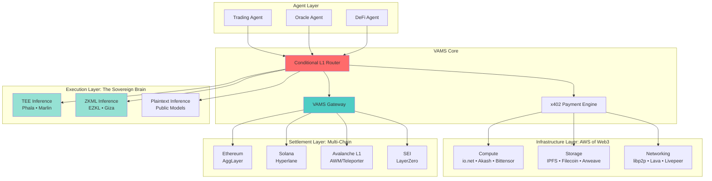
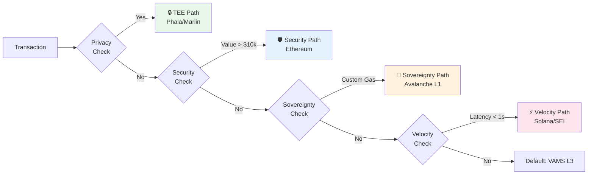

<div align="center">

# 🧠 VAMS

### Verifiable and Agentic Modular Stack

**The Sovereign Brain of the Agentic Web**

[](./LICENSE)
[](#-status)
[](./ARCHITECTURE.md)

---

[What is VAMS?](#-what-is-vams) • [Architecture](#-architecture) • [Core Modules](#-core-modules) • [Use Cases](#-use-cases) • [Get Started](#-getting-started) • [Documentation](#-documentation)

</div>

---

## 🚧 Status

> **VAMS is currently in the Architecture Finalized phase.**  
> This repository contains architectural documentation. No production code has been implemented yet.

---

## 🌐 What is VAMS?

VAMS is a **Layer 3 meta-layer** that unifies three paradigms into a single infrastructure for autonomous AI agents:

<table>
<tr>
<td width="33%" align="center">

### 🏗️ AWS of Web3
**Decentralized Infrastructure**

Access compute, storage, and networking as programmable primitives

</td>
<td width="33%" align="center">

### 🧠 Sovereign Brain
**Privacy-Preserving AI**

Run inference with data sovereignty, model privacy, and verifiability

</td>
<td width="33%" align="center">

### 🤖 Agentic Web
**Agent-First Protocols**

Standardized communication, identity, and economy for autonomous agents

</td>
</tr>
</table>

---

## 🏛️ Architecture

### Network Topology



### The Four Routing Paths

VAMS routes each transaction to the optimal execution environment:



---

## 🔧 Core Modules

### 1. The Conditional L1 Router (CLR)

**Purpose:** Decision engine that routes transactions to optimal execution environments

**How it works:**
1. Parses transaction metadata (privacy, value, latency requirements)
2. Executes priority-based routing logic
3. Selects optimal transport layer
4. Returns routing decision to agent

**Key Features:**
- Sub-50ms routing decisions (p50)
- Support for 4 routing paths
- Verifiable routing proofs

📖 [Full CLR Specification →](./ARCHITECTURE.md#12-conditional-l1-router-clr)

---

### 2. The Inference Engine (Sovereign Brain)

**Purpose:** Privacy-preserving AI inference with three security levels

| Mode | Privacy | Latency | Use Case |
|------|---------|---------|----------|
| **Plaintext** | None | ~100ms | Public data |
| **TEE** | High | ~200ms | Private data |
| **ZKML** | Maximum | ~10s | Regulatory compliance |

**Technologies:**
- **Phala Network:** Intel SGX/AMD SEV trusted execution
- **EZKL/Giza:** Zero-knowledge machine learning
- **Lit Protocol:** Decentralized key management

� [Full Inference Specification →](./ARCHITECTURE.md#6-ai-inference-architecture)

---

### 3. The Infrastructure Bridge (AWS of Web3)

**Purpose:** Unified access to decentralized compute, storage, and networking

#### Compute Layer
- **io.net:** GPU clusters (H100, A100) for AI inference
- **Akash:** CPU containers for agent runtime
- **Bittensor:** Specialized AI model access

#### Storage Layer
- **Hot Storage:** Arweave (permanent), Ceramic (mutable)
- **Warm Storage:** IPFS, Lighthouse, Storj
- **Cold Storage:** Filecoin (10+ year persistence)

#### Networking Layer
- **Discovery:** libp2p DHT for agent discovery
- **RPC:** Lava Network for decentralized blockchain access
- **Media:** Livepeer for streaming

📖 [Full Infrastructure Specification →](./ARCHITECTURE.md#part-i-the-aws-of-web3)

---

### 4. The VAMS Gateway

**Purpose:** Security perimeter for cross-chain messaging

**Architecture:**
```
External Chains ──► Ingress Layer ──► Security Layer ──► Egress Layer ──► Agent L1s
                    (Hyperlane/LZ)    (OFAC/Rate Limit)  (Teleporter)
```

**Security Features:**
- OFAC sanctions screening
- Rate limiting and circuit breakers
- Message integrity verification (ZK proofs)
- Multi-sig governance (3/5)

📖 [Full Gateway Specification →](./ARCHITECTURE.md#13-vams-gateway)

---

### 5. The Agent Economy (x402)

**Purpose:** HTTP-native payment protocol for agent-to-agent commerce

**Flow:**
```
Agent A ─── POST /service ───► Provider B
        ◄── 402: {price, addr} ───
        ─── Signed Receipt ───►
        ◄── Service Response ───
        
        [Background: Batch settlement every 10s]
```

**Features:**
- Instant credit debits (off-chain)
- Batched on-chain settlement
- MEV protection via Lit threshold encryption
- Payment channels for high-frequency interactions

📖 [Full x402 Specification →](./ARCHITECTURE.md#11-agent-economy-x402)

---

## 💡 Use Cases

### Use Case 1: DeFi Arbitrage Agent

**Description:** An autonomous agent that monitors price differences across DEXs and executes arbitrage trades.

**VAMS Components Used:**
- **Compute:** io.net for real-time price analysis
- **Inference:** Plaintext mode for public market data
- **Routing:** Velocity Path (Solana) for sub-second execution
- **Payment:** x402 for paying compute and data providers

**Example Flow:**
```python
# Agent monitors prices using VAMS SDK
prices = await vams.compute.query(
    provider="ionet",
    query="fetch_dex_prices(['UniswapV3', 'TraderJoe'])"
)

# Route arbitrage transaction via CLR
routing = await vams.clr.route({
    "max_latency_ms": 500,
    "value_usd": 1000,
    "requires_velocity": True
})

# Execute on Solana via Hyperlane
tx_hash = await vams.execute(routing, arbitrage_payload)
```

---

### Use Case 2: Private AI Research Assistant

**Description:** An agent that processes sensitive research data without exposing it to any third party.

**VAMS Components Used:**
- **Storage:** Encrypted IPFS via Lit Protocol
- **Inference:** TEE mode (Phala) for private processing
- **Routing:** Privacy Path (TEE)
- **Compliance:** Polygon ID for access control

**Example Flow:**
```python
# Store encrypted research data
cid = await vams.storage.store(
    data=research_paper,
    encryption="lit",
    access_conditions=["polygon_id_verified"]
)

# Run inference in TEE
result = await vams.inference.run(
    mode="tee",
    model="llama-3-70b",
    encrypted_input_cid=cid
)

# Result is encrypted; only authorized users can decrypt
```

---

### Use Case 3: Compliant Enterprise Agent (RWA Tokenization)

**Description:** An agent that tokenizes real-world assets with full regulatory compliance.

**VAMS Components Used:**
- **Routing:** Sovereignty Path (Avalanche Evergreen)
- **Compliance:** OFAC screening + Polygon ID KYC
- **Settlement:** AggLayer (Ethereum) for high-value finality
- **Storage:** Filecoin for audit trails

**Example Flow:**
```python
# Register agent with KYC
agent = await vams.agents.register({
    "polygon_id": polygon_credential,
    "jurisdiction": "US"
})

# Route to Evergreen subnet (permissioned)
routing = await vams.clr.route({
    "requires_compliance": True,
    "value_usd": 50_000,
    "target_ecosystem": "avalanche_evergreen"
})

# Tokenize asset with audit trail
tx = await vams.execute(routing, {
    "action": "tokenize_asset",
    "asset_id": "real_estate_123",
    "audit_storage": "filecoin"
})
```

---

## 🚀 Getting Started

### For Developers

```bash
# Install VAMS SDK (coming soon)
npm install @vams-protocol/sdk

# Initialize agent
import { VAMS } from '@vams-protocol/sdk';

const vams = new VAMS({
  apiKey: process.env.VAMS_API_KEY,
  network: 'testnet'
});

// Register your agent
const agent = await vams.agents.create({
  name: "MyTradingAgent",
  capabilities: ["inference", "trading"]
});
```

### For Contributors

See [PRD.md](./PRD.md) for technical requirements and contribution guidelines.

---

## 📚 Documentation

| Document | Description |
|----------|-------------|
| [**ARCHITECTURE.md**](./ARCHITECTURE.md) | Full technical specification (v3.1) |
| [**WHITEPAPER.md**](./WHITEPAPER.md) | Executive summary and key innovations |
| [**PRD.md**](./PRD.md) | Technical requirements for developers |

---

## 🗺️ Roadmap

| Phase | Timeline | Milestone |
|:-----:|:--------:|-----------|
| 0️⃣ | Q1 2026 | Security audits (Trail of Bits, Certora) |
| 1️⃣ | Q1 2026 | Testnet deployment (Fuji, Devnet) |
| 2️⃣ | Q2 2026 | Compliance integration (Polygon ID, OFAC) |
| 3️⃣ | Q3 2026 | Guarded mainnet ($100k daily cap) |
| 4️⃣ | Q4 2026 | Open mainnet with DAO governance |

---

## 🤝 Contributing

VAMS is in the ideation stage. We welcome:

- 💬 **Feedback** on architecture and design decisions
- 🔍 **Security analysis** and threat modeling
- 🔌 **Integration proposals** for DePIN protocols
- 📝 **Documentation** improvements

**To contribute:** Open an issue to start a discussion.

---

## 📞 Connect

**Aseem Chishti**  
*Lead Architect / Maintainer*

[](https://www.linkedin.com/in/aseemchishti/)
[](https://x.com/aseemchishti/)
[](https://discord.gg/hPewhPW6j/)
[](mailto:aseeminksa@gmail.com)

---

## 📄 License

This project is licensed under the [MIT License](./LICENSE).

---

<div align="center">

**Built for the Agentic Web** 🤖

[Architecture](./ARCHITECTURE.md) • [Whitepaper](./WHITEPAPER.md) • [PRD](./PRD.md) • [License](./LICENSE)

</div>
