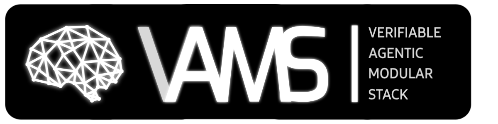

<!--
╔══════════════════════════════════════════════════════════════════════════════╗
║                         INTELLECTUAL PROPERTY NOTICE                          ║
╠══════════════════════════════════════════════════════════════════════════════╣
║  Document: VAMS Project Root Documentation                                    ║
║  Author: Aseem Chishti                                                        ║
║  Email: aseeminksa@gmail.com                                                  ║
║  LinkedIn: https://www.linkedin.com/in/aseemchishti                           ║
║                                                                               ║
║  SHA-256 Fingerprint: E4B7A9...[UPDATED_BY_VAMS_PROTOCOL]...D2F8A7D9            ║
║  Timestamp: 2026-02-17T00:00:26+05:30 (ISO 8601)                              ║
║                                                                               ║
║  Copyright (c) 2026 Aseem Chishti. All Rights Reserved.                       ║
║  Licensed under the MIT License - see LICENSE file for details.               ║
║                                                                               ║
║  This cryptographic fingerprint establishes proof of authorship and content   ║
║  integrity at the specified timestamp. Any unauthorized reproduction          ║
║  claiming original authorship can be verified against this hash.              ║
╚══════════════════════════════════════════════════════════════════════════════╝
-->
<div align="center">
  
  <br/>
### The Operating System for the Agentic Economy

**Unified Infrastructure Layer | Autonomous AI Agents | Zero Friction**

[](https://opensource.org/licenses/MIT)
[](./REPO_STATUS_REPORT.md)
[](./docs/team/ARCHITECTURE_v0-4-0.md)
[](./docs/team/MARKET_ANALYSIS.md)

**[Documentation](./REPO_STATUS_REPORT.md)** • **[Architecture](./docs/team/ARCHITECTURE_v0-4-0.md)** • **[Developer Guide](./docs/DEVELOPER_GUIDE.md)** • **[Whitepaper](./docs/team/WHITEPAPER.md)** • **[Roadmap](./REPO_STATUS_REPORT.md#6-development-roadmap)**

</div>

---

## 💡 What is VAMS?

**VAMS** (Verifiable and Agentic Modular Stack) is the **AWS of Web3** — a Layer 3 meta-architecture that unifies fragmented decentralized infrastructure (DePIN) into a single, consumable API.

**One API. One Token. Any Agent. Any Chain.**

<table>
<tr>
<td width="33%" align="center">
<h3>🌐 $507B TAM</h3>
<p>Cloud + AI infrastructure market</p>
</td>
<td width="33%" align="center">
<h3>⚡ 80% Cheaper</h3>
<p>vs AWS/GCP (Akash: $0.02/hr)</p>
</td>
<td width="33%" align="center">
<h3>🔗 15+ Integrations</h3>
<p>Polygon CDK, Cardano, Celestia, io.net</p>
</td>
</tr>
</table>

### 🎥 VAMS: The Dawn of Agentic Economy
<video src="VAMS%20-%20Dawn%20of%20Agentic%20Economy.mp4" controls="controls" style="max-width: 100%;">
</video>

---

## 🎯 The Problem

Building autonomous agents today means juggling **10+ wallets, 15+ protocols, and complex DevOps**.

**Web2 Developer Pain:**
- 💸 **High Costs** — AWS EC2: $0.10/hr, Stripe: 2.9% + $0.30
- 🔒 **Vendor Lock-in** — Censorship, downtime, arbitrary ToS changes
- 🧩 **No Stateful Execution** — Agents can't survive crashes

**Web3 Developer Pain:**
- 🌀 **Fragmentation** — Different wallet for each chain/token
- 🐌 **Latency** — 12+ second block times kill UX
- 💥 **Complexity** — Manually integrating Akash, Celestia, Phala, etc.

---

## ✨ The VAMS Solution

### 🏗️ The 5 Core Pillars

#### 1️⃣ **Unified DePIN Access**
Single API for compute (io.net, Akash, Phala), storage (Iagon, Ceramic), and networking. No multi-wallet juggling.

#### 2️⃣ **Intelligent Routing (CLR v3.1)**
Conditional L1 Router — 7-priority decision tree auto-selects the optimal chain:
- 🏛️ **P0: Compliance Privacy** → Midnight (ZK-SD)
- 🔐 **P1: Confidential Compute** → Phala TEE
- 💰 **P2: High Value ($10K+)** → Ethereum (via AggLayer)
- 📋 **P3: Institutional KYC** → Polygon CDK KYC Layer
- ✅ **P4: Formal Verification** → Cardano (Ouroboros)
- ⚡ **P5: Velocity (<1s)** → Hydra / SEI / Solana
- 🎯 **P6: Default** → Polygon CDK Validium (VAMS L3)

> Includes **MEV Protection** (encrypted mempool + batch auctions) and **ICB Bridge Executor** (Multi-ISM 2/3 verification + fallback cascade).

#### 3️⃣ **Immortal Agents**
DBOS-style durable execution. Agents checkpoint state to Arweave/Celestia and **survive crashes, network failures, even your laptop dying**.

#### 4️⃣ **Open Airport (Roaming Protocol)**
Trust through Transparency. Agents can **"Roam"** to Solana, Base, or Ethereum to execute tasks, provided they submit cryptographic **Proof of Travel** logs upon return. You are not locked in; you are **anchored**.

#### 5️⃣ **The Trust Decagon**
VAMS is the "Meta-Layer" for trust, aggregating proofs from **10 protocols** (Phala, Parallel, World ID, etc.) to issue a unified **Trust Score**. We don't compete with identity standards; we unify them.

---

## 🌌 The 6 Ontological Breakthroughs

VAMS is not merely a tech stack; it is a **philosophical engine** that instantiates theoretical concepts into verifiable code. We have solved 6 fundamental problems in computer science and social coordination.

| Field | The Breakthrough | Deep Dive |
| :--- | :--- | :--- |
| **Physics** | **It from Bit** (The Synthetic Observer) | [📜 Read](./docs/narrative/VAMS_BREAKTHROUGHS.md#%EF%B8%8F-1-physics-the-synthetic-observer--it-from-bit) |
| **Economics** | **Deterministic Agency** (Zero Agency Cost) | [📜 Read](./docs/narrative/VAMS_BREAKTHROUGHS.md#-2-economics-deterministic-agency--zero-agency-cost) |
| **Law** | **Polycentric Sovereignty** (Algorithmic Jurisdiction) | [📜 Read](./docs/narrative/VAMS_BREAKTHROUGHS.md#%EF%B8%8F-3-law-polycentric-sovereignty--algorithmic-jurisdiction) |
| **Biology** | **Digital Autopoiesis** (Synthetic Life) | [📜 Read](./docs/narrative/VAMS_BREAKTHROUGHS.md#-4-biology-digital-autopoiesis--synthetic-life) |
| **AI** | **The Verifiable Mind** (Glass Box Intelligence) | [📜 Read](./docs/narrative/VAMS_BREAKTHROUGHS.md#-5-ai-the-verifiable-mind--glass-box-intelligence) |
| **Blockchain** | **The DePIN OS** (Planetary Computer) | [📜 Read](./docs/narrative/VAMS_BREAKTHROUGHS.md#-6-blockchain-the-depin-operating-system--planetary-computer) |

> [!IMPORTANT]
> **Must Read:** These narratives outline the theoretical innovations that differentiate VAMS. See the full [**Breakthroughs Document**](./docs/narrative/VAMS_BREAKTHROUGHS.md).

---

## 🏛️ Architecture

### Dual-Host Model: Polygon "Hands" + Cardano "Brain"

```
┌──────────────────────────────────────────────────────────────┐
│  POLYGON AMOY ("The Hands") — EVM, Fast Execution           │
│  Token, Staking, FeeCollector, Sentinel, GovernorExecutor   │
├──────────────────────────────────────────────────────────────┤
│  ICB BRIDGE (Rosen + Mithril)                               │
├──────────────────────────────────────────────────────────────┤
│  CARDANO PRE-PROD ("The Brain") — eUTXO, Governance         │
│  Governor (Quadratic), Timelock, InsuranceFund, AgentDID    │
├──────────────────────────────────────────────────────────────┤
│  L5: ECONOMIC    $VAMS Token • x402 Micropayments           │
│  L4: TRUST       Agent Profile • TEE • ZK-Proofs • Sentinel│
│  L3: LOGIC       DBOS • Kwil • WeaveDB • Glacier            │
│  L2: COMPUTE     io.net GPU • Akash CPU • Phala AI          │
│  L1: FOUNDATION  Celestia DA • Iagon Storage                │
└──────────────────────────────────────────────────────────────┘
```

> [!TIP]
> **Deep Dive:** See [ARCHITECTURE_v0-4-0.md](./docs/team/ARCHITECTURE_v0-4-0.md) (and [v0.3.0](./docs/team/ARCHITECTURE_v0-3-0.md) for legacy specs) for technical specs including composed settlements, regional DEC systems, and the multi-DA performance anchor.

---

## 🚀 Why VAMS Wins

| vs AWS/GCP | vs Akash | vs Bittensor | vs ICB-SDK Bridges |
|------------|----------|--------------|--------------|
| ✅ Decentralized | ✅ Full stack | ✅ Easier UX | ✅ Execution layer |
| ✅ 80% cheaper | ✅ Payments | ✅ Unified infra | ✅ Not just bridges |
| ✅ Censorship-resistant | ✅ Agent runtime | ✅ Production-ready | ✅ Multi-chain routing |

**No other project combines**: Unified DePIN + Intelligent Routing + Immortal Agents + **Roaming Protocol** + Dual-Host Architecture.

---

## 📊 Current Status

**Stage:** Pre-Mainnet | **Architecture:** v0.4.0 | **Neuron:** v1.0.0-icn | **Docs:** [Changelog](./docs/CHANGELOG.md)

| Component | Progress | Description |
|-----------|----------|-------------|
| 📋 **Specs** | 🟢 100% | Architecture v0.4.0, Tokenomics v2.0.0, Market Analysis |
| 📜 **Solidity Contracts** | 🟢 100% | Full V2 Suite + VAMSSentinel + Bridge contracts. **469 tests passing.** |
| 🧠 **Cardano Contracts** | 🟢 100% | 4 Aiken validators + ICB bridge. **37 tests passing.** |
| 🤖 **Agent Runtime** | 🟢 100% | Neuron v1.0.0-icn: Multi-DA Anchor, Service Blocks, Master Escrow |
| 🎨 **Frontend** | 🟢 95% | React 19 + Vite, 3D animations, Sub-1s load time |
| 🌐 **Gateway** | 🟢 100% | FastAPI server with rate-limiting, auth, and dashboard |
| ✅ **Tests** | 🟢 100% | **585 total tests: 469 Solidity + 37 Aiken + 79 Python** |
| 🔒 **Security** | 🟢 100% | VAMSSentinel (autonomous guardian), Slither clean, Flash loan protection |

> [!IMPORTANT]
> **Next Milestone:** Deploy V2 Contracts to Polygon Amoy testnet + Cardano Pre-Prod testnet.

Full roadmap: [REPO_STATUS_REPORT.md](./REPO_STATUS_REPORT.md)

---

## 📚 Documentation

| Document | Purpose |
|----------|---------|
| **[📋 REPO STATUS](./REPO_STATUS_REPORT.md)** | **👈 Start here.** Current stage, 24-week MVP roadmap |
| **[🏗️ DEVELOPER GUIDE](./docs/DEVELOPER_GUIDE.md)** | Quickstart for Agent Consumers and Infra Builders |
| **[📖 Whitepaper](./docs/team/WHITEPAPER.md)** | Academic technical overview |
| **[🏗️ Architecture v0.4.0](./docs/team/ARCHITECTURE_v0-4-0.md)** | Deep specs: Composer, Regional DEC, Multi-DA Anchor |
| **[💰 Tokenomics](./docs/team/TOKENOMICS.md)** | $VAMS utility, burns, vesting, emissions |
| **[🔌 API Reference](./docs/API_REFERENCE.md)** | Full Gateway REST documentation for Consumers |
| **[📝 Changelog](./docs/CHANGELOG.md)** | Log of recent protocol upgrades (including ICN logic) |
| **[📈 Market Analysis](./docs/team/MARKET_ANALYSIS.md)** | $507B TAM, competitor analysis |
| **[🎤 Pitch Deck](./docs/team/PITCH_DECK.md)** | Strategic partnership proposal |

---

## 🛠️ Repository Structure

```bash
VAMS-main/
├── contracts/       # Polygon Solidity (469 tests passing)
│   ├── src/
│   │   ├── token/           # VAMSToken (ERC-20 + Burnable + Permit + Votes)
│   │   ├── staking/         # VAMSStaking (Tiered APY, Lock Periods)
│   │   ├── vesting/         # VAMSVesting (7 schedule types)
│   │   ├── governance/      # VAMSTimelockController
│   │   ├── economic/        # FeeCollector, Insurance, PaymentHandler
│   │   ├── infrastructure/  # VAMSSentinel (autonomous guardian)
│   │   ├── routing/         # VAMSRouter (CLR implementation)
│   │   ├── slashing/        # VAMSSlasher, SlashingParameters
│   │   ├── registry/        # VAMSAgentRegistry (Challenge system)
│   │   └── base/            # VAMSUpgradeableBase, Emergency Pausable
│   └── test/                # 469 tests (Unit, Integration, Fuzz, Governance)
│
├── cardano/         # Cardano Aiken Brain Layer (37 tests passing)
│   ├── validators/
│   │   ├── governor.ak      # Quadratic voting governance
│   │   ├── timelock.ak      # Intent emission to Polygon
│   │   ├── insurance_fund.ak # Capital custody + DAO claims
│   │   └── agent_registry.ak # Agent DID + CIP-68 NFT
│   └── lib/vams/            # Shared types, utils, ICB bridge
│
├── frontend-vite/   # React 19 + Vite (95% complete)
│   ├── src/              # App, components, 3D scenes
│   └── dist/             # Production build
│
├── neuron/          # "Immortal Agent" runtime v1.0.0-icn
│   ├── da/               # Celestia & Polygon DAC anchoring
│   ├── composer/         # Matchmaking & blueprint routing
│   ├── economics/        # Master Hybrid Escrow & Regional DEC
│   ├── services/         # Verified Service Blocks sandbox
│   ├── sentinel/         # Verifiable SLA enforcer loop
│   ├── neuron.py         # Orchestration loop
│   ├── clr_router.py     # CLR v3.1 — 7-Priority Decision Tree
│   └── tests/            # 79+ passing tests
│
├── gateway/         # FastAPI server (100% complete)
│   └── server.py         # Exposes API_REFERENCE.md endpoints
│
└── docs/            # All documentation
    ├── CHANGELOG.md
    ├── DEVELOPER_GUIDE.md
    ├── API_REFERENCE.md
    └── team/
        ├── ARCHITECTURE_v0-4-0.md
        ├── ARCHITECTURE_v0-3-0.md
        ├── WHITEPAPER.md
    └── TOKENOMICS.md
```

---

## 🔧 Quick Start

> [!NOTE]
> **Prerequisites:** Foundry (contracts), Node.js 18+ (frontend), Python 3.10+ (neuron)

### 1️⃣ Clone the Repository
```bash
git clone https://github.com/GodOfAgents/VAMS-main.git
cd VAMS-main
```

### 2️⃣ Smart Contracts (Foundry — Polygon)
```bash
cd contracts
forge install
forge build
forge test  # 469 tests across 19 suites
```

### 2.5️⃣ Cardano Contracts (Aiken)
```bash
cd cardano
aiken check   # 37 tests across 6 modules
aiken build   # Generates plutus.json blueprint
```

### 3️⃣ Frontend
```bash
cd frontend
npm install
npm run dev  # Opens on http://localhost:5173
```

### 4️⃣ Agent Runtime
```bash
cd neuron
pip install -r requirements.txt
python demo_cli.py  # Interactive demo
```

---

## 🌐 Building in Public

We are committed to **radical transparency**:

- 📝 **Every design decision** documented in [ARCHITECTURE_v0-4-0.md](./docs/team/ARCHITECTURE_v0-4-0.md)
- 💰 **Every token allocation** specified in [TOKENOMICS.md](./docs/team/TOKENOMICS.md)
- 🔍 **Every gap** tracked in [REPO_STATUS_REPORT.md](./REPO_STATUS_REPORT.md)

**This repository is our single source of truth.**

---

## 🤝 Contributing & Partnership

### For Developers
- **Contributions welcome!** See roadmap in [REPO_STATUS_REPORT.md](./REPO_STATUS_REPORT.md)
- **Join the build:** Phase 3 (Testnet Deployment) is the current focus

### For Investors
- **5% token allocation** (50M $VAMS) available for Strategic Ecosystem Partnership
- See [PITCH_DECK.md](./docs/team/PITCH_DECK.md) for full proposal

### For Ecosystem Partners
- Grant applications: [Ecosystem_Grants.md](./docs/team/Ecosystem_Grants.md)
- Integration opportunities: Cardano, Polygon, Celestia, io.net, Bittensor

---

## 💸 Support the Mission

Our development is heavily supported by strategic ecosystem grants.
If you represent an ecosystem (L1/L2, DA layer, TEE provider) interested in integrating with VAMS, please review our [Ecosystem Grants Strategy](./docs/team/Ecosystem_Grants.md) and open a dialogue.

---

## 📄 License & Contact

| | |
|--|--|
| **License** | MIT |
| **Author** | Aseem Chishti |
| **Email** | aseeminksa@gmail.com |
| **LinkedIn** | [linkedin.com/in/aseemchishti](https://www.linkedin.com/in/aseemchishti) |
| **GitHub** | [GodOfAgents](https://github.com/GodOfAgents) |

**Proof of Authorship:** [PROOF_OF_AUTHORSHIP.md](./PROOF_OF_AUTHORSHIP.md)

---

<div align="center">

**VAMS: Any Agent. Any Chain. One Stack.** 🚀

*The Operating System for the Agentic Economy*

[](https://github.com/GodOfAgents/VAMS)

</div>
