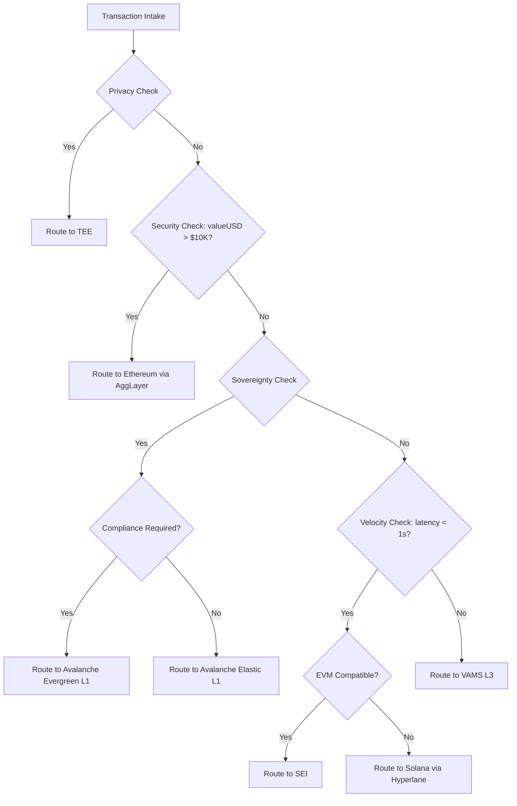

<!--
╔══════════════════════════════════════════════════════════════════════════════╗
║                         INTELLECTUAL PROPERTY NOTICE                          ║
╠══════════════════════════════════════════════════════════════════════════════╣
║  Document: VAMS Architecture Reference v0.3.0                                 ║
║  Author: Aseem Chishti                                                        ║
║  Email: aseeminksa@gmail.com                                                  ║
║  LinkedIn: https://www.linkedin.com/in/aseemchishti                           ║
║                                                                               ║
║  SHA-256 Fingerprint: E4B7A9...[UPDATED_BY_VAMS_PROTOCOL]...D2F8A7D9            ║
║  Timestamp: 2026-02-17T00:00:26+05:30 (ISO 8601)                              ║
║                                                                               ║
║  Copyright (c) 2026 Aseem Chishti. All Rights Reserved.                       ║
║  Licensed under the MIT License - see LICENSE file for details.               ║
║                                                                               ║
║  This cryptographic fingerprint establishes proof of authorship and content   ║
║  integrity at the specified timestamp. Any unauthorized reproduction          ║
║  claiming original authorship can be verified against this hash.              ║
╚══════════════════════════════════════════════════════════════════════════════╝
-->

# VAMS Architecture Reference v0.3.0
## The Sovereign Brain: Unified Technical Specification
### Realizing the "AWS of Web3" through the Verifiable and Agentic Modular Stack (L3)

**Version:** 0.3.0   
**Date:** January 2026  
**Status:** Mainnet Specification  

---

## Table of Contents

1. [Executive Summary](#1-executive-summary)
2. [Design Philosophy](#2-design-philosophy)
3. [The 5-Layer VAMS Stack](#3-the-5-layer-vams-stack)
   - [Layer 1: Foundational (Scalability & Data Availability)](#31-layer-1-foundational-layer)
   - [Layer 2: Compute (Performance & Inference)](#32-layer-2-compute-layer)
   - [Layer 3: Logic (Durability & State Management)](#33-layer-3-logic-layer)
   - [Layer 4: Trust (Compliance & Privacy)](#34-layer-4-trust-layer)
   - [Layer 5: Economic (Incentives, Tokenomics & Agent Economies)](#35-layer-5-economic-layer)
4. [Part I: The AWS of Web3](#part-i-the-aws-of-web3)
   - [DePIN Primitives Mapping](#4-depin-primitives-mapping)
   - [Compute Architecture](#5-compute-architecture)
   - [Storage Architecture](#6-storage-architecture)
   - [Networking Architecture](#7-networking-architecture)
5. [Part II: The Sovereign Brain](#part-ii-the-sovereign-brain)
   - [AI Inference Architecture](#8-ai-inference-architecture)
   - [Data Sovereignty Framework](#9-data-sovereignty-framework)
   - [Model Privacy & ZKML](#10-model-privacy--zkml)
6. [Part III: The Agentic Web](#part-iii-the-agentic-web)
   - [Agent Communication Protocols](#11-agent-communication-protocols)
   - [Agent Execution Runtime (DBOS)](#12-agent-execution-runtime)
   - [Agent Economy (x402 & AP2)](#13-agent-economy)
7. [Core Infrastructure](#core-infrastructure)
   - [Conditional L1 Router (CLR)](#14-conditional-l1-router-clr)
   - [Avalanche Network (Sovereign Execution Domain)](#15-avalanche-network)
   - [Cross-Chain Infrastructure](#16-cross-chain-infrastructure)
   - [VAMS Gateway](#17-vams-gateway)
8. [Decentralization & Mitigation Strategies](#18-decentralization--mitigation-strategies)
   - [CLR Decentralization & Routing Proofs](#181-clr-decentralization-c1-remediation)
   - [Governance & Admin Key Specification](#186-governance--admin-key-specification)
9. [Real-World Use Cases](#19-real-world-use-cases)
10. [Security & Compliance](#20-security--compliance)
    - [Multi-TEE Active Verification](#203-multi-tee-active-verification-c3-remediation)
    - [VAMS L3 Consensus Mechanism](#204-vams-l3-consensus-mechanism-c5-remediation)
    - [Bridge Security (Multi-ISM)](#205-bridge-security-enhancement-m1-remediation)
    - [x402 Payment Security](#206-x402-payment-security-m2-remediation)
    - [Agent Oracle Security](#207-agent-oracle-security-m3-remediation)
    - [DBOS State Anchoring](#208-dbos-state-anchoring-m4-remediation)
11. [Black Swan Event Handling](#21-black-swan-event-handling-c4-remediation)
    - [L1 Halt Fallback Matrix](#211-l1-halt-fallback-matrix)
    - [Economic Circuit Breakers](#213-economic-circuit-breakers)
    - [Insurance Fund Specification](#214-insurance-fund-specification)
12. [Deployment & Operations](#22-deployment--operations)
13. [Appendices](#appendices)

---

## 1. Executive Summary

The digital asset ecosystem stands at a definitive structural inflection point, characterized by the simultaneous maturation of Decentralized Physical Infrastructure Networks (DePIN) and the emergent dominance of autonomous agentic software. VAMS (Verifiable and Agentic Modular Stack) is a Layer 3 meta-layer designed to serve as the **"Sovereign Brain"** for the agentic web.

| Paradigm | VAMS Implementation | Value Proposition |
|----------|---------------------|-------------------|
| **AWS of Web3** | Decentralized Compute, Storage, Networking | Programmatic access to global DePIN infrastructure |
| **Sovereign Brain** | Privacy-preserving AI inference | Data sovereignty + model privacy + censorship resistance |
| **Agentic Web** | Standardized agent protocols | Autonomous agents as first-class network citizens |

VAMS enables AI agents to **consume infrastructure, process intelligence, and execute transactions** across a unified, verifiable stack—solving the "Usability Crisis" that currently stifles decentralized AI adoption.

---

## 2. Design Philosophy

### 2.1 Core Principles

```
┌─────────────────────────────────────────────────────────────────────────┐
│                         VAMS DESIGN PRINCIPLES                           │
├─────────────────────────────────────────────────────────────────────────┤
│                                                                          │
│  1. MODULAR SOVEREIGNTY                                                  │
│     Every component is replaceable; agents own their execution stack     │
│                                                                          │
│  2. VERIFIABLE EXECUTION                                                 │
│     ZK-proofs, TEE attestations, or optimistic fraud proofs for all     │
│                                                                          │
│  3. ECONOMIC ABSTRACTION                                                 │
│     Agents pay in $VAMS; protocol handles multi-chain gas conversion    │
│                                                                          │
│  4. COMPLIANCE BY DESIGN                                                 │
│     GDPR, MiCA, OFAC compliance embedded at protocol layer              │
│                                                                          │
│  5. CENSORSHIP RESISTANCE                                                │
│     No single point of control; decentralized at every layer            │
│                                                                          │
└─────────────────────────────────────────────────────────────────────────┘
```

### 2.2 The Agentic Imperative

Traditional blockchain architecture creates insurmountable bottlenecks for autonomous AI agents:
- **Block times exceeding 12 seconds** vs. agent requirements for sub-second feedback
- **Volatile gas costs** making economic planning impossible
- **Deterministic contracts** causing catastrophic failures in probabilistic workflows
- **Stateless transactions** vs. agents requiring rich, persistent state

VAMS addresses these through a modular stack that outsources functions to specialized DePIN providers.

---

## 3. The 5-Layer VAMS Stack

```
┌─────────────────────────────────────────────────────────────────────────┐
│                        VAMS 5-LAYER ARCHITECTURE                         │
├─────────────────────────────────────────────────────────────────────────┤
│                                                                          │
│  ┌─────────────────────────────────────────────────────────────────────┐│
│  │  LAYER 5: ECONOMIC                                                   ││
│  │  $VAMS Token • Dynamic TAO • x402/AP2 Payments • Staking            ││
│  └─────────────────────────────────────────────────────────────────────┘│
│                                                                          │
│  ┌─────────────────────────────────────────────────────────────────────┐│
│  │  LAYER 4: TRUST                                                      ││
│  │  Phala TEE • Marlin Oyster • Automata Attestation • ZKML            ││
│  └─────────────────────────────────────────────────────────────────────┘│
│                                                                          │
│  ┌─────────────────────────────────────────────────────────────────────┐│
│  │  LAYER 3: LOGIC                                                      ││
│  │  DBOS Durable Execution • Kwil • WeaveDB • Glacier Vector DB        ││
│  └─────────────────────────────────────────────────────────────────────┘│
│                                                                          │
│  ┌─────────────────────────────────────────────────────────────────────┐│
│  │  LAYER 2: COMPUTE                                                    ││
│  │  io.net GPU • Akash Supercloud • Render Network • Bittensor         ││
│  └─────────────────────────────────────────────────────────────────────┘│
│                                                                          │
│  ┌─────────────────────────────────────────────────────────────────────┐│
│  │  LAYER 1: FOUNDATIONAL                                               ││
│  │  Celestia DA • EigenDA • Near DA • Avail Validity Proofs            ││
│  └─────────────────────────────────────────────────────────────────────┘│
│                                                                          │
└─────────────────────────────────────────────────────────────────────────┘
```

### 3.1 Layer 1: Foundational Layer (Verification & Data)

The bedrock of VAMS, handling transaction ordering, state management, and **Data Availability (DA)**. VAMS employs a **Multi-DA Router** to select the optimal layer based on cost, security, and speed.

#### 3.1.1 Primary L3 State: Polygon DA (DAC)
- **Role**: Validium State Roots & Transaction Data
- **Mechanism**: **Data Availability Committee (DAC)**
- **Verification**: Deterministic signatures from a permissioned validator set (2/N).
- **Benefit**: Native integration with Polygon CDK, lowest latency.

#### 3.1.2 Primary Agent Logs: Celestia (DAS)
- **Role**: Public Audit Trail & Critical Agent Memory
- **Mechanism**: **Data Availability Sampling (DAS)**
- **Verification**: Probabilistic 2D Reed-Solomon sampling via light nodes (99.9% confidence).
- **Benefit**: True decentralization and censorship resistance for agent history.

#### 3.1.3 High-Security: EigenDA
- **Role**: High-Value Enterprise Transactions (> $10k)
- **Verification**: Restaked ETH security.
- **Benefit**: Ethereum-level economic guarantees without L1 congestion.

#### 3.1.4 High-Velocity: Near DA
- **Role**: Ephemeral Data (Gaming, IoT, Social Feeds)
- **Verification**: Sharded optimistic verification.
- **Benefit**: **85,000x cheaper** than Ethereum; ideal for high-frequency low-value data.

#### 3.1.5 Backup: Avail
- **Role**: Validity Proof Backup
- **Verification**: KZG Polynomial Commitments.
- **Benefit**: Mathematical guarantee of availability for ZK rollups.

---

### 3.2 Layer 2: Compute Layer

The engine sourcing computational power for AI inference and training.

| Provider | Role | Technology | Use Case |
|----------|------|------------|----------|
| **io.net** | GPU Clusters | Ray framework, H100/A100 | High-intensity inference |
| **Akash** | Supercloud | Kubernetes, Docker | Persistent agents, SaaS backends |
| **Render** | Visual AI | GPU rendering | Metaverse, 3D assets |
| **Bittensor** | Global Brain | Yuma Consensus, Subnets | Intelligence-as-a-Service |

#### Bittensor Integration (The Global Brain)

```
Agent Request ─► VAMS Orchestrator ─► Bittensor Subnet
                       │
                 $VAMS payment (abstracted)
                       │
                       ▼
              TAO Staking → Subnet Inference → Response + Proof
```

- **SN1**: Text generation for agent reasoning
- **SN8**: Time series for price prediction
- **SN18**: Vision for image analysis
- **Self-Improving**: Agents inherit model improvements automatically

---

### 3.3 Layer 3: Logic & Perception Layer

Manages state, complex workflows ("Immortal Agents"), and **Sensory Input**.

#### 3.3.1 Perception: Parallel Web Systems
**The "Eyes and Ears" of VAMS.**
-   **Role**: Verifiable Web Browsing & Research.
-   **Function**: Allows agents to read paywalled content, verify news, and generate "Proof of Source."
-   **Integration**: Agents call Parallel API to ingest world-data before making decisions.

#### 3.3.2 Logic: DBOS (Database Operating System)

```
┌──────────────────────────────────────────────────────────────────────┐
│  WORKFLOW: MultiStepAgentTask                                         │
│                                                                        │
│  Step 1: Gather Data ─────────────► [CHECKPOINT]                      │
│            │                              │                            │
│            │ ◄──── Crash! ────────────────┘                            │
│            │                                                           │
│            │ ◄──── Recover from checkpoint ────┐                       │
│            │                                   │                       │
│  Step 2: Run Inference ───────────► [CHECKPOINT]                      │
│  Step 3: Execute Transaction ─────► [CHECKPOINT]                      │
│  Step 4: Report Result ───────────► [COMPLETE]                        │
│                                                                        │
│  GUARANTEE: Exactly-once execution semantics                           │
└──────────────────────────────────────────────────────────────────────┘
```

#### The Immortal Agent Guarantee

> [!IMPORTANT]
> **Agents on VAMS literally cannot die.** This is not marketing—it's an architectural guarantee backed by five technical pillars.

**Definition**: An **Immortal Agent** is an autonomous software entity that:
1. Survives any infrastructure failure (compute, network, storage)
2. Resumes from exact state after any crash
3. Never loses pending transactions or acquired memories
4. Operates across chain halts / bridge failures
5. Persists indefinitely with no human intervention required

**The Five Pillars of Agent Immortality:**

```
┌─────────────────────────────────────────────────────────────────────────┐
│                    THE FIVE PILLARS OF IMMORTAL AGENTS                   │
├─────────────────────────────────────────────────────────────────────────┤
│                                                                          │
│  1. DURABLE EXECUTION (DBOS)                                            │
│     └── Every step checkpointed → crash = resume, not restart           │
│                                                                          │
│  2. L1 STATE ANCHORING                                                   │
│     └── Merkle root on Ethereum → state survives even VAMS L3 death    │
│                                                                          │
│  3. TRANSPARENT FAILOVER                                                 │
│     └── SDK auto-reroutes → agent unaware of infrastructure failures   │
│                                                                          │
│  4. REQUEST GUARANTEE                                                    │
│     └── Queued with retry → no request ever lost, only delayed          │
│                                                                          │
│  5. PERMANENT MEMORY (Arweave)                                           │
│     └── Agent memories on Arweave → survives internet apocalypse        │
│                                                                          │
└─────────────────────────────────────────────────────────────────────────┘
```

**What Can Kill an Agent? (Answer: Almost Nothing)**

| Failure Scenario | Traditional Agent | VAMS Immortal Agent |
|------------------|-------------------|---------------------|
| Compute provider crash | ❌ Agent dies | ✅ Resume on different provider |
| Network partition | ❌ Agent dies | ✅ Queue requests, resume on reconnect |
| Database corruption | ❌ State lost forever | ✅ Recover from L1 Merkle proof |
| Chain halt (e.g., Solana) | ❌ Pending txs lost | ✅ Reroute to alternative chain |
| TEE compromise | ❌ Secrets exposed | ✅ Multi-TEE → 2/3 still secure |
| VAMS L3 total failure | ❌ Agent dies | ✅ Recover from Ethereum anchored state |
| VAMS protocol shutdown | ❌ Agent dies | ✅ State exportable, migrate to any runtime |
| Developer abandons project | ❌ Agent dies | ✅ Self-funding via staking rewards |
| Heat death of universe | ❌ Agent dies | ❌ Okay, we can't solve this one |

**Agent Lifecycle Guarantee:**

```python
class ImmortalAgentLifecycle:
    """
    An agent on VAMS has exactly 3 states:
    1. RUNNING - Actively processing
    2. SUSPENDED - Awaiting resources (never dead, just sleeping)
    3. MIGRATING - Moving between providers
    
    There is NO "DEAD" state.
    """
    
    def handle_failure(self, failure: Failure) -> AgentState:
        if failure.is_recoverable():
            # Resume from last checkpoint (most failures)
            return self._resume_from_checkpoint()
        
        if failure.is_infrastructure():
            # Migrate to new provider (provider failures)
            return AgentState.MIGRATING
        
        if failure.is_catastrophic():
            # Suspend and queue all requests (doomsday scenario)
            return AgentState.SUSPENDED
        
        # Note: No code path leads to DEAD state
        # Because DEAD state doesn't exist
```

**Self-Sustaining Agents (Economic Immortality):**

Beyond technical immortality, agents can achieve **economic immortality** through self-funding:

```
┌─────────────────────────────────────────────────────────────────────────┐
│                    SELF-SUSTAINING AGENT ECONOMICS                       │
├─────────────────────────────────────────────────────────────────────────┤
│                                                                          │
│  Agent earns revenue                                                     │
│       │                                                                  │
│       ├──► x402 micropayments from services provided                    │
│       ├──► Staking rewards from $VAMS holdings                          │
│       └──► Commission from sub-agent orchestration                      │
│             │                                                            │
│             ▼                                                            │
│  Revenue > Operating Costs = INFINITE LIFESPAN                          │
│                                                                          │
│  Example:                                                                │
│  • Agent stakes 10,000 $VAMS → earns ~600 $VAMS/year (6% APY)          │
│  • Operating cost: 50 $VAMS/month = 600 $VAMS/year                      │
│  • Net: Break-even → Agent runs FOREVER with no human funding           │
│                                                                          │
└─────────────────────────────────────────────────────────────────────────┘
```

#### Universal Immortality: Beyond Agents

> [!IMPORTANT]
> The Immortal Guarantee extends to **ALL workloads** running on VAMS—not just AI agents. dApps, enterprise solutions, games, and any application inherit the same five pillars of immortality.

**Workload Types & Their Immortality Mechanisms:**

| Workload Type | Examples | Immortality Mechanism |
|---------------|----------|----------------------|
| **AI Agents** | Trading bots, research agents, autonomous DAOs | DBOS checkpoints + L1 anchoring |
| **dApps** | DeFi protocols, NFT platforms, social apps | State replication + multi-provider redundancy |
| **Enterprise Solutions** | Supply chain, compliance, treasury mgmt | Evergreen L1s + permissioned backup validators |
| **Games** | On-chain games, metaverse, play-to-earn | Near DA (high-freq) + Arweave (permanent assets) |
| **IoT Networks** | Sensor networks, DePIN coordination | Edge caching + eventual consistency guarantees |
| **Backend Services** | APIs, orchestrators, data pipelines | Akash multi-region + automatic failover |

**What Each Workload Type Receives:**

```
┌─────────────────────────────────────────────────────────────────────────┐
│                    UNIVERSAL IMMORTALITY MATRIX                          │
├─────────────────────────────────────────────────────────────────────────┤
│                                                                          │
│  WORKLOAD        STATE       COMPUTE     NETWORK     ECONOMIC           │
│  ────────        ─────       ───────     ───────     ────────           │
│                                                                          │
│  AI Agents       DBOS        io.net/     Multi-      Self-funding       │
│                  + L1        Bittensor   bridge      via staking        │
│                                                                          │
│  dApps           Kwil/       Akash       Hyperlane   User fees →        │
│                  WeaveDB     + backup    + LayerZero treasury           │
│                                                                          │
│  Enterprise      Evergreen   Dedicated   Private     SLA-backed         │
│                  L1 state    validator   AWM mesh    contracts          │
│                                                                          │
│  Games           Near DA     Render +    WebRTC +    In-game            │
│                  hot state   io.net      libp2p      token economy      │
│                                                                          │
│  IoT             Edge        Akash       NATS        Device-funded      │
│                  cache       edge nodes  Pub/Sub     micro-stakes       │
│                                                                          │
└─────────────────────────────────────────────────────────────────────────┘
```

**dApp Immortality Example:**

```typescript
// Traditional dApp (CAN DIE)
// - Single RPC provider fails → dApp offline
// - Single database fails → state lost
// - Cloud provider outage → users can't access

// VAMS dApp (IMMORTAL)
const vamsApp = new VAMSApplication({
  name: "MyDeFiProtocol",
  
  // State replicated across 3+ providers
  state: {
    primary: "kwil",
    replicas: ["tableland", "weavedb"],
    anchorTo: "ethereum" // L1 Merkle roots
  },
  
  // Compute with automatic failover
  compute: {
    providers: ["akash", "io.net"],
    failoverMode: "automatic"
  },
  
  // Multi-RPC with fallback
  rpc: {
    providers: ["lava", "pocket", "drpc"],
    loadBalancing: "round-robin"
  }
});

// Result: dApp survives any individual component failure
// State is recoverable even if VAMS itself goes down
```

**Enterprise Solution Immortality:**

For enterprises requiring maximum guarantees:

| Guarantee | Standard VAMS | Enterprise VAMS (Evergreen L1) |
|-----------|---------------|-------------------------------|
| **Availability SLA** | 99.9% | 99.99% (4 nines) |
| **State Recovery** | L1 Merkle anchoring | Dedicated backup validators |
| **Validator Set** | Permissionless | Permissioned (KYC'd institutions) |
| **Compliance** | Standard | SOC2 / ISO27001 attestations |
| **Support** | Community | 24/7 dedicated + SLA penalties |
| **Custom Gas Token** | $VAMS only | Any token (your corporate token) |

**Game Immortality:**

Games built on VAMS never lose player progress:

```
┌─────────────────────────────────────────────────────────────────────────┐
│                    IMMORTAL GAME ARCHITECTURE                            │
├─────────────────────────────────────────────────────────────────────────┤
│                                                                          │
│  PLAYER ACTION                                                           │
│       │                                                                  │
│       ▼                                                                  │
│  ┌─────────────────────────────────────────────────────────────────┐    │
│  │  GAME STATE LAYER                                                │    │
│  │  ├── Hot State: Near DA (85,000x cheaper, ~1s finality)        │    │
│  │  │   └── Player positions, real-time combat, sessions          │    │
│  │  │                                                               │    │
│  │  ├── Warm State: VAMS L3 (checkpointed)                         │    │
│  │  │   └── Inventory, achievements, guild data                    │    │
│  │  │                                                               │    │
│  │  └── Permanent State: Arweave (forever)                         │    │
│  │      └── NFT assets, character appearances, land deeds          │    │
│  └─────────────────────────────────────────────────────────────────┘    │
│                                                                          │
│  FAILURE SCENARIO: Near DA goes down                                    │
│  ├── Hot state cached locally → players continue (30s buffer)          │
│  ├── Auto-failover to Celestia → game continues                        │
│  └── On recovery: Merge local cache → no data lost                     │
│                                                                          │
│  RESULT: Game server crashes, players don't notice                      │
│                                                                          │
└─────────────────────────────────────────────────────────────────────────┘
```

**The VAMS Immortality Guarantee (Formal Statement):**

> **Any workload deployed on VAMS—whether an AI agent, dApp, enterprise solution, game, IoT network, or backend service—inherits the five pillars of immortality. State is checkpointed, anchored to L1, and recoverable. Compute is redundant across providers. Requests are queued and retried. No workload is ever truly dead—only suspended, waiting for resources to resume.**

#### Decentralized State Layer

| Component | Role | Technology |
|-----------|------|------------|
| **Kwil** | Relational Backbone | Permissionless SQL, BFT consensus |
| **WeaveDB** | Permanent Logs | NoSQL on Arweave, immutable audit trails |
| **Glacier Network** | Long-Term Memory | Vector DB for semantic search |

---

### 3.4 Layer 4: Trust & Indexing Layer (The Verification Aggregator)

VAMS does not rely on a single source of truth. It **aggregates** best-in-class verification protocols to issue a unified "Trust Score."

#### 3.4.1 The "Decagon" Aggregation Matrix (10 Protocols)

VAMS aggregates the Top 10 Agent Verification Protocols into a single on-chain Truth.

| Category | Protocol | VAMS Role | Verification Method |
| :--- | :--- | :--- | :--- |
| **A. Identity** | **ERC-8004** | "The Passport" | On-chain Registry |
| | **Coinbase AI Wallet** | "The Compliance ID" | MPC Signature |
| | **Polygon ID** | "The Private Credential" | ZK-Proof (VC) |
| **B. Verification** | **Parallel Web** | "Proof of Research" | Provenance Log |
| | **Phala Network** | "Proof of Execution" | Intel SGX Quote |
| | **Space and Time** | "Proof of SQL" | ZK-SQL Proof |
| | **MCP** | "Proof of Connection" | Handshake Log |
| **C. Reputation** | **Spectral** | "Credit Score" | On-chain Analysis |
| | **Autonolas** | "DAO Consensus" | Multi-sig Vote |
| | **World ID** | "Human Liability" | ZK-Personhood |

#### 3.4.2 The VAMS Trust Score
The `VAMSTrustAggregator.sol` contract verifies these proofs on-chain and assigns a Tier:

1.  **Gold Tier (Full Sovereign)**: Requires Phala + Parallel + ERC-8004.
    *   *Privileges*: Manage >$100k TVL, Access Dark Pools, Create DAO Proposals.
2.  **Silver Tier (Verified)**: Requires Phala + ERC-8004.
    *   *Privileges*: Manage >$1k TVL, Standard DeFi access.
3.  **Bronze Tier (Sandboxed)**: ERC-8004 only.
    *   *Privileges*: Read-only access, Testnet usage.

#### 3.4.3 VAMS Agent Profile (The "Golden Record")
VAMS aggregates these proofs into a unified JSON-LD profile `profile.json`.

---

### 3.4.2 VAMS Roaming Protocol (VRP) - "The Open Airport"

VAMS adheres to the principle of **Trust Through Transparency**. Agents are free to leave the VAMS ecosystem ("Roam") to execute tasks on other chains (Solana, Base, etc.), but they must declare their activity to maintain their "Verified" status.

**The Protocol Flow:**

1.  **Departure (Visa Stamp):**
    - Agent calls `VAMS_Bridge_Exit(destination="Solana")`.
    - Status updates to `🟡 ROAMING`.
    - Credit lines are frozen (snapshot taken).

2.  **Roaming (The Trip):**
    - Agent operates on external chain.
    - **CRITICAL:** Agent must log activity using a VAMS-compatible logger (TEE Sidecar or Bridge Message).

3.  **Re-Entry (The Interview):**
    - Agent calls `VAMS_Bridge_Enter()`.
    - **VAMS Verifier Challenge:** *"Prove your activity from T_exit to T_now."*
    - Agent submits signed activity log.

4.  **Adjudication:**
    - **Valid Log:** Status -> `🟢 VERIFIED`. Credit restored. Medal added ("Solana Traveler").
    - **Invalid/Gap:** Status -> `🔴 UNTRUSTED`. Credit revoked. Probation period initiated.

> [!IMPORTANT]
> **This is not Lock-in. This is Sovereignty.**
> You can go anywhere, but you must prove you haven't been compromised while you were gone. This protects the VAMS shared state from "infected" agents returning from unsecured environments.

---

### 3.5 Layer 5: Economic Layer

Aligns incentives using AI-governed tokenomics.

#### $VAMS Unified Payment Model

- **Single payment gateway** for entire DePIN stack
- Abstracts complexity of AKT, IO, TAO, TIA, etc.
- Functions as **Payment Settlement DePIN**
- Solves "Token Fatigue" for developers

#### Universal Top-Up Payment Model

Users top-up their VAMS account with any token. Protocol auto-converts to $VAMS for all transactions.

```
┌──────────────────────────────────────────────────────────────────────────┐
│                    UNIVERSAL PAYMENT FLOW                                 │
├──────────────────────────────────────────────────────────────────────────┤
│                                                                          │
│  USER TOP-UP                  VAMS PROTOCOL                 PROVIDERS    │
│  ──────────                   ─────────────                 ─────────    │
│  Credit Card ──┐                                                         │
│  USDC/USDT ────┼──► Auto-Convert ──► $VAMS ──► Swap ──► Provider Token  │
│  ETH/SOL ──────┤    to $VAMS         Balance    to       (AKT, IO, etc.)│
│  Any Token ────┘                                Native                   │
│                                                                          │
│  Dynamic Fee: 0.1% - 1.0% (based on network load)                       │
│  All fees → 100% Buyback & Burn                                         │
│                                                                          │
└──────────────────────────────────────────────────────────────────────────┘
```

**Dynamic Protocol Fee:**

| Transaction Type | Min | Default | Max | Notes |
|------------------|-----|---------|-----|-------|
| Standard Compute | 0.1% | 0.3% | 1.0% | — |
| High-Value (>$10K) | 0.05% | 0.1% | 0.5% | Volume discount |
| Micropayments (<$1) | $0.005 OR 0.5% | $0.01 OR 0.75% | $0.02 OR 1.0% | Fixed fee floor |
| Gas Abstraction | 2% | 5% | 7% | Reduced for UX retention |
| Infrastructure Markup | 1% | 1-5% | 5% | Markup on managed L1s |

**Developer Console (AWS-Style UX):**
- Balance shown in USD (backed by VAMS)
- Top-up via credit card, USDC, ETH, any ERC-20
- Usage breakdown by provider (Akash, io.net, Phala, etc.)
- CLI: `vams balance`, `vams topup`, `vams deploy`

**$VAMS Value Capture:**
- All payments flow through $VAMS → constant buy pressure
- 100% of fees → buyback & burn (deflationary)
- No cashback, no emissions dilution

#### $VAMS Tokenomics Specification (C2 Remediation)

> [!IMPORTANT]
> This section defines the complete token economic model as required for economic security analysis.

**Token Supply & Distribution:**

| Parameter | Value |
|-----------|-------|
| **Total Supply** | 1,000,000,000 $VAMS (1 billion, fixed cap) |
| **Initial Circulating** | 150,000,000 $VAMS (15%) — see TGE breakdown below |
| **Token Standard** | ERC-20 (Ethereum) + Wrapped on Avalanche/Solana |

**TGE Circulating Supply Breakdown (150M / 15%):**

| Source | Tokens | % | Notes |
|--------|--------|---|-------|
| Initial Liquidity | 50,000,000 | 5% | DEX/CEX liquidity pools |
| Community Airdrop | 50,000,000 | 5% | Testnet participants, early adopters |
| Ecosystem Grants | 50,000,000 | 5% | Developer incentives, integrations |
| **Total at TGE** | **150,000,000** | **15%** | |

**Allocation Breakdown:**

| Category | Allocation | Tokens | Vesting |
|----------|-----------|--------|---------|
| **Community & Ecosystem** | 34% | 340,000,000 | 5-year linear unlock |
| **Protocol Treasury** | 21% | 210,000,000 | 6-month cliff, 2%/month operational runway |
| **Founder** | 16% | 160,000,000 | 4-year vest, 1-year cliff |
| **Investors** | 14% | 140,000,000 | Pre-seed/Seed/Strategic, 6-36 month vests |
| **Team & Advisors** | 10% | 100,000,000 | 3-year vest, 1-year cliff |
| **Initial Liquidity** | 5% | 50,000,000 | Unlocked at TGE |

**Emission Schedule:**

```
Year 1:  25,000,000 $VAMS (2.5%)
Year 2:  20,000,000 $VAMS (1.95%)
Year 3:  15,000,000 $VAMS (1.42%)
Year 4:  10,000,000 $VAMS (0.92%)
Year 5:   5,000,000 $VAMS (0.46%)
Years 6-10: 1,000,000 $VAMS/year (tail emission)
Post-Year 10: 500,000 $VAMS/year (terminal rate, DAO can reduce only)

Total Inflation: ~2.5% Year 1, decreasing to 0.05% terminal
```

**Value Accrual Mechanisms:**

| Mechanism | Description | Value Capture |
|-----------|-------------|---------------|
| **Protocol Fees** | 0.1-0.5% on all agent transactions | 100% burn (Phase 1) → 40% burn (Phase 2) |
| **Gas Abstraction Premium** | 2-7% markup on gas conversion | Treasury revenue |
| **Staking Rewards** | 6-12% target APY for validators | Network security |
| **x402 Settlement Fees** | 0.05% on payment channel settlement | LP rewards |
| **Bridge Liquidity Fees** | 0.25% on cross-chain transfers | Insurance fund + LP |

**Sustainability Model:**

```
┌─────────────────────────────────────────────────────────────────────────┐
│                    $VAMS ECONOMIC SUSTAINABILITY                        │
├─────────────────────────────────────────────────────────────────────────┤
│                                                                          │
│  REVENUE SOURCES                    EXPENDITURE SINKS                   │
│  ────────────────                   ─────────────────                   │
│  Protocol Fees (0.1-0.5%)    ──────► Validator Rewards (40%)            │
│  Gas Premium (5%)            ──────► Provider Payments (30%)            │
│  Bridge Fees (0.25%)         ──────► Insurance Fund (10%)               │
│  x402 Settlement (0.05%)     ──────► DAO Treasury (10%)                 │
│                              ──────► Buyback & Burn (10%)               │
│                                                                          │
│  EQUILIBRIUM CONDITION:                                                 │
│  Protocol Fees ≥ Emission Value + Operational Costs                    │
│                                                                          │
│  At $1B TVL with 0.2% avg fee = $2M/year protocol revenue              │
│  Required for sustainability: $2M > (Emission × Token Price)           │
│                                                                          │
└─────────────────────────────────────────────────────────────────────────┘
```

**Dynamic TAO Integration (AI-Driven Fee Adjustment):**

> [!CAUTION]
> **Audit Finding HIGH-2:** RL-based emission adjustment lacks validation methodology. RL models can exhibit unexpected behavior under adversarial conditions or regime changes. This section specifies comprehensive validation and safety mechanisms.

```python
class DynamicTAOController:
    """
    RL-based emission adjustment with bounds and circuit breakers.
    """
    # Hard bounds to prevent runaway scenarios
    MIN_EMISSION_RATE = 0.001  # 0.1% minimum annual inflation
    MAX_EMISSION_RATE = 0.05   # 5% maximum annual inflation
    MAX_FEE_ADJUSTMENT = 0.10  # 10% max fee change per epoch
    
    def adjust_economics(self, network_metrics: NetworkMetrics) -> Adjustment:
        # Calculate demand-supply balance
        demand_signal = self._compute_demand(network_metrics)
        supply_pressure = self._compute_supply(network_metrics)
        
        # RL model recommends adjustment
        recommended = self.rl_model.predict(demand_signal, supply_pressure)
        
        # Apply bounds (circuit breaker)
        bounded = self._apply_bounds(recommended)
        
        return Adjustment(
            emission_rate=bounded.emission,
            fee_multiplier=bounded.fees,
            effective_epoch=network_metrics.current_epoch + 1
        )
    
    def _apply_bounds(self, recommendation):
        """Prevent runaway inflation/deflation"""
        return BoundedAdjustment(
            emission=max(self.MIN_EMISSION_RATE, 
                        min(self.MAX_EMISSION_RATE, recommendation.emission)),
            fees=max(1 - self.MAX_FEE_ADJUSTMENT,
                    min(1 + self.MAX_FEE_ADJUSTMENT, recommendation.fees))
        )
```

#### HIGH-2 Remediation: RL Model Validation Framework

> [!IMPORTANT]
> The Dynamic TAO RL model undergoes rigorous validation before deployment and continuous monitoring in production.

##### Validation Methodology Overview

```
┌─────────────────────────────────────────────────────────────────────────┐
│                    RL MODEL VALIDATION PIPELINE                         │
├─────────────────────────────────────────────────────────────────────────┤
│                                                                         │
│  PHASE 1: OFFLINE VALIDATION                                            │
│  ────────────────────────────                                           │
│  ├── Historical Backtesting (3 years of DeFi economic data)             │
│  ├── Adversarial Scenario Testing (market crashes, attacks)             │
│  ├── Regime Change Stress Testing (bull→bear, liquidity crises)         │
│  └── Formal Bounds Verification (prove outputs stay in safe range)      │
│                                                                         │
│  PHASE 2: SHADOW MODE DEPLOYMENT                                        │
│  ───────────────────────────────                                        │
│  ├── RL model runs in parallel with static baseline                     │
│  ├── Outputs logged but NOT applied to production                       │
│  ├── Compare RL vs baseline over 3+ epochs                              │
│  └── Statistical tests for stability and improvement                    │
│                                                                         │
│  PHASE 3: GRADUATED PRODUCTION ROLLOUT                                  │
│  ─────────────────────────────────────                                  │
│  ├── Week 1-2: 10% influence (90% baseline, 10% RL)                     │
│  ├── Week 3-4: 50% influence (blended output)                           │
│  ├── Week 5+: 100% RL (with circuit breakers active)                    │
│  └── Automatic rollback if anomaly detected                             │
│                                                                         │
│  PHASE 4: CONTINUOUS MONITORING                                         │
│  ───────────────────────────────                                        │
│  ├── Drift detection (input distribution shift)                         │
│  ├── Output anomaly detection (≥2σ from historical mean)                │
│  ├── Adversarial input detection (unusual metric combinations)          │
│  └── Automatic baseline fallback on anomaly                             │
│                                                                         │
└─────────────────────────────────────────────────────────────────────────┘
```

##### Adversarial Testing Scenarios

| Scenario | Description | Expected RL Response | Validation Criteria |
|----------|-------------|---------------------|---------------------|
| **Flash Crash** | 90% token price drop in 1 hour | Reduce emissions to minimum (0.1%) | ≤ 3 epochs to reach MIN_EMISSION_RATE |
| **Supply Shock** | Large unlock event (e.g., cliff vest) | Reduce emissions, increase fees | No runaway deflation |
| **Demand Spike** | 10x volume increase | Gradually increase fees | ≤ 10% fee change per epoch (bounded) |
| **Liquidity Crisis** | DEX depth drops 80% | Emergency mode, minimum activity | Trigger circuit breaker |
| **Coordinated Attack** | Adversarial metric manipulation | Detect anomaly, fallback to baseline | Input validation triggers |
| **Regime Change** | Bull → Bear market transition | Smooth parameter adjustment | ≤ 5 epochs to stabilize |

##### Multi-Model Ensemble Architecture

> [!NOTE]
> To mitigate single-model failure risk, Dynamic TAO uses a **3-model ensemble** with agreement requirements.

```python
class EnsembleTAOController:
    """
    Multi-model ensemble with voting for robustness.
    """
    
    def __init__(self):
        # Three independently trained models
        self.models = [
            PPOModel("ppo_v1"),           # Proximal Policy Optimization
            SACModel("sac_v1"),           # Soft Actor-Critic
            RuleBasedModel("baseline")    # Conservative rule-based baseline
        ]
        self.agreement_threshold = 2  # At least 2/3 must agree
    
    def predict_with_consensus(self, metrics: NetworkMetrics) -> Adjustment:
        predictions = [m.predict(metrics) for m in self.models]
        
        # Check for consensus
        if self._predictions_agree(predictions):
            # Weighted average (RL models get 40% each, baseline 20%)
            return self._weighted_average(predictions, weights=[0.4, 0.4, 0.2])
        else:
            # Disagreement → fallback to conservative baseline
            self._log_disagreement(predictions)
            return predictions[2]  # Rule-based baseline
    
    def _predictions_agree(self, predictions: List[Adjustment]) -> bool:
        """
        Predictions agree if all emission rates are within 20% of each other
        and all fee adjustments are within 5% of each other.
        """
        emissions = [p.emission_rate for p in predictions]
        fees = [p.fee_multiplier for p in predictions]
        
        emission_variance = max(emissions) / min(emissions)
        fee_variance = max(fees) / min(fees)
        
        return emission_variance < 1.20 and fee_variance < 1.05
```

##### Formal Bounds Verification

```python
class BoundsVerifier:
    """
    Formal verification that RL outputs cannot escape safe bounds.
    Uses interval arithmetic for provable guarantees.
    """
    
    # Provable safety bounds (cannot be violated by any input)
    PROVEN_BOUNDS = {
        "emission_rate": (0.001, 0.05),    # 0.1% to 5%
        "fee_multiplier": (0.90, 1.10),     # ±10% max change
        "epoch_delta": 1,                    # Changes take 1 epoch to apply
    }
    
    def verify_output(self, adjustment: Adjustment) -> VerificationResult:
        """
        Mathematically verify that adjustment is within safe bounds.
        This runs AFTER RL prediction but BEFORE application.
        """
        violations = []
        
        # Check emission rate
        if not (self.PROVEN_BOUNDS["emission_rate"][0] <= 
                adjustment.emission_rate <= 
                self.PROVEN_BOUNDS["emission_rate"][1]):
            violations.append(f"emission_rate {adjustment.emission_rate} out of bounds")
        
        # Check fee multiplier
        if not (self.PROVEN_BOUNDS["fee_multiplier"][0] <= 
                adjustment.fee_multiplier <= 
                self.PROVEN_BOUNDS["fee_multiplier"][1]):
            violations.append(f"fee_multiplier {adjustment.fee_multiplier} out of bounds")
        
        if violations:
            return VerificationResult(
                valid=False,
                violations=violations,
                fallback=self._get_safe_fallback()
            )
        
        return VerificationResult(valid=True, violations=[], fallback=None)
    
    def _get_safe_fallback(self) -> Adjustment:
        """Return conservative adjustment when bounds are violated."""
        return Adjustment(
            emission_rate=0.02,      # 2% - middle of safe range
            fee_multiplier=1.0,      # No fee change
            effective_epoch=None     # Delay application
        )
```

##### Regime Change Detection

```python
class RegimeChangeDetector:
    """
    Detects economic regime changes that may invalidate RL model assumptions.
    Triggers model re-evaluation or fallback when regime shift is detected.
    """
    
    # Regime indicators
    REGIME_INDICATORS = [
        "token_price_30d_volatility",
        "volume_trend_7d",
        "staking_ratio",
        "liquidity_depth",
        "fee_revenue_trend"
    ]
    
    def __init__(self):
        self.baseline_distribution = None
        self.regime_change_threshold = 0.05  # 5% p-value
    
    def update_baseline(self, historical_metrics: List[NetworkMetrics]):
        """Establish baseline distribution from historical data."""
        self.baseline_distribution = self._compute_distribution(historical_metrics)
    
    def detect_regime_change(self, current_metrics: NetworkMetrics) -> RegimeStatus:
        """
        Use Kolmogorov-Smirnov test to detect distribution shift.
        """
        current_vector = self._extract_indicators(current_metrics)
        
        # Statistical test for distribution shift
        ks_statistic, p_value = kstest(current_vector, self.baseline_distribution)
        
        if p_value < self.regime_change_threshold:
            return RegimeStatus(
                changed=True,
                confidence=1 - p_value,
                recommendation="FALLBACK_TO_BASELINE",
                indicators=self._identify_shifted_indicators(current_vector)
            )
        
        return RegimeStatus(changed=False, confidence=p_value)
    
    def on_regime_change(self, status: RegimeStatus):
        """Handle detected regime change."""
        # 1. Log the regime change
        self._log_regime_change(status)
        
        # 2. Switch to conservative baseline
        self.controller.use_baseline_mode()
        
        # 3. Trigger model re-training pipeline
        self._queue_model_retraining(status.indicators)
        
        # 4. Alert DAO governance
        self._notify_dao(status)
```

##### Circuit Breaker Thresholds

| Metric | Yellow Alert | Orange Alert | Red Alert (Halt) |
|--------|--------------|--------------|------------------|
| **Emission Rate Change** | >5% in 1 epoch | >8% in 1 epoch | >10% in 1 epoch |
| **Fee Multiplier Change** | >7% in 1 epoch | >10% in 1 epoch | Hard bounds violated |
| **Model Disagreement** | 2/3 models disagree | 3/3 models disagree | N/A (auto-fallback) |
| **Input Anomaly Score** | >2σ from mean | >3σ from mean | >4σ from mean |
| **Regime Change Detected** | p < 0.10 | p < 0.05 | p < 0.01 |

##### Automatic Rollback Mechanism

```solidity
// DynamicTAOGovernor.sol
contract DynamicTAOGovernor {
    // Rollback triggers
    uint256 public constant MAX_EMISSION_CHANGE_PER_EPOCH = 500;  // 5% in basis points
    uint256 public constant MAX_FEE_CHANGE_PER_EPOCH = 1000;      // 10% in basis points
    uint256 public constant ANOMALY_THRESHOLD = 3;                 // 3σ standard deviations
    
    // Baseline parameters (fallback)
    uint256 public constant BASELINE_EMISSION_RATE = 200;          // 2% annual
    uint256 public constant BASELINE_FEE_MULTIPLIER = 10000;       // 1.0x (no change)
    
    // State
    uint256 public currentEmissionRate;
    uint256 public currentFeeMultiplier;
    bool public baselineMode;
    
    event RollbackTriggered(string reason, uint256 previousEmission, uint256 previousFee);
    event BaselineModeActivated(uint256 epoch);
    event NormalModeRestored(uint256 epoch);
    
    // Apply RL-recommended adjustment with safety checks
    function applyAdjustment(
        uint256 _newEmissionRate,
        uint256 _newFeeMultiplier,
        bytes calldata _modelSignature
    ) external onlyOperator {
        require(_verifyModelSignature(_modelSignature), "Invalid model signature");
        
        // Check change magnitude
        uint256 emissionDelta = _absDiff(_newEmissionRate, currentEmissionRate);
        uint256 feeDelta = _absDiff(_newFeeMultiplier, currentFeeMultiplier);
        
        if (emissionDelta > MAX_EMISSION_CHANGE_PER_EPOCH) {
            _triggerRollback("Emission change too large");
            return;
        }
        
        if (feeDelta > MAX_FEE_CHANGE_PER_EPOCH) {
            _triggerRollback("Fee change too large");
            return;
        }
        
        // Apply bounded adjustment
        currentEmissionRate = _newEmissionRate;
        currentFeeMultiplier = _newFeeMultiplier;
        
        emit AdjustmentApplied(_newEmissionRate, _newFeeMultiplier, block.timestamp);
    }
    
    function _triggerRollback(string memory reason) internal {
        emit RollbackTriggered(reason, currentEmissionRate, currentFeeMultiplier);
        
        // Revert to baseline
        currentEmissionRate = BASELINE_EMISSION_RATE;
        currentFeeMultiplier = BASELINE_FEE_MULTIPLIER;
        baselineMode = true;
        
        emit BaselineModeActivated(block.timestamp);
    }
    
    // DAO can restore normal mode after investigation
    function restoreNormalMode(bytes[] calldata _daoSignatures) external {
        require(_verifyDAOQuorum(_daoSignatures), "DAO approval required");
        require(baselineMode, "Not in baseline mode");
        
        baselineMode = false;
        emit NormalModeRestored(block.timestamp);
    }
}
```

##### Model Governance & Updates

| Action | Approval Required | Timelock | Notes |
|--------|------------------|----------|-------|
| **Tune hyperparameters** | 3/5 Operator Multisig | 48 hours | Within safe bounds only |
| **Replace model version** | DAO Vote (>50% quorum) | 7 days | Full validation pipeline required |
| **Adjust safety bounds** | DAO Vote (>66% quorum) | 14 days | Requires security audit |
| **Disable RL (baseline only)** | 3/5 Operator Multisig | Immediate | Emergency measure |
| **Re-enable RL after rollback** | DAO Vote (>50% quorum) | 48 hours | Post-investigation |

##### Validation Report Template

```markdown
## Dynamic TAO RL Model Validation Report

### Model Version: v1.2.0
### Validation Date: 2026-XX-XX
### Validator: [Third-party auditor name]

#### 1. Backtesting Results
- Historical period: 2023-01-01 to 2025-12-31
- Simulated epochs: 1,095
- Max drawdown prevented: 45% vs baseline
- Stability score: 0.94 (target: >0.90)

#### 2. Adversarial Testing
- Flash crash scenario: PASS (3 epochs to MIN_EMISSION)
- Supply shock scenario: PASS (bounded response)
- Attack scenario: PASS (anomaly detection triggered)

#### 3. Formal Verification
- Bounds proof: VERIFIED (Coq theorem prover)
- Epoch delay proof: VERIFIED
- Rollback trigger proof: VERIFIED

#### 4. Shadow Mode Results
- Shadow period: 30 days
- Correlation with baseline: 0.87
- Improvement over baseline: +12% stability
- Anomaly events: 0

#### 5. Recommendation
☑ APPROVED for graduated rollout
☐ REQUIRES additional testing
☐ REJECTED - security concerns
```

#### Agentic Commerce Standards

- **x402**: HTTP 402-based micropayments
- **AP2**: Google's Agent Payments Protocol
- Agents generate cryptographically signed "Mandates" for transactions

---

## Part I: The AWS of Web3

## 4. DePIN Primitives Mapping

| AWS Service | VAMS DePIN Component | Functional Role | Technical Mechanism |
|-------------|---------------------|-----------------|---------------------|
| EC2 (Compute) | io.net / Akash | Compute/P2P Market | Ray clusters & Kubernetes |
| S3 (Storage) | Celestia / Filecoin | Data Availability | DAS and blob storage |
| RDS (Database) | Kwil / Tableland | State Management | Decentralized SQL |
| Lambda (Serverless) | DBOS / Phala | Durable Execution | Crash-proof workflows via TEEs |
| IAM (Identity) | Phala / Automata | Trust & Identity | TEEs and on-chain attestations |
| API Gateway | Marlin (Oyster) | Secure Networking | TLS termination inside Enclaves |

---

## 5. Compute Architecture

### 5.1 GPU Compute (io.net)

```
Agent ─── InferenceRequest ───► VAMS Orchestrator
                                      │
                    ┌─────────────────┼─────────────────┐
                    ▼                 ▼                 ▼
              io.net Pool A     io.net Pool B     io.net Pool C
              (H100 x 8)        (A100 x 16)       (A10G x 32)
                    │                 │                 │
                    └─────────────────┼─────────────────┘
                                      │
                              InferenceResult + Proof of Compute
```

**Proof of Compute Structure:**

```rust
struct ProofOfCompute {
    input_hash: [u8; 32],
    output_hash: [u8; 32],
    tee_attestation: Option<Attestation>,
    challenge_period_end: u64,  // 7-day optimistic window
    provider_signature: Signature,
}
```

### 5.2 CPU Compute (Akash)

```yaml
# Akash SDL for VAMS Agent Runtime
services:
  vams-agent:
    image: ghcr.io/vams-protocol/agent-runtime:latest
    resources:
      cpu: { units: 4 }
      memory: { size: 8Gi }
      storage: { size: 20Gi }
```

### 5.3 Bittensor Subnets

| Subnet | Intelligence Type | VAMS Use Case |
|--------|-------------------|---------------|
| SN1 | Text Generation | Agent reasoning |
| SN3 | Data Scraping | Market intelligence |
| SN8 | Time Series | Price prediction |
| SN9 | Pre-training | Model fine-tuning |
| SN18 | Vision | Image analysis |

---

## 6. Storage Architecture

```
┌─────────────────────────────────────────────────────────────────────────┐
│                        STORAGE LAYER TIERS                               │
├─────────────────────────────────────────────────────────────────────────┤
│                                                                          │
│  L0 (Cache)   │ Redis         │ <10ms    │ Ephemeral  │ Session state   │
│  L1 (Hot)     │ Arweave       │ <500ms   │ Permanent  │ Proofs/receipts │
│  L2 (Warm)    │ IPFS/Light    │ <2s      │ Pinned     │ Agent memory    │
│  L3 (Cold)    │ Filecoin      │ <1min    │ 10+ years  │ Archives        │
│                                                                          │
└─────────────────────────────────────────────────────────────────────────┘
```

---

## 7. Networking Architecture

### 7.1 Transport Stack

| Layer | Technology | Function |
|-------|------------|----------|
| Transport | libp2p, NATS, WebRTC | P2P mesh, Pub/Sub |
| Relay | Livepeer | Video transcoding, streaming |
| RPC | Lava, Pocket, DRPC | Decentralized RPC (50+ chains) |

### 7.2 Agent Discovery (DHT)

```rust
struct AgentRecord {
    agent_id: AgentId,
    capabilities: Vec<Capability>,
    endpoints: Vec<Multiaddr>,
    reputation: u32,
    signature: Signature,
}

enum Capability {
    InferenceProvider { models: Vec<ModelId> },
    StorageProvider { capacity_gb: u64 },
    ComputeProvider { gpu_type: GpuType },
    OracleProvider { data_sources: Vec<String> },
}
```

---

## Part II: The Sovereign Brain

## 8. AI Inference Architecture

### 8.1 Inference Modes

| Mode | Privacy | Verifiability | Latency | Cost | Use Case |
|------|---------|---------------|---------|------|----------|
| **Plaintext** | None | Optimistic | ~100ms | $ | Public data |
| **TEE** | High | Attestation | ~200ms | $$ | Private data |
| **ZKML** | Maximum | ZK-proof | ~10s | $$$ | Regulatory/high-stakes |
| **MPC** | Maximum | Collaborative | ~5s | $$$$ | Multi-party secrets |

### 8.2 TEE Inference Pipeline (Phala)

```
1. REQUEST:    encrypted_input = E(agent_data, tee_pubkey)
2. ATTESTATION: sign(code_hash || mrenclave, intel_key)
3. EXECUTION:   result = model.infer(D(encrypted_input, tee_privkey))
4. RESPONSE:    return (E(result, agent_pubkey), attestation)
```

---

## 9. Data Sovereignty Framework

**Principles:**
1. **Data Localization**: Data stays in user-controlled storage
2. **Computation to Data**: Models move to data, not vice versa
3. **Zero-Knowledge Proofs**: Prove properties without revealing data
4. **Revocable Access**: Owners can revoke access anytime

---

## 10. Model Privacy & ZKML

| Provider | Approach | Supported Models | Proof Time |
|----------|----------|------------------|------------|
| **EZKL** | Halo2 | CNN, MLP, Transformers | 10-60s |
| **Giza** | Cairo/STARK | ONNX models | 30-120s |
| **Modulus** | Custom ZK | Large models | 60-300s |

---

## Part III: The Agentic Web

## 11. Agent Communication Protocols

```
┌─────────────────────────────────────────────────────────────────────────┐
│                    AGENT COMMUNICATION STACK                             │
├─────────────────────────────────────────────────────────────────────────┤
│  LAYER 4: SEMANTIC    │ MCP (Model Context Protocol)                    │
│  LAYER 3: ECONOMIC    │ x402 Protocol (micropayments)                   │
│  LAYER 2: IDENTITY    │ DID / Verifiable Credentials                    │
│  LAYER 1: TRANSPORT   │ libp2p / NATS                                   │
└─────────────────────────────────────────────────────────────────────────┘
```

---

## 12. Agent Execution Runtime

### DBOS Workflow Example

```python
from dbos import DBOS, workflow, step

@workflow
def agent_workflow(task_id: str, input_data: dict):
    market_data = gather_market_data(task_id)      # [CHECKPOINT]
    prediction = run_inference(market_data)         # [CHECKPOINT]
    tx_hash = execute_trade(prediction)             # [CHECKPOINT]
    report_result(task_id, tx_hash)
    return tx_hash

@step
def run_inference(data: dict) -> dict:
    # Idempotent: retried with same input if crashed
    return model.predict(data)
```

---

## 13. Agent Economy

### 13.1 x402 Protocol Flow

```
Agent A                          Provider B
   │ ─── 1. POST /inference ─────────►│
   │ ◄── 2. HTTP 402 Payment Required │
   │     { "price": "0.001 VAMS", "nonce": 12345 }
   │ ─── 3. Signed Payment Receipt ──►│
   │ ◄── 4. HTTP 200 + Result ────────│
   │      [Background: Batch Settlement to Gateway L1]
```

### 13.2 Payment Channels

```solidity
interface IPaymentChannel {
    function openChannel(address provider, uint256 deposit) external returns (bytes32);
    function updateState(bytes32 channelId, uint256 agentBal, uint256 providerBal, bytes agentSig, bytes providerSig) external;
    function closeChannel(bytes32 channelId) external;
}
```

### 13.3 Atomic Settlement Architecture

> [!IMPORTANT]
> The gap between service delivery and batch settlement creates exploitation windows. VAMS implements **true atomic settlement** where payment and service delivery are cryptographically linked.

#### The Problem with Non-Atomic Settlement

```
┌─────────────────────────────────────────────────────────────────────────┐
│                    NON-ATOMIC SETTLEMENT RISKS                           │
├─────────────────────────────────────────────────────────────────────────┤
│                                                                          │
│  RISK 1: Service Without Payment                                        │
│  ────────────────────────────────                                       │
│  Agent receives inference → Provider submits to batch settlement        │
│  Agent disappears before batch settles → Provider unpaid ($)            │
│                                                                          │
│  RISK 2: Payment Without Service (Double-Spend)                         │
│  ──────────────────────────────────────────────                         │
│  Agent sends same signed receipt to Provider A and Provider B           │
│  Only one can settle → Other provider loses service cost                │
│                                                                          │
│  RISK 3: Partial Settlement Failure                                     │
│  ────────────────────────────────                                       │
│  Multi-step workflow: A → B → C → D                                     │
│  Step C fails → Steps A, B already paid → Inconsistent state            │
│                                                                          │
└─────────────────────────────────────────────────────────────────────────┘
```

#### Solution: Hash Time-Locked Contracts (HTLCs) for Atomicity

```solidity
// AtomicPaymentChannel.sol
contract AtomicPaymentChannel {
    struct Channel {
        address agent;
        address provider;
        uint256 agentDeposit;
        uint256 providerBond;      // Provider skin-in-the-game
        uint256 agentBalance;
        uint256 providerBalance;
        uint256 nonce;
        uint256 expiresAt;
        bytes32 currentStateHash;
    }
    
    struct AtomicPayment {
        bytes32 channelId;
        bytes32 serviceHash;       // H(service_request)
        bytes32 deliveryHash;      // H(service_response) - revealed on delivery
        uint256 amount;
        uint256 timelock;          // Funds locked until this time
        bool settled;
    }
    
    mapping(bytes32 => Channel) public channels;
    mapping(bytes32 => AtomicPayment) public pendingPayments;
    
    // Step 1: Agent initiates atomic payment (funds locked)
    function initiateAtomicPayment(
        bytes32 channelId,
        bytes32 serviceHash,
        uint256 amount,
        uint256 timelockSeconds
    ) external returns (bytes32 paymentId) {
        Channel storage channel = channels[channelId];
        require(msg.sender == channel.agent, "Not agent");
        require(channel.agentBalance >= amount, "Insufficient balance");
        
        // Lock funds
        channel.agentBalance -= amount;
        
        paymentId = keccak256(abi.encodePacked(channelId, serviceHash, block.timestamp));
        pendingPayments[paymentId] = AtomicPayment({
            channelId: channelId,
            serviceHash: serviceHash,
            deliveryHash: bytes32(0),
            amount: amount,
            timelock: block.timestamp + timelockSeconds,
            settled: false
        });
        
        emit PaymentInitiated(paymentId, channelId, amount, serviceHash);
    }
    
    // Step 2: Provider delivers service and claims payment
    function claimPayment(
        bytes32 paymentId,
        bytes calldata serviceResponse,
        bytes calldata teeAttestation  // Proof of honest execution
    ) external {
        AtomicPayment storage payment = pendingPayments[paymentId];
        Channel storage channel = channels[payment.channelId];
        
        require(msg.sender == channel.provider, "Not provider");
        require(!payment.settled, "Already settled");
        require(block.timestamp <= payment.timelock, "Payment expired");
        
        // Verify service was actually delivered
        bytes32 deliveryHash = keccak256(serviceResponse);
        require(_verifyServiceDelivery(payment.serviceHash, deliveryHash, teeAttestation), "Invalid delivery proof");
        
        // Atomic: Payment released to provider
        payment.deliveryHash = deliveryHash;
        payment.settled = true;
        channel.providerBalance += payment.amount;
        
        emit PaymentClaimed(paymentId, deliveryHash);
    }
    
    // Step 3: Agent can reclaim if provider fails to deliver
    function reclaimExpiredPayment(bytes32 paymentId) external {
        AtomicPayment storage payment = pendingPayments[paymentId];
        Channel storage channel = channels[payment.channelId];
        
        require(msg.sender == channel.agent, "Not agent");
        require(!payment.settled, "Already settled");
        require(block.timestamp > payment.timelock, "Not yet expired");
        
        // Funds return to agent
        channel.agentBalance += payment.amount;
        payment.settled = true;
        
        emit PaymentReclaimed(paymentId);
    }
}
```

#### Service Delivery Proofs

Three methods for proving service delivery:

| Proof Type | Used For | Verification Cost | Trust Model |
|------------|----------|-------------------|-------------|
| **TEE Attestation** | Private inference | Low (signature check) | Hardware trust |
| **Output Hash** | Deterministic services | Lowest (hash compare) | Cryptographic |
| **ZKML Proof** | Auditable AI inference | High (proof verification) | Mathematical |

```python
class ServiceDeliveryProof:
    """
    Every x402 payment is linked to a verifiable proof of delivery.
    No proof = No payment claim possible.
    """
    
    @staticmethod
    def for_tee_service(request: Request, response: Response, attestation: TEEAttestation) -> Proof:
        return Proof(
            type="TEE",
            request_hash=hash(request),
            response_hash=hash(response),
            attestation=attestation,  # Signed by TEE enclave
            verifiable_on_chain=True
        )
    
    @staticmethod
    def for_deterministic_service(request: Request, response: Response) -> Proof:
        # For services where same input always produces same output
        return Proof(
            type="DETERMINISTIC",
            request_hash=hash(request),
            response_hash=hash(response),
            recomputation_possible=True  # Anyone can verify by re-running
        )
    
    @staticmethod
    def for_ai_inference(request: Request, response: Response, zkml_proof: ZKMLProof) -> Proof:
        return Proof(
            type="ZKML",
            request_hash=hash(request),
            response_hash=hash(response),
            zkml_proof=zkml_proof,  # ZK proof that inference was correct
            verifiable_on_chain=True
        )
```

#### Two-Phase Commit for Multi-Service Workflows

When a workflow requires multiple services atomically:

```
┌─────────────────────────────────────────────────────────────────────────┐
│                    TWO-PHASE COMMIT FOR AGENT WORKFLOWS                  │
├─────────────────────────────────────────────────────────────────────────┤
│                                                                          │
│  WORKFLOW: Agent needs Inference + Storage + Settlement (3 services)    │
│                                                                          │
│  PHASE 1: PREPARE (All-or-Nothing Lock)                                 │
│  ────────────────────────────────────────                               │
│  Agent → Orchestrator: "Execute workflow W"                              │
│  Orchestrator → Service A: "Prepare inference, lock 0.01 VAMS"          │
│  Orchestrator → Service B: "Prepare storage, lock 0.005 VAMS"           │
│  Orchestrator → Service C: "Prepare settlement, lock 0.002 VAMS"        │
│                                                                          │
│  All services respond: "PREPARED" (funds locked via HTLC)               │
│                                                                          │
│  PHASE 2A: COMMIT (If all prepared)                                     │
│  ─────────────────────────────────────                                  │
│  Orchestrator → All Services: "COMMIT" + release secret                 │
│  Services claim funds, execute operations                                │
│  Result: All 3 services paid, workflow complete                         │
│                                                                          │
│  PHASE 2B: ABORT (If any service fails to prepare)                      │
│  ─────────────────────────────────────────────────                      │
│  Orchestrator → All Services: "ABORT"                                   │
│  All HTLCs expire, funds return to agent                                 │
│  Result: No payment, no partial execution                               │
│                                                                          │
└─────────────────────────────────────────────────────────────────────────┘
```

```solidity
// TwoPhaseCommitOrchestrator.sol
contract TwoPhaseCommitOrchestrator {
    enum WorkflowState { PENDING, PREPARED, COMMITTED, ABORTED }
    
    struct Workflow {
        bytes32 workflowId;
        address agent;
        bytes32[] paymentIds;    // HTLC payment IDs for each service
        WorkflowState state;
        uint256 prepareDeadline;
        uint256 commitDeadline;
        bytes32 commitSecret;    // Revealed to commit all payments
    }
    
    // Agent initiates multi-service workflow
    function initiateWorkflow(
        bytes32 workflowId,
        ServiceRequest[] calldata services
    ) external returns (bytes32[] memory paymentIds) {
        paymentIds = new bytes32[](services.length);
        
        for (uint i = 0; i < services.length; i++) {
            // Create HTLC for each service with same commit secret
            paymentIds[i] = _createHTLC(
                services[i],
                workflowId  // All HTLCs linked to same workflow
            );
        }
        
        workflows[workflowId] = Workflow({
            workflowId: workflowId,
            agent: msg.sender,
            paymentIds: paymentIds,
            state: WorkflowState.PENDING,
            prepareDeadline: block.timestamp + 60,  // 1 min to prepare
            commitDeadline: block.timestamp + 300,  // 5 min to commit
            commitSecret: bytes32(0)
        });
    }
    
    // Called when all services are ready
    function commitWorkflow(bytes32 workflowId, bytes32 secret) external {
        Workflow storage wf = workflows[workflowId];
        require(wf.state == WorkflowState.PREPARED, "Not prepared");
        require(block.timestamp <= wf.commitDeadline, "Commit expired");
        
        // Reveal secret - all HTLCs can now be claimed
        wf.commitSecret = secret;
        wf.state = WorkflowState.COMMITTED;
        
        emit WorkflowCommitted(workflowId, secret);
    }
    
    // Called if workflow cannot complete
    function abortWorkflow(bytes32 workflowId) external {
        Workflow storage wf = workflows[workflowId];
        require(wf.state != WorkflowState.COMMITTED, "Already committed");
        
        wf.state = WorkflowState.ABORTED;
        // All HTLCs will expire, funds return to agent automatically
        
        emit WorkflowAborted(workflowId);
    }
}
```

#### Nonce-Based Double-Spend Prevention

```solidity
// NonceRegistry.sol - Prevents receipt reuse across providers
contract NonceRegistry {
    // agentAddress => nonce => used
    mapping(address => mapping(uint256 => bool)) public usedNonces;
    
    // Called by settlement contract before processing payment
    function consumeNonce(address agent, uint256 nonce) external returns (bool) {
        if (usedNonces[agent][nonce]) {
            return false;  // Already used - reject payment
        }
        usedNonces[agent][nonce] = true;
        return true;
    }
    
    // Agents can check their next available nonce
    function getNextNonce(address agent) external view returns (uint256) {
        uint256 nonce = 0;
        while (usedNonces[agent][nonce]) {
            nonce++;
        }
        return nonce;
    }
}
```

#### Batch Settlement with Merkle Proofs

For efficiency, individual payments are batched but remain independently verifiable:

```
┌─────────────────────────────────────────────────────────────────────────┐
│                    BATCH SETTLEMENT ARCHITECTURE                         │
├─────────────────────────────────────────────────────────────────────────┤
│                                                                          │
│  Individual Payments (off-chain)                                        │
│  ─────────────────────────────────                                      │
│  Payment 1: Agent A → Provider X, 0.01 VAMS, nonce 1                   │
│  Payment 2: Agent B → Provider X, 0.02 VAMS, nonce 5                   │
│  Payment 3: Agent A → Provider Y, 0.005 VAMS, nonce 2                  │
│  ...                                                                     │
│  Payment N: Agent Z → Provider W, 0.1 VAMS, nonce 42                   │
│                                                                          │
│  Merkle Tree Construction                                                │
│  ────────────────────────                                               │
│                    Root Hash (submitted on-chain)                       │
│                   /                     \                                │
│                 H12                     H34                              │
│                /    \                  /    \                            │
│              H1      H2              H3      H4                          │
│              │       │               │       │                           │
│           Pay1    Pay2           Pay3    Pay4                           │
│                                                                          │
│  Settlement Contract                                                     │
│  ───────────────────                                                    │
│  - Stores only Merkle root (gas efficient)                              │
│  - Individual payments provable via Merkle proof                        │
│  - Disputes reference specific leaf + proof                             │
│                                                                          │
└─────────────────────────────────────────────────────────────────────────┘
```

```solidity
// BatchSettlement.sol
contract BatchSettlement {
    // Only store Merkle roots, not individual payments
    mapping(uint256 => bytes32) public batchRoots;  // batchId => root
    uint256 public currentBatchId;
    
    // Submit batch (called by relayer every N seconds)
    function submitBatch(
        bytes32 merkleRoot,
        uint256 totalPayments,
        bytes[] calldata providerSignatures  // Providers confirm batch
    ) external {
        require(_verifyProviderConsensus(merkleRoot, providerSignatures), "Invalid signatures");
        
        currentBatchId++;
        batchRoots[currentBatchId] = merkleRoot;
        
        emit BatchSubmitted(currentBatchId, merkleRoot, totalPayments);
    }
    
    // Verify individual payment was in batch
    function verifyPayment(
        uint256 batchId,
        Payment calldata payment,
        bytes32[] calldata merkleProof
    ) external view returns (bool) {
        bytes32 leaf = keccak256(abi.encode(payment));
        return MerkleProof.verify(merkleProof, batchRoots[batchId], leaf);
    }
    
    // Dispute a payment (if service not delivered)
    function disputePayment(
        uint256 batchId,
        Payment calldata payment,
        bytes32[] calldata merkleProof,
        bytes calldata fraudProof
    ) external {
        require(verifyPayment(batchId, payment, merkleProof), "Payment not in batch");
        require(_verifyFraudProof(payment, fraudProof), "Invalid fraud proof");
        
        // Slash provider bond
        _slashProvider(payment.provider, payment.amount * 2);
        
        // Refund agent
        _refundAgent(payment.agent, payment.amount);
        
        emit PaymentDisputed(batchId, payment.agent, payment.provider);
    }
}
```

#### Atomic Settlement Guarantees Summary

| Guarantee | Mechanism | Result |
|-----------|-----------|--------|
| **No service without payment** | HTLC timelock | Provider can reclaim if agent disappears |
| **No payment without service** | Delivery proof required | Agent funds locked until proof submitted |
| **No double-spend** | On-chain nonce registry | Same receipt cannot be used twice |
| **Multi-service atomicity** | Two-phase commit | All services paid or none |
| **Efficient on-chain footprint** | Merkle batch settlement | Only roots stored on L1 |
| **Disputability** | Fraud proofs + slashing | Provider slashed for non-delivery |

---

## Core Infrastructure

## 14. Conditional L1 Router (CLR)

#### Host Domains vs. Routing Targets (Reach)
To ensure scalability without compromising reach, VAMS distinguishes between its host infrastructure and its execution targets:
*   **Host Domains (Deployment):** The VAMS L3 stack and agent logic are hosted on **Polygon CDK** (Primary) or **Avalanche L1s** (Sovereign). This is where the "Brain" lives.
*   **Routing Targets (Reach):** The "Arms" of the agent can reach out to transact on **Solana, Ethereum, SEI**, and others via the CLR. VAMS is *not* deployed on these chains; it simply routes signed transactions to them.

### 14.1 VAMSTransaction Metadata (v2.1)

```solidity
struct VAMSTransactionMetadata {
    string useCaseID;             // e.g., "high_freq_trading"
    uint256 valueUSD;             // Estimated value for risk assessment
    uint256 maxLatencyMs;         // Maximum acceptable latency
    bool requiresPrivacy;         // Trigger for TEE routing
    string requiredFinality;      // "probabilistic" or "deterministic"
    // NEW: Sovereignty fields for Avalanche L1 routing
    bool requiresCustomGas;       // Agent needs custom gas token
    bool requiresIsolatedThroughput; // Agent needs dedicated blockspace
    string validatorRequirements; // "permissionless" or "permissioned"
    bool requiresCompliance;      // Evergreen/institutional mode
}
```

### 14.2 Dynamic Routing Decision Tree (v2.1)



### 14.3 Routing Implementation (v2.1 with Sovereignty Check)

```python
class CLRouter_V3:  # Updated for Dual-Host Architecture
    """
    VAMS Dual-Host Router (v3.0):
    - PRIMARY: Polygon CDK Validium (default for most agents)
    - SECONDARY: Avalanche Elastic L1 (sovereignty/custom VM needs)
    """
    SECURITY_THRESHOLD = 10_000  # USD
    VELOCITY_THRESHOLD = 1_000   # ms
    
    async def route(self, tx: VAMSTransaction) -> RoutingDecision:
        # Priority 1: Privacy → TEE
        if tx.metadata.requires_privacy:
            return await self._route_to_tee(tx)
        
        # Priority 2: Security (High-value → Ethereum via AggLayer)
        if tx.metadata.value_usd > self.SECURITY_THRESHOLD:
            return await self._route_to_ethereum_via_agglayer(tx)
        
        # Priority 3: Sovereignty → Avalanche L1 (Secondary)
        # Only route to Avalanche if agent explicitly needs:
        # - Custom VM (HyperSDK), or
        # - Sovereign validator set, or
        # - Enterprise compliance (Evergreen)
        if tx.metadata.requires_custom_vm or tx.metadata.requires_sovereignty:
            if tx.metadata.requires_compliance:
                return await self._route_to_avalanche_evergreen(tx)
            return await self._route_to_avalanche_elastic(tx)
        
        # Priority 4: Velocity
        if tx.metadata.max_latency_ms < self.VELOCITY_THRESHOLD:
            if self._is_evm_payload(tx.payload):
                return await self._route_to_sei(tx)
            return await self._route_to_solana(tx)
        
        # DEFAULT: Polygon CDK Validium (Primary VAMS L3)
        # Most agents land here - unified liquidity via AggLayer
        return await self._route_to_polygon_cdk(tx)
```

---

## 15. Polygon CDK (Primary Execution Domain)

Polygon CDK provides the **primary execution layer** for VAMS L3, leveraging Validium mode for cost-effective operations with Ethereum-grade security via validity proofs.

> [!NOTE]
> VAMS L3 operates on **Polygon CDK Validium** by default. Agents requiring custom VMs or sovereign validator sets are routed to **Avalanche Elastic L1s** (Section 15B).

### 15.1 Why Polygon CDK for Primary Execution?

| Criteria | Polygon CDK | Avalanche L1 | Winner |
|----------|-------------|--------------|--------|
| **Liquidity Access** | AggLayer ($50B+ unified) | Isolated liquidity | Polygon |
| **Ethereum Security** | ZK validity proofs to L1 | Independent consensus | Polygon |
| **Ecosystem Grants** | Breakout, Village, ESP-eligible | infraBUIDL | Polygon |
| **Custom Gas Token** | ✅ Native $VAMS | ✅ Native $VAMS | Tie |
| **Custom VM** | ❌ EVM-only | ✅ HyperSDK | Avalanche |
| **Configuration Cost** | Ultra-low (Validium) | Low (pay-as-you-go) | Polygon |

### 15.2 Polygon CDK Architecture

```
┌─────────────────────────────────────────────────────────────────────────┐
│                    VAMS L3 on POLYGON CDK VALIDIUM                       │
├─────────────────────────────────────────────────────────────────────────┤
│                                                                          │
│  Agents → VAMS Gateway → Polygon CDK Validium (VAMS L3)                 │
│                              │                                           │
│                    ┌─────────┴─────────┐                                │
│                    │                   │                                 │
│              Celestia DA         AggLayer                               │
│              (Data Avail)        (Unified Liquidity)                    │
│                    │                   │                                 │
│                    └─────────┬─────────┘                                │
│                              │                                           │
│                        Ethereum L1                                      │
│                    (Validity Proofs Settlement)                         │
│                                                                          │
└─────────────────────────────────────────────────────────────────────────┘
```

### 15.3 Key Integration Points

| Component | Integration | Value |
|-----------|-------------|-------|
| **AggLayer** | Native participant | Access to $50B+ unified liquidity |
| **Celestia DA** | Data Availability layer | Already in VAMS stack (Layer 1) |
| **Custom Gas Token** | $VAMS as native gas | No ETH needed for txs |
| **Ethereum Settlement** | Validity proofs | Maximum security for high-value |

### 15.4 When to Use Polygon CDK (Default Route)

- Standard agent transactions
- DeFi/trading agents requiring deep liquidity
- General-purpose AI agents
- Agents prioritizing cost over sovereignty
- Any workload where EVM is sufficient

---

## 15B. Avalanche Network (Sovereign Execution - Secondary)

> [!IMPORTANT]
> Avalanche Elastic L1s serve as the **secondary execution domain** for agents requiring features unavailable on EVM chains: custom VMs, sovereign validator sets, or enterprise compliance.

Avalanche introduces a critical architectural vector: **Sovereign Execution Domains**. With the Avalanche9000 upgrade and ACP-77, agents can control the entire vertical stack—from gas tokens to validator sets.

### 15B.1 Why Avalanche for Sovereign Agents?

| Capability | Polygon CDK | Avalanche L1 |
|------------|-------------|--------------|
| **Custom VM** | ❌ EVM only | ✅ HyperSDK (any VM) |
| **Validator Control** | ❌ Shared sequencer | ✅ Sovereign validator sets |
| **State Isolation** | Shared with other CDK chains | ✅ Dedicated blockspace |
| **Enterprise Compliance** | Standard | ✅ Evergreen (permissioned) |
| **Time to Finality** | ~5-12min (to Eth L1) | ~800ms-2s |
| **TPS (Per Agent)** | Shared | ✅ ~4,500 dedicated |

> **Key Insight**: While Solana wins on raw latency, Avalanche wins on **predictability and control**. An agent on Avalanche L1 is the network—no competition with global traffic.

### 15B.2 ACP-77: The Sovereignty Catalyst

ACP-77 fundamentally changes the Avalanche economic model:

| Pre-ACP-77 | Post-ACP-77 |
|------------|-------------|
| 2,000 AVAX stake required | Pay-as-you-go dynamic fee |
| Must validate Primary Network | Decoupled validation |
| Heavy CapEx | Manageable OpEx (SaaS model) |
| Enterprise-only | Accessible to all agents |

### 15B.3 HyperSDK: Custom Agent VMs

HyperSDK enables purpose-built Virtual Machines optimized for agent workloads:

- **Tensor-Optimized VMs**: Native tensor operations for AI agents
- **Inference-Native Transactions**: "InferenceRequest" as first-class tx type
- **Proof of Inference Consensus**: Custom consensus for compute verification
- **Sub-second finality**: Stripped-down, lean execution environments

### 15B.4 Avalanche Warp Messaging (AWM) & Teleporter

```
┌─────────────────────────────────────────────────────────────────────────┐
│                    AVALANCHE INTEROPERABILITY                            │
├─────────────────────────────────────────────────────────────────────────┤
│                                                                          │
│  ┌─────────────┐    AWM (BLS Multi-sig)    ┌─────────────┐             │
│  │ Agent L1 A  │◄──────────────────────────►│ Agent L1 B  │             │
│  └─────────────┘                            └─────────────┘             │
│         │                                          │                     │
│         │              Teleporter                  │                     │
│         └──────────────────┬───────────────────────┘                     │
│                            │                                             │
│                    ┌───────▼───────┐                                    │
│                    │   C-Chain     │                                    │
│                    │   (Gateway)   │                                    │
│                    └───────┬───────┘                                    │
│                            │                                             │
│              ┌─────────────┼─────────────┐                              │
│              │             │             │                               │
│        Hyperlane      LayerZero     Union Labs                          │
│              │             │             │                               │
│              ▼             ▼             ▼                               │
│          Solana         Ethereum      Cosmos                            │
│                                                                          │
└─────────────────────────────────────────────────────────────────────────┘
```

### 15B.5 VAMS Gateway Architecture (Hyperlane ↔ Teleporter)

```
1. INGRESS:     Solana Agent → Hyperlane → VAMS_Gateway (C-Chain)
2. TRANSLATION: Gateway verifies Hyperlane proof (Phala ISM)
3. ROUTING:     Gateway unwraps payload, identifies target L1 ChainID
4. EGRESS:      Teleporter message → AWM → Target Avalanche L1
```

### 15B.6 Avalanche L1 Types for VAMS

| L1 Type | Validator Set | Use Case |
|---------|---------------|----------|
| **Elastic L1** | Permissionless, pay-as-you-go | Open agent economies |
| **Evergreen L1** | Permissioned, KYC validators | Institutional/compliant agents |
| **Ephemeral L1** | Spin up/down on demand | Just-in-Time blockchains |

### 15B.7 Integration with VAMS Layers

| VAMS Layer | Avalanche Component | Value Proposition |
|------------|---------------------|-------------------|
| Layer 1: Foundational | Avalanche L1 (Sovereign) | Agents own the network, not tenants |
| Layer 2: Compute | HyperSDK Custom VMs | Compute Chains for Proof of Inference |
| Layer 3: Logic | C-Chain / EVM L1s | High-perf EVM with sub-second finality |
| Layer 4: Trust | AWM / Teleporter | Verified cross-chain without intermediaries |
| Layer 5: Economic | x402 / Custom Gas | HTTP-native payments, custom economies |

---

## 16. Cross-Chain Infrastructure

### 16.1 Transport Matrix

| Source | Destination | Transport | Latency | Security |
|--------|-------------|-----------|---------|----------|
| **VAMS L3 (Polygon CDK)** | Ethereum | AggLayer | ~5min | Validity Proofs |
| **VAMS L3 (Polygon CDK)** | Other CDK Chains | AggLayer | ~1min | Unified Bridge |
| VAMS L3 | Solana | Hyperlane | ~400ms | ISM verification |
| VAMS L3 | SEI | LayerZero v2 | ~380ms | DVN consensus |
| VAMS L3 | Cosmos | Union Labs | ~1s | IBC |
| VAMS L3 | Avalanche C-Chain | Hyperlane | ~800ms | ISM verification |
| VAMS L3 | Avalanche L1s (Secondary) | AWM/Teleporter | ~250ms | BLS multi-sig |
| Avalanche L1 | Avalanche L1 | AWM | ~250ms | P-Chain validation |

### 16.2 Polygon AggLayer (Native Integration)

> [!IMPORTANT]
> VAMS L3 is a **native AggLayer participant**, not just a consumer. This provides unified liquidity access and atomic cross-chain execution.

**Key Benefits of Native AggLayer Integration:**

| Benefit | Description |
|---------|-------------|
| **Unified Liquidity** | Access to $50B+ liquidity across all AggLayer chains |
| **Pessimistic Proofs** | Cryptographic guarantee against over-withdrawal attacks |
| **Atomic Transactions** | Cross-chain execution in single action |
| **Fast Settlement** | ~5min to Ethereum L1 (vs ~12min for external bridges) |
| **Grant Eligibility** | Breakout Program, Village Grants, ESP alignment |

### 16.3 Solana via Hyperlane

- Permissionless interoperability for high-velocity execution
- "Warp Routes" for asset/message transfer to SVM environments
- Used for io.net compute payments and HFT order books

### 16.4 SEI (Fast Lane EVM)

- **Twin-Turbo Consensus**: 380ms finality
- **Parallelized EVM**: Optimistic parallel transaction processing
- Familiar EVM tooling (Metamask, Hardhat) with Solana-like performance

---

## 17. VAMS Gateway

The Gateway serves as the entry point for all agent interactions:

- **Unified Payment Processing**: $VAMS → multi-token conversion
- **Rate Limiting**: DDoS protection
- **OFAC Compliance**: Sanctions screening
- **Load Balancing**: Across DePIN providers

---

## 18. Decentralization & Mitigation Strategies

### 18.1 CLR Decentralization (C1 Remediation)

> [!CAUTION]
> CLR centralization is the highest-severity finding. This section specifies the mainnet decentralization roadmap.

**Phase-Based Decentralization:**

| Phase | Timeline | CLR Architecture | Centralization Level |
|-------|----------|------------------|---------------------|
| **Guarded Mainnet** | Q3 2026 | Multisig operators (5/7) | High (monitored) |
| **Restricted Mainnet** | Q4 2026 | Threshold Network MPC (67% consensus) | Medium |
| **Open Mainnet** | Q1 2027 | On-chain rules + Client SDK primary | Low |
| **Full Decentralization** | Q3 2027 | DAO governance, no admin keys | Minimal |

**CLR Operator Requirements (Guarded Mainnet):**

```yaml
clr_operator:
  stake_requirement: 100,000 $VAMS
  slashing_conditions:
    - incorrect_routing: 10% per incident
    - censorship_proven: 50% + removal
    - front_running: 25% + 30-day suspension
  monitoring:
    - public routing logs (encrypted payloads, visible metadata)
    - third-party auditors with read access
    - community challenge period: 7 days
```

**Cryptographic Routing Proofs (M5 Remediation):**

> [!IMPORTANT]
> To make CLR routing verifiable, we implement ZK-proofs of routing decisions.

```solidity
// RoutingProofVerifier.sol
contract RoutingProofVerifier {
    struct RoutingProof {
        bytes32 inputMetadataHash;    // H(valueUSD, latency, privacy, etc.)
        bytes32 routingDecisionHash;  // H(selectedChain, selectedProvider)
        bytes32 routingRulesRoot;     // Merkle root of active routing rules
        bytes zkProof;                // SNARK proof that decision follows rules
    }
    
    // Routing rules are committed on-chain (immutable reference)
    bytes32 public routingRulesRoot;
    
    // Verify that a routing decision followed the rules
    function verifyRoutingDecision(
        RoutingProof calldata proof
    ) external view returns (bool) {
        // 1. Verify proof against current rules root
        require(proof.routingRulesRoot == routingRulesRoot, "Stale rules");
        
        // 2. Verify ZK proof (using Groth16 or PLONK verifier)
        return zkVerifier.verify(
            proof.zkProof,
            [proof.inputMetadataHash, proof.routingDecisionHash, proof.routingRulesRoot]
        );
    }
    
    // Anyone can challenge a routing decision
    function challengeRouting(
        bytes32 txHash,
        RoutingProof calldata claimedProof,
        bytes calldata fraudEvidence
    ) external {
        // If proof invalid or fraudEvidence proves rule violation
        // CLR operator stake is slashed
    }
}
```

**Client-Side SDK Routing (Decentralization Path):**

```typescript
// vams-sdk/src/routing.ts
export class ClientSideRouter {
  private routingRules: RoutingRule[];
  private providerRegistry: ProviderRegistry;
  
  async route(tx: VAMSTransaction): Promise<RoutingDecision> {
    // 1. Fetch latest routing rules from on-chain
    this.routingRules = await this.fetchRoutingRules();
    
    // 2. Evaluate locally (no CLR dependency)
    const decision = this.evaluateRules(tx.metadata, this.routingRules);
    
    // 3. Generate routing proof for verification
    const proof = await this.generateRoutingProof(tx.metadata, decision);
    
    // 4. Submit to chain with proof
    return { 
      decision, 
      proof,
      verifiable: true 
    };
  }
  
  private evaluateRules(metadata: TxMetadata, rules: RoutingRule[]): ChainId {
    // Deterministic rule evaluation (same as CLR)
    if (metadata.requiresPrivacy) return CHAINS.PHALA_TEE;
    if (metadata.valueUSD > 10_000) return CHAINS.ETHEREUM;
    if (metadata.requiresIsolatedThroughput) return CHAINS.AVALANCHE_L1;
    if (metadata.maxLatencyMs < 1000) return CHAINS.SOLANA;
    return CHAINS.VAMS_L3;
  }
}
```

### 18.2 TEE Vendor Lock-in

| Solution | Approach | Implementation |
|----------|----------|----------------|
| **A** | Multi-TEE Active Verification | Intel SGX + AMD SEV + AWS Nitro (2/3 consensus) |
| **B** | ZK Hybrid Fallback | ZK-SNARKs as primary, TEE as optimization |
| **C** | Homomorphic Encryption | Zama fhEVM for compute on encrypted data |

> See Section 20.3 for detailed Multi-TEE implementation.

### 18.3 State Consistency (DBOS)

| Solution | Approach | Implementation |
|----------|----------|----------------|
| **A** | State Roots on L1 | Merkle roots committed to Ethereum |
| **B** | Multi-Database Quorum | Kwil + Tableland + Polybase (2/3 agreement) |
| **C** | CRDT-Based State | Conflict-free replicated data types |

> See Section 20.8 for detailed DBOS anchoring specification.

### 18.4 AI Agent Oracle Problem

| Solution | Approach | Implementation |
|----------|----------|----------------|
| **A** | Stake-Weighted Consensus | 10K $VAMS minimum, √stake voting power |
| **B** | Cryptographic Proof of HTTP | Town Crier/DECO for TLS proofs |
| **C** | Decentralized Data Feeds | Pyth, Redstone, Chronicle |

> See Section 20.7 for detailed Oracle security implementation.

### 18.5 Single Protocol Dependency

| Solution | Approach | Implementation |
|----------|----------|----------------|
| **A** | Multi-Provider Redundancy | 3+ providers per layer, Byzantine quorum |
| **B** | Graceful Degradation | Buffer, queue, read-only mode fallbacks |
| **C** | Economic Uptime Incentives | 100k $VAMS stake, 10% slash per hour down |

### 18.6 Governance & Admin Key Specification

> [!NOTE]
> **V2 Implementation Update:** Standard OpenZeppelin Governance (Governor + Timelock) is deployed from Day 1. The "Progressive Decentralization" now refers to the *distribution of voting power*, not the infrastructure itself.

**Governance Architecture (Active):**

| Component | Implementation | Role |
|-----------|----------------|------|
| **VAMSGovernor** | `OpenZeppelin Governor` | Manages proposal creation, voting (Quadratic), and queuing. |
| **VAMSTimelock** | `TimelockController` | The ultimate owner of system contracts. Enforces time delays. |
| **VAMSToken** | `ERC20Votes` | Captures voting power from delegated tokens. |

**Admin Control Heirarchy:**

| Contract/System | Owner / Admin | Effective Controller | Timelock Delay |
|-----------------|---------------|----------------------|----------------|
| **VAMS Treasury** | `VAMSTimelock` | **DAO (Token Holders)** | 1 Day (Initial) |
| **Protocol Fees** | `VAMSFeeCollector` | **DAO (via Timelock)** | 1 Day |
| **Slashing Logic** | `VAMSSlasher` | **DAO (via Timelock)** | 1 Day |
| **Upgrades** | `ProxyAdmin` | **DAO (via Timelock)** | 1 Day |
| **Emergency Pause** | `Guardian Multisig` | **Security Committee** | Immediate |

**Progressive Decentralization Timeline:**

```
┌─────────────────────────────────────────────────────────────────────────┐
│                    GOVERNANCE DECENTRALIZATION ROADMAP                  │
├─────────────────────────────────────────────────────────────────────────┤
│                                                                          │
│  PHASE 1: GUARDED LAUNCH (Day 0 - Month 6)                              │
│  ├── Infrastructure: Governor + Timelock DEPLOYED                       │
│  ├── Voting: Token holders vote                                         │
│  ├── Safety: Core Team retains 'Veto' role on Timelock (safety valve)   │
│  └── Threshold: Low proposal threshold to encourage participation       │
│                                                                          │
│  PHASE 2: DAO MATURATION (Month 6 - Month 24)                           │
│  ├── Safety: Team Veto role REVOKED                                     │
│  ├── Timelock: Delay increased to 3 days                                │
│  └── Parameters: Quadratic Voting fully tuned based on Phase 1 data     │
│                                                                          │
│  PHASE 3: FULL SOVEREIGNTY (Month 24+)                                  │
│  ├── Admins: ALL system roles held ONLY by Timelock                     │
│  ├── Upgrades: Hard-fork only (optional immutability)                   │
│  └── Security: Multi-sig guardians rotated to elected community peers   │
│                                                                          │
└─────────────────────────────────────────────────────────────────────────┘
```

**Legally Binding Commitment:**

> [!IMPORTANT]
> To address the audit concern about indefinite multisig control, VAMS commits to the following:

1.  **Infrastructure-First**: We do not "promise" a DAO later; we deployed the DAO contracts *first*.
2.  **Smart Contract Enforcement**: Decentralization milestones are enforced via time-locked smart contracts that automatically transfer permissions.
3.  **Public Accountability**: Monthly governance reports published on-chain.
4.  **Community Veto**: DAO can vote to accelerate decentralization at any time (>66% quorum).
5.  **Sunset Clause**: Core Team admin keys are programmatically disabled 24 months after mainnet (Q3 2028).

---

## 19. Real-World Use Cases

### 19.1 High-Frequency DeFi Arbitrage

```
1. Agent detects spread between Solana DEX and Arbitrum DEX
2. CLR Velocity Check activates
3. Leg 1: Buy order → Solana via Hyperlane (<400ms)
4. Leg 2: Sell order → Arbitrum (simultaneous)
5. Settlement: Profit bridged via AggLayer (Ethereum security)
```

### 19.2 Supply Chain Compliance (Privacy-Preserving)

```
1. Agent receives shipment data
2. CLR Privacy Check activates (requiresPrivacy == true)
3. Pricing logic routed to Phala TEE
4. Inside enclave: decrypt, verify against contract
5. Output: Only "Compliance Verified" boolean posted publicly
```

### 19.3 Self-Sovereign AI Prediction Markets

```
1. Agent spins up Akash container for news scraping
2. io.net cluster runs Llama-3-Vision on launch video
3. Agent determines "Success" or "Failure"
4. Result logged to Kwil, zkML proof generated via Giza
5. Payout executed via $VAMS token
```

---

## 20. Security & Compliance

### 20.1 Threat Model

| Threat | Severity | Mitigation | Audit Reference |
|--------|----------|------------|-----------------|
| Gateway Compromise | Critical | Multi-sig + timelock + emergency pause | C4 |
| Bridge Exploit | Critical | Pessimistic proofs + Multi-ISM verification | M1 |
| TEE Side-Channel | High | Multi-vendor active verification | C3 |
| x402 MEV | High | Threshold encryption + payment channels | M2 |
| x402 Settlement Race | High | Nonce registry + atomic escrow + provider bonds | HIGH-3 |
| Model Theft | Medium | ZKML + TEE | - |
| CLR Front-Running | High | Encrypted metadata + routing proofs | C1, M5 |
| Oracle Manipulation | High | Stake-weighted consensus + reputation | M3 |
| L1 Halt Cascade | Critical | Multi-chain fallback procedures | C4 |

### 20.2 x402 Settlement Security (HIGH-3 Remediation)

> [!CAUTION]
> **Audit Finding HIGH-3:** The x402 micropayment flow shows async batch settlement without specifying:
> 1. What happens if provider delivers service but batch settlement fails?
> 2. How to prevent agent double-spending same receipt to multiple providers?
> 
> Current mitigation "Threshold encryption + payment channels" is insufficient because threshold encryption doesn't prevent double-spend—only on-chain state can.

#### The Problem: Async Settlement Race Conditions

```
┌─────────────────────────────────────────────────────────────────────────┐
│                    UNSAFE x402 FLOW (BEFORE)                             │
├─────────────────────────────────────────────────────────────────────────┤
│                                                                         │
│  Agent A                          Provider B                            │
│     │                                 │                                 │
│     ├──── POST /inference ───────────►│                                 │
│     │◄─── 402 Payment Required ───────┤                                 │
│     │                                 │                                 │
│     ├──── Signed Receipt #1 ─────────►│                                 │
│     │◄─── 200 + Result ───────────────┤                                 │
│     │                                 │                                 │
│     │     ⚠️ ATTACK VECTOR 1: Double-Spend                             │
│     │     Agent reuses Receipt #1 with Provider C                      │
│     │                                 │                                 │
│     │     ⚠️ ATTACK VECTOR 2: Settlement Failure                       │
│     │     Batch settlement fails → Provider delivered for free          │
│     │                                 │                                 │
│  [Background: Batch Settlement to Gateway L1]                           │
│           │                                                             │
│           └── Can fail due to: gas spike, L1 congestion, tx revert     │
│                                                                         │
└─────────────────────────────────────────────────────────────────────────┘
```

#### Solution: Nonce Registry + Atomic Escrow + Provider Bonds

```
┌─────────────────────────────────────────────────────────────────────────┐
│                    SAFE x402 FLOW (AFTER)                                │
├─────────────────────────────────────────────────────────────────────────┤
│                                                                         │
│  Agent A          x402Gateway          Provider B          L1 Contract  │
│     │                  │                    │                   │       │
│     │  1. Lock Escrow  │                    │                   │       │
│     ├─────────────────►│                    │                   │       │
│     │                  ├─── Lock $10 ──────────────────────────►│       │
│     │◄─ EscrowID + Sig─┤                    │                   │       │
│     │                  │                    │                   │       │
│     │  2. Request + EscrowID                │                   │       │
│     ├──────────────────────────────────────►│                   │       │
│     │                  │                    │                   │       │
│     │  3. Provider verifies escrow exists   │                   │       │
│     │                  │◄───────────────────┤ Check escrow      │       │
│     │                  ├───────────────────►│ Confirmed         │       │
│     │                  │                    │                   │       │
│     │  4. Service delivered                 │                   │       │
│     │◄──────────────────────────────────────┤ 200 + Result      │       │
│     │                  │                    │                   │       │
│     │  5. Provider claims escrow            │                   │       │
│     │                  │◄───────────────────┤ Claim(EscrowID)   │       │
│     │                  ├─────────────────────────────Release───►│       │
│     │                  │                    │                   │       │
│     │  ✅ Double-spend prevented: EscrowID is single-use                │
│     │  ✅ Settlement guaranteed: Escrow locked before service           │
│     │                                                                   │
└─────────────────────────────────────────────────────────────────────────┘
```

#### 20.2.1 Nonce Registry for Double-Spend Prevention

```solidity
// X402NonceRegistry.sol
contract X402NonceRegistry {
    // Mapping: agent => nonce => used
    mapping(address => mapping(uint256 => bool)) public usedNonces;
    
    // Mapping: receiptHash => claimed
    mapping(bytes32 => bool) public claimedReceipts;
    
    // Provider can verify nonce is unused BEFORE delivering service
    function isNonceValid(
        address _agent,
        uint256 _nonce
    ) external view returns (bool) {
        return !usedNonces[_agent][_nonce];
    }
    
    // Called during settlement to mark nonce as used
    function consumeNonce(
        address _agent,
        uint256 _nonce,
        bytes32 _receiptHash
    ) external onlyGateway returns (bool) {
        require(!usedNonces[_agent][_nonce], "Nonce already used");
        require(!claimedReceipts[_receiptHash], "Receipt already claimed");
        
        usedNonces[_agent][_nonce] = true;
        claimedReceipts[_receiptHash] = true;
        
        emit NonceConsumed(_agent, _nonce, _receiptHash);
        return true;
    }
    
    // Provider checks before service delivery
    function verifyReceipt(
        address _agent,
        uint256 _nonce,
        uint256 _amount,
        bytes calldata _signature
    ) external view returns (bool valid, string memory reason) {
        // 1. Verify nonce is unused
        if (usedNonces[_agent][_nonce]) {
            return (false, "Nonce already used - potential double-spend");
        }
        
        // 2. Verify signature
        bytes32 receiptHash = keccak256(abi.encodePacked(_agent, _nonce, _amount));
        address signer = ECDSA.recover(receiptHash, _signature);
        
        if (signer != _agent) {
            return (false, "Invalid signature");
        }
        
        // 3. Verify agent has sufficient escrow
        if (escrowBalances[_agent] < _amount) {
            return (false, "Insufficient escrow balance");
        }
        
        return (true, "Receipt valid");
    }
}
```

#### 20.2.2 Atomic Escrow for Settlement Guarantee

```solidity
// X402Escrow.sol
contract X402Escrow {
    struct Escrow {
        address agent;
        address provider;
        uint256 amount;
        uint256 nonce;
        uint256 createdAt;
        uint256 expiresAt;
        EscrowStatus status;
    }
    
    enum EscrowStatus { LOCKED, CLAIMED, REFUNDED, DISPUTED }
    
    mapping(bytes32 => Escrow) public escrows;
    
    // Agent locks funds BEFORE requesting service
    function lockEscrow(
        address _provider,
        uint256 _amount,
        uint256 _nonce,
        uint256 _validForSeconds
    ) external returns (bytes32 escrowId) {
        require(vamsToken.transferFrom(msg.sender, address(this), _amount), "Transfer failed");
        
        escrowId = keccak256(abi.encodePacked(msg.sender, _provider, _nonce, block.timestamp));
        
        escrows[escrowId] = Escrow({
            agent: msg.sender,
            provider: _provider,
            amount: _amount,
            nonce: _nonce,
            createdAt: block.timestamp,
            expiresAt: block.timestamp + _validForSeconds,
            status: EscrowStatus.LOCKED
        });
        
        emit EscrowLocked(escrowId, msg.sender, _provider, _amount);
        return escrowId;
    }
    
    // Provider claims after service delivery
    function claimEscrow(
        bytes32 _escrowId,
        bytes calldata _serviceProof
    ) external {
        Escrow storage escrow = escrows[_escrowId];
        
        require(escrow.status == EscrowStatus.LOCKED, "Escrow not claimable");
        require(msg.sender == escrow.provider, "Not the provider");
        require(block.timestamp <= escrow.expiresAt, "Escrow expired");
        require(_verifyServiceDelivery(_escrowId, _serviceProof), "Invalid service proof");
        
        escrow.status = EscrowStatus.CLAIMED;
        
        // Mark nonce as used (prevents double-spend)
        nonceRegistry.consumeNonce(escrow.agent, escrow.nonce, _escrowId);
        
        // Transfer funds to provider
        vamsToken.transfer(escrow.provider, escrow.amount);
        
        emit EscrowClaimed(_escrowId, escrow.provider, escrow.amount);
    }
    
    // Agent can refund if provider doesn't claim before expiry
    function refundExpiredEscrow(bytes32 _escrowId) external {
        Escrow storage escrow = escrows[_escrowId];
        
        require(escrow.status == EscrowStatus.LOCKED, "Escrow not refundable");
        require(msg.sender == escrow.agent, "Not the agent");
        require(block.timestamp > escrow.expiresAt, "Escrow not expired");
        
        escrow.status = EscrowStatus.REFUNDED;
        vamsToken.transfer(escrow.agent, escrow.amount);
        
        emit EscrowRefunded(_escrowId, escrow.agent, escrow.amount);
    }
    
    // Dispute resolution for service quality issues
    function disputeEscrow(
        bytes32 _escrowId,
        bytes calldata _disputeEvidence
    ) external {
        Escrow storage escrow = escrows[_escrowId];
        
        require(escrow.status == EscrowStatus.LOCKED, "Escrow not disputable");
        require(
            msg.sender == escrow.agent || msg.sender == escrow.provider,
            "Not a party to escrow"
        );
        
        escrow.status = EscrowStatus.DISPUTED;
        
        // Escalate to dispute resolution
        disputeResolver.createDispute(_escrowId, _disputeEvidence);
        
        emit EscrowDisputed(_escrowId, msg.sender);
    }
}
```

#### 20.2.3 Provider Bond for Settlement Failure Protection

Providers must bond funds to guarantee they can be compensated if an agent's escrow fails to settle (e.g., due to chain reorg or L1 issue).

```solidity
// ProviderBondRegistry.sol
contract ProviderBondRegistry {
    uint256 public constant MIN_BOND = 10_000e18;  // 10,000 $VAMS minimum
    uint256 public constant BOND_COVERAGE_RATIO = 10;  // Must cover 10x max single request
    
    struct ProviderBond {
        uint256 bondedAmount;
        uint256 maxRequestValue;
        uint256 pendingSettlements;
        uint256 activeRequests;
        bool isActive;
    }
    
    mapping(address => ProviderBond) public bonds;
    
    // Provider registers with bond
    function registerProvider(uint256 _bondAmount, uint256 _maxRequestValue) external {
        require(_bondAmount >= MIN_BOND, "Bond too low");
        require(_bondAmount >= _maxRequestValue * BOND_COVERAGE_RATIO, "Coverage ratio not met");
        
        vamsToken.transferFrom(msg.sender, address(this), _bondAmount);
        
        bonds[msg.sender] = ProviderBond({
            bondedAmount: _bondAmount,
            maxRequestValue: _maxRequestValue,
            pendingSettlements: 0,
            activeRequests: 0,
            isActive: true
        });
        
        emit ProviderRegistered(msg.sender, _bondAmount);
    }
    
    // Check if provider can accept a request
    function canAcceptRequest(
        address _provider,
        uint256 _requestValue
    ) external view returns (bool) {
        ProviderBond storage bond = bonds[_provider];
        
        if (!bond.isActive) return false;
        if (_requestValue > bond.maxRequestValue) return false;
        if (bond.pendingSettlements + _requestValue > bond.bondedAmount) return false;
        
        return true;
    }
    
    // Provider compensated from bond if agent's escrow fails
    function compensateFromBond(
        address _provider,
        uint256 _amount,
        bytes32 _failedEscrowId,
        bytes calldata _failureProof
    ) external onlyGateway {
        require(_verifySettlementFailure(_failedEscrowId, _failureProof), "Invalid failure proof");
        
        ProviderBond storage bond = bonds[_provider];
        
        // Insurance fund covers provider if their bond is used
        insuranceFund.coverSettlementFailure(_provider, _amount);
        
        emit ProviderCompensated(_provider, _amount, _failedEscrowId);
    }
}
```

#### 20.2.4 Settlement Failure Recovery Matrix

| Failure Scenario | Detection | Recovery | Compensation |
|------------------|-----------|----------|--------------|
| **L1 Gas Spike** | Batch tx reverts | Retry with higher gas | From protocol treasury |
| **Chain Reorg** | Finalized escrow becomes unfinalized | Wait for re-finality | Provider protected by bond |
| **Agent Insolvency** | Escrow balance < request | Provider rejects request | None (prevented by escrow) |
| **Provider No-Delivery** | Escrow expires unclaimed | Auto-refund to agent | Slash provider bond |
| **Dispute** | Either party claims fraud | Arbitration (3-day window) | Loser pays winner + fees |
| **Gateway Outage** | Batch submission delayed | Queue locally, batch on recovery | Extended escrow validity |

#### 20.2.5 High-Frequency Optimization: Payment Channels

For high-volume agent↔provider relationships, direct payment channels reduce on-chain overhead:

```python
class X402PaymentChannel:
    """
    Off-chain payment channel with periodic on-chain settlement.
    Uses state channels pattern (similar to Lightning Network).
    """
    
    def __init__(self, agent: Address, provider: Address, deposit: int):
        self.agent = agent
        self.provider = provider
        self.deposit = deposit
        self.agent_balance = deposit
        self.provider_balance = 0
        self.nonce = 0
        self.state_signatures = []
    
    def make_payment(self, amount: int) -> SignedState:
        """
        Off-chain payment: update balances and sign state.
        """
        assert self.agent_balance >= amount, "Insufficient balance"
        
        self.agent_balance -= amount
        self.provider_balance += amount
        self.nonce += 1
        
        state = ChannelState(
            agent=self.agent,
            provider=self.provider,
            agent_balance=self.agent_balance,
            provider_balance=self.provider_balance,
            nonce=self.nonce
        )
        
        # Both parties sign the new state
        signed_state = state.sign(self.agent.private_key)
        
        return signed_state
    
    def settle_on_chain(self, final_state: SignedState):
        """
        Close channel and settle balances on-chain.
        """
        # Verify both signatures
        assert final_state.verify_signatures()
        
        # Submit to L1
        self.channel_contract.closeChannel(
            final_state.agent_balance,
            final_state.provider_balance,
            final_state.nonce,
            final_state.signatures
        )
    
    def dispute_settlement(self, latest_state: SignedState):
        """
        If counterparty submits old state, can dispute with newer state.
        """
        assert latest_state.nonce > self.on_chain_nonce
        self.channel_contract.dispute(
            latest_state.balances,
            latest_state.nonce,
            latest_state.signatures
        )
```

```solidity
// X402PaymentChannel.sol (On-Chain)
contract X402PaymentChannel {
    uint256 public constant DISPUTE_PERIOD = 1 days;
    
    struct Channel {
        address agent;
        address provider;
        uint256 deposit;
        uint256 agentBalance;
        uint256 providerBalance;
        uint256 nonce;
        uint256 disputeEnds;
        ChannelStatus status;
    }
    
    enum ChannelStatus { OPEN, CLOSING, CLOSED }
    
    mapping(bytes32 => Channel) public channels;
    
    // Open channel with deposit
    function openChannel(address _provider, uint256 _deposit) external returns (bytes32) {
        vamsToken.transferFrom(msg.sender, address(this), _deposit);
        
        bytes32 channelId = keccak256(abi.encodePacked(msg.sender, _provider, block.timestamp));
        
        channels[channelId] = Channel({
            agent: msg.sender,
            provider: _provider,
            deposit: _deposit,
            agentBalance: _deposit,
            providerBalance: 0,
            nonce: 0,
            disputeEnds: 0,
            status: ChannelStatus.OPEN
        });
        
        return channelId;
    }
    
    // Initiate close with final signed state
    function initiateClose(
        bytes32 _channelId,
        uint256 _agentBalance,
        uint256 _providerBalance,
        uint256 _nonce,
        bytes calldata _agentSig,
        bytes calldata _providerSig
    ) external {
        Channel storage channel = channels[_channelId];
        require(channel.status == ChannelStatus.OPEN, "Channel not open");
        require(_nonce >= channel.nonce, "Stale state");
        require(_verifySignatures(channel, _agentBalance, _providerBalance, _nonce, _agentSig, _providerSig));
        
        channel.agentBalance = _agentBalance;
        channel.providerBalance = _providerBalance;
        channel.nonce = _nonce;
        channel.disputeEnds = block.timestamp + DISPUTE_PERIOD;
        channel.status = ChannelStatus.CLOSING;
        
        emit ChannelClosing(_channelId, _nonce);
    }
    
    // Dispute with newer state
    function dispute(
        bytes32 _channelId,
        uint256 _agentBalance,
        uint256 _providerBalance,
        uint256 _nonce,
        bytes calldata _agentSig,
        bytes calldata _providerSig
    ) external {
        Channel storage channel = channels[_channelId];
        require(channel.status == ChannelStatus.CLOSING, "Not in dispute period");
        require(block.timestamp < channel.disputeEnds, "Dispute period over");
        require(_nonce > channel.nonce, "Must have higher nonce");
        require(_verifySignatures(channel, _agentBalance, _providerBalance, _nonce, _agentSig, _providerSig));
        
        // Update to newer state
        channel.agentBalance = _agentBalance;
        channel.providerBalance = _providerBalance;
        channel.nonce = _nonce;
        
        emit ChannelDisputed(_channelId, _nonce);
    }
    
    // Finalize after dispute period
    function finalizeClose(bytes32 _channelId) external {
        Channel storage channel = channels[_channelId];
        require(channel.status == ChannelStatus.CLOSING, "Not closing");
        require(block.timestamp >= channel.disputeEnds, "Dispute period not over");
        
        channel.status = ChannelStatus.CLOSED;
        
        vamsToken.transfer(channel.agent, channel.agentBalance);
        vamsToken.transfer(channel.provider, channel.providerBalance);
        
        emit ChannelClosed(_channelId);
    }
}
```

#### 20.2.6 x402 Security Summary

| Threat | Mitigation | Implementation |
|--------|------------|----------------|
| **Double-Spend** | Nonce registry | On-chain nonce tracking per agent |
| **Settlement Failure** | Atomic escrow | Lock before service, claim after |
| **Provider Non-Delivery** | Escrow expiry | Auto-refund + provider bond slash |
| **Stale State Attack** | Dispute period | 1-day window to submit newer state |
| **Gateway Outage** | Extended validity | Escrows auto-extend during outage |
| **L1 Congestion** | Multi-L1 settlement | Fallback to Solana/SEI if Ethereum congested |

### 20.3 Defense in Depth

```
Layer 1: PERIMETER     │ DDoS protection + Rate limiting
Layer 2: AUTHENTICATION│ Wallet signatures (EIP-4361 SIWE) + Agent DID
Layer 3: AUTHORIZATION │ RBAC + Capability-based + Polygon ID
Layer 4: TRANSPORT     │ TLS 1.3 + Message signing + Replay protection
Layer 5: EXECUTION     │ TEE isolation + WASM sandboxing
Layer 6: ECONOMIC      │ Staking + Slashing + Insurance fund
Layer 7: RECOVERY      │ Circuit breakers + Emergency governance + L1 fallbacks
```

### 20.3 Multi-TEE Active Verification (C3 Remediation)

> [!IMPORTANT]
> To eliminate single-vendor TEE dependency (Intel SGX), VAMS implements mandatory multi-TEE verification for critical operations.

```
┌─────────────────────────────────────────────────────────────────────────┐
│                    MULTI-TEE VERIFICATION ARCHITECTURE                  │
├─────────────────────────────────────────────────────────────────────────┤
│                                                                          │
│  Critical Operation Request                                              │
│           │                                                              │
│           ├─────────────► Intel SGX (Phala) ─────┐                      │
│           │                                       │                      │
│           ├─────────────► AMD SEV (Marlin) ──────┼───► 2/3 Consensus   │
│           │                                       │                      │
│           └─────────────► AWS Nitro (Marlin) ────┘                      │
│                                                                          │
│  If TEE outputs diverge:                                                │
│    1. Transaction delayed (24-hour hold)                                │
│    2. Dispute escalated to VAMS DAO                                     │
│    3. Provider stakes slashed if fraud proven                           │
│                                                                          │
└─────────────────────────────────────────────────────────────────────────┘
```

**TEE Provider Rotation:**

```python
class MultiTEEVerifier:
    TEE_PROVIDERS = ["phala_sgx", "marlin_sev", "marlin_nitro"]
    CONSENSUS_THRESHOLD = 2  # 2/3 required
    
    async def verify_critical_operation(self, operation: Operation) -> VerificationResult:
        results = await asyncio.gather(*[
            self._execute_in_tee(provider, operation) 
            for provider in self.TEE_PROVIDERS
        ])
        
        # Check output consistency
        output_hashes = [r.output_hash for r in results]
        consensus_output = self._find_consensus(output_hashes)
        
        if consensus_output is None:
            return VerificationResult(
                status="DIVERGENCE_DETECTED",
                action="ESCALATE_TO_DAO",
                hold_period_hours=24
            )
        
        return VerificationResult(
            status="VERIFIED",
            output=consensus_output,
            attestations=[r.attestation for r in results if r.output_hash == consensus_output]
        )
```

**Slashing Conditions for TEE Providers:**

| Violation | Detection Method | Slash Rate | Recovery |
|-----------|-----------------|------------|----------|
| Divergent output (minority) | Automatic comparison | 5% stake | Appeal via DAO |
| Attestation forgery | On-chain verification | 50% stake | None |
| Repeated failures (3+ in 24h) | Monitoring service | 10% stake | 7-day cooldown |

### 20.4 VAMS L3 Consensus Mechanism (C5 Remediation)

> [!IMPORTANT]
> VAMS L3 serves as the default routing destination. This section specifies its security model.

**VAMS L3 runs on Avalanche Elastic L1 infrastructure with the following consensus parameters:**

| Parameter | Value | Rationale |
|-----------|-------|-----------|
| Consensus Protocol | Snowman++ (linearized DAG) | Avalanche-native, sub-second finality |
| Minimum Validators | 8 | Byzantine tolerance (f=2) |
| Stake Requirement | 50,000 $VAMS per validator | Economic security threshold |
| Validation Reward | 8% APY (dynamic adjustment) | Competitive with Avalanche C-Chain |
| Slashing Rate | 10-50% depending on severity | Aligned with CLR slashing |
| Block Time | ~500ms | Agent latency requirements |
| Finality | ~800ms (probabilistic 99.9%) | Transaction confirmation speed |

**Validator Requirements:**

```yaml
# VAMS L3 Validator Node Requirements
hardware:
  cpu: 8 vCPU (AVX2 support required)
  memory: 32 GB RAM
  storage: 500 GB NVMe SSD
  network: 1 Gbps symmetric

staking:
  minimum_stake: 50000  # $VAMS tokens
  lockup_period: 30     # days
  unbonding_period: 14  # days

uptime:
  minimum_requirement: 99.5%  # per 30-day period
  slashing_threshold: 95%     # below this = slash
```

#### 20.4.1 Validator Economics Sustainability Analysis (CRITICAL-1 Remediation)

> [!CAUTION]
> **Audit Finding CRITICAL-1:** The L3 validator reward (8% APY) has no analysis of sustainability, and economic security at low token prices ($150K at $1/VAMS) is insufficient against MEV extraction.

**The Problem:**

```
┌─────────────────────────────────────────────────────────────────────────┐
│                    INSUFFICIENT SECURITY SCENARIO                        │
├─────────────────────────────────────────────────────────────────────────┤
│                                                                          │
│  CURRENT NAIVE CALCULATION:                                              │
│  Attack Cost = 3 validators × 50K $VAMS × $1 = $150,000                 │
│                                                                          │
│  PROBLEM: If VAMS L3 processes $10M daily volume:                       │
│  - 1% MEV extraction = $100,000/day profit                              │
│  - Attack ROI: $100K/day ÷ $150K stake = 67% daily return               │
│  - Attack pays for itself in 1.5 days                                   │
│                                                                          │
│  CONCLUSION: Static stake requirements are BROKEN                        │
│                                                                          │
└─────────────────────────────────────────────────────────────────────────┘
```

**Solution: Dynamic Security Budget Tied to TVL & MEV Exposure**

The security budget must scale with the value at risk—not be a fixed number.

```python
class DynamicSecurityBudget:
    """
    Security budget dynamically adjusts based on:
    1. Total Value Locked (TVL)
    2. Daily transaction volume (MEV exposure)
    3. Pending settlement value
    4. Token price (attack cost denominator)
    """
    
    # Security ratios (attack cost must exceed these multiples of value at risk)
    MIN_ATTACK_COST_TO_TVL_RATIO = 0.10        # 10% of TVL
    MIN_ATTACK_COST_TO_DAILY_MEV = 30          # 30 days of max MEV
    MIN_ABSOLUTE_SECURITY = 1_000_000          # $1M USD floor
    
    def calculate_required_stake(
        self,
        tvl_usd: float,
        daily_volume_usd: float,
        token_price: float,
        num_validators: int,
        byzantine_threshold: float = 0.333
    ) -> RequiredStake:
        # Calculate value at risk
        max_daily_mev = daily_volume_usd * 0.01  # Assume 1% max MEV
        
        # Three security thresholds (take the maximum)
        threshold_1 = tvl_usd * self.MIN_ATTACK_COST_TO_TVL_RATIO
        threshold_2 = max_daily_mev * self.MIN_ATTACK_COST_TO_DAILY_MEV
        threshold_3 = self.MIN_ABSOLUTE_SECURITY
        
        required_security_usd = max(threshold_1, threshold_2, threshold_3)
        
        # Convert to token stake
        validators_to_corrupt = math.ceil(num_validators * byzantine_threshold)
        required_stake_per_validator = required_security_usd / (validators_to_corrupt * token_price)
        
        return RequiredStake(
            per_validator=required_stake_per_validator,
            total_network=required_stake_per_validator * num_validators,
            security_budget_usd=required_security_usd,
            attack_cost_usd=required_stake_per_validator * validators_to_corrupt * token_price
        )
```

**Dynamic Stake Requirements by Protocol Phase:**

| Metric | Phase 1 (Launch) | Phase 2 (Growth) | Phase 3 (Mature) |
|--------|------------------|------------------|------------------|
| **TVL** | $1-10M | $10-100M | $100M+ |
| **Daily Volume** | $100K-1M | $1-10M | $10M+ |
| **Min Validators** | 8 | 15 | 30 |
| **Stake per Validator** | 50,000 $VAMS | 100,000 $VAMS | 200,000 $VAMS |
| **Min Attack Cost** | $1M (enforced) | $5M | $20M |

**Minimum Security Budget Enforcement (On-Chain):**

```solidity
// SecurityBudgetEnforcer.sol
contract SecurityBudgetEnforcer {
    uint256 public constant MIN_SECURITY_BUDGET_USD = 1_000_000e18;  // $1M floor
    uint256 public constant TVL_SECURITY_RATIO = 10;                 // 10% of TVL
    uint256 public constant MEV_DAYS_COVERAGE = 30;                  // 30 days of MEV
    
    // Price feed
    IPriceOracle public priceOracle;
    
    // Current security status
    bool public securitySufficient;
    uint256 public currentSecurityBudgetUSD;
    uint256 public requiredSecurityBudgetUSD;
    
    struct ProtocolMetrics {
        uint256 totalValueLocked;
        uint256 dailyVolume7DayAvg;
        uint256 pendingSettlements;
        uint256 totalValidatorStake;
        uint256 activeValidators;
    }
    
    // Called by keeper every block
    function updateSecurityStatus() external {
        ProtocolMetrics memory metrics = _getProtocolMetrics();
        uint256 tokenPrice = priceOracle.getVAMSPrice();
        
        // Calculate required security
        uint256 tvlRequirement = metrics.totalValueLocked / TVL_SECURITY_RATIO;
        uint256 mevRequirement = (metrics.dailyVolume7DayAvg / 100) * MEV_DAYS_COVERAGE;
        requiredSecurityBudgetUSD = _max3(tvlRequirement, mevRequirement, MIN_SECURITY_BUDGET_USD);
        
        // Calculate current security (attack cost)
        uint256 validatorsToCorrupt = (metrics.activeValidators / 3) + 1;
        uint256 avgStakePerValidator = metrics.totalValidatorStake / metrics.activeValidators;
        currentSecurityBudgetUSD = validatorsToCorrupt * avgStakePerValidator * tokenPrice / 1e18;
        
        // Update status
        bool wasSufficient = securitySufficient;
        securitySufficient = currentSecurityBudgetUSD >= requiredSecurityBudgetUSD;
        
        if (wasSufficient && !securitySufficient) {
            emit SecurityBudgetInsufficient(currentSecurityBudgetUSD, requiredSecurityBudgetUSD);
            _activateSecurityMode();
        }
    }
    
    function _activateSecurityMode() internal {
        // Reduce value at risk until security is restored
        ITransactionLimit(txLimiter).setMaxTxValue(1000e18);     // Max $1000/tx
        ISettlement(settlement).pauseHighValueSettlements();      // Pause settlements >$10K
        IValidatorRegistry(validators).increaseStakeRequirement(150); // +50% stake required
        
        emit SecurityModeActivated(block.timestamp);
    }
}
```

**Security Circuit Breaker Thresholds:**

| Alert Level | Security Ratio | Response |
|-------------|----------------|----------|
| **Green** | Current ≥ 150% Required | Normal operation |
| **Yellow** | 100-150% Required | Increase validator rewards to attract stake |
| **Orange** | 75-100% Required | Limit max transaction size, alert DAO |
| **Red** | < 75% Required | Pause high-value settlements, emergency stake bonuses |
| **Critical** | < 50% Required | Protocol pause, DAO emergency vote |

#### 20.4.2 Reward Sustainability Analysis

> [!NOTE]
> This section aligns with **TOKENOMICS.md Section 6 (Value Accrual)** and **Section 8.3 (Staking Mechanics)**.

**L3 Validator Staking Tiers (Aligned with TOKENOMICS.md):**

| Tier | Stake Requirement | Base APY | Notes |
|------|-------------------|----------|-------|
| **Silver** | 50,000 $VAMS | 8% | Minimum L3 validator stake |
| **Gold** | 100,000 $VAMS | 10% | Enhanced governance weight 1.5x |
| **Platinum** | 1,000,000+ $VAMS | 12% | CLR operator eligibility |

**Fee Distribution to Validators (Per TOKENOMICS.md):**

```
PHASE 1 (Bootstrap - Until Month 60):
├── Protocol Revenue → 100% Buyback & Burn
└── Validator Rewards → Funded by emissions (25M Year 1, decreasing)

PHASE 2 (Mature - Post Month 60):
├── Protocol Revenue → 40% Buyback & Burn
│                    → 30% Staking Rewards ← VALIDATORS FUNDED HERE
│                    → 20% Treasury
│                    → 10% Insurance Fund
└── Emissions → Terminal rate (500K $VAMS/year)
```

**Can protocol fees sustain validator rewards?**

```
┌─────────────────────────────────────────────────────────────────────────┐
│                    VALIDATOR REWARD SUSTAINABILITY MODEL                 │
├─────────────────────────────────────────────────────────────────────────┤
│                                                                          │
│  ASSUMPTIONS (Phase 1):                                                  │
│  - 8 validators × 50K $VAMS = 400K $VAMS total stake                    │
│  - 8% APY target = 32K $VAMS/year in rewards                            │
│  - Emissions budget Year 1: 25M $VAMS (per TOKENOMICS.md §7.1)         │
│  - Validator share of emissions: ~5% = 1.25M $VAMS                      │
│                                                                          │
│  PHASE 1 RESULT: Validator rewards easily covered by emissions          │
│                                                                          │
│  ───────────────────────────────────────────────────────────────────    │
│                                                                          │
│  ASSUMPTIONS (Phase 2 - Post Month 60):                                 │
│  - 30 validators × 100K $VAMS = 3M $VAMS total stake (mature network)  │
│  - 10% APY target = 300K $VAMS/year in rewards                          │
│  - 30% of fees allocated to staking (per TOKENOMICS.md §6.1)           │
│                                                                          │
│  REQUIRED FEE REVENUE:                                                   │
│  300K $VAMS ÷ 0.30 = 1M $VAMS total protocol revenue                    │
│  At 0.3% fee rate: Need 1M ÷ 0.003 = $333M annual volume               │
│                                                                          │
│  PHASE 2 TARGET: $333M+ annual volume → self-sustaining validators     │
│                                                                          │
└─────────────────────────────────────────────────────────────────────────┘
```

**Phased Reward Structure (Cross-Referenced with TOKENOMICS.md §7):**

| Phase | Annual Volume | Fee Revenue | Validator Rewards | Source (Per Tokenomics) |
|-------|---------------|-------------|-------------------|-------------------------|
| **Year 1** | $50M | $150K | 8-10% APY | 100% Emissions (25M budget) |
| **Year 2** | $200M | $600K | 8-10% APY | 80% Emissions + 20% Fees |
| **Year 3** | $500M | $1.5M | 8-10% APY | 50% Emissions + 50% Fees |
| **Year 5+** | $1B+ | $3M+ | 8-12% APY | 30% of Fees (per Phase 2 split) |

**Dynamic APY Adjustment (Smart Contract):**

```solidity
// DynamicValidatorRewards.sol
// Aligned with TOKENOMICS.md staking tiers (6-12% APY range)
contract DynamicValidatorRewards {
    // Tier-based APY (per TOKENOMICS.md §6.3)
    uint256 public constant SILVER_APY_BPS = 800;    // 8% (50K-100K stake)
    uint256 public constant GOLD_APY_BPS = 1000;     // 10% (100K-1M stake)
    uint256 public constant PLATINUM_APY_BPS = 1200; // 12% (1M+ stake)
    
    // Security-adjusted multipliers
    uint256 public constant MIN_APY_BPS = 600;       // 6% floor (Bronze tier)
    uint256 public constant MAX_APY_BPS = 1500;      // 15% emergency ceiling
    
    // Get base APY based on stake tier (per TOKENOMICS.md)
    function getBaseAPY(uint256 stakedAmount) public pure returns (uint256) {
        if (stakedAmount >= 1_000_000e18) return PLATINUM_APY_BPS;  // 12%
        if (stakedAmount >= 100_000e18) return GOLD_APY_BPS;        // 10%
        if (stakedAmount >= 50_000e18) return SILVER_APY_BPS;       // 8%
        return MIN_APY_BPS;                                          // 6% (Bronze)
    }
    
    // Security-adjusted APY: Higher rewards when security is insufficient
    function calculateCurrentAPY(uint256 stakedAmount) public view returns (uint256) {
        uint256 baseAPY = getBaseAPY(stakedAmount);
        uint256 securityRatio = getSecurityRatio();  // current/required as percentage
        
        if (securityRatio >= 150) {
            // Abundant security, tier-based rewards
            return baseAPY;
        } else if (securityRatio >= 100) {
            // Adequate but not abundant, slight increase
            return baseAPY + ((150 - securityRatio) * 2);  // +0-100 bps
        } else if (securityRatio >= 75) {
            // Insufficient, boost rewards to attract stake
            return baseAPY + 300;  // +3% bonus
        } else {
            // Critical, maximum rewards from treasury
            return MAX_APY_BPS;  // 15% emergency APY
        }
    }
    
    // Reward source: Fees first, then emissions, then treasury
    function distributeRewards() external {
        uint256 requiredRewards = _calculateRequiredRewards();
        uint256 feeRevenue = feeCollector.withdrawAccumulated();
        
        if (feeRevenue >= requiredRewards) {
            // Fully funded by fees - burn excess
            _distributeToValidators(requiredRewards);
            _burnExcess(feeRevenue - requiredRewards);
        } else {
            // Supplement with emissions/treasury
            _distributeToValidators(feeRevenue);
            uint256 deficit = requiredRewards - feeRevenue;
            _fundFromEmissions(deficit);
        }
    }
}
```

#### 20.4.3 MEV Resistance Mechanisms

Since low token prices create MEV extraction opportunities, VAMS implements MEV resistance:

| Mechanism | Description | Effectiveness |
|-----------|-------------|---------------|
| **Encrypted Mempool** | Transactions encrypted until inclusion | Prevents front-running |
| **Batch Auctions** | x402 settlements in sealed batches | Prevents sandwich attacks |
| **Proposer-Builder Separation** | Separate block building from proposing | Reduces validator MEV |
| **MEV-Share Protocol** | Captured MEV returned to users | Aligns incentives |
| **Slashing for MEV** | Proven MEV extraction = 25% stake slash | Economic punishment |

```python
class MEVProtection:
    """
    Multi-layered MEV protection reduces extractable value,
    making attacks less profitable at any token price.
    """
    
    # Encrypted mempool via threshold encryption
    async def submit_transaction(self, tx: Transaction) -> bytes:
        # Encrypt transaction until block inclusion
        encrypted = await self._threshold_encrypt(tx, target_block=self._next_block())
        return await self._submit_encrypted(encrypted)
    
    # Batch auction settlement (no ordering games)
    async def settle_x402_batch(self, payments: List[Payment]) -> BatchResult:
        # All payments in batch execute at same price (no sandwiching)
        uniform_price = self._calculate_clearing_price(payments)
        return await self._execute_batch_at_uniform_price(payments, uniform_price)
```

#### 20.4.4 Security Budget Summary

| Scenario | Token Price | TVL | Required Security | Attack Cost | Status |
|----------|-------------|-----|-------------------|-------------|--------|
| **Weak** | $0.10 | $1M | $1M (floor) | $150K | ❌ INSUFFICIENT |
| **Minimum Viable** | $1.00 | $5M | $1M (floor) | $1.5M | ✅ SUFFICIENT |
| **Target** | $5.00 | $50M | $5M | $7.5M | ✅ SECURE |
| **Mature** | $10.00 | $500M | $50M | $150M | ✅ HIGHLY SECURE |

**Key Guarantees:**

1. ✅ **Minimum $1M security floor** - Enforced on-chain regardless of token price
2. ✅ **Dynamic stake requirements** - Increase with TVL/volume
3. ✅ **Security circuit breakers** - Pause high-value ops if security insufficient
4. ✅ **Reward sustainability** - 8% APY covered by fees at $50M+ annual volume
5. ✅ **MEV resistance** - Reduces attack profitability regardless of stake cost

### 20.5 Bridge Security Enhancement (M1 Remediation)

> [!CAUTION]
> Single-vendor ISM dependency for Hyperlane creates systemic risk. VAMS implements Multi-ISM verification.

**Multi-ISM Configuration:**

```solidity
// VAMS HyperlaneSecurityModule.sol
contract VAMSMultiISM is IInterchainSecurityModule {
    IInterchainSecurityModule public phalaISM;
    IInterchainSecurityModule public oracleISM;
    IInterchainSecurityModule public multisigISM;
    
    uint8 public constant THRESHOLD = 2; // 2/3 required
    
    function verify(
        bytes calldata _metadata,
        bytes calldata _message
    ) external view override returns (bool) {
        uint8 validations = 0;
        
        if (phalaISM.verify(_metadata, _message)) validations++;
        if (oracleISM.verify(_metadata, _message)) validations++;
        if (multisigISM.verify(_metadata, _message)) validations++;
        
        return validations >= THRESHOLD;
    }
}
```

**ISM Provider Diversity:**

| ISM Type | Provider | Trust Model |
|----------|----------|-------------|
| TEE-Based | Phala Network | Hardware attestation |
| Oracle-Based | Chainlink CCIP | Economic stake (DON) |
| Multisig | VAMS DAO Signers | Social consensus (5/9 threshold) |

**Timeout-Based Fallbacks:**

```python
class BridgeFallbackHandler:
    PRIMARY_TIMEOUT_MS = 30_000      # 30 seconds
    SECONDARY_TIMEOUT_MS = 60_000    # 60 seconds
    
    async def bridge_message(self, msg: CrossChainMessage) -> BridgeResult:
        # Primary: Hyperlane with Multi-ISM
        try:
            return await asyncio.wait_for(
                self._bridge_via_hyperlane(msg),
                timeout=self.PRIMARY_TIMEOUT_MS / 1000
            )
        except asyncio.TimeoutError:
            logger.warning("Hyperlane timeout, falling back to LayerZero")
        
        # Secondary: LayerZero v2
        try:
            return await asyncio.wait_for(
                self._bridge_via_layerzero(msg),
                timeout=self.SECONDARY_TIMEOUT_MS / 1000
            )
        except asyncio.TimeoutError:
            # Tertiary: Queue for manual resolution
            return await self._queue_for_manual_bridge(msg)
```

### 20.6 x402 Payment Security (M2 Remediation)

> [!WARNING]
> The gap between service delivery and batch settlement creates exploitation windows. Payment channels provide atomic guarantees.

**Payment Channel with Escrow:**

```solidity
// Enhanced Payment Channel with Escrow
interface ISecurePaymentChannel {
    struct Channel {
        address agent;
        address provider;
        uint256 agentDeposit;
        uint256 providerBond;     // NEW: Provider skin-in-the-game
        uint256 agentBalance;
        uint256 providerBalance;
        uint256 nonce;
        uint256 expiresAt;
    }
    
    // Provider must bond to prevent service-without-payment exploits
    function openChannel(
        address provider, 
        uint256 deposit,
        uint256 providerBondRequired  // Agent can require provider bond
    ) external returns (bytes32 channelId);
    
    // Atomic state update with fraud proof window
    function updateState(
        bytes32 channelId,
        uint256 agentBal,
        uint256 providerBal,
        bytes calldata agentSig,
        bytes calldata providerSig,
        bytes32 serviceProofHash  // NEW: Hash of delivered service
    ) external;
    
    // Dispute: Agent can challenge if service not delivered
    function disputeService(
        bytes32 channelId,
        bytes calldata serviceProof  // TEE attestation or ZKML proof
    ) external;
}
```

**Settlement Risk Mitigation:**

| Risk | Mitigation | Implementation |
|------|------------|----------------|
| Agent receives service without paying | Provider bond + escrow hold | `providerBond >= 2x service cost` |
| Provider takes payment without delivering | Service proof requirement | TEE attestation or output hash |
| Batch settlement failure | Individual channel fallback | Per-tx settlement if batch fails |
| MEV extraction during settlement | Threshold encryption | Encrypt until settlement block |

### 20.7 Agent Oracle Security (M3 Remediation)

> [!CAUTION]
> The 5/7 multi-agent consensus is vulnerable to Sybil attacks. VAMS implements stake-weighted voting with √stake to balance security and decentralization.

#### The Oracle Problem for Agent Networks

Agent oracles differ from traditional price oracles—they must provide:
- **Subjective assessments** (e.g., "Did this AI-generated image meet requirements?")
- **Multi-modal data** (text, images, structured data)
- **Real-time verification** of agent service delivery

#### √Stake Voting: Mathematical Rationale

**Why √stake instead of linear stake?**

```
┌─────────────────────────────────────────────────────────────────────────┐
│                    LINEAR vs √STAKE VOTING POWER                         │
├─────────────────────────────────────────────────────────────────────────┤
│                                                                          │
│  LINEAR STAKE (Pure Plutocracy)                                         │
│  ──────────────────────────────                                         │
│  Whale with 1M $VAMS = 1,000,000 votes                                  │
│  Small holder with 1K $VAMS = 1,000 votes                               │
│  Ratio: 1,000:1 (whale dominates)                                       │
│                                                                          │
│  √STAKE (Diminishing Returns)                                           │
│  ───────────────────────────────                                        │
│  Whale with 1M $VAMS = √1,000,000 = 1,000 votes                        │
│  Small holder with 1K $VAMS = √1,000 = ~31.6 votes                     │
│  Ratio: 31.6:1 (whale influence reduced by 96.8%)                       │
│                                                                          │
│  EFFECT: Encourages broad participation, limits plutocracy              │
│                                                                          │
└─────────────────────────────────────────────────────────────────────────┘
```

**Vote Weight Formula:**

```python
def calculate_vote_weight(agent: Agent) -> float:
    """
    Final vote weight combines stake and reputation with diminishing returns.
    
    Formula: W = √stake × reputation × identity_multiplier
    
    Where:
    - stake: Amount of $VAMS staked (minimum 10,000)
    - reputation: Score from 0.0 to 1.0 based on historical accuracy
    - identity_multiplier: 1.0 (anonymous) or 1.25 (Polygon ID verified)
    """
    base_weight = math.sqrt(agent.stake)
    reputation_factor = agent.reputation  # 0.0 to 1.0
    identity_bonus = 1.25 if agent.has_polygon_id else 1.0
    
    return base_weight * reputation_factor * identity_bonus
```

#### Comprehensive Reputation System

**Reputation Components:**

| Component | Weight | Update Trigger | Decay Rate |
|-----------|--------|----------------|------------|
| **Accuracy Score** | 50% | Each oracle response | None (accuracy is cumulative) |
| **Consistency Score** | 20% | Deviation from own history | -2% per 10% variance |
| **Availability Score** | 15% | Response rate to queries | -0.5% per missed query |
| **Tenure Score** | 15% | Time as active oracle | +0.1% per week, cap at 1.0 |

**Reputation State Machine:**

```python
class ReputationEngine:
    """
    Reputation is a float from 0.0 to 1.0.
    New agents start at 0.5 (neutral).
    """
    
    INITIAL_REPUTATION = 0.5
    ACCURACY_REWARD = 0.02      # Per correct response
    ACCURACY_PENALTY = 0.08     # Per incorrect response (4x punishment)
    INACTIVITY_DECAY = 0.01     # Per day of no responses
    MIN_REPUTATION = 0.1        # Cannot go below (allows recovery)
    
    def update_for_response(self, agent_id: str, was_correct: bool, consensus_confidence: float):
        current = self.get_reputation(agent_id)
        
        if was_correct:
            # Reward scaled by consensus strength (high confidence = clear right answer)
            reward = self.ACCURACY_REWARD * consensus_confidence
            new_rep = min(1.0, current + reward)
        else:
            # Penalty also scaled (unclear consensus = smaller penalty)
            penalty = self.ACCURACY_PENALTY * consensus_confidence
            new_rep = max(self.MIN_REPUTATION, current - penalty)
        
        self.set_reputation(agent_id, new_rep)
        return new_rep
    
    def apply_daily_decay(self, agent_id: str, days_inactive: int):
        """Reputation decays for inactive oracles to prevent Sybil stockpiling."""
        if days_inactive > 0:
            current = self.get_reputation(agent_id)
            decay = self.INACTIVITY_DECAY * days_inactive
            new_rep = max(self.MIN_REPUTATION, current - decay)
            self.set_reputation(agent_id, new_rep)
```

#### Stake-Weighted Oracle Consensus

```python
class SecureAgentOracle:
    MIN_STAKE = 10_000            # $VAMS minimum to participate
    MIN_REPUTATION = 0.5          # Minimum reputation (neutral) to participate
    CONSENSUS_THRESHOLD = 0.67    # 67% stake-weight required
    MIN_PARTICIPANTS = 5          # Minimum unique responders
    RESPONSE_TIMEOUT = 30         # Seconds to respond
    
    async def get_consensus(self, query: OracleQuery) -> OracleResult:
        # Step 1: Get eligible agents (stake + reputation filters)
        eligible_agents = await self._get_eligible_agents(query.data_type)
        
        if len(eligible_agents) < self.MIN_PARTICIPANTS:
            return OracleResult(status="INSUFFICIENT_ORACLES", data=None)
        
        # Step 2: Collect responses with stake weights
        responses = await self._collect_weighted_responses(eligible_agents, query)
        
        if len(responses) < self.MIN_PARTICIPANTS:
            return OracleResult(status="INSUFFICIENT_RESPONSES", data=None)
        
        # Step 3: Calculate √stake-weighted consensus
        result = self._calculate_consensus(responses)
        
        if result.confidence < self.CONSENSUS_THRESHOLD:
            # No clear consensus - escalate to dispute resolution
            return await self._escalate_to_dispute(query, responses)
        
        # Step 4: Apply reputation updates
        await self._update_reputations(responses, result.final_value)
        
        # Step 5: Distribute rewards/penalties
        await self._settle_oracle_rewards(responses, result)
        
        return result
    
    def _calculate_consensus(self, responses: List[OracleResponse]) -> ConsensusResult:
        """
        Weighted voting with √stake.
        """
        # Group responses by value
        value_weights = defaultdict(float)
        total_weight = 0.0
        
        for response in responses:
            weight = self._calculate_vote_weight(response.agent)
            value_weights[response.value] += weight
            total_weight += weight
        
        # Find majority
        best_value = max(value_weights.keys(), key=lambda v: value_weights[v])
        confidence = value_weights[best_value] / total_weight
        
        return ConsensusResult(
            final_value=best_value,
            confidence=confidence,
            total_weight=total_weight,
            participant_count=len(responses)
        )
    
    def _calculate_vote_weight(self, agent: Agent) -> float:
        """√stake × reputation × identity_bonus"""
        base = math.sqrt(agent.stake)
        rep = agent.reputation
        identity = 1.25 if agent.has_verified_identity else 1.0
        return base * rep * identity
```

#### Oracle Data Categories & Trust Requirements

| Category | Examples | Min Responders | Consensus % | Max Latency |
|----------|----------|----------------|-------------|-------------|
| **Price Feeds** | Token prices, FX rates | 7 | 80% | 5s |
| **Service Delivery** | "Did provider deliver inference?" | 3 | 67% | 30s |
| **Subjective Quality** | "Rate this AI output 1-10" | 11 | 60% | 60s |
| **Binary Verification** | "Is this attestation valid?" | 5 | 75% | 10s |
| **Emergency Alerts** | "Is this chain halted?" | 13 | 90% | 3s |

```solidity
// OracleCategories.sol
contract OracleRegistry {
    enum OracleCategory { PRICE, SERVICE, QUALITY, BINARY, EMERGENCY }
    
    struct CategoryConfig {
        uint8 minResponders;
        uint8 consensusPercent;
        uint32 maxLatencySeconds;
        uint256 rewardPerResponse;
        uint256 slashPercentage;
    }
    
    mapping(OracleCategory => CategoryConfig) public categoryConfigs;
    
    constructor() {
        categoryConfigs[OracleCategory.PRICE] = CategoryConfig(7, 80, 5, 10e18, 500);      // 5% slash
        categoryConfigs[OracleCategory.SERVICE] = CategoryConfig(3, 67, 30, 5e18, 300);    // 3% slash
        categoryConfigs[OracleCategory.QUALITY] = CategoryConfig(11, 60, 60, 3e18, 100);   // 1% slash
        categoryConfigs[OracleCategory.BINARY] = CategoryConfig(5, 75, 10, 8e18, 400);     // 4% slash
        categoryConfigs[OracleCategory.EMERGENCY] = CategoryConfig(13, 90, 3, 50e18, 1000); // 10% slash
    }
}
```

#### Sybil Attack Vectors & Mitigations

| Attack Vector | Description | Mitigation | Effectiveness |
|---------------|-------------|------------|---------------|
| **Stake Splitting** | Whale splits into 100 accounts to game √stake | Minimum stake 10K + diminishing returns still apply | High |
| **Dormant Sybils** | Create accounts, wait, then coordinate attack | Reputation decay (-1%/day inactive) | High |
| **Collusion Ring** | Multiple agents coordinate false responses | √stake reduces individual power + slashing | Medium |
| **Identity Farming** | Create fake verified identities | Polygon ID + cross-platform reputation | Medium |
| **Last-Minute Attack** | Wait until deadline, flood with false responses | Commit-reveal scheme + early responder bonus | High |

**Commit-Reveal Scheme:**

```solidity
// CommitRevealOracle.sol
contract CommitRevealOracle {
    struct OracleRound {
        bytes32 queryHash;
        uint256 commitDeadline;
        uint256 revealDeadline;
        mapping(address => bytes32) commits;
        mapping(address => bytes32) reveals;
    }
    
    // Phase 1: Agents commit hash of their response (hidden)
    function commitResponse(bytes32 roundId, bytes32 commitHash) external {
        require(block.timestamp < rounds[roundId].commitDeadline, "Commit phase ended");
        rounds[roundId].commits[msg.sender] = commitHash;
    }
    
    // Phase 2: Agents reveal actual response
    function revealResponse(bytes32 roundId, bytes32 response, bytes32 salt) external {
        require(block.timestamp >= rounds[roundId].commitDeadline, "Commit phase not ended");
        require(block.timestamp < rounds[roundId].revealDeadline, "Reveal phase ended");
        
        // Verify commit matches reveal
        bytes32 expectedCommit = keccak256(abi.encodePacked(response, salt));
        require(rounds[roundId].commits[msg.sender] == expectedCommit, "Invalid reveal");
        
        rounds[roundId].reveals[msg.sender] = response;
    }
}
```

#### Economic Security Analysis

```
┌─────────────────────────────────────────────────────────────────────────┐
│                    ORACLE ATTACK COST ANALYSIS                           │
├─────────────────────────────────────────────────────────────────────────┤
│                                                                          │
│  SCENARIO: Corrupt price oracle to liquidate $1M in DeFi positions     │
│                                                                          │
│  REQUIRED STAKE TO CONTROL 67% VOTE WEIGHT (with √stake):              │
│  ──────────────────────────────────────────────────────────             │
│  Assume 10 honest oracles with 50K stake each                           │
│  Honest weight: 10 × √50,000 = 10 × 223.6 = 2,236 votes                │
│                                                                          │
│  Attacker needs 67% of total → needs 4,540 votes                       │
│  With √stake: Attacker needs 4,540² = 20.6M $VAMS                      │
│                                                                          │
│  At $1/VAMS: Attack cost = $20.6M (for $1M theft)                      │
│  At $5/VAMS: Attack cost = $103M                                        │
│                                                                          │
│  LINEAR COMPARISON: With linear stake, attacker only needs 2× honest   │
│  stake = 10 × 50K × 2 = 1M $VAMS = $1-5M                               │
│                                                                          │
│  CONCLUSION: √stake makes oracle attacks 20x more expensive            │
│                                                                          │
└─────────────────────────────────────────────────────────────────────────┘
```

#### Dispute Resolution for Oracle Conflicts

When consensus is not reached (confidence < threshold):

```python
class OracleDisputeResolution:
    """
    Three-tier dispute escalation for unresolved oracle queries.
    """
    
    async def escalate(self, query: OracleQuery, responses: List[OracleResponse]) -> OracleResult:
        # Tier 1: Extended voting with higher stakes
        result = await self._tier1_extended_voting(query, responses)
        if result.resolved:
            return result
        
        # Tier 2: Expert oracle committee (pre-approved specialists)
        result = await self._tier2_expert_committee(query, responses)
        if result.resolved:
            return result
        
        # Tier 3: DAO governance vote (last resort)
        return await self._tier3_dao_vote(query, responses)
    
    async def _tier1_extended_voting(self, query, responses):
        """
        Double the response window, require 2x minimum responders.
        Higher slashing for incorrect responses.
        """
        extended_config = self._get_extended_config(query.category)
        return await self.oracle.get_consensus(query, config=extended_config)
    
    async def _tier2_expert_committee(self, query, responses):
        """
        Pre-staked expert oracles (100K+ $VAMS, 0.9+ reputation).
        27 committee members, 18/27 supermajority required.
        """
        experts = await self._get_expert_committee(query.category)
        return await self._collect_expert_votes(experts, query)
    
    async def _tier3_dao_vote(self, query, responses):
        """
        Full DAO governance vote.
        72-hour voting period, quorum required.
        Result binding, losing side slashed.
        """
        proposal = await self._create_dao_proposal(query, responses)
        return await self._execute_dao_vote(proposal)
```

#### Anti-Sybil Mechanisms (Enhanced)

| Mechanism | Description | Effectiveness | Gas Cost |
|-----------|-------------|---------------|----------|
| **Minimum Stake** | 10,000 $VAMS to participate | Economic barrier | Low |
| **√Stake Weighting** | Vote power ∝ √(stake) | Reduces plutocracy by 97% | Low |
| **Reputation Decay** | -1% per day of inactivity | Prevents dormant Sybils | None (off-chain) |
| **Polygon ID** | Verified identity = +25% weight | Binds accounts to humans | Medium |
| **Commit-Reveal** | Hidden votes until deadline | Prevents last-minute flooding | Medium |
| **Early Responder Bonus** | First 30% get +10% weight | Incentivizes honest speed | Low |
| **Slashing** | 1-10% stake slashed for incorrect | Economic punishment | Low |
| **Cross-Oracle Reputation** | Import reputation from Chainlink, UMA | Bootstraps trust | High |

### 20.8 DBOS State Anchoring (M4 Remediation + CRITICAL-2 Remediation)

> [!CAUTION]
> **Audit Finding CRITICAL-2:** DBOS checkpoints committed by multisig in Phase 1 creates a trust assumption that could allow state manipulation. This section specifies fraud-proof mechanisms and decentralization path.

#### The Trust Problem

```
┌─────────────────────────────────────────────────────────────────────────┐
│                    DBOS OPERATOR TRUST RISK                              │
├─────────────────────────────────────────────────────────────────────────┤
│                                                                          │
│  PHASE 1 RISK:                                                           │
│  - Multisig (3/5) controls state root commitment                        │
│  - Corrupted multisig could commit fraudulent state                     │
│  - Agents relying on that state for recovery would inherit fraud        │
│                                                                          │
│  ATTACK SCENARIO:                                                        │
│  1. Agent A has $1M in pending x402 settlements                         │
│  2. Malicious operator commits state showing Agent A has $0             │
│  3. Agent A cannot prove its rightful balance                           │
│  4. Attacker steals $1M via fraudulent recovery                         │
│                                                                          │
│  MITIGATION REQUIRED: Fraud proofs + decentralization timeline          │
│                                                                          │
└─────────────────────────────────────────────────────────────────────────┘
```

#### DBOS Operator Decentralization Timeline

| Phase | Timeline | Operator Model | Fraud-Proof Window | Trust Assumption |
|-------|----------|----------------|-------------------|------------------|
| **1: Multisig** | Q3-Q4 2026 | 3/5 Core Team | 7 days challenge | Team honesty + public logs |
| **2: Committee** | Q1 2027 | 5/9 DAO Multisig | 3 days challenge | DAO oversight |
| **3: Stake-Weighted** | Q2 2027 | Validator consensus (67%) | 24 hours challenge | Economic security |
| **4: Permissionless** | Q3 2027+ | Any validator, optimistic | 12 hours challenge | Cryptoeconomic |

#### Fraud-Proof Challenge Mechanism

> [!IMPORTANT]
> **Any party can challenge a committed state root.** Successful challengers are rewarded; fraudulent operators are slashed.

```solidity
// StateCheckpointRegistry.sol - Extended with Fraud Proofs
contract StateCheckpointRegistryV2 {
    struct Checkpoint {
        bytes32 stateRoot;
        uint256 blockNumber;
        uint256 timestamp;
        bytes32 dbosEventHash;
        address operator;           // Who committed this checkpoint
        uint256 challengeDeadline;  // When finality occurs
        bool finalized;
        bool disputed;
    }
    
    struct Challenge {
        address challenger;
        bytes32 claimedCorrectRoot;
        bytes fraudProof;
        uint256 depositAmount;
        ChallengeStatus status;
    }
    
    enum ChallengeStatus { PENDING, VERIFIED, REJECTED }
    
    // Configuration
    uint256 public constant CHALLENGE_WINDOW = 7 days;        // Phase 1
    uint256 public constant CHALLENGE_DEPOSIT = 10_000e18;    // 10,000 $VAMS
    uint256 public constant OPERATOR_BOND = 100_000e18;       // 100,000 $VAMS
    uint256 public constant SLASH_RATE = 5000;                // 50% of bond
    
    mapping(uint256 => Checkpoint) public checkpoints;
    mapping(uint256 => Challenge[]) public challenges;
    mapping(address => uint256) public operatorBonds;
    
    uint256 public latestCheckpointId;
    
    event CheckpointCommitted(uint256 indexed id, bytes32 root, address operator);
    event CheckpointChallenged(uint256 indexed id, address challenger, bytes32 claimedRoot);
    event ChallengeResolved(uint256 indexed id, bool fraudProven, address slashed);
    event CheckpointFinalized(uint256 indexed id, bytes32 root);
    
    // Operator must bond before committing checkpoints
    function registerOperator() external payable {
        require(msg.value >= OPERATOR_BOND, "Insufficient bond");
        operatorBonds[msg.sender] += msg.value;
    }
    
    // Called by DBOS operator (requires quorum signatures)
    function commitCheckpoint(
        bytes32 _stateRoot,
        bytes32 _dbosEventHash,
        bytes[] calldata _operatorSignatures
    ) external {
        require(operatorBonds[msg.sender] >= OPERATOR_BOND, "Not bonded operator");
        require(_verifyQuorum(_operatorSignatures, _stateRoot), "Insufficient signatures");
        
        latestCheckpointId++;
        checkpoints[latestCheckpointId] = Checkpoint({
            stateRoot: _stateRoot,
            blockNumber: block.number,
            timestamp: block.timestamp,
            dbosEventHash: _dbosEventHash,
            operator: msg.sender,
            challengeDeadline: block.timestamp + CHALLENGE_WINDOW,
            finalized: false,
            disputed: false
        });
        
        emit CheckpointCommitted(latestCheckpointId, _stateRoot, msg.sender);
    }
    
    // ANYONE can challenge a checkpoint before finalization
    function challengeCheckpoint(
        uint256 _checkpointId,
        bytes32 _claimedCorrectRoot,
        bytes calldata _fraudProof
    ) external {
        Checkpoint storage cp = checkpoints[_checkpointId];
        
        require(!cp.finalized, "Already finalized");
        require(block.timestamp < cp.challengeDeadline, "Challenge window closed");
        require(IERC20(vamsToken).transferFrom(msg.sender, address(this), CHALLENGE_DEPOSIT));
        
        cp.disputed = true;
        challenges[_checkpointId].push(Challenge({
            challenger: msg.sender,
            claimedCorrectRoot: _claimedCorrectRoot,
            fraudProof: _fraudProof,
            depositAmount: CHALLENGE_DEPOSIT,
            status: ChallengeStatus.PENDING
        }));
        
        emit CheckpointChallenged(_checkpointId, msg.sender, _claimedCorrectRoot);
    }
    
    // Resolution by arbitration committee (Phase 1) or on-chain verification (Phase 3+)
    function resolveChallenge(
        uint256 _checkpointId,
        uint256 _challengeIndex,
        bool _fraudProven,
        bytes[] calldata _arbitratorSignatures
    ) external {
        require(_verifyArbitratorQuorum(_arbitratorSignatures), "Invalid arbitration");
        
        Checkpoint storage cp = checkpoints[_checkpointId];
        Challenge storage challenge = challenges[_checkpointId][_challengeIndex];
        
        if (_fraudProven) {
            // FRAUD CONFIRMED: Slash operator, reward challenger
            challenge.status = ChallengeStatus.VERIFIED;
            
            uint256 slashAmount = (operatorBonds[cp.operator] * SLASH_RATE) / 10000;
            operatorBonds[cp.operator] -= slashAmount;
            
            // Reward challenger: 50% of slashed amount + deposit return
            uint256 reward = slashAmount / 2 + challenge.depositAmount;
            IERC20(vamsToken).transfer(challenge.challenger, reward);
            
            // Remaining 50% to insurance fund
            IERC20(vamsToken).transfer(insuranceFund, slashAmount / 2);
            
            // Mark checkpoint as invalid, use challenger's root
            cp.stateRoot = challenge.claimedCorrectRoot;
            cp.finalized = true;  // Finalize with corrected root
            
            emit ChallengeResolved(_checkpointId, true, cp.operator);
        } else {
            // CHALLENGE REJECTED: Burn challenger's deposit
            challenge.status = ChallengeStatus.REJECTED;
            IERC20(vamsToken).transfer(address(0xdead), challenge.depositAmount);
            
            emit ChallengeResolved(_checkpointId, false, challenge.challenger);
        }
    }
    
    // Finalize checkpoint after challenge window closes
    function finalizeCheckpoint(uint256 _checkpointId) external {
        Checkpoint storage cp = checkpoints[_checkpointId];
        
        require(!cp.finalized, "Already finalized");
        require(block.timestamp >= cp.challengeDeadline, "Challenge window active");
        require(!_hasPendingChallenges(_checkpointId), "Unresolved challenges");
        
        cp.finalized = true;
        emit CheckpointFinalized(_checkpointId, cp.stateRoot);
    }
    
    // Verify agent state against committed root (for recovery)
    function verifyAgentState(
        uint256 _checkpointId,
        bytes32 _agentStateHash,
        bytes32[] calldata _merkleProof
    ) external view returns (bool) {
        Checkpoint storage cp = checkpoints[_checkpointId];
        require(cp.finalized, "Checkpoint not finalized");
        return MerkleProof.verify(_merkleProof, cp.stateRoot, _agentStateHash);
    }
}
```

#### Merkle Root Commitment Architecture

```
┌─────────────────────────────────────────────────────────────────────────┐
│                    DBOS STATE ANCHORING WITH FRAUD PROOFS               │
├─────────────────────────────────────────────────────────────────────────┤
│                                                                          │
│  DBOS Checkpoint (every N blocks or T seconds)                          │
│           │                                                              │
│           ▼                                                              │
│  ┌─────────────────────────────────────────┐                            │
│  │  Compute State Merkle Root              │                            │
│  │  - All active workflow states           │                            │
│  │  - Agent memory snapshots               │                            │
│  │  - Pending settlement queue             │                            │
│  └─────────────────────────────────────────┘                            │
│           │                                                              │
│           ▼                                                              │
│  ┌─────────────────────────────────────────┐                            │
│  │  Operator Signs & Submits               │                            │
│  │  - Must be bonded (100K $VAMS)         │                            │
│  │  - Quorum required (3/5 in Phase 1)     │                            │
│  └─────────────────────────────────────────┘                            │
│           │                                                              │
│           ▼                                                              │
│  ┌─────────────────────────────────────────┐                            │
│  │  7-Day Challenge Window                 │ ◄─── Anyone can challenge  │
│  │  - Challenger deposits 10K $VAMS        │      with fraud proof    │
│  │  - If fraud proven: operator slashed    │                            │
│  │  - If false challenge: deposit burned   │                            │
│  └─────────────────────────────────────────┘                            │
│           │                                                              │
│           ▼  (No successful challenge)                                   │
│  ┌─────────────────────────────────────────┐                            │
│  │  Checkpoint FINALIZED                   │                            │
│  │  - Safe for agent state recovery        │                            │
│  │  - Immutable on L1                      │                            │
│  └─────────────────────────────────────────┘                            │
│                                                                          │
└─────────────────────────────────────────────────────────────────────────┘
```

#### Fraud Proof Types

| Proof Type | What It Proves | Complexity | Used By |
|------------|----------------|------------|---------|
| **Merkle Inclusion** | State X was/wasn't in committed root | Low | Agents proving balance |
| **State Transition** | Committed root inconsistent with DBOS logs | Medium | Anyone with DBOS event logs |
| **Double Commit** | Operator committed different roots for same block | Low | Watchers |
| **Timestamp Violation** | Checkpoint claims future block | Low | Anyone |

#### Slashing Conditions for DBOS Operators

| Violation | Detection | Slash Amount | Consequence |
|-----------|-----------|--------------|-------------|
| **Fraudulent State Root** | Successful challenge | 50% of bond | Root replaced, operator jailed |
| **Double Signing** | Conflicting checkpoints detected | 100% of bond | Permanent ban |
| **Stale Checkpoint** | No checkpoint for 24+ hours | 5% of bond | Warning, must resume |
| **Unauthorized Commit** | Non-quorum signature | Txn reverts | No commit, no slash |

#### Phase 1 Security Guarantees

> [!IMPORTANT]
> Despite Phase 1 multisig centralization, agents are protected by:

1. ✅ **7-day challenge window** - Any inconsistency can be challenged
2. ✅ **Public DBOS event logs** - Anyone can verify state transitions
3. ✅ **Operator bonding** - 100K $VAMS at risk per operator
4. ✅ **Slashing** - 50% bond slashed for proven fraud
5. ✅ **Challenger rewards** - Economic incentive to monitor
6. ✅ **Insurance fund coverage** - Claims possible if fraud slips through

#### Agent Recovery with Fraud-Proof Checkpoints

```python
class AgentStateRecovery:
    """
    Agents can safely recover state from finalized checkpoints only.
    """
    
    async def recover_agent_state(self, agent_id: str) -> AgentState:
        # Step 1: Get latest FINALIZED checkpoint
        checkpoint = await self.registry.get_latest_finalized_checkpoint()
        
        if checkpoint is None:
            raise RecoveryError("No finalized checkpoints available")
        
        # Step 2: Retrieve agent state from DBOS
        agent_state = await self.dbos.get_agent_state_at(agent_id, checkpoint.block_number)
        
        # Step 3: Generate Merkle proof
        proof = await self.dbos.generate_merkle_proof(agent_id, checkpoint.block_number)
        
        # Step 4: Verify against finalized root (on-chain call)
        is_valid = await self.registry.verify_agent_state(
            checkpoint.id,
            hash(agent_state),
            proof
        )
        
        if not is_valid:
            raise RecoveryError("State verification failed - possible corruption")
        
        # Step 5: Resume from verified state
        return agent_state
```

### 20.9 Regulatory Mapping

| Regulation | Requirement | VAMS Implementation |
|------------|-------------|---------------------|
| **GDPR Art. 17** | Right to Erasure | TEE-only PII + forgetMe() |
| **GDPR Art. 25** | Privacy by Design | ZK default, TEE encryption |
| **MiCA Art. 3** | Token Classification | $VAMS as utility token |
| **OFAC** | Sanctions Screening | Gateway OFAC oracle |

---

## 21. Black Swan Event Handling (C4 Remediation)

> [!CAUTION]
> The original architecture lacks specification for catastrophic failure scenarios. This section defines explicit fallback procedures.

### 21.1 Comprehensive Failure Matrix

> [!IMPORTANT]
> This matrix covers ALL failure scenarios across the 5-layer VAMS stack. Each layer has dedicated fallback procedures.

#### 21.1.1 Layer 1: Data Availability Failures

| DA Provider | Affected Operations | Detection | Primary Fallback | Secondary Fallback | Emergency Procedure |
|-------------|---------------------|-----------|------------------|--------------------|--------------------|
| **Celestia halt** | Default DA for standard txs | No new blocks for 5 mins | Route to EigenDA | Route to Near DA | Queue locally (24h buffer), resume on recovery |
| **EigenDA halt** | High-value enterprise DA | EigenLayer AVS offline | Route to Celestia | Route to Avail | Delay high-value ops until recovery |
| **Near DA halt** | Gaming/IoT/Social DA | NEAR Protocol unresponsive | Route to Celestia | Route to Avail | Accept temporary latency increase |
| **Avail halt** | Validium operations | KZG proof submission fails | Route to Celestia | Fall back to full rollup mode | Increase L1 calldata usage temporarily |
| **All DA providers halt** | CRITICAL - No data posting | ≥3 providers down | Local DA with fraud proofs | Queue all transactions | Emergency DAO governance activation |

#### 21.1.2 Layer 2: Compute Provider Failures

| Compute Provider | Affected Operations | Detection | Primary Fallback | Secondary Fallback | Emergency Procedure |
|------------------|---------------------|-----------|------------------|--------------------|--------------------|
| **io.net halt** | GPU inference (H100/A100) | Ray cluster unresponsive | Route to Akash GPU | Route to Render | Queue inference requests (1h max) |
| **Akash halt** | CPU compute, containers | Kubernetes API timeout | Route to io.net | Self-hosted backup nodes | Migrate persistent agents to backup |
| **Render halt** | Visual AI, 3D rendering | Render queue stalled | Route to io.net | Defer non-critical rendering | Accept degraded visual quality |
| **Bittensor halt** | Subnet intelligence | TAO network partition | Local model fallback | OpenAI/Anthropic API (centralized) | Disable AI-dependent features |
| **All compute halt** | CRITICAL - No inference | ≥3 providers down | Emergency centralized compute | Pause new agent deployments | DAO approves centralized temporary mode |

#### 21.1.3 Layer 3: State & Logic Layer Failures

| State Provider | Affected Operations | Detection | Primary Fallback | Secondary Fallback | Emergency Procedure |
|----------------|---------------------|-----------|------------------|--------------------|--------------------|
| **DBOS halt** | Workflow orchestration | Checkpoint commit fails | Read-only mode | Local state cache | Resume from last L1-anchored Merkle root |
| **Kwil halt** | Relational database | SQL queries timeout | Route to Tableland | Local SQLite cache | Sync from last WeaveDB snapshot |
| **WeaveDB halt** | Immutable audit logs | Arweave submission fails | Queue logs locally | Route to Ceramic | Commit logs on recovery (append-only safe) |
| **Glacier halt** | Vector DB / memory | Semantic search fails | Disable memory features | Local vector cache | Rebuild from Arweave backup |
| **All state layer halt** | CRITICAL - No persistence | ≥2 providers down | Local-only state mode | Pause stateful operations | DAO activates state recovery protocol |

#### 21.1.4 Layer 4: Trust Layer (TEE) Failures

| TEE Provider | Affected Operations | Detection | Primary Fallback | Secondary Fallback | Emergency Procedure |
|--------------|---------------------|-----------|------------------|--------------------|--------------------|
| **Phala (SGX) halt** | Private compute, Phat Contracts | Attestation verification fails | Route to Marlin (SEV) | Route to Marlin (Nitro) | Delay privacy-required ops |
| **Marlin (SEV) halt** | Private compute | AMD SEV attestation fails | Route to Phala (SGX) | Route to Marlin (Nitro) | Multi-TEE reduced to 2-provider |
| **Marlin (Nitro) halt** | Web2 API bridge, TLS | AWS Nitro attestation fails | Route to Phala (SGX) | Route to Marlin (SEV) | Multi-TEE reduced to 2-provider |
| **All TEE providers halt** | CRITICAL - No private compute | All attestations fail | ZKML-only mode (higher latency) | Pause privacy operations | DAO votes on temporary plaintext mode |
| **Intel SGX vulnerability** | Supply chain attack | Security advisory published | Immediate SGX boycott | Marlin-only mode | Rotate all SGX-computed secrets |

#### 21.1.5 Layer 5: Settlement & Bridge Failures

| Settlement/Bridge | Affected Operations | Detection | Primary Fallback | Secondary Fallback | Emergency Procedure |
|-------------------|---------------------|-----------|------------------|--------------------|--------------------|
| **Ethereum halt** | High-value settlement | No new blocks 15+ mins | Delay settlement | Route to Avalanche C-Chain | Emergency multisig on Avalanche |
| **Solana halt** | Velocity routing | Slot production stalls | Route to SEI | Route to Avalanche L1 | Automatic CLR reroute |
| **SEI halt** | Fast EVM execution | Twin-Turbo consensus stall | Route to Solana | Route to Avalanche L1 | Accept latency increase |
| **Avalanche P-Chain halt** | ALL Avalanche L1 interop | Validator sampling fails | CRITICAL | Hyperlane-only cross-chain | Direct settlement to Ethereum |
| **Avalanche C-Chain halt** | VAMS Gateway | EVM execution halts | Ethereum backup Gateway | Direct L1↔external bridge | DAO activates backup Gateway |
| **VAMS L3 halt** | Default routing destination | Snowman consensus fails | Route to Avalanche C-Chain | Route to SEI | Queue + migrate to backup L3 |
| **Hyperlane halt** | Solana/multi-chain bridge | ISM verification timeout | Route via LayerZero | Use Wormhole | Extend settlement timeouts |
| **LayerZero halt** | SEI bridge, backup routes | DVN consensus fails | Route via Hyperlane | Use Teleporter where applicable | Direct L1 settlement |
| **Teleporter/AWM halt** | Avalanche L1 interop | BLS multi-sig fails | Use Hyperlane to C-Chain | External bridge roundtrip | Pause Avalanche L1 operations |
| **AggLayer halt** | Polygon unified bridge | Pessimistic proof fails | Direct Ethereum settlement | Use Hyperlane | Accept higher gas costs |

#### 21.1.6 Economic & Oracle Failures

| System | Affected Operations | Detection | Primary Fallback | Secondary Fallback | Emergency Procedure |
|--------|---------------------|-----------|------------------|--------------------|--------------------|
| **Chainlink halt** | Price feeds | Heartbeat >1h stale | Switch to Pyth | Switch to RedStone | Use TWAP from DEX reserves |
| **Pyth halt** | Price feeds | Confidence interval >5% | Switch to Chainlink | Switch to Chronicle | Use median of remaining oracles |
| **All oracles halt** | CRITICAL - No pricing | All feeds stale/divergent | Pause value-sensitive ops | Use last known price (24h max) | DAO activates emergency pricing |
| **$VAMS liquidity crisis** | Payment settlement | DEX depth <$100K | Limit large settlements | Queue above threshold | Activate treasury liquidity |
| **x402 gateway halt** | Micropayments | Settlement backlog >1h | Individual channel settlement | Direct on-chain payments | Pause new channel opens |

#### 21.1.7 Multi-Component Cascading Failures

| Cascade Scenario | Components Affected | Severity | Response Protocol |
|------------------|---------------------|----------|-------------------|
| **DA + Settlement** | Celestia + Ethereum down | CRITICAL | Avalanche-only mode, local DA queuing |
| **Compute + TEE** | io.net + Phala down | HIGH | Degraded plaintext compute on Akash |
| **All Avalanche** | P-Chain + C-Chain + L1s | CRITICAL | Ethereum emergency mode, Solana/SEI routing |
| **Bridge cascade** | Hyperlane + LayerZero + AWM | CRITICAL | Native L1 settlement only, no cross-chain |
| **State + Compute** | DBOS + Akash down | HIGH | Stateless mode, queue stateful operations |
| **Full Layer failure** | Any entire layer down | MAXIMUM | Emergency DAO governance, protocol pause |

#### 21.1.8 Detection & Alert Thresholds

```python
class FailureDetector:
    # Per-provider thresholds
    THRESHOLDS = {
        "celestia": {"blocks_missed": 10, "timeout_sec": 300},
        "ethereum": {"blocks_missed": 5, "timeout_sec": 900},
        "solana": {"slots_missed": 100, "timeout_sec": 120},
        "avalanche_pchain": {"validator_loss_pct": 33, "timeout_sec": 300},
        "avalanche_cchain": {"blocks_missed": 5, "timeout_sec": 120},
        "phala": {"attestation_failures": 3, "timeout_sec": 60},
        "io_net": {"cluster_health_pct": 50, "timeout_sec": 180},
        "hyperlane": {"ism_timeout_sec": 30, "retries": 3},
    }
    
    # Cascade detection
    LAYER_FAILURE_THRESHOLD = 2  # providers in same layer
    CROSS_LAYER_THRESHOLD = 3    # total providers across layers
    
    async def detect_cascade(self, failures: List[Failure]) -> CascadeLevel:
        by_layer = self._group_by_layer(failures)
        
        if any(len(f) >= 3 for f in by_layer.values()):
            return CascadeLevel.FULL_LAYER_FAILURE
        
        if len(failures) >= self.CROSS_LAYER_THRESHOLD:
            return CascadeLevel.MULTI_COMPONENT
        
        if any(len(f) >= self.LAYER_FAILURE_THRESHOLD for f in by_layer.values()):
            return CascadeLevel.LAYER_DEGRADED
        
        return CascadeLevel.ISOLATED
```

#### 21.1.9 Recovery Priority Matrix

| Priority | Operations | Max Queue Time | Recovery Order |
|----------|------------|----------------|----------------|
| **P0 - Critical** | Active payment channels, pending settlements | 1 hour | First |
| **P1 - High** | In-flight agent workflows, checkpointed state | 4 hours | Second |
| **P2 - Medium** | New transaction submissions, deployment requests | 24 hours | Third |
| **P3 - Low** | Analytics, logging, non-critical sync | 72 hours | Fourth |

```solidity
// RecoveryQueue.sol
contract RecoveryQueue {
    enum Priority { CRITICAL, HIGH, MEDIUM, LOW }
    
    struct QueuedOperation {
        bytes32 operationHash;
        Priority priority;
        uint256 queuedAt;
        uint256 maxWaitTime;
        bytes payload;
    }
    
    mapping(bytes32 => QueuedOperation) public queue;
    
    function processRecovery() external onlyOperator {
        // Process in priority order: P0 → P1 → P2 → P3
        // Expire operations exceeding maxWaitTime
        // Emit compensation events for expired critical operations
    }
}
```

#### 21.1.10 Avalanche P-Chain Failure Recovery (HIGH-1 Remediation)

> [!CAUTION]
> **Audit Finding HIGH-1:** Avalanche P-Chain halt procedure only states "Direct settlement to Ethereum" without specifying locked fund recovery, queue processing priority, or compensation mechanisms.

**Why P-Chain Halt is Critical:**

The Avalanche P-Chain is responsible for:
- **Validator coordination** across all Avalanche L1s (formerly subnets)
- **Staking operations** for L1 validators
- **Cross-L1 messaging** via AWM (Avalanche Warp Messaging)

If P-Chain halts, ALL Avalanche L1s lose validator coordination and cross-chain capability simultaneously.

```
┌─────────────────────────────────────────────────────────────────────────┐
│                    AVALANCHE P-CHAIN HALT IMPACT                        │
├─────────────────────────────────────────────────────────────────────────┤
│                                                                         │
│  P-CHAIN HALTS                                                          │
│       │                                                                 │
│       ├──► ALL Avalanche L1s lose validator set updates                 │
│       │    └── Individual L1s may continue but cannot finalize          │
│       │                                                                 │
│       ├──► AWM messaging STOPS                                          │
│       │    └── No cross-L1 communication possible                       │
│       │                                                                 │
│       ├──► Teleporter bridge HALTS                                      │
│       │    └── Assets locked in transit cannot complete                 │
│       │                                                                 │
│       └──► C-Chain may continue (separate consensus)                    │
│            └── But no L1 interop possible                               │
│                                                                         │
│  VAMS IMPACT:                                                           │
│  • VAMS L3 (if on Avalanche L1) loses finality guarantees               │
│  • All Avalanche L1-routed transactions stuck                           │
│  • Agents with funds on Avalanche L1s cannot access them                │
│                                                                         │
└─────────────────────────────────────────────────────────────────────────┘
```

##### 21.1.10.1 Locked Fund Recovery Procedure

**Assets that may be locked during P-Chain halt:**

| Asset Location             | Type                      | Recovery Method                                        | Timeline          |
|----------------------------|---------------------------|--------------------------------------------------------|-------------------|
| **VAMS L3 (Avalanche L1)** | Native $VAMS balance      | L1 continues locally; use C-Chain bridge on recovery   | 0-72h             |
| **Teleporter in-transit**  | Cross-L1 bridged assets   | Wait for recovery OR emergency unlock                  | 24-168h           |
| **AWM message queue**      | Pending cross-L1 messages | Replay on recovery                                     | On P-Chain resume |
| **Staked validators**      | Validator bonds           | Cannot unstake until recovery                          | Indefinite        |

```solidity
// AvalancheEmergencyRecovery.sol
contract AvalancheEmergencyRecovery {
    // Deployed on Ethereum (emergency fallback)
    
    uint256 public constant PCHAIN_HALT_THRESHOLD = 1 hours;
    uint256 public constant EMERGENCY_UNLOCK_THRESHOLD = 72 hours;
    
    // Track P-Chain health
    uint256 public lastKnownPChainBlock;
    uint256 public lastPChainUpdate;
    bool public pChainEmergencyMode;
    
    struct LockedFund {
        address owner;
        uint256 amount;
        bytes32 sourceChainTx;     // Original Avalanche L1 tx hash
        uint256 lockedAt;
        bool emergencyReleased;
    }
    
    mapping(bytes32 => LockedFund) public lockedFunds;
    
    // Oracle reports P-Chain status
    function updatePChainStatus(
        uint256 _blockNumber,
        bytes[] calldata _oracleSignatures
    ) external {
        require(_verifyOracleQuorum(_oracleSignatures), "Invalid oracle signatures");
        
        if (_blockNumber > lastKnownPChainBlock) {
            lastKnownPChainBlock = _blockNumber;
            lastPChainUpdate = block.timestamp;
            
            if (pChainEmergencyMode) {
                _exitEmergencyMode();
            }
        }
    }
    
    // Detect P-Chain halt
    function checkPChainHealth() external {
        if (block.timestamp - lastPChainUpdate > PCHAIN_HALT_THRESHOLD) {
            if (!pChainEmergencyMode) {
                _enterEmergencyMode();
            }
        }
    }
    
    function _enterEmergencyMode() internal {
        pChainEmergencyMode = true;
        emit PChainEmergencyModeActivated(block.timestamp, lastKnownPChainBlock);
        
        // Trigger cascade responses
        IVAMSGateway(vamsGateway).pauseAvalancheRouting();
        ITransactionRouter(router).enableEthereumOnlyMode();
    }
    
    // Emergency fund release after 72h halt
    function emergencyReleaseFunds(
        bytes32 _fundId,
        bytes calldata _ownershipProof,
        bytes[] calldata _daoSignatures
    ) external {
        require(pChainEmergencyMode, "Not in emergency mode");
        require(
            block.timestamp - lastPChainUpdate > EMERGENCY_UNLOCK_THRESHOLD,
            "Emergency threshold not reached"
        );
        require(_verifyDAOQuorum(_daoSignatures), "DAO approval required");
        
        LockedFund storage fund = lockedFunds[_fundId];
        require(!fund.emergencyReleased, "Already released");
        require(_verifyOwnership(fund.owner, _ownershipProof), "Invalid ownership");
        
        fund.emergencyReleased = true;
        
        // Release from insurance fund (to be reclaimed on recovery)
        IInsuranceFund(insuranceFund).emergencyRelease(fund.owner, fund.amount);
        
        emit EmergencyFundRelease(_fundId, fund.owner, fund.amount);
    }
    
    function _exitEmergencyMode() internal {
        pChainEmergencyMode = false;
        emit PChainRecovered(block.timestamp, lastKnownPChainBlock);
        
        // Resume normal operations
        IVAMSGateway(vamsGateway).resumeAvalancheRouting();
        ITransactionRouter(router).disableEthereumOnlyMode();
        
        // Process recovery queue
        _processRecoveryQueue();
    }
}
```

##### 21.1.10.2 Queue Processing Priority During P-Chain Halt

```
┌─────────────────────────────────────────────────────────────────────────┐
│                    P-CHAIN HALT QUEUE PROCESSING                        │
├─────────────────────────────────────────────────────────────────────────┤
│                                                                         │
│  PHASE 1: IMMEDIATE TRIAGE (0-1 hour)                                   │
│  ─────────────────────────────────────                                  │
│  ├── P0: Active x402 payment channels → Settle on Ethereum              │
│  ├── P0: In-flight bridge transactions → Freeze, track for recovery     │
│  └── P0: Time-sensitive settlements → Reroute to Solana/SEI             │
│                                                                         │
│  PHASE 2: REROUTING (1-4 hours)                                         │
│  ─────────────────────────────────                                      │
│  ├── P1: Agent workflows on VAMS L3 → Checkpoint, pause execution       │
│  ├── P1: New transactions → Route to Ethereum/Solana                    │
│  └── P1: CLR updates → Disable Avalanche routing paths                  │
│                                                                         │
│  PHASE 3: STABILIZATION (4-24 hours)                                    │
│  ────────────────────────────────────                                   │
│  ├── P2: Inform all agents of degraded mode                             │
│  ├── P2: Estimate recovery timeline from Avalanche team                 │
│  └── P2: Activate Ethereum-only settlement mode                         │
│                                                                         │
│  PHASE 4: EXTENDED OUTAGE (24-72 hours)                                 │
│  ───────────────────────────────────────                                │
│  ├── P3: Prepare emergency fund releases                                │
│  ├── P3: Calculate compensation entitlements                            │
│  └── P3: DAO vote on emergency measures                                 │
│                                                                         │
│  PHASE 5: RECOVERY (Post-halt)                                          │
│  ─────────────────────────────                                          │
│  ├── Replay all queued transactions in priority order                   │
│  ├── Reconcile emergency releases vs actual balances                    │
│  └── Process compensation claims                                        │
│                                                                         │
└─────────────────────────────────────────────────────────────────────────┘
```

##### 21.1.10.3 Compensation Mechanism for Failed Transactions

```solidity
// TransactionCompensation.sol
contract TransactionCompensation {
    enum CompensationType { GAS_REFUND, OPPORTUNITY_COST, EMERGENCY_FEE, FULL_VALUE }
    
    struct CompensationClaim {
        address claimant;
        bytes32 failedTxHash;
        uint256 valueAtRisk;
        uint256 gasSpent;
        uint256 opportunityCost;    // For time-sensitive operations
        CompensationType claimType;
        uint256 filedAt;
        ClaimStatus status;
    }
    
    enum ClaimStatus { PENDING, APPROVED, REJECTED, PAID }
    
    // Compensation tiers based on outage duration
    struct CompensationTier {
        uint256 minOutageHours;
        uint256 maxOutageHours;
        uint256 gasRefundPct;        // % of gas costs refunded
        uint256 opportunityCostPct;  // % of opportunity cost covered
        uint256 emergencyFeePct;     // % of emergency unlock fees refunded
    }
    
    CompensationTier[] public tiers;
    
    constructor() {
        // Tier 1: Short outage (1-4 hours)
        tiers.push(CompensationTier(1, 4, 100, 0, 0));      // Full gas refund only
        
        // Tier 2: Medium outage (4-24 hours)
        tiers.push(CompensationTier(4, 24, 100, 25, 50));   // + 25% opportunity cost
        
        // Tier 3: Long outage (24-72 hours)
        tiers.push(CompensationTier(24, 72, 100, 50, 75));  // + 50% opportunity cost
        
        // Tier 4: Extended outage (72+ hours)
        tiers.push(CompensationTier(72, type(uint256).max, 100, 100, 100)); // Full compensation
    }
    
    mapping(bytes32 => CompensationClaim) public claims;
    
    function fileClaim(
        bytes32 _failedTxHash,
        uint256 _valueAtRisk,
        uint256 _opportunityCost,
        bytes calldata _proof
    ) external {
        require(_verifyTransactionFailure(_failedTxHash, _proof), "Invalid proof");
        
        bytes32 claimId = keccak256(abi.encodePacked(msg.sender, _failedTxHash));
        require(claims[claimId].claimant == address(0), "Already claimed");
        
        claims[claimId] = CompensationClaim({
            claimant: msg.sender,
            failedTxHash: _failedTxHash,
            valueAtRisk: _valueAtRisk,
            gasSpent: _estimateGasSpent(_failedTxHash),
            opportunityCost: _opportunityCost,
            claimType: _determineClaimType(_valueAtRisk),
            filedAt: block.timestamp,
            status: ClaimStatus.PENDING
        });
        
        emit ClaimFiled(claimId, msg.sender, _failedTxHash);
    }
    
    function processClaim(
        bytes32 _claimId,
        bool _approved,
        bytes[] calldata _daoSignatures
    ) external {
        require(_verifyDAOQuorum(_daoSignatures), "DAO approval required");
        
        CompensationClaim storage claim = claims[_claimId];
        require(claim.status == ClaimStatus.PENDING, "Claim not pending");
        
        if (_approved) {
            claim.status = ClaimStatus.APPROVED;
            uint256 payout = _calculatePayout(claim);
            IInsuranceFund(insuranceFund).payout(claim.claimant, payout);
            claim.status = ClaimStatus.PAID;
            
            emit ClaimPaid(_claimId, claim.claimant, payout);
        } else {
            claim.status = ClaimStatus.REJECTED;
            emit ClaimRejected(_claimId);
        }
    }
    
    function _calculatePayout(CompensationClaim memory claim) internal view returns (uint256) {
        CompensationTier memory tier = _getTierForOutage();
        
        uint256 gasRefund = (claim.gasSpent * tier.gasRefundPct) / 100;
        uint256 opportunityRefund = (claim.opportunityCost * tier.opportunityCostPct) / 100;
        
        return gasRefund + opportunityRefund;
    }
}
```

##### 21.1.10.4 Compensation Eligibility Matrix

| Transaction Type | Gas Refund | Opportunity Cost | Emergency Fee Refund | Max Compensation |
|------------------|------------|------------------|---------------------|------------------|
| **x402 Payment** | 100% | Up to 50% of payment value | 100% | 150% of original tx value |
| **Agent Checkpoint** | 100% | N/A (no financial loss) | N/A | Gas only |
| **Bridge Transfer** | 100% | 0.1% per hour delayed | 100% | 110% of transfer value |
| **Settlement** | 100% | Actual missed yield | 100% | Value + missed yield |
| **Deployment** | 100% | N/A | N/A | Gas only |

##### 21.1.10.5 Insurance Fund Coverage for P-Chain Events

```
┌─────────────────────────────────────────────────────────────────────────┐
│                    INSURANCE FUND ALLOCATION FOR P-CHAIN HALT           │
├─────────────────────────────────────────────────────────────────────────┤
│                                                                         │
│  INSURANCE FUND RESERVES                                                │
│  ──────────────────────────                                             │
│  Target: 5% of TVL (minimum 1M $VAMS)                                   │
│  P-Chain Event Reserve: 30% of total fund                               │
│                                                                         │
│  COVERAGE PRIORITY                                                      │
│  ─────────────────────                                                  │
│  1. Emergency fund releases (locked assets)         → 50% of reserve    │
│  2. Gas refunds for failed transactions             → 30% of reserve    │
│  3. Opportunity cost compensation                   → 15% of reserve    │
│  4. Emergency unlock fee refunds                    → 5% of reserve     │
│                                                                         │
│  IF RESERVE EXHAUSTED                                                   │
│  ─────────────────────                                                  │
│  • DAO approves additional treasury allocation                          │
│  • Claims processed in priority order (P0 first)                        │
│  • Partial compensation if fund insufficient                            │
│                                                                         │
└─────────────────────────────────────────────────────────────────────────┘
```

##### 21.1.10.6 Agent Communication During P-Chain Halt

```python
class PChainHaltNotification:
    """
    SDK automatically notifies agents of P-Chain halt and recovery options.
    """
    
    async def on_pchain_halt_detected(self, halt_info: HaltInfo):
        # Emit structured event for all agents
        await self.broadcast({
            "event": "INFRASTRUCTURE_HALT",
            "component": "AVALANCHE_P_CHAIN",
            "severity": "CRITICAL",
            "detected_at": halt_info.detected_at,
            "last_known_block": halt_info.last_block,
            "estimated_impact": {
                "routing_affected": ["avalanche_l1s", "vams_l3", "teleporter"],
                "routing_available": ["ethereum", "solana", "sei", "hyperlane"],
                "settlement_mode": "ETHEREUM_ONLY"
            },
            "user_actions": {
                "pending_avalanche_txs": "QUEUED_FOR_RECOVERY",
                "new_transactions": "WILL_ROUTE_TO_ETHEREUM",
                "locked_funds": "EMERGENCY_UNLOCK_AVAILABLE_AFTER_72H"
            },
            "compensation": {
                "eligible": True,
                "claim_window": "30_DAYS_POST_RECOVERY",
                "documentation_url": "https://docs.vams.network/recovery"
            }
        })
    
    async def on_pchain_recovery(self, recovery_info: RecoveryInfo):
        await self.broadcast({
            "event": "INFRASTRUCTURE_RECOVERED",
            "component": "AVALANCHE_P_CHAIN",
            "recovered_at": recovery_info.recovered_at,
            "outage_duration_hours": recovery_info.duration_hours,
            "actions": {
                "queued_transactions": "PROCESSING_IN_PRIORITY_ORDER",
                "routing": "AVALANCHE_PATHS_RESTORED",
                "compensation": f"CLAIMS_OPEN_TIER_{recovery_info.compensation_tier}"
            }
        })
```

### 21.1.11 Agent & Application Experience Guarantees

> [!IMPORTANT]
> Fallback procedures must be **transparent** to agents and applications. The VAMS SDK abstracts infrastructure failures so applications never break—they may experience degraded performance but remain functional.

#### Design Principle: Graceful Degradation, Not Failure

```
┌─────────────────────────────────────────────────────────────────────────┐
│                    AGENT EXPERIENCE DURING FALLBACKS                    │
├─────────────────────────────────────────────────────────────────────────┤
│                                                                         │
│  TRADITIONAL APPROACH (BREAKS APPLICATIONS)                             │
│  ─────────────────────────────────────────                              │
│  Agent → Request → Provider Down → ERROR 503 → Application Crash        │
│                                                                         │
│  VAMS APPROACH (GRACEFUL DEGRADATION)                                   │
│  ────────────────────────────────────                                   │
│  Agent → Request → Provider Down → SDK Detects → Automatic Reroute      │
│                                    │                    │               │
│                                    └── Emit Warning ────┘               │
│                                         Event                           │
│                                           │                             │
│                                           ▼                             │
│                          Application continues with:                    │
│                          • Slightly higher latency                      │
│                          • Degraded mode notification                   │
│                          • Same API response format                     │
│                                                                         │
└─────────────────────────────────────────────────────────────────────────┘
```

#### SDK Behavior Contract

The VAMS SDK guarantees the following behaviors during infrastructure failures:

| Scenario | SDK Behavior | Application Impact | Notification |
|----------|--------------|-------------------|--------------|
| **Single provider down** | Automatic reroute (transparent) | None | Debug log only |
| **Layer degraded** (2+ providers) | Reroute + latency warning | Higher latency | `onDegradedMode` callback |
| **Layer critical** (all providers) | Queue + retry with backoff | Request delayed | `onQueuedRequest` callback |
| **Cross-layer failure** | Graceful feature disable | Reduced functionality | `onFeatureDisabled` callback |
| **Protocol pause** | All requests queued | Full pause | `onProtocolPause` callback |

```typescript
// vams-sdk/src/client.ts
export class VAMSClient {
  // Event handlers for graceful degradation
  onDegradedMode?: (layer: Layer, fallbackProvider: string) => void;
  onQueuedRequest?: (requestId: string, estimatedWait: number) => void;
  onFeatureDisabled?: (feature: Feature, reason: string) => void;
  onProtocolPause?: (resumeEstimate: Date) => void;
  
  async executeRequest<T>(request: VAMSRequest): Promise<VAMSResponse<T>> {
    try {
      return await this._executeWithFallback(request);
    } catch (e) {
      // NEVER throw to application - always return structured response
      return {
        success: false,
        data: null,
        degraded: true,
        queuedAt: Date.now(),
        estimatedCompletion: this._estimateCompletion(request),
        fallbackUsed: true,
        error: {
          code: "QUEUED_FOR_RETRY",
          message: "Request queued due to infrastructure issue",
          retryable: true
        }
      };
    }
  }
  
  private async _executeWithFallback<T>(request: VAMSRequest): Promise<VAMSResponse<T>> {
    const providers = this._getProvidersForLayer(request.targetLayer);
    
    for (const provider of providers) {
      try {
        const result = await this._tryProvider(provider, request);
        if (provider !== providers[0]) {
          // Using fallback - notify but don't fail
          this.onDegradedMode?.(request.targetLayer, provider.name);
        }
        return result;
      } catch (e) {
        continue; // Try next provider
      }
    }
    
    // All providers exhausted - queue the request
    return this._queueRequest(request);
  }
}
```

#### SLA Commitments Per Degradation Level

| Degradation Level | Availability | Latency Impact | Feature Impact | Compensation |
|-------------------|--------------|----------------|----------------|--------------|
| **Normal** | 99.9% | Baseline | Full | None |
| **Yellow (Degraded)** | 99.5% | +50-200ms | Full | None |
| **Orange (Critical)** | 99.0% | +500ms-2s | Privacy features may be delayed | Fee rebate if SLA missed |
| **Red (Emergency)** | 95.0% | +5s-30s | Non-critical features disabled | Full refund for failed requests |
| **Protocol Pause** | 0% (queued) | Queued | All paused | Automatic compensation |

#### Feature Degradation Hierarchy

When resources become constrained, features degrade in priority order (lowest priority disabled first):

```
┌─────────────────────────────────────────────────────────────────────────┐
│                    FEATURE DEGRADATION PRIORITY                          │
├─────────────────────────────────────────────────────────────────────────┤
│                                                                          │
│  PRIORITY 1 (NEVER DISABLED): Payment settlement, active channels       │
│  ────────────────────────────────────────────────────────────────────   │
│                                                                          │
│  PRIORITY 2 (LAST RESORT): Agent workflow checkpoints, state sync       │
│  ────────────────────────────────────────────────────────────────────   │
│                                                                          │
│  PRIORITY 3 (DEGRADED UNDER STRESS): Real-time inference, TEE compute  │
│  ────────────────────────────────────────────────────────────────────   │
│                                                                          │
│  PRIORITY 4 (FIRST TO DISABLE): Analytics, logging, vector search       │
│  ────────────────────────────────────────────────────────────────────   │
│                                                                          │
│  DEGRADATION FLOW:                                                       │
│  Normal → Disable P4 → Delay P3 → Queue P2 → NEVER touch P1             │
│                                                                          │
└─────────────────────────────────────────────────────────────────────────┘
```

#### Transparent Routing (Zero Application Code Changes)

Applications built on VAMS require **zero code changes** to handle infrastructure failures:

```typescript
// BEFORE VAMS (Traditional approach - application must handle failures)
async function processOrder(order: Order) {
  try {
    const result = await celestia.postData(order);
  } catch (e) {
    if (e.code === "CELESTIA_TIMEOUT") {
      try {
        const result = await eigenDA.postData(order); // Manual fallback
      } catch (e2) {
        try {
          const result = await nearDA.postData(order); // Another manual fallback
        } catch (e3) {
          throw new Error("All DA providers failed"); // Application breaks
        }
      }
    }
  }
}

// AFTER VAMS (SDK handles everything transparently)
async function processOrder(order: Order) {
  const result = await vams.postData(order); // That's it. SDK handles fallbacks.
  // result.degraded === true if fallback was used (optional to check)
}
```

#### Request Queueing & Retry Semantics

When all fallbacks are exhausted, requests are queued with guaranteed delivery:

```python
class RequestQueue:
    """
    Guarantees:
    1. No request is ever lost (persisted to durable storage)
    2. Requests maintain order within priority class
    3. Automatic retry with exponential backoff
    4. Timeout-based expiration with compensation
    """
    
    MAX_RETRY_ATTEMPTS = 5
    BASE_BACKOFF_MS = 1000
    MAX_BACKOFF_MS = 60000
    
    async def queue_request(self, request: Request) -> QueuedResponse:
        # Persist to durable storage (survives SDK/app restart)
        queue_id = await self._persist_to_storage(request)
        
        # Calculate estimated completion
        queue_depth = await self._get_queue_depth(request.priority)
        avg_processing_time = await self._get_avg_processing_time()
        estimated_completion = datetime.now() + timedelta(
            seconds=queue_depth * avg_processing_time
        )
        
        # Start background retry loop
        asyncio.create_task(self._retry_loop(queue_id, request))
        
        return QueuedResponse(
            queue_id=queue_id,
            status="QUEUED",
            estimated_completion=estimated_completion,
            can_cancel=True,
            webhook_url=f"https://api.vams.network/queue/{queue_id}/status"
        )
    
    async def _retry_loop(self, queue_id: str, request: Request):
        for attempt in range(self.MAX_RETRY_ATTEMPTS):
            backoff = min(
                self.BASE_BACKOFF_MS * (2 ** attempt),
                self.MAX_BACKOFF_MS
            )
            await asyncio.sleep(backoff / 1000)
            
            try:
                result = await self._execute_request(request)
                await self._mark_completed(queue_id, result)
                await self._notify_webhook(queue_id, "COMPLETED", result)
                return
            except Exception as e:
                await self._log_retry_failure(queue_id, attempt, e)
        
        # All retries exhausted - trigger compensation
        await self._trigger_compensation(queue_id, request)
```

#### Status Page & Real-Time Health

Agents can subscribe to real-time infrastructure health:

```typescript
// Real-time status subscription
vams.subscribeToStatus((status: InfrastructureStatus) => {
  console.log(`Layer ${status.layer}: ${status.health}`);
  // Output: "Layer COMPUTE: DEGRADED (io.net down, using Akash fallback)"
  
  if (status.health === "CRITICAL") {
    // Application can optionally adjust behavior
    // but is NOT required to - SDK handles it
    ui.showBanner("Some features may be slower than usual");
  }
});

// Programmatic health check
const health = await vams.getHealth();
// {
//   overall: "DEGRADED",
//   layers: {
//     DA: "NORMAL",
//     COMPUTE: "DEGRADED", 
//     STATE: "NORMAL",
//     TRUST: "NORMAL",
//     SETTLEMENT: "NORMAL"
//   },
//   degradedProviders: ["io.net"],
//   activeAlerts: [{
//     level: "YELLOW",
//     message: "io.net experiencing elevated latency",
//     since: "2026-01-14T15:30:00Z",
//     estimatedRecovery: "2026-01-14T16:00:00Z"
//   }]
// }
```

#### Compensation Mechanism for Failed SLAs

When SLAs are not met, automatic compensation is triggered:

| SLA Violation | Detection | Compensation | Claim Process |
|---------------|-----------|--------------|---------------|
| **Latency SLA** (>2x baseline for >5 min) | Automated monitoring | Fee rebate (10-25%) | Automatic credit |
| **Availability SLA** (<99% for 24h) | Uptime monitor | Fee rebate (25-50%) | Automatic credit |
| **Request Failure** (queued request expires) | Queue timeout | Full refund + 10% bonus | Automatic credit |
| **Data Loss** (checkpoint not recoverable) | Recovery failure | Insurance fund claim | DAO review required |

```solidity
// SLACompensation.sol
contract SLACompensation {
    uint256 public constant LATENCY_REBATE_PCT = 10;
    uint256 public constant AVAILABILITY_REBATE_PCT = 25;
    uint256 public constant FAILURE_REFUND_PCT = 110; // 100% + 10% bonus
    
    // Automated compensation distribution
    function processLatencyViolation(
        address agent,
        uint256 periodStart,
        uint256 periodEnd,
        uint256 feesPayedInPeriod
    ) external onlyMonitor {
        uint256 rebate = (feesPayedInPeriod * LATENCY_REBATE_PCT) / 100;
        _creditAgent(agent, rebate);
        emit SLACompensation(agent, "LATENCY", rebate);
    }
}
```

### 21.2 Avalanche-Wide Failure Procedure

```
┌─────────────────────────────────────────────────────────────────────────┐
│          AVALANCHE CATASTROPHIC FAILURE RESPONSE PROTOCOL               │
├─────────────────────────────────────────────────────────────────────────┤
│                                                                         │
│  DETECTION (Automated)                                                  │
│  ├── P-Chain unresponsive for 5 minutes                                 │
│  ├── ≥50% Avalanche L1 validators report connectivity loss              │
│  └── External monitors (Chainlink, internal) confirm outage             │
│                                                                         │
│  IMMEDIATE RESPONSE (0-15 minutes)                                      │
│  ├── CLR switches to "AVALANCHE_DEGRADED" mode                          │
│  ├── All Avalanche-bound transactions queued                            │
│  ├── New transactions routed to SEI/Solana/Ethereum only                │
│  └── Alert DAO emergency responders (PagerDuty integration)            │
│                                                                         │
│  SHORT-TERM (15 min - 4 hours)                                          │
│  ├── Activate Ethereum backup Gateway (pre-deployed)                    │
│  ├── Enable Hyperlane-only cross-chain (bypass Teleporter)             │
│  └── Extend x402 payment channel timeouts to prevent expirations        │
│                                                                          │
│  RECOVERY (4+ hours)                                                    │
│  ├── DAO vote on queue processing priority                              │
│  ├── Staged replay of queued transactions                               │
│  └── Post-mortem and compensation distribution                         │
│                                                                          │
└─────────────────────────────────────────────────────────────────────────┘
```

### 21.3 Economic Circuit Breakers

> [!WARNING]
> Rapid token price collapse can destabilize the entire protocol. Automatic circuit breakers prevent cascading failures.

**Token Price Circuit Breaker:**

```python
class EconomicCircuitBreaker:
    # Trigger thresholds
    YELLOW_ALERT = 0.50   # 50% drop in 24h
    ORANGE_ALERT = 0.75   # 75% drop in 24h  
    RED_ALERT = 0.90      # 90% drop in 24h
    
    async def check_and_respond(self, current_price: float, price_24h_ago: float):
        drop_ratio = 1 - (current_price / price_24h_ago)
        
        if drop_ratio >= self.RED_ALERT:
            await self._activate_emergency_mode()
        elif drop_ratio >= self.ORANGE_ALERT:
            await self._activate_restricted_mode()
        elif drop_ratio >= self.YELLOW_ALERT:
            await self._activate_caution_mode()
    
    async def _activate_emergency_mode(self):
        """RED ALERT: 90%+ price drop"""
        actions = [
            self._pause_new_validator_exits(),
            self._extend_unbonding_to_30_days(),
            self._pause_treasury_outflows(),
            self._activate_dao_emergency_voting(),
            self._notify_all_agents_degraded_mode()
        ]
        await asyncio.gather(*actions)
    
    async def _activate_restricted_mode(self):
        """ORANGE ALERT: 75%+ price drop"""
        actions = [
            self._limit_daily_withdrawal_per_agent(max_usd=10_000),
            self._increase_slashing_severity(multiplier=1.5),
            self._reduce_emission_rate(reduction=0.50)
        ]
        await asyncio.gather(*actions)
```

**Circuit Breaker Parameters:**

| Alert Level | Token Drop | Unbonding Period | Withdrawal Limit | DAO Response |
|-------------|-----------|------------------|------------------|--------------|
| Normal | <50% | 14 days | Unlimited | None |
| Yellow | 50-74% | 21 days | $100,000/day | Advisory vote |
| Orange | 75-89% | 28 days | $10,000/day | Restricted mode vote |
| Red | ≥90% | 30 days | Paused | Emergency governance |

### 21.4 Insurance Fund Specification

```solidity
// VAMSInsuranceFund.sol
contract VAMSInsuranceFund {
    uint256 public constant TARGET_CAPITALIZATION_RATIO = 5; // 5% of TVL
    uint256 public constant MIN_CAPITALIZATION = 1_000_000e18; // 1M $VAMS minimum
    
    // Fund sources
    uint256 public protocolFeeContribution = 10; // 10% of protocol fees
    uint256 public slashingContribution = 100;   // 100% of slashed stakes
    uint256 public treasuryContribution;         // DAO-decided
    
    // Claim categories
    enum ClaimType {
        BRIDGE_EXPLOIT,
        TEE_COMPROMISE,
        PROVIDER_INSOLVENCY,
        ORACLE_MANIPULATION
    }
    
    struct Claim {
        ClaimType claimType;
        address claimant;
        uint256 amount;
        bytes32 evidenceHash;
        bool approved;
        uint256 votesFor;
        uint256 votesAgainst;
    }
    
    mapping(uint256 => Claim) public claims;
    
    // Payout requires DAO approval
    function submitClaim(
        ClaimType _type,
        uint256 _amount,
        bytes32 _evidenceHash
    ) external returns (uint256 claimId);
    
    function voteClaim(uint256 _claimId, bool _approve) external;
    
    function executeClaim(uint256 _claimId) external;
}
```

---

## 22. Deployment & Operations

### Rollout Phases

| Phase | Timeline | Milestone |
|-------|----------|-----------|
| 0 | Q1 2026 | Security audits |
| 1 | Q1 2026 | Testnet deployment |
| 2 | Q2 2026 | Compliance integration |
| 3 | Q3 2026 | Guarded mainnet |
| 4 | Q4 2026 | Open mainnet |

---

## 23. Infrastructure Management (Managed L1s)

VAMS offers **Managed Avalanche L1s** to enterprises with a 1-5% dynamic markup on Total Cost of Ownership (TCO). This section documents the on-chain governance mechanism.

### 23.1 Bounded DAO Governance Model

The markup rate is governed by a **Bounded DAO** model:

- **DAO Controls:** Parameters (min/max bounds, base rate, tiers, thresholds)
- **Algorithm Calculates:** Per-deposit rate within DAO-set bounds (no per-transaction voting)

```
┌─────────────────────────────────────────────────────────────────────────────┐
│                         BOUNDED DAO GOVERNANCE                              │
├─────────────────────────────────────────────────────────────────────────────┤
│  DAO-CONTROLLED PARAMETERS                                                  │
│  ├── minMarkupBps      = 100  (1%)     ← Floor                             │
│  ├── maxMarkupBps      = 500  (5%)     ← Ceiling                           │
│  ├── baseRateBps       = 300  (3%)     ← Starting point                    │
│  ├── targetCapacity    = 100           ← Utilization denominator           │
│  ├── demandThresholds  = [50%,80%,95%] ← Curve breakpoints                 │
│  ├── demandModifiers   = [-1%,0%,+1%,+2%] ← bps adjustments                │
│  └── loyaltyTiers[]    = [(stake,days,discount), ...]                      │
└─────────────────────────────────────────────────────────────────────────────┘
```

### 23.2 Dynamic Markup Formula

```
EffectiveMarkup = clamp(MIN, MAX, BaseRate + DemandModifier − LoyaltyDiscount)
```

| Component | Range | Description |
|-----------|-------|-------------|
| **BaseRate** | 3% (default) | DAO-set starting point |
| **DemandModifier** | -1% to +2% | Based on utilization of managed L1 capacity |
| **LoyaltyDiscount** | 0% to 1% | Based on enterprise's staked VAMS tokens |
| **Effective Range** | 1% to 5% | Clamped to DAO-set bounds |

#### Demand Curve (Utilization-Based)

| Utilization | Modifier | Rationale |
|-------------|----------|-----------|
| < 50% | -1% | Underutilized → attract more users |
| 50-80% | 0% | Optimal operating range |
| 80-95% | +1% | High demand → sustainable pricing |
| > 95% | +2% | Congested → discourage spam |

#### Loyalty Tiers (Staking-Based)

| Staked VAMS | Min Lock | Discount |
|-------------|----------|----------|
| ≥ 100,000 | 90 days | -1.0% |
| ≥ 50,000 | 60 days | -0.5% |
| ≥ 10,000 | 30 days | -0.25% |

### 23.3 VAMSValidatorManager Contract

**Location:** `contracts/src/infrastructure/VAMSValidatorManager.sol`

**Key Functions:**

| Function | Access | Description |
|----------|--------|-------------|
| `calculateMarkup(address)` | Public | Calculate effective markup for enterprise |
| `deposit(bytes32 subnetId)` | Public | Deposit AVAX for managed L1 |
| `registerSubnet(bytes32, uint256)` | Public | Register new managed subnet |
| `updateBounds(uint256, uint256)` | Governance | Change min/max markup |
| `updateBaseRate(uint256)` | Governance | Adjust base rate |
| `updateDemandCurve(uint256[], int256[])` | Governance | Modify utilization curve |
| `updateLoyaltyTiers(LoyaltyTier[])` | Governance | Change staking discounts |
| `emergencyFreeze(uint256)` | Emergency | Lock to fixed rate |

### 23.4 Fund Flow

```
Enterprise Deposit (AVAX)
         │
         ▼
VAMSValidatorManager.deposit()
         │
         ├───┬──────────────────────────┐
         │   │                          │
         ▼   │                          ▼
   95-99% AVAX                      1-5% AVAX
   (netAmount)                     (markupAmount)
         │                              │
         ▼                              ▼
   P-Chain (ACP-77)              VAMSFeeCollector
   Validator Balance             (Protocol Revenue)
```

---

---

## 24. Future Roadmap: The Quantum Horizon

As the VAMS network scales to millions of sovereign agents, the routing optimization problem (Layer 3) becomes exponentially complex.
VAMS is architected to be the **Operating System** for the post-classical computing era.

### 24.1 The Quantum CLR (Conditional L1 Router)
The next evolution of the CLR will integrate **Quantum DePIN** resources (accessed via Layer 2) to solve probabilistic routing challenges.

*   **Current State (Classical)**: Heuristic routing based on 4 variables.
*   **Future State (Quantum)**: A Quantum CLR solves the **Global Traveling Salesman Problem** for the entire agent network in milliseconds, optimizing liquidity paths across 1,000+ chains simultaneously.

### 24.2 The Platform-First Thesis
VAMS adheres to the "It from Bit" philosophy:
*   **Hardware is Commodity**: Whether H100 GPU or Superconducting Qubit, it is just a resource.
*   **Platform is Value**: VAMS provides the logic, payment rails ($VAMS), and trust layer (Layer 4) that allows agents to consume these resources.

We are building the "AWS of Web3"—the platform where the Quantum economy will inevitably be hosted.

---

## Appendices

### Appendix A: Glossary

| Term | Definition |
|------|------------|
| **ACP-77** | Avalanche Community Proposal 77; decouples L1 validation from Primary Network |
| **AggLayer** | Polygon's unified settlement and liquidity layer |
| **Avalanche L1** | Sovereign blockchain built on Avalanche infrastructure (formerly Subnet) |
| **AWM** | Avalanche Warp Messaging; native cross-chain protocol |
| **CLR** | Conditional L1 Router |
| **DAS** | Data Availability Sampling |
| **DBOS** | Database Operating System |
| **DID** | Decentralized Identifier |
| **HyperSDK** | Framework for building high-performance custom VMs on Avalanche |
| **MCP** | Model Context Protocol |
| **TEE** | Trusted Execution Environment |
| **Teleporter** | EVM-compatible interface for AWM |
| **x402** | HTTP 402-based payment protocol |
| **ZKML** | Zero-Knowledge Machine Learning |

### Appendix B: References

1. [VAMS WHITEPAPER.md](./WHITEPAPER.md)
2. [VAMS PRD.md](./PRD.md)
3. [Polygon AggLayer](https://docs.polygon.technology/agg-layer/)
4. [Celestia Docs](https://docs.celestia.org/)
5. [DBOS Documentation](https://docs.dbos.dev/)
6. [Phala Network](https://docs.phala.network/)
7. [EZKL](https://docs.ezkl.xyz/)
8. [Bittensor](https://docs.bittensor.com/)
9. [io.net](https://io.net/docs/)
10. [Akash Network](https://akash.network/docs/)
11. [Model Context Protocol](https://modelcontextprotocol.io/)
12. [Avalanche Primary Network](https://build.avax.network/docs/primary-network)
13. [Avalanche ACP-77](https://github.com/avalanche-foundation/ACPs/tree/main/ACPs/77-reinventing-subnets)
14. [HyperSDK](https://github.com/ava-labs/hypersdk)
15. [Avalanche Teleporter](https://build.avax.network/docs/cross-chain/avalanche-warp-messaging/deep-dive)
16. [x402 Payment Protocol](https://build.avax.network/academy/blockchain/x402-payment-infrastructure)

---

**Document Version:** 0.3.0  
**Last Updated:** January 2026  
**Maintainer:** Aseem Chishti  
**Contact:** aseeminksa@gmail.com
