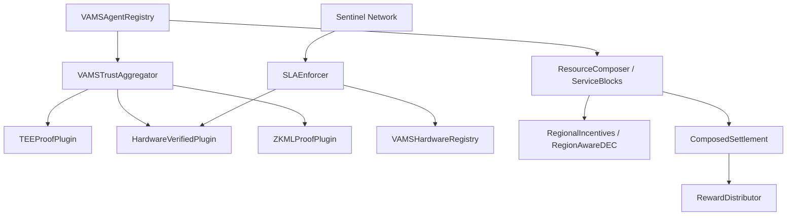

# VAMS Smart Contracts

This workspace contains all Solidity smart contracts for the Verifiable and Agentic Modular Stack (VAMS). It is built using the Foundry framework.

## Architecture



## Directory Structure

The `src/` directory is organized modularly inside the VAMS logic layers:

- `da/` — Satellite DA auditing registries (Phase 0)
- `economic/` — Bonding, hardware commitments, composed settlements, regional DEC (Phase 2 & 4)
- `governance/` — Protocol timelock and multisig 
- `infrastructure/` — Hardware registry, Service Block registry (Phase 2 & 3)
- `interfaces/` — Shared external and internal interfaces
- `oracle/` — Price oracles and chain metric feeds
- `registry/` — Core agent registration and lifecycle
- `routing/` — Cross-chain conditional routing abstractions (CLR v3.1)
- `sentinel/` — SLA enforcement, benchmarking, and slashing rules (Phase 2)
- `slashing/` — Base slashing parameters and penalties
- `staking/` — Token locking and yield mechanics
- `token/` — Native ERC-20 token definitions ($VAMS / x402)
- `trust/` — Verification logic. Contains `VAMSTrustAggregator` and all proof plugins (Phase 2)
- `vesting/` — Vesting schedules for core team and node operators

## Building and Testing

Prerequisite: [Foundry](https://book.getfoundry.sh/) must be installed.

```bash
# Install dependencies
forge install

# Build everything
forge build

# Run unit and integration tests
forge test -vvv

# Run NatSpec coverage check
forge doc --check
```

## Interface Index

Below are some of the most critical interfaces. 

| Interface | Description | Location |
|-----------|-------------|----------|
| `IVAMSProofPlugin` | The standard pattern allowing any verified source to plug into the Trust Aggregator. | `src/interfaces/IVAMSProofPlugin.sol` |
| `IPerformanceAnchor` | Maps off-chain data from different DA layers to on-chain hashes. | `src/interfaces/IPerformanceAnchor.sol` |
| `IHardwareCommitment`| Enforces time-locked collateralization for specific hardware availability. | `src/interfaces/IHardwareCommitment.sol` |
| `IServiceBlockRegistry`| Manages third-party builder deployments, trust scoring, and revenue sharing. | `src/interfaces/IServiceBlockRegistry.sol` |
| `IComposedSettlement`| Resolves split-payments across multiple independent DePIN providers. | `src/interfaces/IComposedSettlement.sol` |
