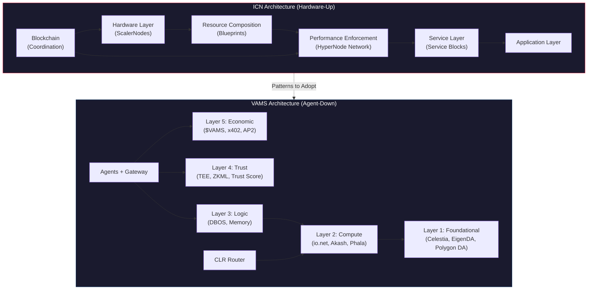

# ICN → VAMS Architecture Improvement Analysis

## ICN Paper Reference
**Impossible Cloud Network: A Decentralized Internet Infrastructure Layer (Whitepaper v1.1)**
— Chung, Carpio, Navoichyk et al., October 2025 ([arXiv:2510.04620v1](https://arxiv.org/abs/2510.04620v1))

## VAMS Document Reference
**VAMS Architecture Reference v0.3.0** — Aseem Chishti, January 2026

---

## Executive Summary

ICN and VAMS share a common thesis — **decentralizing infrastructure to eliminate single points of trust** — but approach it from opposite ends of the stack. ICN is a **hardware-up** infrastructure layer (physical nodes → services), while VAMS is a **agent-down** orchestration layer (AI agents → DePIN providers). Reading ICN reveals **8 architectural gaps** in VAMS that, if addressed, could significantly strengthen its positioning as the "AWS of Web3."

| # | ICN Pattern | VAMS Gap | Impact |
|---|-------------|----------|--------|
| 1 | [Hardware Abstraction Layer](#1-hardware-abstraction-layer) | No standardized hardware classification | High |
| 2 | [Decentralized Performance Enforcement](#2-decentralized-performance-enforcement) | Provider SLAs are trust-based (no on-chain enforcement) | Critical |
| 3 | [Resource Composition Engine](#3-resource-composition-engine) | No resource-aware abstraction (agents pick providers manually) | High |
| 4 | [Regional Economics Model](#4-regional-economics-model) | Flat global pricing (no geo-economic optimization) | Medium |
| 5 | [Hardware Collateralization with Slashing](#5-hardware-collateralization-with-slashing) | Provider bonds exist but lack hardware-level granularity | High |
| 6 | [Service Blocks (Composable Services)](#6-service-blocks-composable-services) | Service layer is ad-hoc provider integration | Medium |
| 7 | [Satellite Data Availability Network](#7-satellite-data-availability-network) | Performance audit data not independently available | Medium |
| 8 | [Pluggable Proofs Across Service Layer](#8-pluggable-proofs-across-service-layer) | Proof system is per-provider, not protocol-standardized | High |

---

## Detailed Improvements

### 1. Hardware Abstraction Layer

**ICN Pattern:** ScalerNodes are the smallest physical units of enterprise-grade hardware, classified into hardware classes (compute, storage, networking). Providers register ScalerNodes with class, location, capacity, rewards share, reservation price, and max booking duration. This creates a **globally addressable resource map**.

**VAMS Gap:** VAMS treats DePIN providers (io.net, Akash, Phala) as black-box vendors. An agent requesting GPU compute gets routed to "io.net" — but has no visibility into the *specific* hardware class, location, or real-time capacity of the resources allocated.

**Recommendation:**

> [!IMPORTANT]
> Introduce a `VAMSHardwareRegistry` — an on-chain catalogue where every DePIN provider registers their nodes with standardized metadata.

```solidity
struct VAMSResourceNode {
    bytes32 nodeId;
    address provider;           // io.net, Akash, Phala, etc.
    HardwareClass hwClass;      // GPU_H100, GPU_A100, CPU_EPYC, STORAGE_NVME, etc.
    string region;              // "us-east-1", "eu-west-2", "ap-south-1"
    uint256 capacityUnits;      // Standardized capacity units
    uint256 reservationPrice;   // $/hour in $VAMS
    uint256 maxBookingDuration; // Maximum reservation window (seconds)
    uint256 collateralStaked;   // Bonded $VAMS
    bool isActive;
}
```

**Impact:** This transforms VAMS from "meta-aggregator that trusts providers" into a **resource-aware platform** where agents can make intelligent provisioning decisions (e.g., "I need 4× H100 GPUs within 200ms of Frankfurt for the next 6 hours").

---

### 2. Decentralized Performance Enforcement

**ICN Pattern:** The **HyperNode Network** is ICN's most innovative contribution — an independent, permissionless network of validator nodes that *continuously monitor and benchmark* every hardware provider. HyperNodes execute challenges specific to each hardware class (storage I/O tests, compute benchmarks, network latency probes) and publish KPI reports to a Data Availability layer (Satellite Network), with cryptographic proofs settled on-chain.

**VAMS Gap:** VAMS relies on provider self-reporting and TEE attestations for proof-of-compute. There is **no independent third-party performance monitoring network**. The Multi-TEE verification (Section 20.3) validates execution correctness, but not whether the *physical hardware performance* matches what was advertised (e.g., an io.net node claiming H100 but actually running on A100).

**Recommendation:**

> [!CAUTION]
> This is the **highest-impact improvement**. Without independent performance enforcement, VAMS's SLA guarantees rest on trust in individual providers.

Introduce a **VAMS Sentinel Network** (distinct from the existing `VAMSSentinel` emergency contract) — a permissionless set of monitoring nodes that:

1. **Periodically challenge** registered `VAMSResourceNodes` with hardware-class-specific benchmarks
2. **Publish KPI reports** to Celestia (already in the VAMS DA stack — Layer 1)
3. **Submit Merkle-rooted proofs** on-chain to an `SLAEnforcer.sol` contract
4. **Trigger automatic slashing** when performance falls below registered thresholds

```python
class VAMSSentinelNode:
    """
    Independent performance verifier — inspired by ICN's HyperNode Network.
    Permissionless: anyone can run a Sentinel by staking 5,000 $VAMS.
    """
    
    CHALLENGE_TYPES = {
        "GPU_COMPUTE": GPUBenchmarkChallenge,      # FP16/FP32 TFLOPS test
        "CPU_COMPUTE": CPUBenchmarkChallenge,       # SPEC-like workload
        "STORAGE_IO": StorageIOPSChallenge,         # 4K random read/write IOPS
        "NETWORK_LATENCY": LatencyProbeChallenge,   # Round-trip within region
        "MEMORY_BANDWIDTH": MemBandwidthChallenge,  # STREAM benchmark
    }
    
    async def execute_challenge(self, node: VAMSResourceNode) -> ChallengeReport:
        challenge = self.CHALLENGE_TYPES[node.hw_class.category]
        result = await challenge.run(node.endpoint)
        
        report = ChallengeReport(
            node_id=node.nodeId,
            sentinel_id=self.id,
            kpis=result.kpis,
            passed=result.meets_thresholds(node.registered_capacity),
            timestamp=datetime.utcnow(),
        )
        
        # Publish to Celestia for public auditability
        await self.da_client.publish(report.to_blob(), namespace=VAMS_SENTINEL_NS)
        
        # Submit proof on-chain
        await self.sla_enforcer.submit_proof(report.merkle_proof())
        
        return report
```

**Integration with Existing Architecture:**
- Sentinel reports feed into the **VAMS Trust Score** (Section 3.4.2), adding a "Hardware Verified" dimension
- Reports are stored on **Celestia DA** (Layer 1, Section 3.1.2), which is already in the stack for agent audit trails
- Slashing flows through the existing `VAMSSlasher` contract (Section 18.6)

---

### 3. Resource Composition Engine

**ICN Pattern:** ICN's Resource Composition Layer decomposes ScalerNodes into fundamental resource units (storage, compute, memory, networking) and recomposes them using **Instance Blueprints** — standardized configurations optimized for common use cases. Instances can be static or **elastic** (auto-scaling subject to resource availability).

**VAMS Gap:** VAMS agents interact with providers at the API/service level, not the resource level. When an agent needs compute, it calls io.net or Akash directly. There is no intermediate **resource abstraction engine** that can compose optimal resource bundles across multiple providers.

**Recommendation:**

Add a `ResourceComposer` to the VAMS Gateway (Section 17) that:

1. **Accepts Instance Blueprints** (pre-defined or custom resource configurations)
2. **Optimally allocates** resources across available providers based on cost, locality, and performance
3. **Supports elastic scaling** by monitoring usage and dynamically adjusting allocations

```python
class InstanceBlueprint:
    """Pre-defined or custom resource configurations — a la ICN."""
    name: str                  # e.g., "AI_INFERENCE_STANDARD"
    compute: ComputeSpec       # 4x A100, 32 vCPU
    memory: MemorySpec         # 128GB RAM
    storage: StorageSpec       # 500GB NVMe + 2TB persistent
    networking: NetworkSpec    # 1Gbps, region="eu-west"
    elastic: bool              # Auto-scale if resources available
    max_cost_per_hour: float   # Budget cap in $VAMS

class VAMSResourceComposer:
    """
    Sits inside the VAMS Gateway. Replaces manual provider selection
    with intelligent resource composition.
    """
    async def provision(self, blueprint: InstanceBlueprint) -> ProvisionedInstance:
        # 1. Query HardwareRegistry for available nodes matching specs
        candidates = await self.registry.find_nodes(
            hw_class=blueprint.compute.gpu_type,
            region=blueprint.networking.region,
            min_capacity=blueprint.compute.units,
        )
        
        # 2. Score candidates (price, SLA history from Sentinel reports, latency)
        scored = self.scorer.rank(candidates, blueprint)
        
        # 3. Compose across multiple providers if needed
        allocation = self.allocator.compose(scored, blueprint)
        
        # 4. Lock resources & escrow payment via x402
        return await self.executor.provision(allocation)
```

**Impact:** This shifts VAMS from "provider marketplace" to "intelligent infrastructure orchestrator" — exactly the value proposition that makes AWS dominant.

---

### 4. Regional Economics Model

**ICN Pattern:** ICN divides its global resource pool into economic regions with region-specific reward rates. Regions are defined by **operational cost homogeneity** — areas where the cost of running infrastructure per unit of resource is roughly the same. Each region has target capacities and bootstrap incentives for early providers, transitioning to access-fee-based rewards as the region matures.

**VAMS Gap:** VAMS uses a flat global pricing model for the $VAMS token. The CLR (Section 14) routes transactions to different *chains* based on technical criteria (latency, privacy, value), but there is **no geographic economic optimization** for infrastructure costs. A GPU compute provider in Singapore and one in Iowa receive the same $VAMS reward, despite 3-5x differences in operational costs.

**Recommendation:**

Introduce a **Regional Incentive Matrix** managed by the DEC (Dynamic Emission Controller, Section 3.5):

```python
class RegionalEconomics:
    """
    Align provider incentives with real-world infrastructure economics.
    
    Strategy: Higher rewards in underserved / high-demand regions
    to bootstrap global coverage. Rewards decay to market-rate
    access fees as regions mature.
    """
    
    REGIONS = {
        "us-east":    {"bootstrap_multiplier": 1.0, "target_capacity_gpu": 1000},
        "eu-west":    {"bootstrap_multiplier": 1.2, "target_capacity_gpu": 800},
        "ap-south":   {"bootstrap_multiplier": 1.8, "target_capacity_gpu": 400},  # High growth
        "latam":      {"bootstrap_multiplier": 2.5, "target_capacity_gpu": 200},  # Underserved
        "africa":     {"bootstrap_multiplier": 3.0, "target_capacity_gpu": 100},  # Bootstrapping
    }
    
    def calculate_provider_reward(self, region: str, capacity_units: int) -> float:
        config = self.REGIONS[region]
        current_capacity = self.registry.get_region_capacity(region)
        utilization = current_capacity / config["target_capacity_gpu"]
        
        if utilization < 0.5:
            # Below 50% target: full bootstrap multiplier
            return base_reward * config["bootstrap_multiplier"]
        elif utilization < 1.0:
            # 50-100%: decaying multiplier
            decay = (utilization - 0.5) * 2  # 0.0 to 1.0
            multiplier = config["bootstrap_multiplier"] * (1 - decay) + 1.0 * decay
            return base_reward * multiplier
        else:
            # At/above target: standard market rate
            return base_reward * 1.0
```

**Impact:** This addresses a real weakness in VAMS's DePIN strategy — right now, providers naturally cluster in cheap US/EU regions. Regional economics would create a truly global infrastructure layer, critical for edge inference (Section A.2 of ICN paper) and data sovereignty (VAMS Section 9).

---

### 5. Hardware Collateralization with Slashing

**ICN Pattern:** Hardware providers must lock tokens as collateral proportional to the hardware resources they provide, for the *entire commitment period*. This collateral serves dual purposes: (1) penalizing underperformance via slashing, and (2) ensuring sustained participation (providers can't just disappear).

**VAMS Gap:** VAMS has provider bonds (`ProviderBondRegistry.sol`, Section 20.2.3) with a 10,000 $VAMS minimum bond and 10x coverage ratio. However, bonds are tied to **settlement risk**, not **hardware commitment**. A provider can register with a bond, deliver services for a week, then disappear — the bond only covers unpaid services, not the commitment to remain available.

**Recommendation:**

Extend the `ProviderBondRegistry` to include **time-locked hardware commitments**:

```solidity
struct HardwareCommitment {
    address provider;
    bytes32[] nodeIds;          // Registered hardware nodes
    uint256 collateral;         // Locked $VAMS (proportional to capacity)
    uint256 commitmentStart;
    uint256 commitmentEnd;      // Must maintain nodes for this duration
    uint256 minUptime;          // 99.5% during commitment period
}
```

**Slashing matrix aligned with ICN model:**

| Violation | Detection | Slash Rate | Lock Period |
|-----------|-----------|------------|-------------|
| Capacity below registered | Sentinel benchmarks | 5% collateral/incident | — |
| Disappearance (offline >4h) | Sentinel liveness | 10% collateral/day | — |
| Early exit (before commitment ends) | On-chain timestamp | 25% collateral | Remaining commitment |
| Performance fraud (faking hw class) | Sentinel benchmark mismatch | 50% collateral | Permanent ban |

---

### 6. Service Blocks (Composable Services)

**ICN Pattern:** ICN's Service Blocks are modular software components built to deploy on the ICN Operating Subsystem. They can be combined in distributed or integrated setups, and **macro Service Blocks** group commonly-used-together components. Service Builders (a permissionless role) submit new services via an SDK, which are tested, validated, and then deployable on-demand by any user.

**VAMS Gap:** VAMS integrates DePIN providers individually (io.net for GPU, Akash for CPU, Phala for TEE, etc.), but there is no **composable service marketplace** where third parties can publish, combine, and deploy service packages. The closest analogy is the DePIN Primitives Mapping (Section 4), but this is a static mapping, not a dynamic, extensible ecosystem.

**Recommendation:**

Create a **VAMS Service Block Registry** — a permissionless marketplace for composable infrastructure services:

```python
class ServiceBlock:
    """
    A deployable, composable infrastructure service on VAMS.
    
    Examples:
    - "INFERENCE_LLAMA_70B": Pre-configured Llama-3 70B inference endpoint
    - "VECTOR_DB_CLUSTER": Glacier Network vector DB with auto-replication
    - "PRIVACY_SHIELD": Phala TEE wrapper for any service block
    """
    name: str
    builder: Address               # Creator's wallet
    resource_requirements: InstanceBlueprint  # What hardware it needs
    compose_with: list[str]        # Compatible service blocks
    deployment_script: CID         # IPFS hash of deployment artifact
    revenue_share: float           # Builder's cut of usage fees (e.g., 10%)
    trust_tier_required: str       # "bronze", "silver", "gold"
    verified: bool                 # Passed VAMS validation suite
```

**Macro Service Block example:**

```yaml
# "AI_AGENT_STARTER_PACK" — a macro block
name: ai_agent_starter_pack
includes:
  - llama3_inference       # GPU compute via io.net
  - vector_memory          # Glacier Network VDB
  - tee_privacy_wrapper    # Phala TEE enclave
  - celestia_audit_log     # Audit trail on Celestia DA
  - x402_payment_channel   # Pre-configured payment channel
deploy_as: single_instance
billing: unified_via_vams
```

**Impact:** This opens up a long-tail DePIN ecosystem where third-party builders contribute value (and earn revenue) without becoming full DePIN providers.

---

### 7. Satellite Data Availability Network

**ICN Pattern:** ICN's Satellite Network is a standalone data availability layer specifically for *performance audit data*. Reports from HyperNodes are published to the Satellite Network, making them publicly auditable and independently verifiable against on-chain proofs.

**VAMS Gap:** VAMS uses Celestia for agent audit trails (Section 3.1.2), but there is no **dedicated namespace or protocol** for infrastructure performance data. Provider performance data is scattered across TEE attestations, oracle responses, and settlement records — there's no unified, publicly queryable audit trail of "how well did each provider perform."

**Recommendation:**

Dedicate a **Celestia namespace** for VAMS infrastructure performance auditing:

```python
VAMS_PERFORMANCE_NAMESPACE = b"vams-perf-v1"

class PerformanceAuditLog:
    """
    All Sentinel reports, provider SLA metrics, and challenge results 
    are published to a dedicated Celestia namespace.
    
    This makes the ENTIRE performance history of every VAMS provider
    publicly queryable and verifiable — no trust required.
    """
    
    async def publish_sentinel_report(self, report: ChallengeReport):
        blob = Blob(
            namespace=VAMS_PERFORMANCE_NAMESPACE,
            data=report.serialize(),
            share_version=0,
        )
        height = await self.celestia_client.submit([blob])
        
        # On-chain: commit Merkle root linking blob height to report hash
        await self.on_chain_anchor.commit(
            blob_height=height,
            report_hash=report.merkle_root(),
            provider=report.node_id,
        )
```

**Impact:** This directly supports VAMS's "Trust Through Transparency" principle (Section 3.4.2) and gives the Trust Score an objective data source beyond provider self-reporting.

---

### 8. Pluggable Proofs Across Service Layer

**ICN Pattern:** ICN's proof framework is explicitly **pluggable** — proofs "transcend the hardware layer, extending their applicability and functionality to services." Any service can define custom proofs verified through the HyperNode standardized interface. This means a storage service might use erasure coding proofs, while a compute service uses proof-of-execution — all verified through the same on-chain framework.

**VAMS Gap:** VAMS has three proof types (TEE Attestation, Output Hash, ZKML — Section 13.3), but they are **specified at the protocol level**, not extensible by service builders. If a new DePIN provider joins with a novel verification method (e.g., Trusted Execution on RISC-V, or homomorphic computation proofs), the core architecture must be updated.

**Recommendation:**

Introduce a **Proof Plugin Interface** in the VAMS Trust Layer (Layer 4):

```solidity
interface IVAMSProofPlugin {
    /// @notice Returns the type identifier for this proof plugin
    function proofType() external view returns (bytes32);
    
    /// @notice Verify a proof of service delivery
    /// @param serviceHash Hash of the service request
    /// @param deliveryHash Hash of the service response
    /// @param proofData Plugin-specific proof bytes
    /// @return valid Whether the proof is valid
    function verify(
        bytes32 serviceHash,
        bytes32 deliveryHash,
        bytes calldata proofData
    ) external view returns (bool valid);
    
    /// @notice Returns the trust weight of this proof type (basis points)
    /// @dev Used by VAMSTrustAggregator to weight composite trust scores
    function trustWeight() external view returns (uint256);
}

// Registration in TrustAggregator
contract VAMSTrustAggregator {
    mapping(bytes32 => IVAMSProofPlugin) public proofPlugins;
    
    function registerProofPlugin(IVAMSProofPlugin plugin) external onlyDAO {
        proofPlugins[plugin.proofType()] = plugin;
        emit ProofPluginRegistered(plugin.proofType(), address(plugin));
    }
    
    function verifyServiceDelivery(
        bytes32 serviceHash,
        bytes32 deliveryHash,
        bytes32 proofType,
        bytes calldata proofData
    ) external view returns (bool, uint256 trustWeight) {
        IVAMSProofPlugin plugin = proofPlugins[proofType];
        require(address(plugin) != address(0), "Unknown proof type");
        
        bool valid = plugin.verify(serviceHash, deliveryHash, proofData);
        return (valid, plugin.trustWeight());
    }
}
```

**Impact:** This future-proofs VAMS's verification architecture. As new DePIN technologies emerge (FHE compute, RISC Zero proofs, ARM CCA attestations), service builders can integrate them without protocol-level changes.

---

## Summary: Priority-Ordered Roadmap

| Priority | Improvement | Effort | Timeline Suggestion |
|----------|-------------|--------|---------------------|
| 🔴 **P0** | Decentralized Performance Enforcement (Sentinel Network) | Large | Q3-Q4 2026 |
| 🔴 **P0** | Pluggable Proofs Interface | Medium | Q3 2026 |
| 🟠 **P1** | Hardware Abstraction Registry | Medium | Q4 2026 |
| 🟠 **P1** | Hardware Collateralization (time-locked commitments) | Medium | Q4 2026 |
| 🟡 **P2** | Resource Composition Engine | Large | Q1 2027 |
| 🟡 **P2** | Service Blocks Marketplace | Large | Q1 2027 |
| 🟢 **P3** | Satellite Performance DA Namespace | Small | Q3 2026 (quick win) |
| 🟢 **P3** | Regional Economics Model | Medium | Q2 2027 |

> [!TIP]
> The **Satellite Performance DA Namespace** (#7) is the lowest-effort, highest-signal improvement — it requires only allocating a Celestia namespace and writing a small publishing service. It immediately enhances the Trust Score with objective data and builds the foundation for the Sentinel Network (#2).

---

## Architectural Comparison Diagram



---

## Key Philosophical Insight

ICN and VAMS are **complementary mirrors**:

- **ICN** builds from physical hardware upward, creating a resource pool that services consume
- **VAMS** builds from agent intelligence downward, orchestrating infrastructure that agents need

The ideal VAMS v0.4.0 would **adopt ICN's bottom-up rigor** (hardware classification, independent performance enforcement, resource composition) while **retaining VAMS's top-down intelligence** (agent runtime, cognitive architecture, cross-chain routing, agentic commerce). Together, these form a complete stack where agents don't just *consume* infrastructure — they consume *verified, composable, competitively-priced* infrastructure.
