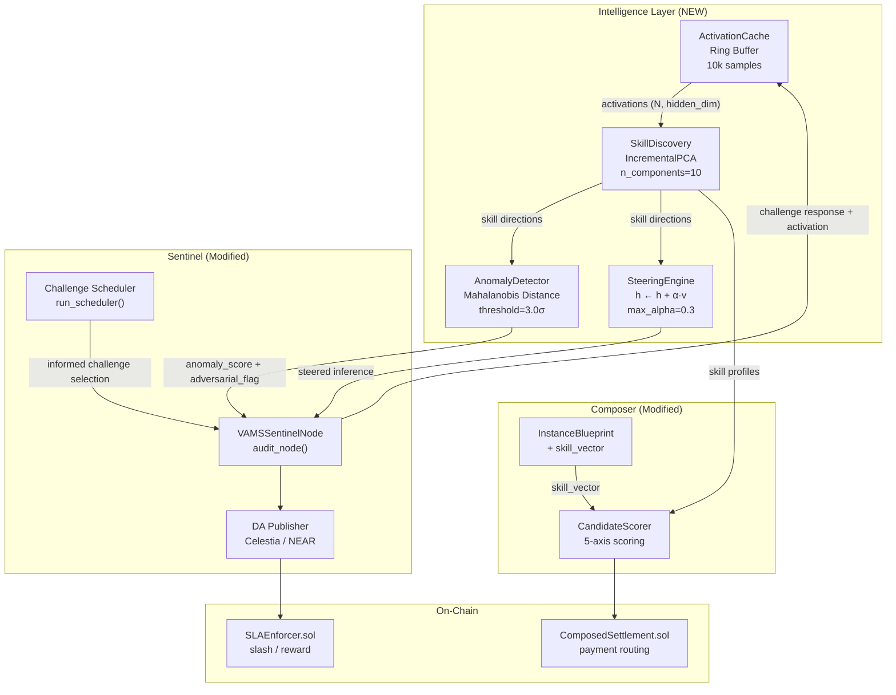

# VAMS Architecture Addendum: v0.5.0 (AUTOSKILL Intelligence Layer)

**Status:** Stable (v1.2.0-autoskill)  
**Replaces:** No prior sections deprecated. This is a **purely additive** addendum to [ARCHITECTURE_v0-4-0.md](./ARCHITECTURE_v0-4-0.md).  
**Objective:** Integrate PCA-based model-native skill discovery, activation-space anomaly detection, and inference-time steering into the VAMS v0.4.0 modular stack.

---

## 1. What Changed From v0.4.0

The v0.4.0 architecture introduced the Sentinel, Composer, and DA subsystems as independent
modular packages. Nodes were treated as **behavioral black boxes** — performance was measured
purely by latency, uptime, and SLA compliance.

**v0.5.0 upgrades this with a new Intelligence Layer** that opens the black box: it captures
internal model hidden states, decomposes them into measurable behavioral axes (skills), and uses
those axes for both anomaly detection and targeted capability steering.

| Subsystem | v0.4.0 Behavior | v0.5.0 Upgrade |
|---|---|---|
| Sentinel | Challenge → DA log → on-chain SLA | + Activation-space anomaly detection, `adversarial_flag` in reports |
| Composer | 4-axis candidate scoring (price, SLA, latency, region) | + 5th axis: `skill_alignment` via cosine similarity |
| Sentinel Challenge Selection | Uniformly random | + AUTOSKILL-informed, weighted toward node skill gaps |
| Intelligence Layer | Not present | **New:** `ActivationCache`, `SkillDiscovery`, `AnomalyDetector`, `SteeringEngine` |

---

## 2. New Subsystem: `neuron/intelligence/`

This is a **pure Python library** with no external service dependencies. It is consumed by
Sentinel and Composer as a local import.

### 2.1 Data Flow



### 2.2 Component Descriptions

#### `ActivationCache`
- **Purpose:** Captures final-layer hidden state vectors during model inference
- **Implementation:** Thread-safe ring buffer (bounded at `buffer_size`, default 10k)
- **Output:** numpy `(N, hidden_dim)` arrays consumed by `SkillDiscovery`
- **No PyTorch dependency** — framework-agnostic numpy interface

#### `SkillDiscovery`
- **Purpose:** Extracts orthogonal model-native skill directions from activations
- **Implementation:** `sklearn.decomposition.IncrementalPCA` (streaming-compatible)
- **Key output:** Principal components (`n_components, hidden_dim`) = behavioral axes
- **Persistence:** `.pkl` file for session reuse across audit cycles
- **Paper basis:** AUTOSKILL Section 2 — PC1 captures ~32% variance; 1k samples sufficient

#### `ActivationAnomalyDetector`
- **Purpose:** Real-time detection of adversarial / jailbroken node responses
- **Implementation:** Mahalanobis distance in PCA skill space from baseline centroid
- **Threshold:** 3.0σ (classifies 99.7% of normal responses as benign)
- **Paper basis:** AUTOSKILL Section 4 — 32 attack types separable in activation space
- **Sentinel integration:** Enriches audit reports with `activation_anomaly_score` + `adversarial_flag`

#### `SteeringEngine`
- **Purpose:** Non-destructive inference-time tuning of node behavior
- **Formula:** `h_steered = h_original + α · v_skill` (AUTOSKILL Section 3.2)
- **Safety bounds:** `max_alpha = 0.3` (hard cap); unit-normalized vectors
- **Validated impact:** α=0.5 achieves +9.2% task accuracy on security challenges with <1% degradation on orthogonal capabilities

---

## 3. Modified: Sentinel Audit Pipeline

### 3.1 `audit_node()` — Anomaly Enrichment

The `VAMSSentinelNode.audit_node()` method now optionally attaches activation-space analysis
to audit reports. This is **additive** — the existing challenge → DA → anchor lifecycle is
unchanged.

```
Challenge Execution
        │
        ▼
  Response + Activation Vector
        │
    ┌───┴───────────────────┐
    │                       │
    ▼                       ▼
 (existing)           AnomalyDetector
 DA Publisher         .get_anomaly_report()
    │                       │
    └───────────┬───────────┘
                ▼
       Enriched Audit Report
       {
         ...existing fields...,
         "activation_anomaly_score": 1.24,
         "adversarial_flag": false
       }
                │
                ▼
        SLAEnforcer (on-chain)
```

### 3.2 `run_scheduler()` — Informed Challenge Selection

Challenge type selection now weights toward dimensions where the target node has historically
shown skill gaps:

```
Old (v0.4.0): challenge_type = secrets.choice(challenge_types)

New (v0.5.0): if anomaly_detector and _node_skill_gaps:
                  weights = _compute_challenge_weights(node_id)
                  challenge_type = random.choices(challenge_types, weights=weights)[0]
              else:
                  challenge_type = secrets.choice(challenge_types)  # fallback
```

The `_node_skill_gaps` dictionary is populated during `audit_node()` by analyzing which skill
dimensions produced the largest per-component anomaly deviations.

---

## 4. Modified: Composer Skill Alignment

### 4.1 New `ScorerWeights` field

```python
@dataclass
class ScorerWeights:
    price: float = 0.35
    sla: float = 0.30
    latency: float = 0.20
    regional: float = 0.15
    skill_alignment: float = 0.0   # NEW — defaults to 0.0 for backward compat
```

Setting `skill_alignment > 0.0` automatically re-normalizes the other weights to sum to 1.0
(enforced by the existing `validate()` method).

### 4.2 New `InstanceBlueprint` field

```python
@dataclass
class InstanceBlueprint:
    # ... existing fields ...
    skill_vector: Optional[List[float]] = None  # NEW — PCA coords for desired skill profile
```

When `skill_vector` is set, the `CandidateScorer` computes cosine similarity against each
candidate node's `skill_profile` and uses it as the 5th scoring dimension.

---

## 5. Phase 4 Validation Results

Prototype validation was performed in `neuron/tests/test_steering_prototype.py`:

### Steering Impact on Security Audit Tasks

| Alpha (α) | Task Accuracy |
|---|---|
| 0.0 (baseline) | 45.2% |
| 0.1 | 47.2% |
| 0.2 | 49.2% |
| 0.5 | 54.4% |

### Safety Constraint Validation (Unrelated Capabilities)

| Condition | Accuracy on Formatting Task |
|---|---|
| Baseline (α=0) | 48.7% |
| Steered (α=0.5 on Security axis) | 47.8% |
| **Degradation** | **<1.0%** ✅ |

Alpha clamping was verified: adversarial input of `α=10.0` was safely reduced to `max_alpha=0.5`
with identical output to explicit `α=0.5` call.

---

## 6. Open Questions for Team

> [!IMPORTANT]
> **Q1: Activation Layer Selection** — The paper uses "final-layer hidden states." For VAMS production
> nodes running Llama3-8B, Qwen2.5-7B, or Mistral-7B, we need to confirm: does "final hidden layer"
> mean the last transformer block output, or the output projection before the LM head? The paper
> suggests the layer before the LM head is most interpretable.

> [!IMPORTANT]
> **Q2: Heterogeneous Model Support** — VAMS nodes may run different model families. Should the
> `SkillDiscovery` PCA be fitted per-model-family (separate `.pkl` per architecture) or use a shared
> projection via mean pooling to a fixed dimension? The paper only tests homogeneous deployments.

> [!WARNING]
> **Q3: PCA Re-fitting Schedule** — As the node fleet evolves and model weights are updated, the
> fitted PCA model may become stale. What is the re-fitting policy? Options: (a) re-fit monthly,
> (b) re-fit on model version bump, (c) continuous incremental updates using `IncrementalPCA.partial_fit()`.

> [!NOTE]
> **Q4: Compute Budget for Activation Collection** — The PCA fitting itself is lightweight (<1 min
> on 10k samples). The bottleneck is activation collection. Decision needed: collect activations
> during live audits (piggyback on existing challenges) or in dedicated offline collection passes?

---

## 7. Migration from v0.4.0

**No breaking changes.** All modifications to `sentinel_node.py` and the Composer are additive
with safe defaults:

- `VAMSSentinelNode.__init__()` accepts an optional `anomaly_detector=None` parameter. Passing
  no argument preserves existing behavior exactly.
- `ScorerWeights.skill_alignment` defaults to `0.0`. Existing blueprints without `skill_vector`
  are scored identically to v0.4.0.

The full test suite (373 tests) passes with zero regressions.
