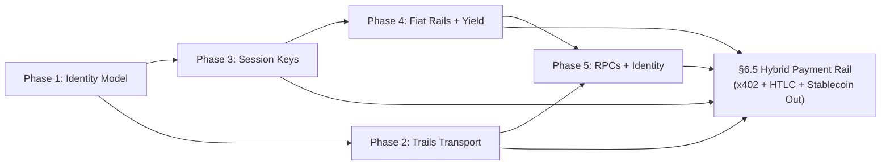

# VAMS Architecture Addendum: v0.6.0 (Polygon OMS Integration)

**Status:** Stable (v1.3.0-oms)
**Replaces:** No prior sections deprecated. This is a **purely additive** addendum to
[ARCHITECTURE_v0-5-0.md](./ARCHITECTURE_v0-5-0.md) and [ARCHITECTURE_v0-4-0.md](./ARCHITECTURE_v0-4-0.md).
**Objective:** Integrate Polygon's Open Money Stack (OMS) across 5 phases — covering identity
abstraction, cross-chain routing via Trails, ERC-4337 account abstraction, fiat on-ramps,
yield generation, and stablecoin payouts — without breaking TEE, DA, Sentinel, or non-EVM bridge
subsystems.

---

## 1. What Changed From v0.5.0

The v0.5.0 architecture added the AUTOSKILL Intelligence Layer, leaving nodes as verifiable but
still using raw EOA signing and public RPC endpoints. **v0.6.0 integrates OMS to harden the
economic and identity layers.**

| Subsystem | v0.5.0 Behavior | v0.6.0 Upgrade |
|---|---|---|
| Signing | Raw `from_key()` EOA signing in all Python modules | `SignerInterface` abstraction; `SessionKeySigner` (ERC-4337) for operations |
| Bridge Transport | AggLayer primary for Polygon/ETH/ARB/Base routes | OMS Trails as primary for AggLayer chains; existing transports unchanged for Cardano/Solana/SEI |
| CLR P3 Route | PLATINUM trust tier only | PLATINUM + `OMSIdentityVerifier.is_verified()` (fail-closed) |
| Fiat Entry | Not present | `CoinmeClient` + `UniversalTopupManager` — credit card / bank → $VAMS |
| Insurance Yield | Idle capital earns no yield | `YieldManager` — up to 30% in OMS yield vaults (instant withdrawal) |
| Provider Payouts | $VAMS only | `StablecoinPayoutManager` — opt-in USDC/USDT via OMS rails |
| RPC Infrastructure | Public fallbacks | OMS enterprise RPCs for Polygon-ecosystem chains + SLA monitoring |

---

## 2. Phase 1 — Two-Layer Identity Model

### 2.1 Problem

Prior to v0.6.0, every Python module signed transactions directly with the agent's root EOA
private key (`Account.from_key(pk)`). This created two risks:
1. A compromised session operation exposes the root key
2. ERC-4337 smart wallet adoption would require a full refactor

### 2.2 Solution: `SignerInterface` Abstraction

```
neuron/sdk/signer.py
│
├── SignerInterface (ABC)
│   ├── sign(message: bytes) → bytes
│   └── address: str
│
├── EOASigner(SignerInterface)
│   └── Wraps Account.from_key() — existing behavior, no behavior change
│
├── SessionKeySigner(SignerInterface)
│   └── Wraps Sequence SDK session key — used for ERC-4337 operations (Phase 3)
│
└── SignerFactory
    └── .create(config) → EOASigner | SessionKeySigner
```

### 2.3 `VAMSAgentRegistry.sol` Changes

```solidity
struct Agent {
    // ... existing fields ...
    address authorizedWallet;   // NEW: Sequence smart wallet address (or zero = not set)
}

// NEW: Owner-only setter
function setAuthorizedWallet(bytes32 agentId, address wallet) external;

// NEW: View function for authorization checks
function isAuthorizedCaller(bytes32 agentId, address caller) external view returns (bool);

// Modified: all existing ownership checks now accept authorized wallet
// msg.sender == agent.owner || msg.sender == agent.authorizedWallet
```

### 2.4 TEE Attestation Binding Preservation

> [!IMPORTANT]
> `tee_plugin.py → _abi_encode_attestation()` always binds to the **root EOA identity**, not
> the session wallet. This is a hard invariant: TEE proofs must be tied to the original hardware
> operator, not to ephemeral session keys.

---

## 3. Phase 2 — Trails Transport Integration (CLR v3.1)

### 3.1 Scope

Trails is mapped as a **transport accelerator for AggLayer-connected chains only**. Non-EVM routes
(Cardano, Midnight, Hydra, Solana, SEI) remain on their existing transports.

| Route | Previous Transport | v0.6.0 Primary | v0.6.0 Fallback |
|---|---|---|---|
| VAMS_L3 → Ethereum | AggLayer | **Trails** | AggLayer |
| VAMS_L3 → Polygon | AggLayer | **Trails** | AggLayer |
| VAMS_L3 → Arbitrum | AggLayer | **Trails** | AggLayer |
| VAMS_L3 → Base | AggLayer | **Trails** | AggLayer |
| VAMS_L3 → Cardano | RosenBridge | RosenBridge | — unchanged — |
| VAMS_L3 → Solana | Hyperlane | Hyperlane | — unchanged — |
| VAMS_L3 → SEI | LayerZero | LayerZero | — unchanged — |

### 3.2 `TrailsClient` Interface

```python
# neuron/sdk/trails_client.py
class TrailsClient:
    def submit_intent(source, dest, payload, value) → TrailsReceipt
    def get_status(intent_id) → TrailsStatus   # PENDING | SETTLED | FAILED
    # Mock mode: TrailsClient(mock=True) for testing — no network calls
```

### 3.3 BridgeExecutor Integration

`BridgeExecutor.execute()` now checks:
```
if transport == BridgeTransport.TRAILS:
    → TrailsTransportHandler.execute_intent()
    → on failure: cascade to BridgeFallbackHandler (AggLayer)
```

---

## 4. Phase 3 — Sequence ERC-4337 Session Keys

### 4.1 `SequenceWalletManager`

```python
# neuron/sdk/sequence_wallet.py
class SequenceWalletManager:
    """Creates and manages ERC-4337 smart wallets per agent."""
    def create_wallet(agent_id) → SmartWallet
    def get_wallet(agent_id) → SmartWallet

class SessionKeyManager:
    """Creates scoped session keys bound to TrustTier limits."""
    def create_session_key(agent_id, tier) → SessionKey
```

### 4.2 TrustTier → Session Key Scope

| TrustTier | `max_value_per_tx` | `validity_window` | Allowed Contracts |
|---|---|---|---|
| BRONZE | 100 $VAMS | 24h | VAMS core contracts only |
| SILVER | 1,000 $VAMS | 24h | VAMS core + approved DEXes |
| GOLD | 50,000 $VAMS | 24h | VAMS core + approved DEXes + bridge contracts |
| PLATINUM | Unlimited | 24h | All VAMS contracts |

### 4.3 Signing Flow

```
Agent Operation
    │
    ▼
SignerFactory.create(config)
    │
    ├── config.use_session_key = False  →  EOASigner (channel creation, registration)
    │
    └── config.use_session_key = True   →  SessionKeySigner (payments, x402 tokens)
                                               │
                                               ▼
                                        Sequence SDK → ERC-4337 UserOperation
```

---

## 5. Phase 4 — Coinme Fiat Rails + Insurance Fund Yield

### 5.1 Universal Top-Up Flow

```
User (credit card / bank transfer)
    │
    ▼
CoinmeClient.create_checkout(amount_fiat, currency, dest_address)
    │
    ▼ (Coinme handles KYC + MTL compliance)
Fiat → Crypto Conversion (Coinme)
    │
    ▼
UniversalTopUpManager
    ├── Applies gas abstraction premium: 2–7% (per TOKENOMICS.md)
    └── Deposits $VAMS to agent's ComposedSettlement escrow
```

**Jurisdiction coverage:** All Coinme-supported regions (leverages Coinme's existing Money
Transmitter Licenses — VAMS does not hold separate MTLs).

### 5.2 Insurance Fund Yield (`VAMSInsuranceFund.sol` + `YieldManager`)

New roles and functions:
```solidity
// New role
bytes32 public constant YIELD_MANAGER_ROLE = keccak256("YIELD_MANAGER_ROLE");

// Deploy idle capital — reverts if > 30% of totalFundBalance()
function deployToYield(address vault, uint256 amount) external onlyRole(YIELD_MANAGER_ROLE);

// Instant withdrawal — no delay
function withdrawFromYield(address vault, uint256 amount) external onlyRole(YIELD_MANAGER_ROLE);

// Updated view — now returns balanceOf + totalDeployedBalance
function totalFundBalance() external view returns (uint256);
```

> [!WARNING]
> The 30% deployment cap is enforced on-chain with a Solidity `require`. It cannot be bypassed
> by a compromised `YIELD_MANAGER_ROLE` key — the cap is a mathematical invariant, not a
> governance parameter.

---

## 6. Phase 5 — Stablecoin Payouts + Enterprise RPCs + OMS Identity

### 6.1 Stablecoin Payout Flow

```
Provider claims rewards via RewardDistributor.claimRewards()
    │
    ├── payoutPreference[msg.sender] == VAMS_ONLY
    │       → Transfer $VAMS directly (existing behavior)
    │
    ├── payoutPreference[msg.sender] == STABLECOIN
    │       → Route through OMS conversion contract
    │       → Provider receives USDC or USDT
    │
    └── payoutPreference[msg.sender] == HYBRID
            → Split: 50% $VAMS direct, 50% via OMS conversion
```

To opt-in:
```python
# Python SDK
manager = StablecoinPayoutManager(web3, reward_distributor_address, private_key)
manager.opt_in_to_stablecoin()   # 100% USDC/USDT
manager.opt_in_to_hybrid()        # 50/50 split
```

### 6.2 Enterprise RPC Configuration

`ChainOracle` now uses OMS enterprise RPC endpoints for all Polygon-ecosystem chains with:
- Per-endpoint latency tracking (rolling 60s window)
- Uptime SLA monitoring (target: 99.9%)
- Automatic failover to secondary endpoint on consecutive failures
- Cache TTL: 30s (unchanged)

Environment variables required:
```
OMS_POLYGON_RPC_PRIMARY=https://rpc.oms.polygon.technology/mainnet
OMS_POLYGON_RPC_SECONDARY=https://rpc2.oms.polygon.technology/mainnet
OMS_IDENTITY_API=https://api.oms.polygon.technology/identity
OMS_API_KEY=<your_oms_api_key>
```

### 6.3 CLR v3.1 — P3 OMS Identity Gate

The full CLR v3.1 decision tree (7 priorities):

```
CLRouter.route_v3(request, agent_id)
    │
    ├── P0: Privacy / TEE requirement?
    │       → Midnight (privacy chain)
    │
    ├── P1: Confidential compute?
    │       → Phala / Marlin TEE + Midnight
    │
    ├── P2: High-value (> $50K)?
    │       → Trails → Ethereum (Multi-ISM bridge)
    │
    ├── P3: Institutional compliance?  ← UPDATED IN v0.6.0
    │       → OMSIdentityVerifier.is_verified(agent_id)
    │           ├── False → REJECT (fail-closed, 403)
    │           └── True  → Polygon CDK (KYC Layer)
    │
    ├── P4: Formal verification required?
    │       → Cardano / Aiken (EUTXO)
    │
    ├── P5: Velocity / micro-transactions?
    │       → Hydra (off-chain) or SEI (parallel EVM)
    │
    └── P6: Default
            → Polygon CDK (best cost/latency)
```

### 6.4 `OMSIdentityVerifier` — Fail-Closed Design

```python
def is_verified(self, address: str) -> bool:
    if not address:
        return False                    # No address → reject
    try:
        resp = requests.get(
            f"{self.api_url}/v1/verification/{address}",
            headers={"Authorization": f"Bearer {self.api_key}"},
            timeout=5
        )
        if resp.status_code == 200:
            return resp.json().get("is_verified", False)
        return False                    # Non-200 → reject
    except Exception:
        return False                    # Any error → fail-closed, reject
```

---

## 6.5 Hybrid Payment Rail (End-to-End)

The five OMS phases do not operate independently — they compose into a single **Hybrid Payment
Rail** that covers the full lifecycle of agent capital: fiat in → on-chain escrow → micropayment
delivery → stablecoin out. This section documents that unified flow and the on-chain contracts
that enforce it.

### 6.5.1 Capital Flow Diagram

```
┌─────────────────────────────────────────────────────────────────────────────┐
│                       HYBRID PAYMENT RAIL (v0.6.0)                          │
├─────────────────────────────────────────────────────────────────────────────┤
│                                                                               │
│  [FIAT IN]                                                                    │
│  User: credit card / bank transfer                                            │
│      │                                                                        │
│      ▼                                                                        │
│  CoinmeClient.create_checkout(amount_fiat, currency, dest_address)            │
│  ← Coinme handles KYC + Money Transmitter License compliance →                │
│      │                                                                        │
│      ▼                                                                        │
│  UniversalTopupManager                                                        │
│  ├── Applies GasAbstractionPremium: 2–7% (per TOKENOMICS.md §4.3)            │
│  └── Deposits net $VAMS to agent's smart wallet (Sequence ERC-4337)           │
│      │                                                                        │
│  ─ ─ ─ ─ ─ ─ ─ ─ ─ ─ ON-CHAIN BOUNDARY ─ ─ ─ ─ ─ ─ ─ ─ ─ ─ ─ ─ ─         │
│      │                                                                        │
│  [x402 MICROPAYMENT CHANNEL]                                                  │
│  Agent locks funds BEFORE service delivery:                                   │
│      │                                                                        │
│      ▼                                                                        │
│  X402EscrowManager.lockEscrow(provider, amount, nonce, validFor, hashlock)    │
│  ├── EscrowStatus: LOCKED (funds held, 5 min – 24 h window)                  │
│  ├── X402NonceRegistry.isNonceValid() — prevents double-spend                │
│  └── Optional HTLC hashlock for multi-hop atomicity                           │
│      │                                                                        │
│      ▼                                                                        │
│  Provider delivers service                                                    │
│      │                                                                        │
│      ▼                                                                        │
│  X402EscrowManager.claimEscrow(escrowId, serviceProof, preimage)              │
│  ├── serviceProof.proofType: TEE | DETERMINISTIC | ZKML                       │
│  ├── X402NonceRegistry.consumeNonce() — marks nonce spent on-chain            │
│  ├── 0.05% settlement fee → protocol treasury                                 │
│  └── 72 h dispute window (VAMSSentinel holds SENTINEL_ROLE for emergency      │
│      pause via EmergencyLockdown.s.sol)                                       │
│      │                                                                        │
│  [REWARD ACCUMULATION]                                                        │
│  Provider earns $VAMS in RewardDistributor over time                          │
│      │                                                                        │
│  [PAYOUT SELECTION — StablecoinPayoutManager]                                 │
│      │                                                                        │
│      ├── VAMS_ONLY  ─────────────────► Transfer $VAMS directly                │
│      │                                                                        │
│      ├── STABLECOIN ─────────────────► OMS conversion contract                │
│      │                                  → Trails → Provider (USDC / USDT)     │
│      │                                                                        │
│      └── HYBRID (50/50) ────────────► 50% $VAMS direct                       │
│                                        50% OMS → Trails → USDC / USDT        │
│                                                                               │
└─────────────────────────────────────────────────────────────────────────────┘
```

### 6.5.2 On-Chain Contract Roles

| Contract | Role in Rail | Key Constants |
|---|---|---|
| `X402EscrowManager` | HTLC escrow — locks agent funds before service, releases after proof | `SETTLEMENT_FEE_BPS = 5` (0.05%), `DISPUTE_WINDOW = 72h` |
| `X402NonceRegistry` | Double-spend prevention — each `(agent, nonce, receiptHash)` triple is unique and consumed on claim | monotonically increasing per-agent nonce |
| `VAMSPaymentHandler` | Channel-style micropayment management, ECDSA signature verification, 24h dispute window | `SETTLEMENT_FEE_BPS = 5` |
| `BatchSettlement` | Batches multiple nonce consumptions in a single tx — references `IX402NonceRegistry` | gas-efficient batch path |
| `ComposedSettlement` | Multi-provider escrow with 48h validity (vs 24h for single x402) | used for composer-provisioned instances |
| `RewardDistributor` | Accumulates provider $VAMS rewards and routes to `StablecoinPayoutManager` on claim | `VAMS_ONLY` \| `STABLECOIN` \| `HYBRID` |

### 6.5.3 Session Key Authorization Path

All x402 payment operations in v0.6.0 are authorized through the Phase 3 session key system,
not raw EOA signing:

```
Agent requests service
    │
    ▼
SignerFactory.create(config.use_session_key = True)
    │
    ▼
SessionKeySigner  ──► Sequence SDK ERC-4337 UserOperation
    │
    ├── validates: TrustTier value cap (BRONZE: 100 $VAMS, SILVER: 1,000 $VAMS, ...)
    ├── validates: 24h session key validity window
    │
    ▼
X402EscrowManager.lockEscrow()   ← signed by session key, not root EOA
```

This means a compromised session key cannot drain the agent's full wallet balance —
the on-chain cap enforced by the Sequence ERC-4337 contract is a hard invariant.

### 6.5.4 Emergency Isolation

The x402 stack is fully integrated into `EmergencyLockdown.s.sol`:
- `X402EscrowManager` is paused (`_safePause(X402_ESCROW)`) as step 1d of the lockdown sequence
- `ADMIN_ROLE`, `PAUSER_ROLE`, and `DEFAULT_ADMIN_ROLE` are revoked from the compromised key
- `VAMSSentinel` holds `SENTINEL_ROLE` on `X402EscrowManager` for autonomous emergency pause
  without waiting for the full governance lockdown sequence

---

## 7. Security Boundaries

| Boundary | Mechanism | Where Enforced |
|---|---|---|
| P3 route access | `OMSIdentityVerifier.is_verified()` fail-closed | `clr_router.py` |
| Session key value limits | Per-TrustTier caps in `SessionKeyManager` | `sequence_wallet.py` |
| Session key expiry | 24h validity window (configurable) | Sequence SDK on-chain |
| TEE attestation root binding | `_abi_encode_attestation()` always uses EOA | `tee_plugin.py` |
| Insurance yield cap | ≤30% `totalFundBalance()` — on-chain require | `VAMSInsuranceFund.sol` |
| OMS API key exposure | Loaded from env var `OMS_API_KEY`, never hardcoded | `oms_identity.py` |
| Non-EVM bridge isolation | Cardano/Solana/SEI routes untouched in `TRANSPORT_MATRIX` | `bridge_executor.py` |
| x402 double-spend | Nonce + receipt hash consumed atomically on claim | `X402NonceRegistry.sol` |
| x402 service non-delivery | HTLC refund after expiry; 72h dispute window | `X402EscrowManager.sol` |
| x402 emergency isolation | `SENTINEL_ROLE` autonomous pause; lockdown script revokes all roles | `EmergencyLockdown.s.sol` |

---

## 8. Migration from v0.5.0

**No breaking changes.** All v0.6.0 modifications are additive with safe defaults:

- `OMSIdentityVerifier` is only invoked for P3 routes. All other CLR routes are unaffected.
- `SessionKeySigner` is opt-in via `SignerFactory` config. Default `EOASigner` behavior unchanged.
- `StablecoinPayoutManager.set_preference()` defaults to `VAMS_ONLY` (no action required from
  providers who want to keep $VAMS payouts).
- `VAMSInsuranceFund` yield functions are gated by `YIELD_MANAGER_ROLE` — contracts without this
  role granted behave identically to v0.5.0.
- `TrailsClient` mock mode (`TrailsClient(mock=True)`) is available for all test environments.

The full test suite (**1,083 tests — 619 Forge + 37 Aiken + 427 Pytest**) passes with zero regressions.

---

## 9. Phase Dependency Graph



---

## 10. Related Documentation

| Document | Description |
|---|---|
| [ARCHITECTURE_v0-5-0.md](./ARCHITECTURE_v0-5-0.md) | AUTOSKILL Intelligence Layer (v0.5.0) |
| [ARCHITECTURE_v0-4-0.md](./ARCHITECTURE_v0-4-0.md) | ICN Modular Stack (v0.4.0) |
| [../DEVELOPER_GUIDE.md](../DEVELOPER_GUIDE.md) | Developer onboarding — all personas |
| [../API_REFERENCE.md](../API_REFERENCE.md) | REST API including OMS identity + payout endpoints |
| [../NODE_OPERATORS.md](../NODE_OPERATORS.md) | Node operator guide — enterprise RPC + stablecoin setup |
| [../CHANGELOG.md](../CHANGELOG.md) | Full release history |
