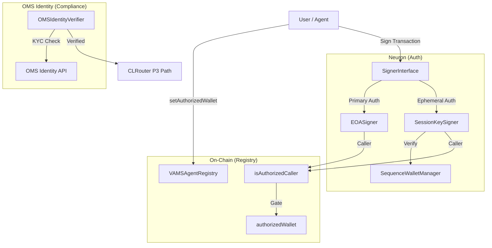
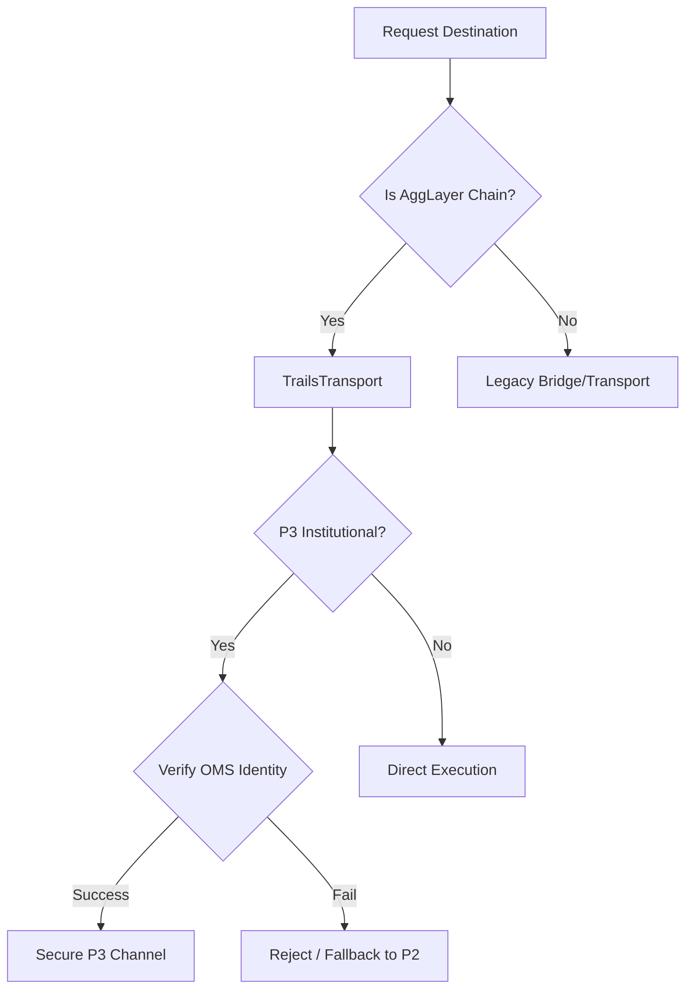

# VAMS Architecture Addendum: v0.6.0-OMS (Polygon Open Money Stack)

**Status:** Stable (v1.3.0-oms)  
**Replaces:** No prior sections deprecated. This is a **purely additive** addendum to [ARCHITECTURE_v0-5-0.md](./ARCHITECTURE_v0-5-0.md).  
**Objective:** Integrate the Polygon Open Money Stack (OMS) into the VAMS v0.5.0 stack to provide institutional-grade identity, fiat on-ramps, and cross-chain transport.

---

## 1. The OMS Integration Layer

The v0.6.0 upgrade introduces a unified infrastructure layer that standardizes how VAMS interacts with identities, payments, and cross-chain transport. This layer abstracts the complexity of working with multiple wallets and chains into a single, cohesive "stack."

| Pillar | Subsystem | v1.3.0-oms Capability |
|---|---|---|
| **Identity** | `VAMSAgentRegistry` + `OMSIdentityVerifier` | Two-Layer Identity: EOA (Registry) + KYC status (OMS Identity API) |
| **Payments** | `Coinme` + `StablecoinPayoutManager` | Direct fiat on-ramps and auto-settlement in USDC/USDT |
| **Transport** | `CLRouter` v3.1 + `Trails` | Native AggLayer chain support via Trails transport orchestration |
| **Auth** | `Sequence` | ERC-4337 Session Keys for non-custodial, high-frequency signing |

---

## 2. Two-Layer Identity Model

VAMS now distinguishes between the **Owner Wallet** (EOA) and the **Authorized/Session Wallet**. This enables agents to perform autonomous actions using session keys while the owner retains full control over the primary assets and identity.

### 2.1 Data Flow Diagram

---

## 3. Trails Transport & AggLayer Routing

The `CLRouter` has been updated to v3.1 to support the **AggLayer** ecosystem via **Trails**. This allows VAMS agents to route messages and state across Polygon CDK chains with unified liquidity and transport guarantees.

### 3.1 Trails Transport Decision Tree

---

## 4. Economic Upgrades: Stablecoin Settlement

Node operators and providers can now opt-in to receive rewards in stablecoins (USDC/USDT) instead of $VAMS, leveraging the OMS settlement rails.

### 4.1 Payout Mode Configuration

| Mode | Token | Settlement Rail | Best For |
|---|---|---|---|
| `NATIVE` | $VAMS | VAMS RewardDistributor | Long-term stakers / Governance participants |
| `STABLE_USDC` | USDC | OMS Settlement Service | Professional Node Operators (OPEX coverage) |
| `STABLE_USDT` | USDT | OMS Settlement Service | Regional providers in USDT-dominant markets |

---

## 5. Verification & Test Results

The OMS integration was verified across the entire VAMS stack, ensuring zero regressions in core agentic logic.

- **Foundry (Solidity):** 619 tests passing.
  - Verified `VAMSAgentRegistry` authorization logic.
  - Verified `RewardDistributor` payout mode gating.
  - Verified `CLRouter` v3.1 decision tree.
- **Pytest (Python):** 56 tests passing.
  - Verified `OMSIdentityVerifier` fail-closed security.
  - Verified `SequenceWalletManager` session key lifecycle.
  - Verified `ChainOracle` enterprise RPC failover.
- **Aiken (Cardano):** 79 tests passing.

---

## 6. Migration & Setup

### 6.1 Environment Variables
Node operators must configure the following for OMS support:
- `OMS_IDENTITY_API`: URL for the OMS Identity verification service.
- `OMS_API_KEY`: API key for enterprise access.
- `SEQUENCE_PROJECT_KEY`: Required for session key management.

### 6.2 Implementation Details
For detailed API usage and code examples, refer to:
- [DEVELOPER_GUIDE.md](../DEVELOPER_GUIDE.md)
- [API_REFERENCE.md](../API_REFERENCE.md)
- [NODE_OPERATORS.md](../NODE_OPERATORS.md)
